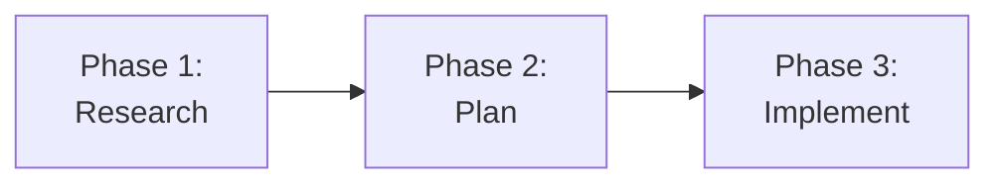

# Docusaurus Content Instructions

These instructions apply automatically when editing any file under `docs/docusaurus/`. Follow them to maintain consistency across the documentation site.

## Frontmatter

Every documentation page requires these frontmatter fields:

* `title`: Page title displayed in the browser tab and sidebar
* `description`: One-sentence summary for SEO and social sharing
* `sidebar_position`: Integer controlling page order within its category (1, 2, 3...)

Optional fields:

* `sidebar_label`: Override the sidebar display text when it should differ from `title`
* `keywords`: Array of terms for search indexing
* `tags`: Array of tags for content categorization

```yaml
---
title: The RPI Workflow
description: How the Research-Plan-Implement-Review loop structures AI-assisted development
sidebar_position: 2
sidebar_label: RPI Workflow
keywords: [rpi, research, plan, implement, review]
tags: [build-the-work, rpi, workflow]
---
```

## Admonitions

Use Docusaurus triple-colon syntax for callout boxes. Do not use GitHub-flavored `> [!NOTE]` alerts.

```markdown
:::note
Useful information that users should know, even when skimming.
:::

:::tip
Helpful advice for doing things better or more easily.
:::

:::info
Additional context that clarifies a concept.
:::

:::warning
Important information that could prevent problems.
:::

:::danger
Critical information about potential data loss or security issues.
:::
```

## Internal Links

Link between documentation pages using relative paths without the `.md` extension:

```markdown
<!-- Correct -->
See [How It Works](getting-started/how-it-works) for architecture details.

<!-- Incorrect — .md extension causes build warnings -->
See [How It Works](getting-started/how-it-works.md) for architecture details.
```

Cross-category links use relative paths from the current file location:

```markdown
<!-- From ship-it/overview.md to getting-started/how-it-works.md -->
[How It Works](../getting-started/how-it-works)
```

## Mermaid Diagrams

Use fenced code blocks with the `mermaid` language identifier. Line breaks within nodes use `<br/>` (not `\n`).

````markdown

````

Verify diagrams render in both light and dark themes. Use minimal inline styling; avoid hardcoded colors that break in dark mode unless both themes are tested.

## Category Structure

Each sidebar category is a directory containing a `_category_.json` file:

```json
{
  "label": "Getting Started",
  "position": 1,
  "collapsible": true,
  "collapsed": false
}
```

Adding a new top-level category changes the site information architecture. Discuss with maintainers before creating one. The current segment hierarchy is:

1. Getting Started
2. Shape the Work
3. Build the Work
4. Ship It
5. Reference

## Images

Place images in `docs/docusaurus/static/img/` and reference them with absolute paths from the site root:

```markdown

```

## Code Blocks

Always specify a language identifier for syntax highlighting. Use `text` when no highlighting is needed:

````markdown
```yaml
title: Example Configuration
```

```text
Plain text output with no highlighting
```
````

## Page Ordering

Use sequential `sidebar_position` values (1, 2, 3...) within each category. Gaps in numbering are acceptable when anticipating future pages.

## Educational Tone

Lead with "why this matters" before explaining "how to use the tool." Reference DORA, SPACE, and ESSP frameworks where relevant to connect tooling to measurable outcomes.

Address the reader as "you." Use "we" when speaking for the project. Avoid marketing language ("powerful," "seamless," "revolutionary") and unsupported productivity claims.

## Value Tags

When mentioning HVE-Core artifacts in documentation, note their value assessment where it adds context:

* 🟢 Core: High value, directly supports a documented flow
* 🟡 Supporting: Useful but secondary
* ⚪ Meta: Internal tooling for HVE-Core authors, not end users

The full assessment is in the value delivery segments workshop document. Not every mention needs a tag; use them when distinguishing between core and supporting artifacts helps the reader prioritize.
