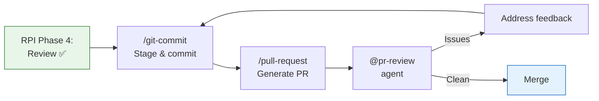

# Code Review & Pull Requests

After the RPI workflow produces reviewed code, you need to get it merged. HVE-Core provides tools for the complete pipeline: staging and committing with conventional messages, generating PR descriptions from diffs, automated code review focused on real issues, and ADO PR creation with work item linking.

## The Code-to-Merge Pipeline

## Generating Pull Requests

Two prompts handle PR description generation:

🟢 **`/pull-request`** generates a GitHub PR description from your branch diff. It reads the commit history, groups changes by type and scope, and produces a conventional-commit-formatted title with a structured body.

🟡 **`/ado-create-pull-request`** does the same for Azure DevOps, with additional capabilities: it searches ADO for related work items, identifies reviewers from git history, and links everything together through a multi-phase protocol with user confirmation gates.

Both prompts read from `pr-reference.xml`, a structured diff generated by `scripts/dev-tools/pr-ref-gen.sh`. This ensures the PR description reflects exactly what changed, not what the AI thinks changed.

## Automated Code Review

The 🟢 `@pr-review` agent reviews code changes with an extremely high signal-to-noise ratio. It analyzes staged/unstaged changes and branch diffs, surfacing only issues that genuinely matter:

* Bugs and logic errors
* Security vulnerabilities
* Convention violations specific to this codebase

It deliberately ignores style, formatting, and trivial matters. The goal is zero false positives: every comment should be actionable. This complements the RPI review phase, which validates against the plan and research; `@pr-review` validates against broader code quality and security standards.

## Git Operations

| Prompt | Purpose | When to Use |
|---|---|---|
| 🟢 `/git-commit` | Stage files and create a conventional commit | After implementation, before PR |
| 🟡 `/git-commit-message` | Generate only the commit message (no staging) | When you have already staged manually |
| 🟡 `/git-merge` | Merge or rebase with intelligent conflict resolution | Syncing branches, resolving conflicts |

The `/git-merge` prompt follows a strict protocol: it confirms the working tree is clean, fetches latest refs, executes the operation, and walks through any conflicts file by file. It never force-pushes or rewrites remote history.

## ADO PR Creation

For teams using Azure DevOps, `/ado-create-pull-request` provides a comprehensive PR creation workflow:

1. Analyzes the branch diff to generate a PR description
2. Searches ADO for related work items and suggests links
3. Identifies reviewers from git history of changed files
4. Presents the complete PR plan for your review before creating

The workflow follows the same planning-file pattern as backlog management, with artifacts in `.copilot-tracking/pr/`. See [ADO Integration](../shape-the-work/ado-integration) for the broader ADO workflow context.

For how coding conventions are enforced automatically during all of these operations, see [Coding Standards](coding-standards).
