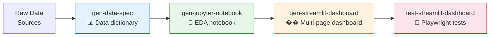

# Data Science Workflows

HVE-Core includes four agents that form an implicit data science pipeline. Unlike the RPI workflow, this pipeline has no orchestrator and no formal handoff mechanism. Each agent is self-contained: you invoke them individually and pass context through conversation or by referencing previously generated files.

## The Implicit Pipeline

| Agent | Input | Output | Persona |
|---|---|---|---|
| 🟡 `@gen-data-spec` | Raw data sources (CSV, DB, API) | Data dictionary, machine-readable profiles | Data Engineer |
| 🟡 `@gen-jupyter-notebook` | Data spec + data sources | Structured EDA notebook with visualizations | Data Scientist |
| 🟡 `@gen-streamlit-dashboard` | Data spec + analysis findings | Multi-page Streamlit dashboard | Data Scientist / Analyst |
| 🟡 `@test-streamlit-dashboard` | Running Streamlit app | Playwright test suite with issue tracking | QA Engineer |

## Why No Orchestrator?

The RPI workflow needs an orchestrator because its phases have strict dependency chains and require context isolation. A research finding must be documented before planning can reference it.

The data science pipeline has softer dependencies. A data scientist who already knows their data can skip `gen-data-spec` and go straight to `gen-jupyter-notebook`. An analyst who has a notebook can jump to `gen-streamlit-dashboard`. The sequence is a recommendation, not a requirement.

This implicit structure is a deliberate design choice. An orchestrator would add overhead without adding value, because data science workflows are inherently exploratory. You often loop back, skip steps, or branch in directions that a rigid pipeline would constrain.

## Connection to RPI

For larger data science projects (building a production ML pipeline, creating a data platform, refactoring an analytics codebase), RPI applies normally. Use the Task Researcher to investigate existing data infrastructure, the Task Planner to design the pipeline, and the Task Implementor to build it.

The data science agents complement RPI rather than replacing it. Use `gen-data-spec` during the Research phase to understand your data. Use `gen-jupyter-notebook` during prototyping. Use `gen-streamlit-dashboard` to build the presentation layer.

:::tip Python environments
The `uv-projects` instruction file auto-applies to Python files, managing virtual environments with `uv`. When you create a new data science project, `uv add ipykernel ipywidgets black tqdm pytest` sets up the standard toolkit automatically.
:::
