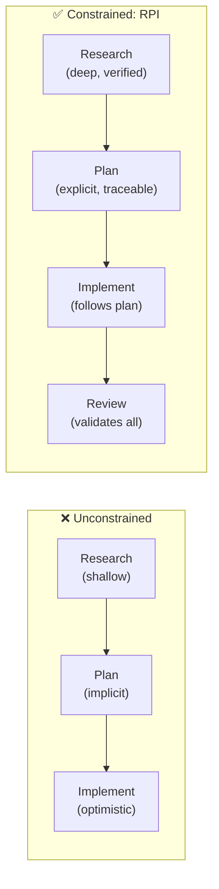

# Build the Work

You have seen this failure mode. You ask an AI assistant to "implement feature X" and it produces something that compiles, passes a cursory review, and subtly misunderstands the codebase. It invented a pattern that already exists elsewhere. It made assumptions about the database schema that contradict reality. The code is plausible but wrong.

This happens because three cognitive modes activate simultaneously: investigation (what exists?), design (what should change?), and implementation (write the code). The AI interleaves them in a single conversation, and each one contaminates the others.

The investigation suffers because the AI is already planning how to implement, so it stops searching when it finds something "good enough" rather than verifying what is actually there. The design suffers because the AI is already writing code, so it commits to the first approach that looks plausible. The implementation suffers because the AI is still discovering things it missed, so it makes assumptions that contradict reality.

## Why Constraints Improve AI Output

The counterintuitive finding: telling an AI it *cannot* write code makes it a better researcher. When the Task Researcher agent knows it will never implement anything, it optimizes for verified truth instead of plausible code. It searches for existing patterns instead of inventing new ones. It cites specific files and line numbers instead of describing what "probably" exists.

This is not unique to AI. Design thinking calls it "creative constraints": adding limitations that paradoxically improve outcomes. A brainstorming session with "solutions must cost under $100" produces more innovative results than one with no constraints at all. An AI with "you can only research right now" produces more accurate findings than one with "do whatever you need."

HVE-Core applies this principle systematically through the RPI workflow: each phase has explicit constraints that change what the AI optimizes for.

## The SPACE Connection

Phase separation optimizes two SPACE dimensions simultaneously:

**Communication**: Knowledge transfers through documented artifacts (research findings, implementation plans) rather than ephemeral conversation context. A plan written by the Task Planner is a communication artifact that any implementor can follow.

**Efficiency**: Each phase starts with a clean context window. No context pollution from earlier exploration. The AI focuses entirely on the current task rather than spreading attention across accumulated conversation history.

## What This Section Covers

* [The RPI Workflow](rpi-workflow) — the 5-phase loop, strict vs autonomous modes, and when to use each
* [RPI in Practice](rpi-in-practice) — a complete walkthrough with actual prompts and artifacts
* [Code Review & PRs](code-review-prs) — from reviewed code to merged pull requests
* [Coding Standards](coding-standards) — the invisible guardrails that auto-apply per language
* [Data Science Workflows](data-science) — the implicit pipeline for data exploration

For the upstream workflow that produces the tasks RPI works on, see [Shape the Work](../shape-the-work/overview).
