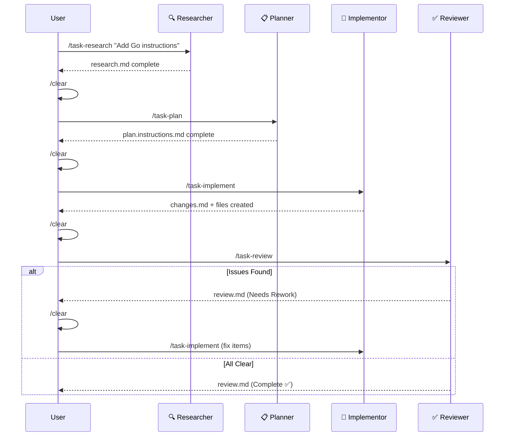

# RPI in Practice

This walkthrough follows a complete RPI cycle on a realistic task: adding a Go language instruction file to HVE-Core. Each phase shows the prompt you type, what the agent produces, and the `/clear` boundary that separates phases.

## The Task

You need to add a Go instruction file following existing conventions. In an unconstrained approach, you would say "Create a Go instruction file like the Python one." The AI would skim the Python file, make some analogies, and produce something plausible but potentially inconsistent.

With RPI, you separate the work into phases.

## Phase 1: Research

**What you type:**

```text
/task-research Add a Go language instruction file following existing conventions
```

**What the researcher does:**

The Task Researcher cannot write the instruction file. It can only investigate. This constraint causes it to search `.github/instructions/` for all existing language instruction files, compare their structures, read `prompt-builder.instructions.md` for authoring standards, and check for existing Go code patterns in the codebase.

**What it produces** (`.copilot-tracking/research/`):

```markdown
## Evidence Log

### Existing Instruction File Structure
* `.github/instructions/csharp/csharp.instructions.md` (lines 1-380)
  - Frontmatter: description + applyTo: '**/*.cs'
  - Sections: Project Structure, Coding Standards, Documentation, Complete Example
* `.github/instructions/python-script.instructions.md` (lines 1-210)
  - Frontmatter: description + applyTo: '**/*.py'
  - Sections: Entry Points, CLI Parsing, Logging, Path Handling, Type Hints

### Common Structure Across All Language Instructions
1. Frontmatter with description and applyTo glob
2. Language version targeting
3. Naming conventions table
4. Error handling patterns
5. Complete example demonstrating all conventions
```

**Then you type `/clear`** — clearing the conversation context entirely. The research artifact persists in `.copilot-tracking/research/`.

## Phase 2: Plan

**What you type:**

```text
/task-plan
```

The Task Planner reads the research artifact (not the conversation that produced it) and generates a phased implementation plan with checkboxes.

**What it produces** (`.copilot-tracking/plans/`):

```markdown
## Phase 1: Create Go Instruction File
- [ ] Create `.github/instructions/go.instructions.md`
- [ ] Add frontmatter: description + applyTo: '**/*.go'
- [ ] Add Go version targeting section (Go 1.22+)
- [ ] Add naming conventions table
- [ ] Add error handling patterns (error wrapping, sentinel errors)
- [ ] Add complete example demonstrating all conventions
```

**Then you type `/clear`** again.

## Phase 3: Implement

**What you type:**

```text
/task-implement
```

The Task Implementor reads the plan and executes it checkbox by checkbox. It creates the file, writes each section following the plan, and records changes in `.copilot-tracking/changes/`.

## Phase 4: Review

**What you type:**

```text
/task-review
```

The Task Reviewer validates the implementation against both the research findings and the plan. It checks whether the Go instruction file follows the common structure identified in research and whether every plan checkbox was addressed.

### When Review Finds Issues

Review does not always pass on the first attempt. The reviewer categorizes issues by severity:

* **Critical**: The implementation contradicts the research findings or violates a convention
* **Major**: A plan item was missed or implemented incorrectly
* **Minor**: Style issues, missing comments, or optional improvements

For Critical and Major issues, the status is "Needs Rework" and the iteration loop begins:

1. `/clear` and re-enter the implementor with `/task-implement`
2. The implementor reads the review findings alongside the original plan
3. It addresses each rework item and updates `changes.md`
4. `/clear` and re-enter the reviewer with `/task-review`

This loop typically converges in 1-2 iterations.

## The Artifact Data Bus

Phases communicate through files, not conversation. The `.copilot-tracking/` directory is the shared data bus:

```text
.copilot-tracking/
├── research/
│   └── go-instructions-research.md      ← Phase 1 writes, Phase 2 reads
├── plans/
│   └── go-instructions-plan.instructions.md  ← Phase 2 writes, Phase 3 reads
├── details/
│   └── go-instructions-details.md       ← Phase 2 writes, Phase 3 reads
├── changes/
│   └── go-instructions-changes.md       ← Phase 3 writes, Phase 4 reads
└── memory/
    └── session-memory.md                ← /checkpoint saves, /checkpoint restores
```

Each phase writes to its own directory and the next phase reads from it. No phase reads from conversation history. This is why `/clear` works: the artifacts contain everything the next phase needs.

## The Complete Timeline



## Tips and Common Mistakes

**Do not skip research.** The most common mistake is jumping straight to `/task-plan` or `/task-implement`. The research phase is where assumptions get validated. Skipping it means the AI builds on guesses rather than verified knowledge.

**Do clear between phases.** The `/clear` command is not optional in strict mode. Without it, context from the research phase bleeds into the planning phase, and the planner optimizes for what it remembers rather than what the research documented.

**Start with strict mode.** The visibility into each phase's output builds intuition about what quality looks like at each stage. Once you recognize good research and good plans, autonomous mode becomes trustworthy.

For how reviewed code becomes a merged PR, see [Code Review & PRs](code-review-prs). For the upstream workflow that produces tasks, see [Shape the Work: Backlog Management](../shape-the-work/backlog-management).
