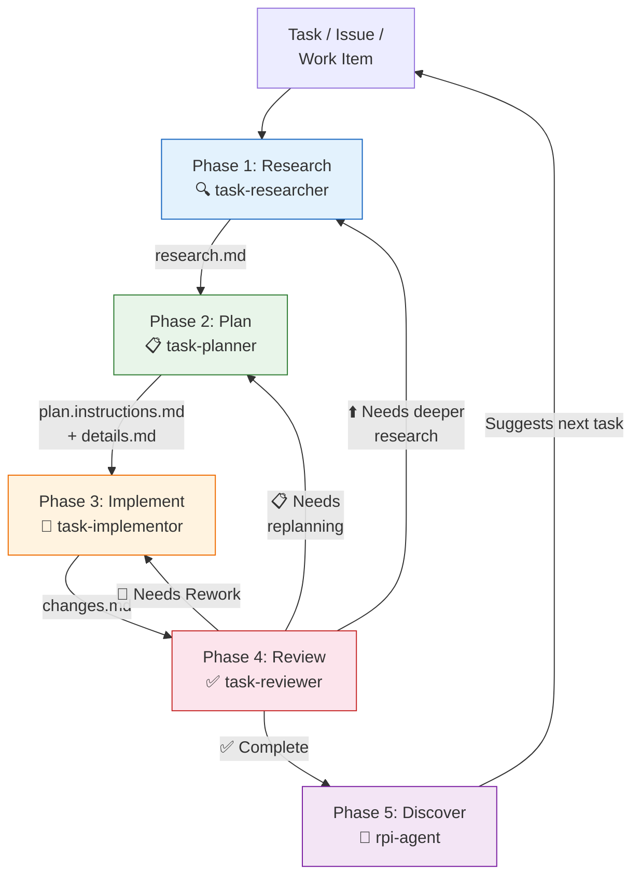
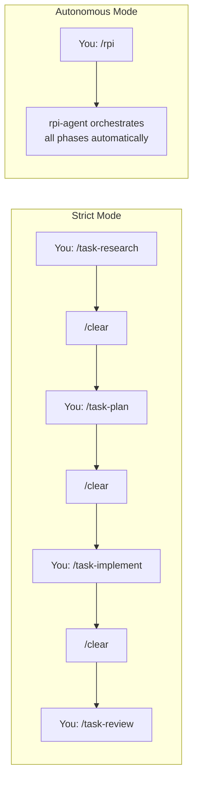

# The RPI Workflow

RPI treats code tasks as a type transformation pipeline. Each phase takes one kind of input and produces a different kind of output. The constraint that makes this work: each phase starts with a clean context, working only from documented artifacts rather than accumulated conversation history.

## The Five Phases

| Phase | Agent | Input | Output | Constraint |
|---|---|---|---|---|
| Research | 🟢 `@task-researcher` | Uncertainty | Verified knowledge | Cannot write code |
| Plan | 🟢 `@task-planner` | Knowledge | Actionable strategy | Cannot implement |
| Implement | 🟢 `@task-implementor` | Strategy | Working code | Must follow plan |
| Review | 🟢 `@task-reviewer` | Working code | Validated code | Cannot modify code |
| Discover | 🟢 `@rpi-agent` | Completed work | Next task | Suggests, does not decide |

## The Flow

The review phase is where the loop's power becomes clear. The reviewer validates against both the research findings and the plan, not just code style. When issues are found, work routes back to the right phase: rework for implementation errors, replanning for design problems, deeper research for missed assumptions.

## Two Modes: Strict vs Autonomous

**Strict mode**: You invoke each phase manually with its prompt (`/task-research`, `/task-plan`, `/task-implement`, `/task-review`), clearing context between phases with `/clear`. You review artifacts between phases and can redirect if something looks wrong.

**Autonomous mode**: You invoke `/rpi` or `@rpi-agent` once. The orchestrator dispatches subagents for each phase automatically, managing context boundaries internally. You review the final output.

## Decision Guide: When to Use Which

| Factor | Choose Strict | Choose Autonomous |
|---|---|---|
| Task complexity | High — needs deep research | Moderate — well-defined scope |
| Research depth | Extensive codebase exploration needed | Scope is already understood |
| Your involvement | Want to review between phases | Trust the pipeline, check at end |
| Context window | Large changes that benefit from fresh context per phase | Changes that fit in a single context |
| Learning RPI | You are new to the workflow and want to see each phase | You know the workflow and want speed |

:::tip Start strict, move to autonomous
Start with strict mode when learning RPI. The visibility into each phase's output builds intuition about what good research, planning, and review look like. Move to autonomous mode once you trust the artifact quality at each phase.
:::

## How Phases Communicate

Phases do not communicate through conversation history. They communicate through files in `.copilot-tracking/`. Each phase writes structured markdown that the next phase reads. This means:

* **Persistence**: Research on Monday feeds planning on Wednesday
* **Traceability**: The plan references specific findings from the research. The review validates against both
* **Resumability**: If a phase is interrupted, restart it — the artifacts from previous phases are still there

For a detailed walkthrough showing these artifacts in action, see [RPI in Practice](rpi-in-practice).

For the upstream workflow that produces the tasks RPI works on, see [Shape the Work: Backlog Management](../shape-the-work/backlog-management).
