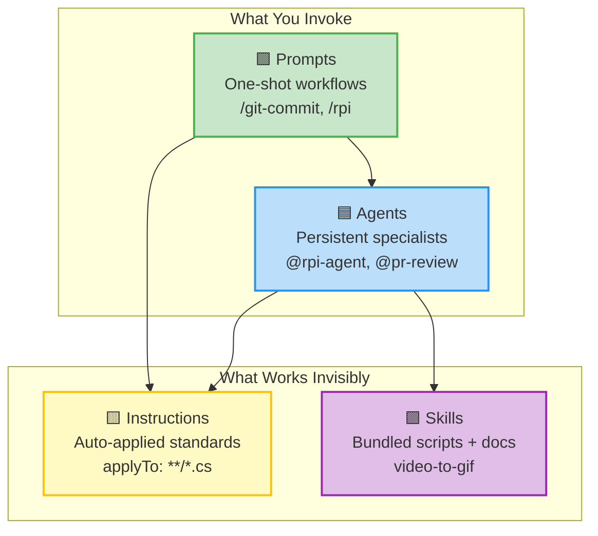
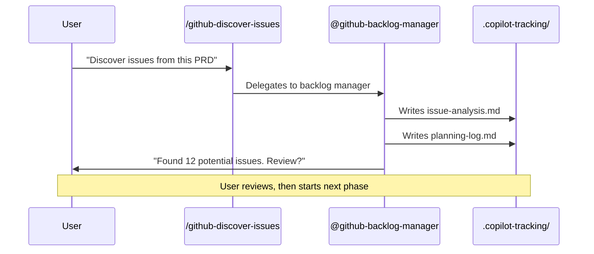
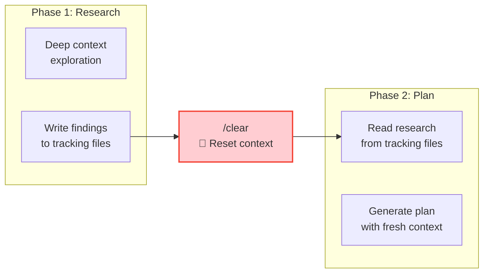

# How HVE-Core Works

HVE-Core is not a single tool. It is a system of four artifact types that work together. Understanding these layers explains why using HVE-Core feels different from other AI coding assistants.

## Four Layers, One System

Two layers are things you invoke directly: **prompts** and **agents**. Two layers work invisibly: **instructions** and **skills**.



## Instructions: The Invisible Standards

When you open a Python file and ask Copilot to help, something happens before the AI generates a single token: the `python-script.instructions.md` file is automatically injected into the context. The AI now knows to use `pathlib.Path` instead of `os.path`, type hints with Python 3.11+ syntax, Google-style docstrings, and `click` for complex CLIs.

You did not invoke anything. You did not configure anything. The `applyTo: '**/*.py'` frontmatter pattern matched your file, and the conventions appeared.

This is the "invisible guardrails" concept: coding standards that enforce themselves through the instruction file system. Every language-specific instruction file defines conventions that activate when you touch a matching file.

Available standards include C# (.NET 10), Python 3.11+, Bash 5.x, Bicep, Terraform, Markdown, and writing style conventions. When you edit a `.cs` file, C# conventions activate. When you edit a `.tf` file, Terraform conventions activate. The AI follows your standards without being reminded.

:::tip You're already getting value
If you installed HVE-Core and then edited any code file, instruction files were already shaping the AI's output. This is the lowest-friction entry point: conventions apply automatically without learning any commands or workflows.
:::

## Prompts: One-Shot Workflows

Prompts are single-invocation workflows. Type `/git-commit` in Copilot Chat and the prompt stages your changes, generates a conventional commit message, and commits. Type `/rpi` and the prompt kicks off the full Research-Plan-Implement-Review cycle.

Prompts accept input variables and can delegate to agents for complex work. The `/github-discover-issues` prompt, for example, delegates to the `@github-backlog-manager` agent for the actual discovery logic.

## Agents: Persistent Specialists

Agents are multi-turn conversational or autonomous workflows. The `@rpi-agent` orchestrates the complete Research → Plan → Implement → Review loop. The `@github-backlog-manager` coordinates four specialized workflows through a single conversation.

Agents can hand off to other agents. The RPI agent dispatches `@task-researcher`, `@task-planner`, `@task-implementor`, and `@task-reviewer` as subagents, each constrained to one cognitive mode.

## Skills: Bundled Utilities

Skills package documentation with executable scripts. The `video-to-gif` skill bundles FFmpeg conversion scripts with usage documentation. Skills are the least common artifact type, used when a task requires running external tools rather than conversational guidance.

## The Handoff Pattern: Guided Flows

Some workflows span multiple agents and prompts in a defined sequence. The GitHub Backlog Manager, for example, guides you through discovery → triage → sprint planning → execution, with each step producing artifacts that the next step consumes.



## The `/clear` Boundary: Why Constrained Phases Win

Here is a counterintuitive insight: giving an AI *less* context often produces *better* results.

In a long Copilot Chat session, context accumulates. Early research pollutes later planning decisions. Implementation details bleed into architectural choices. The AI's attention spreads across everything rather than focusing on the task at hand.

HVE-Core's answer is the `/clear` boundary pattern. Each workflow phase writes its outputs to `.copilot-tracking/` files, then the user clears the chat context. The next phase reads *only* the structured artifacts, not the messy exploration that produced them.



This is the same principle that makes Unix pipes powerful: each stage transforms a clean input into a clean output. The intermediate thinking is discarded, not accumulated.

## The Artifact Bus: `.copilot-tracking/`

The `.copilot-tracking/` directory is the shared state bus for all HVE-Core workflows. Each workflow phase writes structured markdown files that the next phase reads. This creates three properties that conversation-only AI assistants lack:

**Persistence**: Artifacts survive conversation resets. You can start researching on Monday and implement on Friday.

**Traceability**: The plan references specific line numbers in the research. The review validates against both. Every decision has a paper trail.

**Parallelism**: Multiple researchers can contribute findings to the same research document. Multiple implementors can work on different plan phases.

The directory structure organizes artifacts by workflow type:

```text
.copilot-tracking/
├── research/          ← Task Researcher output
├── plans/             ← Task Planner output
├── changes/           ← Task Implementor output
├── pr/                ← PR generation artifacts
├── github-issues/     ← Backlog management artifacts
└── workitems/         ← ADO work item artifacts
```

## How This Differs from Just Asking ChatGPT

You can ask any AI assistant to "write me a PRD" or "plan this feature." The result will be plausible and generic. It will not know your team's naming conventions, your backlog's current state, your codebase's architectural constraints, or the commit message format your CI pipeline requires.

HVE-Core addresses this gap in three ways:

**Instructions encode your standards.** Conventions are not remembered from previous conversations. They are loaded automatically based on file patterns. The AI follows your team's C# conventions because `csharp.instructions.md` says so, not because you reminded it.

**Agents carry workflow knowledge.** The `github-backlog-manager` agent knows the 4-step backlog flow because its definition includes the protocol. It does not "figure out" how to triage issues. It follows a defined sequence with similarity assessment, label mapping, and duplicate detection built in.

**Tracking files create continuity.** The `.copilot-tracking/` directory is an artifact bus. Each workflow phase writes structured outputs that the next phase reads. A planning session on Monday produces artifacts that an implementation session on Friday can consume, even across different chat sessions and context windows.

:::info How this site was designed
This documentation site used HVE-Core's own workflow to build itself. A research dossier mapped 70+ artifacts. Five workshops explored user segments, page structures, and educational framing, diverging broadly before converging on four delivery-aligned sections. The plan went through specify → clarify → architect → validate gates before any content was written. You are reading the output of the same process the site teaches.
:::
