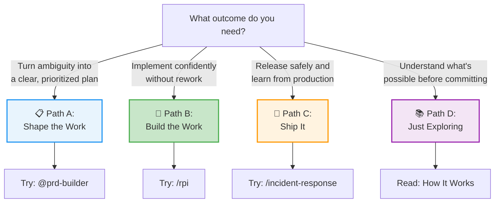

# Quick Start: Choose Your Path

HVE-Core provides 70+ artifacts across the full delivery lifecycle. This page helps you find the right starting point for your role and goals.

Your role determines which artifacts matter. A product manager managing a GitHub backlog uses completely different tools than an engineer implementing a feature, who uses completely different tools than a platform engineer responding to a production incident.

Pick the path that matches your outcome, not your job title. Each path gives you one artifact to try right now, three artifacts to learn first, and a pointer to the site section that covers your workflow in depth.

:::note Site sections are being built progressively
The Shape the Work, Build the Work, and Ship It sections are under active development. Links to those sections will be added as content lands. For now, the descriptions below explain what each section will cover.
:::

## What Do You Need to Do?

## Path A: Turn Ambiguity into a Clear Plan

**Role**: Product Manager, Tech Lead, TPM, Engineering Manager

**Your first 5 minutes**: Try the PRD builder.

Open Copilot Chat and type `@prd-builder`. Describe a feature you are working on. The agent walks you through a structured requirements gathering process, asking clarifying questions and producing a formatted Product Requirements Document.

When you are done, you will have a PRD that can feed directly into the backlog management flow.

**The 3 artifacts that matter most to you**:

| Artifact | What It Does | Try It |
|---|---|---|
| `@prd-builder` | Builds structured Product Requirements Documents through guided Q&A | `@prd-builder` in Copilot Chat |
| `@github-backlog-manager` | Orchestrates issue discovery, triage, sprint planning, and batch execution | `/github-discover-issues` in Copilot Chat |
| `@adr-creation` | Guides you through Architecture Decision Records for technical choices | `@adr-creation` in Copilot Chat |

**Go deeper**: [Shape the Work](../shape-the-work/overview) covers requirements, backlog management, and ADO integration in detail.

## Path B: Implement Confidently Without Rework

**Role**: Software Engineer, DevOps Engineer, Data Scientist

**Your first 5 minutes**: Try the RPI workflow.

Open Copilot Chat in a repository with an open issue or task. Type `/rpi` and point it at your issue. The RPI agent autonomously researches your codebase, creates a phased implementation plan, implements changes with tracking, and reviews its own work. It is the closest thing to a pair programmer that actually reads the codebase before writing code.

**The 3 artifacts that matter most to you**:

| Artifact | What It Does | Try It |
|---|---|---|
| `@rpi-agent` | Autonomous Research → Plan → Implement → Review loop | `/rpi` in Copilot Chat |
| `@pr-review` | Code review focused on bugs, security, and logic errors (not style) | `@pr-review` in Copilot Chat |
| `/git-commit` | Stage changes, generate conventional commit messages, commit | `/git-commit` in Copilot Chat |

**Go deeper**: [Build the Work](../build-the-work/overview) covers the RPI workflow, code review, coding standards, and data science workflows.

## Path C: Release Safely and Learn from Production

**Role**: Platform Engineer, SRE, Release Manager

**Your first 5 minutes**: Try incident response.

Open Copilot Chat and type `/incident-response`. Describe an incident scenario. The prompt walks you through an Azure-focused incident response workflow with structured assessment, communication templates, and remediation tracking.

**The 3 artifacts that matter most to you**:

| Artifact | What It Does | Try It |
|---|---|---|
| `/incident-response` | Azure incident response workflow with structured assessment | `/incident-response` in Copilot Chat |
| `bicep.instructions.md` | Auto-applied Azure Bicep conventions when editing `.bicep` files | Automatic — just edit a `.bicep` file |
| `terraform.instructions.md` | Auto-applied Terraform conventions when editing `.tf` files | Automatic — just edit a `.tf` file |

:::warning Early-stage coverage
Ship It is where HVE-Core is growing fastest. Release management, SLO tooling, and monitoring automation are on the roadmap. The Ship It section covers what is available today and what is coming next.
:::

<!-- TODO: Add link to ship-it/overview when Phase 2D lands -->
**Go deeper**: The Ship It section covers incident response, IaC conventions, and the roadmap for future operations tooling.

## Path D: Understand What's Possible

**Role**: Anyone curious about HVE-Core

**Your first 5 minutes**: Understand the architecture.

Read [How HVE-Core Works](how-it-works) to understand the 4-layer model (Prompts, Agents, Instructions, Skills). Then browse the Reference section (coming soon) to see the complete artifact inventory organized by type.

When you are ready to try something, come back to this page and pick Path A, B, or C based on what you do day-to-day.

## What to Try Next

After your first 5 minutes, the natural next step depends on your path:

* **Product/Planning**: Take a real PRD or requirements document and run it through `/github-discover-issues` to see how HVE-Core translates requirements into a structured backlog.
* **Engineering**: Pick a real issue in your project and run `/rpi` end-to-end. Watch how it researches your codebase before planning, and how the phased plan creates checkpoints you can review.
* **Platform/Ops**: Edit a Bicep or Terraform file and notice how conventions apply automatically. Check [How It Works](how-it-works) for more on the auto-applied instruction mechanism.

Haven't installed yet? Start with [Installation](installation).
