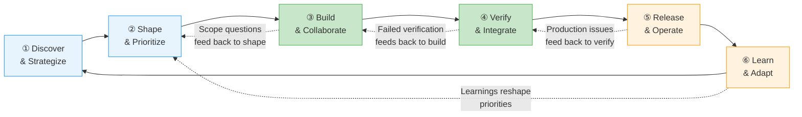

# The Value Delivery Loop

:::caution Draft Content
This page is not finalised. The value delivery loop model and metric mappings are working drafts subject to revision.
:::

Software delivery is often drawn as a pipeline: requirements go in one end, deployed features come out the other. This mental model is comforting and wrong.

In practice, delivery is a loop. Learnings from production reshape priorities. Failed verifications send work back to development. Scope questions during build feed back to shaping. The "pipeline" metaphor obscures these feedback arcs, and obscured feedback arcs are where organizations lose velocity.

## The Full Loop with Feedback Arcs

The forward flow (①→②→③→④→⑤→⑥→①) is what most teams track. The feedback arcs (dashed lines) are where elite teams differentiate. Mean time to detect and mean time to recover collapse from days to minutes when those learnings feed directly into backlog prioritization rather than sitting in a postmortem document nobody reads.

## Phase ①: Discover & Strategize

**What happens**: Product vision, market signals, competitive analysis, and stakeholder alignment define what the organization should invest in. The key artifacts are roadmaps, OKRs, and opportunity backlogs.

**Who is involved**: Product leadership, business stakeholders, strategy teams.

**What can go wrong**: Building the wrong thing perfectly. Teams optimize locally while the product drifts from market need. Strategy stays abstract and never translates into concrete, prioritized work items.

**Which metrics apply**: [SPACE](https://cacm.acm.org/practice/the-space-of-developer-productivity/) Satisfaction (clarity of mission), [ESSP](https://github.com/resources/insights/engineering-system-success-playbook) Business Outcomes (are we pursuing the right opportunities). [DORA](https://dora.dev/guides/dora-metrics/) metrics do not directly measure this phase, which is part of why it gets neglected.

**Where HVE-Core helps**: Risk register and security plan creator support strategic assessment. This phase has the most room to grow, and contributions here are especially impactful.

## Phase ②: Shape & Prioritize

**What happens**: Business needs, user feedback, and technical insights are translated into structured, prioritized work items. Vague ideas become concrete requirements with acceptance criteria. Backlogs are groomed, deduplicated, and organized into milestones or sprints.

**Who is involved**: Product Managers, Tech Leads, TPMs, Engineering Managers. Sometimes the entire team during sprint planning.

**What can go wrong**: Requirements stay vague because nobody invested time in shaping them. Developers start building from ambiguous tickets and make assumption-driven decisions that create rework. Prioritization happens by loudest voice rather than strategic framework.

**Which metrics apply**: DORA Lead Time for Changes (upstream shaping directly determines how fast work flows into development), SPACE Efficiency (backlog-to-sprint time), ESSP Velocity (well-shaped work moves faster through build).

**Where HVE-Core helps**: PRD and BRD builders structure requirements through guided conversation. The GitHub Backlog Manager orchestrates a 4-step flow (discover → triage → sprint plan → execute). ADO integration provides the same capabilities for Azure DevOps teams. Architecture decision records and security plans capture technical choices early.

:::tip
This is HVE-Core's second-deepest area, with 20 artifacts across two complete backlog management flows. If your bottleneck is "turning ideas into actionable work," start here.
:::

## Phase ③: Build & Collaborate

**What happens**: Engineers research the problem space, plan their approach, write code, and submit it for review. This is not just "coding." It is a collaborative knowledge-transfer process where code review, pair programming, and documentation all contribute to the outcome.

**Who is involved**: Software Engineers, DevOps Engineers, Data Scientists, Technical Writers.

**What can go wrong**: Engineers start coding before understanding the problem. AI assistants generate plausible but incorrect code because research and implementation happen in the same context. Code review catches style issues but misses logic errors because the reviewer lacks context on the original intent.

**Which metrics apply**: DORA Lead Time for Changes (first commit to production), SPACE Activity (commits, PRs, reviews as supporting signals only), SPACE Communication (PR review cycles, knowledge silos), ESSP Developer Happiness (flow state, low friction).

**Where HVE-Core helps**: The RPI workflow (Research → Plan → Implement → Review) provides phase-separated AI assistance. Six language-specific instruction files auto-apply coding conventions. PR generation, code review, and git operations are comprehensive. The data science pipeline covers specification through dashboard testing.

## Phase ④: Verify & Integrate

**What happens**: CI/CD pipelines run automated tests, static analysis, and security scanning. Code coverage gates enforce quality thresholds. Integration tests verify that changes work with the rest of the system.

**Who is involved**: Engineers (writing tests), CI/CD systems (running them), Security teams (reviewing scan results).

**What can go wrong**: Every gap in test coverage is technical debt against your change failure rate. Teams optimize for test speed at the expense of test quality. Security scanning produces so many false positives that real vulnerabilities get ignored.

**Which metrics apply**: DORA Change Failure Rate (what percentage of deployments cause failures), DORA Deployment Frequency (how often the verification pipeline completes), ESSP Quality (defect escape rate).

**Where HVE-Core helps**: The PR review agent focuses on bugs, security, and logic errors with a high signal-to-noise ratio. Doc-ops validates documentation quality. C# test instructions enforce conventions. Testing conventions for additional languages are an active area of contribution.

## Phase ⑤: Release & Operate

**What happens**: Code is released to production. Progressive delivery strategies (canary releases, feature flags, blue/green deployments) manage risk. Operational hygiene covers toil reduction, incident response, and SLO/SLA management.

**Who is involved**: Platform Engineers, SREs, Release Managers, on-call engineers.

**What can go wrong**: Deployments happen without observability. When something breaks, the team lacks the tooling to diagnose quickly. Toil accumulates because operational improvements are never prioritized against feature work.

**Which metrics apply**: DORA Deployment Frequency and Change Failure Rate (measured at the deployment boundary), DORA Mean Time to Recovery, ESSP Quality (failed deployment recovery time).

**Where HVE-Core helps**: The incident response prompt provides structured triage, diagnosis, and RCA workflows. Bicep and Terraform instruction files help write correct infrastructure code. Build monitoring is available through the ADO build info prompt. This segment has the most opportunity for growth, and the roadmap is active.

## Phase ⑥: Learn & Adapt

**What happens**: Observability data, real-user monitoring, and error tracking reveal whether what shipped actually moved the needle. Incident postmortems identify systemic issues. Learnings feed back into discovery and shaping, closing the loop.

**Who is involved**: Product teams (validating impact), Engineering teams (improving reliability), Leadership (adjusting strategy).

**What can go wrong**: Learnings stay in postmortem documents nobody reads. The feedback arc from production to planning never closes. Teams keep shipping features without knowing whether previous features achieved their intended impact.

**Which metrics apply**: DORA Mean Time to Recovery (how quickly learning translates to action), SPACE Satisfaction (sense of progress), ESSP Business Outcomes (did the feature achieve its goal).

**Where HVE-Core helps**: Community interaction templates support contributor communication. This is the phase with the least HVE-Core coverage today, and closing the ⑥→① feedback arc is the next frontier.

## How DORA Metrics Map to Phases

| Metric | Primary Phase(s) | What It Measures |
|---|---|---|
| Deployment Frequency | ③④⑤ | Throughput across build, verify, and release |
| Lead Time for Changes | ②③④⑤ | First commit to production, but shaped by upstream clarity |
| Change Failure Rate | ④⑤ | Failures in production caused by gaps in verify and release |
| Mean Time to Recovery | ⑤⑥ | Speed of response and learning from failures |

## How SPACE Dimensions Cross-Cut Everything

| SPACE Dimension | ① Discover | ② Shape | ③ Build | ④ Verify | ⑤ Release | ⑥ Learn |
|---|---|---|---|---|---|---|
| **Satisfaction** | Clarity of mission | Confidence in plan | Flow state | Trust in test suite | Deploy confidence | Sense of progress |
| **Performance** | Strategy quality | Backlog actionability | Code quality | Defect escape rate | Deploy success rate | Insight quality |
| **Activity** | Research volume | Stories refined | Commits, PRs | Test runs, builds | Deploys | Retro actions closed |
| **Communication** | Stakeholder alignment | Cross-team prioritization | PR review cycles | CI/CD signal clarity | Incident comms | Knowledge sharing |
| **Efficiency** | Idea-to-backlog time | Backlog-to-sprint time | Cycle time | Build time | Deploy time | Learning-to-action time |

## How [ESSP](https://github.com/resources/insights/engineering-system-success-playbook) Zones Layer On Top

Where DORA gives you four metrics and SPACE gives you five dimensions, the [Engineering Systems Success Playbook](https://github.com/resources/insights/engineering-system-success-playbook) organizes the conversation into four outcome zones:

**Developer Happiness**: Are engineers satisfied with their tools, processes, and work environment? This is measured through SPACE's Satisfaction dimension, but ESSP treats it as a first-class outcome rather than a secondary indicator.

**Quality**: Are we shipping work that stays shipped? Change Failure Rate and defect escape rate are the primary signals. Quality is not just about testing. It is about the upstream shaping that determines whether the right thing was built.

**Velocity**: How fast does value move through the loop? This is not deployment frequency alone. It is the end-to-end lead time from "we have an idea" to "a user benefits from it."

**Business Outcomes**: Did the shipped feature actually achieve its intended impact? This is the zone most engineering organizations ignore because it crosses the boundary between engineering metrics and product metrics.

## The Feedback Arcs

The four feedback arcs in the diagram are where the loop either accelerates or stalls:

**⑥→② (Learnings reshape priorities)**: The most important arc. When production learnings directly influence what gets shaped next, the organization learns faster than competitors. When this arc is broken, teams ship features into a void.

**④→③ (Failed verification feeds back to build)**: Fast CI feedback means developers fix issues in minutes rather than days. Slow or noisy CI means failures are ignored.

**⑤→④ (Production issues feed back to verify)**: When production incidents reveal gaps in testing, those gaps should be closed immediately, not added to a backlog that is never prioritized.

**③→② (Scope questions feed back to shape)**: When developers encounter ambiguity during implementation, they need a fast path back to the shaper, not a Slack thread that gets buried.

Organizations with the shortest full-loop cycle time, not just deployment cycle time, consistently outperform on both developer satisfaction and business outcomes.

Now that you understand the delivery model, see [How HVE-Core Works](how-it-works) to understand the technical architecture, or jump to the [Quick Start](quick-start) to find the right entry point for your role.
