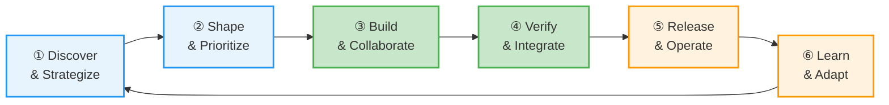

# What is HyperVelocity Engineering?

Most engineering teams optimize for code velocity. Faster builds. Faster deploys. Faster CI pipelines. Those investments pay off, but only in phases ③ and ④ of the value delivery loop.

Meanwhile, a product manager spends three weeks turning a business need into a coherent set of requirements. A tech lead spends another week breaking those requirements into work items that developers can actually act on. After the code ships, nobody closes the loop to ask: did this actually solve the problem?

HyperVelocity Engineering is the practice of shortening the *entire* value delivery loop, not just the build-and-verify phases. It is the difference between "we deploy 47 times a day" and "we consistently deliver the right thing, fast, with confidence."

## The Value Delivery Loop

Everything flows from this loop. Six phases, continuously cycling:



The insight from [DORA](https://dora.dev) and [SPACE](https://cacm.acm.org/practice/the-space-of-developer-productivity/) research: most engineering tooling investment goes into phases ③–④, but most organizations leak value in phases ①–② and ⑥. HVE-Core takes an unusual position by investing deeply in phase ② (Shape & Prioritize) alongside phase ③ (Build & Collaborate).

The value delivery loop follows the same principle as design thinking's Double Diamond: diverge (discover broadly) then converge (decide narrowly), repeated across each phase. Discovery is divergent exploration. Shaping is convergent prioritization. Building is divergent implementation. Verification is convergent validation. This isn't a coincidence — structured phase separation produces better outcomes whether you're designing a product or engineering software.

## Where Organizations Leak Value

DORA research consistently shows that elite engineering organizations do not just ship faster. They ship *differently*. Their lead time for changes is measured in hours because the upstream work (discovery, shaping, prioritization) is already structured when it reaches the development team.

The pattern is predictable: organizations invest heavily in CI/CD automation, code review tooling, and testing infrastructure. These are phases ③ and ④. But the requirements were fuzzy going in, and nobody measures whether the shipped feature moved a business metric. Value leaks at the seams between phases, not within them.

## How We Measure What Matters

Three research frameworks inform the HVE approach:

**[DORA Four Key Metrics](https://dora.dev/guides/dora-metrics/)** measure delivery performance: Deployment Frequency, Lead Time for Changes, Change Failure Rate, and Mean Time to Recovery. Elite teams excel across all four, not by optimizing each independently but by tightening the feedback loops between them.

**[SPACE Framework](https://cacm.acm.org/practice/the-space-of-developer-productivity/)** (Satisfaction, Performance, Activity, Communication, Efficiency) pushes back against activity-only metrics. Developer satisfaction and communication quality are leading indicators of delivery outcomes, more so than raw commit counts or PR velocity.

**[ESSP (Engineering Systems Success Playbook)](https://github.com/resources/insights/engineering-system-success-playbook)** organizes measurement into four outcome zones: Developer Happiness, Quality, Velocity, and Business Outcomes. The practical insight is that the Quality zone bridges Velocity (how fast) and Impact (did it matter), and most organizations have a gap there.

## What HVE-Core Provides

HVE-Core is a collection of prompts, agents, instructions, and skills for GitHub Copilot. It provides structured workflows for the phases of software delivery where AI assistance creates measurable improvement.

**Strong coverage in [shaping work](shape-the-work/overview)**: PRD builders, [backlog management flows](shape-the-work/backlog-management), architecture decision records, security planning. The GitHub Backlog Manager orchestrates a complete pipeline from issue discovery through sprint planning.

**Deep coverage in [building work](build-the-work/overview)**: The [RPI](build-the-work/rpi-workflow) (Research → Plan → Implement → Review) workflow provides phase-separated AI assistance that produces better results than unconstrained "just code it" approaches. Six language-specific instruction files apply coding conventions automatically. Code review, PR generation, and git operations are comprehensive.

**Growing coverage in [shipping work](ship-it/overview)**: [Incident response](ship-it/incident-response) workflows, [IaC coding conventions](ship-it/infrastructure-as-code) for Bicep and Terraform, and operational risk assessment. Ship It is HVE-Core's area of most active growth, with a clear [roadmap](ship-it/whats-coming) for release management, SLO tooling, and feedback loop automation.

:::note What's on the horizon
Release management, progressive delivery, SLO/SLA tooling, telemetry analysis, and retrospective facilitation are active areas of growth. HVE-Core focuses first on phases where AI-assisted workflows create the clearest improvement, and expands from there. The [Ship It](ship-it/overview) section covers what exists today and [what is coming next](ship-it/whats-coming).
:::

<!-- TODO: This heatmap is static text. Consider generating from artifact inventory if it becomes a maintenance burden -->

```text
Phase                       Coverage
───────────────────────────────────────────────
① Discover & Strategize     ░░██░░░░    risk-register, security-plan
② Shape & Prioritize        ████████    PRD/BRD builders, backlog flows, ADR
③ Build & Collaborate       ██████████  RPI flow, coding standards, git ops
④ Verify & Integrate        ████████░░  pr-review, doc-ops, test instructions
⑤ Release & Operate         ██░░░░░░    incident-response, IaC conventions
⑥ Learn & Adapt             ░░░░░░░░    community-interaction (minimal)

████ = Rich tooling     ██ = Some tooling     ░░ = Opportunity
```

This distribution is not accidental. HVE-Core invested where AI-assisted workflows create the clearest improvement today: structured planning (②) and disciplined implementation (③).

## Next Steps

Start with the [Value Delivery Loop](getting-started/value-delivery-loop) to understand the delivery model in depth, then learn [how the architecture works](getting-started/how-it-works) and find the [right entry point for your role](getting-started/quick-start).

