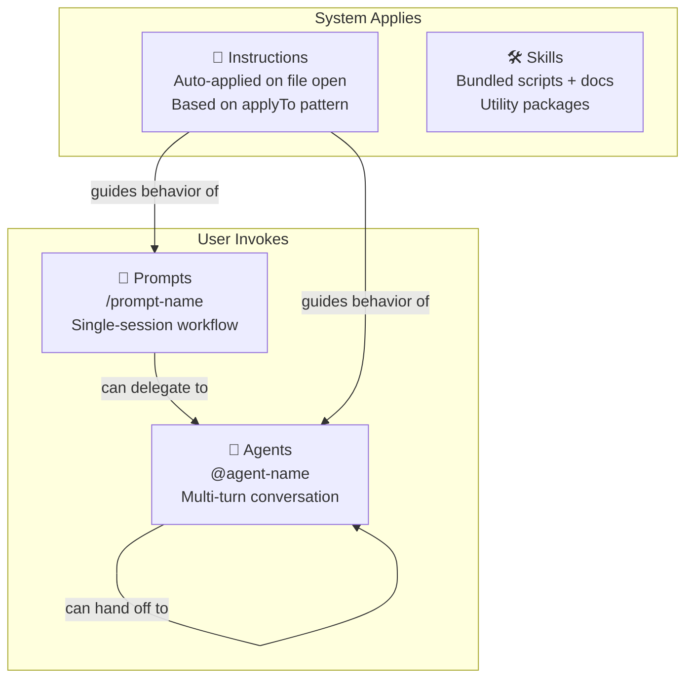

# Artifact Types

HVE-Core organizes AI customizations into four types, each with a distinct activation model and purpose. Understanding these types is essential for using and extending the system.

## Agents (.agent.md)

Agents are multi-turn conversational or autonomous workflows. They maintain context across turns, have access to declared tools, and can hand off to other agents. You invoke an agent by mentioning `@agent-name` in Copilot Chat.

**Location**: `.github/agents/`

**Activation**: `@agent-name` in chat

**Examples**: `@rpi-agent` autonomously orchestrates the Research → Plan → Implement → Review loop. `@prd-builder` walks you through structured requirements gathering. `@pr-review` reviews code changes for bugs, security, and logic errors.

## Prompts (.prompt.md)

Prompts are single-session workflows. Invoke with `/prompt-name` and Copilot executes to completion. Prompts can accept input variables and delegate to an agent for execution. They are the quick-action layer.

**Location**: `.github/prompts/`

**Activation**: `/prompt-name` command

**Examples**: `/rpi` starts the full RPI flow. `/git-commit` stages and commits with conventional messages. `/incident-response` walks through structured incident triage.

## Instructions (.instructions.md)

Instructions are auto-applied coding standards. No invocation is needed. They activate based on file patterns defined in the `applyTo` frontmatter field. When you open a file matching the pattern, Copilot loads the instruction context automatically. This is the invisible quality layer.

**Location**: `.github/instructions/` (or anywhere in the workspace)

**Activation**: Automatic, based on `applyTo` glob pattern

**Examples**: `csharp.instructions.md` with `applyTo: '**/*.cs'` applies C# conventions whenever you edit a `.cs` file. `markdown.instructions.md` applies to all markdown files. For more on how this mechanism works, see [How It Works](../getting-started/how-it-works).

## Skills (SKILL.md)

Skills are self-contained packages that bundle documentation with executable scripts. Unlike prompts and agents, skills provide concrete utilities with bash and PowerShell scripts rather than conversational guidance. Each skill lives in its own directory under `.github/skills/`.

**Location**: `.github/skills/<skill-name>/SKILL.md`

**Activation**: Referenced by agents or prompts

**Examples**: `video-to-gif` bundles FFmpeg conversion scripts for both bash and PowerShell.

## Artifact Type Comparison

| Aspect | Agents | Prompts | Instructions | Skills |
|---|---|---|---|---|
| File extension | `.agent.md` | `.prompt.md` | `.instructions.md` | `SKILL.md` |
| Activation | `@agent-name` in chat | `/prompt-name` command | Automatic on file open | Referenced by agents/prompts |
| Interaction | Multi-turn conversation | Single invocation | Invisible (no interaction) | Script execution |
| State | Persists across turns | Single session | Stateless | Stateless |
| Tools | Declared in frontmatter | Inherited from agent | N/A | Bundled scripts |
| Handoffs | Can hand off to other agents | Can delegate to one agent | N/A | N/A |
| Input variables | N/A | `${input:name}` syntax | N/A | Parameters in SKILL.md |
| Required frontmatter | `description` | `description` | `description`, `applyTo` | `name`, `description` |

## When to Use Which Type

:::tip Decision Guide
- **"I need a multi-step conversation with a specialist"** → Agent
- **"I need to run a workflow once and get results"** → Prompt
- **"I need coding standards enforced whenever I edit certain files"** → Instruction
- **"I need a utility with scripts I can run"** → Skill
:::

### Common Patterns

- An **agent** that orchestrates other agents: `rpi-agent` dispatches `task-researcher`, `task-planner`, `task-implementor`, and `task-reviewer` in sequence
- A **prompt** that delegates to an agent: `/github-discover-issues` delegates to `@github-backlog-manager`
- An **instruction** that guides all agents: `commit-message.instructions.md` applies whenever any agent creates a git commit
- A **skill** with cross-platform scripts: `video-to-gif` bundles FFmpeg conversion for bash and PowerShell

## The Frontmatter Contract

Every artifact starts with YAML frontmatter between `---` delimiters. The required and optional fields vary by type. See the [Frontmatter Schema Reference](frontmatter-schema) for complete field documentation, and the [All Artifacts A-Z](all-artifacts) catalog for the full inventory.
