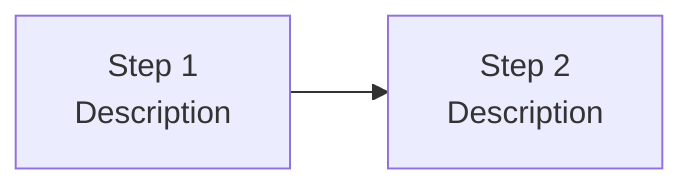

# Contributing to Docs

This page covers how to add and edit pages on the HVE-Core documentation site. For contributing artifacts (agents, prompts, instructions, skills) to the repository itself, see [CONTRIBUTING.md](https://github.com/microsoft/hve-core/blob/main/CONTRIBUTING.md).

## Writing New Pages

To add a page:

1. Create a `.md` file in the appropriate category directory under `docs/docusaurus/docs/`
2. Add the required frontmatter (see below)
3. Write your content following the conventions on this page
4. Run `npm run build` in `docs/docusaurus/` to verify no broken links or errors

## Page Frontmatter

Every Docusaurus page requires three frontmatter fields:

```yaml
---
title: Your Page Title
description: A one-sentence summary of what this page covers
sidebar_position: 3
---
```

| Field | Required | Purpose |
|---|---|---|
| `title` | Yes | Page heading and browser tab title |
| `description` | Yes | SEO meta description and social sharing |
| `sidebar_position` | Yes | Order within the category (lower = higher) |
| `sidebar_label` | No | Override display name in sidebar |
| `keywords` | No | Array of search terms for discoverability |

## Docusaurus Syntax Guide

Docusaurus uses a few syntax patterns that differ from standard GitHub-flavored markdown.

### Admonitions

Use triple-colon syntax for callout boxes. Do not use GitHub-style `> [!NOTE]` alerts — they do not render in Docusaurus.

```markdown
:::note
Useful information that users should know, even when skimming.
:::

:::tip
Helpful advice for doing things better or more easily.
:::

:::info
Additional context that clarifies a concept.
:::

:::warning
Important information that could prevent problems.
:::

:::danger
Critical information about potential data loss or security issues.
:::
```

Each admonition renders as a colored callout box with an icon matching its severity level.

### Internal Links

Docusaurus links between pages use relative paths **without** the `.md` extension:

```markdown
<!-- Correct -->
See [Artifact Types](../reference/artifact-types) for details.

<!-- Incorrect — .md extension will cause build warnings -->
See [Artifact Types](../reference/artifact-types.md) for details.
```

Link to pages in other categories using relative paths from the current file location:

```markdown
<!-- From ship-it/overview.md to build-the-work/rpi-workflow.md -->
[RPI Workflow](../build-the-work/rpi-workflow)

<!-- From reference/artifact-types.md to getting-started/how-it-works.md -->
[How It Works](../getting-started/how-it-works)
```

### Mermaid Diagrams

Use fenced code blocks with the `mermaid` language tag. Use `<br/>` for line breaks within node labels:

````markdown

````

### Code Blocks

Always specify a language for syntax highlighting. Use `text` when no highlighting is needed:

````markdown
```bash
npm run build
```

```yaml
---
title: Example
---
```
````

## Adding New Categories

Each sidebar category is a directory with a `_category_.json` file:

```json
{
  "label": "Category Name",
  "position": 3,
  "collapsible": true,
  "collapsed": false
}
```

| Field | Purpose |
|---|---|
| `label` | Display name in the sidebar |
| `position` | Order among sibling categories (lower = higher) |
| `collapsible` | Whether the category can be collapsed |
| `collapsed` | Whether the category starts collapsed |

Adding a new top-level category changes the site's information architecture. Discuss with maintainers before creating one. Adding pages within existing categories is encouraged.

## The docusaurus-edits Instructions File

The file `.github/instructions/docusaurus-edits.instructions.md` auto-applies to all files under `docs/docusaurus/`. When Copilot edits site content, it follows these conventions automatically. The conventions cover frontmatter requirements, admonition syntax, link format, Mermaid diagrams, category structure, page length guidelines, and cross-linking patterns.

You do not need to memorize the conventions. They are enforced automatically through the instruction file's `applyTo` pattern.

## Style and Voice

Follow the conventions in `writing-style.instructions.md`. For documentation pages, use the instructional context: address the reader as "you", keep guidance actionable, and lead with concepts before tools.

Aim for pages that take 5-10 minutes to read. If a page exceeds this, consider splitting it or moving reference material into a `<details>` block for progressive disclosure.
