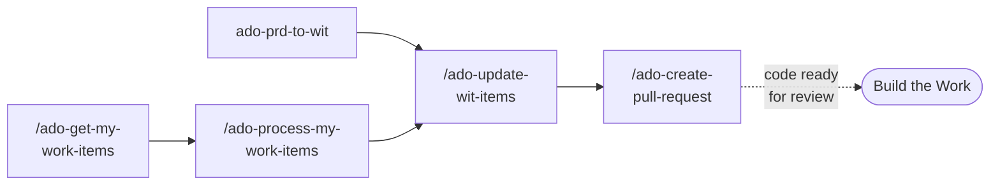

# Azure DevOps Integration

If your team uses Azure DevOps for work item tracking, this page is your starting point. The goals are identical to the [GitHub Backlog Management](backlog-management) flow: discover missing work items, plan updates, and execute changes in batch.

The difference is architectural: GitHub backlog management has a single orchestrator agent (`@github-backlog-manager`) that dispatches specialized workflows. ADO integration uses individual prompts that you invoke directly. The prompts follow shared instruction files that ensure consistency, but there is no orchestrator coordinating between them.

This is not a maturity difference. It reflects how each platform's API and tooling works best. Choose based on which platform your team already uses for work tracking.

## The ADO Workflow



## ADO Prompts and Their GitHub Equivalents

| ADO Artifact | Purpose | GitHub Equivalent |
|---|---|---|
| `/ado-get-my-work-items` | Fetch work items assigned to you or recently modified | Path A of `/github-discover-issues` |
| `/ado-process-my-work-items` | Enrich work items with context for task planning | No direct equivalent (combines discovery enrichment with sprint context) |
| `@ado-prd-to-wit` | Analyze PRDs and plan ADO work item hierarchies | Path B of `/github-discover-issues` |
| `/ado-update-wit-items` | Batch create, update, and link work items from a handoff file | `/github-execute-backlog` |
| `/ado-create-pull-request` | Create ADO pull request with automated description, work item linking, reviewer identification | `/pull-request` (GitHub PR generation) |
| `/ado-get-build-info` | Retrieve build status, logs, and changes from ADO pipelines | No GitHub equivalent (GitHub Actions uses different tooling) |

## Work Item Hierarchy

ADO enforces a stricter hierarchy than GitHub Issues:

1. **Epic** (top level)
2. **Feature** (child of Epic)
3. **User Story** (child of Feature)
4. **Task or Bug** (child of User Story)

The planning prompts respect this hierarchy. When creating work items from a PRD, the `@ado-prd-to-wit` agent creates the parent structure if it does not exist, ensuring every User Story has a Feature parent and every Feature has an Epic parent.

## The Planning File Contract

ADO uses the same `.copilot-tracking/` pattern as GitHub, with ADO-specific templates:

<details>
<summary>Planning file structure</summary>

```text
.copilot-tracking/workitems/
  discovery/
    <artifact-name>/
      artifact-analysis.md     ← Extracted requirements with working field values
      work-items.md            ← Source of truth for planned operations
      planning-log.md          ← Operational log with similarity assessments
      handoff.md               ← Execution checklist
```

The similarity assessment framework is identical to the GitHub flow. Discovered work items are classified as Match, Similar, Distinct, or Uncertain before deciding whether to create new items or update existing ones.

</details>

## When to Use ADO vs GitHub

Choose based on where your team already tracks work:

**Your team uses GitHub Issues**: Use the [GitHub Backlog Manager](backlog-management). It has an orchestrator agent, the deepest integration, and handles triage, sprint planning, and execution through a single conversational interface.

**Your team uses Azure DevOps**: Use the ADO prompts on this page. They cover the same workflow through individual invocations and support ADO's richer work item hierarchy (Epics, Features, User Stories, Tasks).

**Your team uses both**: This happens. The planning file formats are compatible, but there is no cross-platform sync. Pick one as the source of truth for work items and use the other for platform-specific operations like ADO build info or GitHub Actions.

For the broader context on how shaping connects to the rest of the delivery lifecycle, see the [Shape the Work overview](overview).
