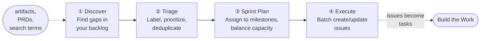

# Backlog Management with GitHub

In most teams, backlog management follows one of two patterns. Either one person spends Friday afternoon manually triaging the week's issues (and hates it), or nobody does it (and the backlog becomes a graveyard of good intentions).

Both patterns fail because they treat backlog management as clerical work. It is not. Triage requires understanding the versioning strategy. Sprint planning requires dependency analysis. Issue discovery requires semantic matching against existing work. These are algorithmic problems dressed up as "project management."

The 🟢 GitHub Backlog Manager treats them as such.

## The Four-Workflow Pipeline

The backlog manager orchestrates four workflows in sequence. Each produces artifacts that the next one consumes.



PRDs from [Requirements & Architecture](requirements-architecture) feed directly into the Discovery workflow. The pipeline takes those structured requirements and turns them into prioritized, sprint-ready issues.

| Workflow | Prompt | What It Does | Input | Output |
|---|---|---|---|---|
| Discover | `/github-discover-issues` | Find missing issues from PRDs, search terms, or assignment queries | Documents, search terms, or "show me my issues" | `issue-analysis.md`, `issues-plan.md`, `handoff.md` |
| Triage | `/github-triage-issues` | Auto-label using conventional commit patterns, assign milestones, detect duplicates | Issues carrying the `needs-triage` label | `triage-plan.md` with recommendations |
| Sprint Plan | `/github-sprint-plan` | Organize issues into milestones with dependency awareness | Open issues, milestone definitions | Sprint assignment plan |
| Execute | `/github-execute-backlog` | Batch create, update, link, and close issues from a handoff file | `handoff.md` from any upstream workflow | Created/updated GitHub issues |

## The Orchestrator vs Direct Prompts

You have two entry points into backlog management:

**The orchestrator** (`@github-backlog-manager`): Describe what you need in natural language. "Triage the untriaged issues in our repo." "Create issues from this PRD." "Plan the next sprint for milestone v2.3.0." The agent classifies your intent and dispatches the right workflow.

**Direct prompts**: If you already know which workflow you need, invoke it directly. `/github-triage-issues` skips intent classification and goes straight to triage.

Both paths produce the same output files and respect the same autonomy settings. The orchestrator adds convenience; the direct prompts add precision.

## The 3-Tier Autonomy Model

Different operations carry different risk. Creating an issue is low-risk (you can close it). Closing an issue might lose context. The autonomy model lets you tune how much the agent does without asking.

| Tier | Create | Update | Link | Close | Best For |
|---|---|---|---|---|---|
| **Full** | Auto | Auto | Auto | Auto | Well-defined batch ops, high-confidence assessments |
| **Partial** (default) | Gate | Auto | Auto | Gate | Most workflows: creation and deletion need human eyes |
| **Manual** | Gate | Gate | Gate | Gate | Unfamiliar repos, sensitive backlogs, first-time use |

:::note
Partial autonomy is the default. The agent creates a plan and executes updates and links automatically, but pauses for your approval before creating new issues or closing existing ones. Say "use full autonomy" to skip all gates, or "use manual" to approve every operation.
:::

## From Backlog to Build

An issue created by the backlog manager might look like this:

```text
feat(agents): add batch triage support

## Summary
Add batch label operations to the triage workflow agent.

## Acceptance Criteria
- [ ] Batch apply labels to multiple issues in a single operation
- [ ] Support undo of batch label changes
```

That same issue becomes the input to the RPI workflow. When an engineer picks it up, the Research phase begins, reading the issue, understanding the codebase, and producing an implementation plan. The loop closes: requirements defined in Shape the Work become tasks executed in Build the Work.

<!-- TODO: link to build-the-work/rpi-workflow when Phase 2C lands -->

For teams using Azure DevOps instead of GitHub, see [ADO Integration](ado-integration) for the equivalent workflow.

---

## Reference: Handoff File Contract

<details>
<summary>How the planning files work under the hood</summary>

Every backlog workflow produces markdown files in `.copilot-tracking/github-issues/<type>/<scope>/`. These files are the contract between planning and execution: human-readable, git-trackable, and resumable.

```text
.copilot-tracking/github-issues/
  discovery/
    <scope-name>/
      issue-analysis.md      ← Requirements extracted from artifacts
      issues-plan.md         ← Source of truth for planned operations
      planning-log.md        ← Operational log with phase tracking
      handoff.md             ← Execution checklist with checkboxes
      handoff-logs.md        ← Per-operation results (after execution)
  triage/
    <date>/
      triage-plan.md         ← Triage recommendations
      planning-log.md        ← Progress tracking
```

The handoff file is the bridge between planning and execution. Each checkbox represents one GitHub API operation:

```markdown
## Issues
### Create
- [ ] feat(agents): add batch triage support
  - Labels: feature, agents, Milestone: v2.2.0
  - Body: Add batch label operations to the triage workflow...

### Update
- [x] #38: Update existing triage workflow scope
  - Changes: labels, milestone
```

Checked boxes (`[x]`) are done. Unchecked boxes (`[ ]`) are pending. If execution is interrupted (network failure, rate limit, context window), the agent resumes from the first unchecked box. No work is repeated.

</details>
