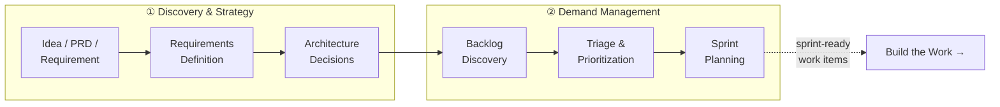

# Shape the Work

You have been in the meeting. Someone says "we need a better onboarding experience." Three sprints later, engineering delivers something that technically matches the ticket but misses the actual problem. The requirements were fuzzy. The acceptance criteria were copy-pasted. Nobody stopped to ask which users were struggling and why.

This is the most expensive failure mode in software delivery: building the wrong thing perfectly. DORA research shows that lead time for changes is the strongest predictor of elite team performance, and most teams measure it from first commit. But cycle time starts when someone writes a vague ticket and drops it in the backlog. The gap between "someone had an idea" and "an engineer starts coding" is where organizations bleed time through ambiguity, re-prioritization, missing context, and duplicated work.

"Shape the Work" is about closing that gap: turning vague ideas into clear, prioritized, actionable plans before anyone opens an editor.

## The Shaping Workflow

Shaping progresses through two delivery phases: Discovery & Strategy (understanding the problem space) and Demand Management (deciding what to build, in what order). The output is sprint-ready work items that an engineer can pick up with confidence.

## What HVE-Core Provides

HVE-Core covers this phase with artifacts organized into three areas:

**Requirements & Architecture**: Five agents that help you define *what* to build. Generate PRDs, BRDs, architecture decision records, security plans, and architecture diagrams through guided, multi-turn conversations. See [Requirements & Architecture](requirements-architecture) for details and a decision matrix on when to use which tool.

**GitHub Backlog Management**: A complete orchestrated pipeline: discover issues from artifacts, triage and label them, plan sprints, and batch-execute changes. The 🟢 GitHub Backlog Manager agent coordinates four specialized workflows with a 3-tier autonomy model. See [Backlog Management](backlog-management) for the full flow.

**Azure DevOps Integration**: The same capabilities for teams using ADO: discover work items, plan updates, and execute changes through instruction-driven prompts. See [ADO Integration](ado-integration) for the parallel workflow.

:::note Coverage and opportunity
HVE-Core does not yet cover OKR and roadmap tooling, portfolio-level prioritization frameworks like WSJF, or capacity planning. Strategy is project-scoped, not product-scoped. These represent the next frontier for contributions in the shaping space.
:::

## How This Connects

Sprint-ready work items produced by shaping become the input to the [Build the Work](../build-the-work/overview) phase. When an engineer picks up an issue, they invoke the [RPI workflow](../build-the-work/rpi-workflow) (Research → Plan → Implement → Review), which begins by reading the issue's acceptance criteria and context that shaping produced. The quality of upstream shaping directly determines the quality of downstream implementation.

For the conceptual foundation behind this workflow, see [The Value Delivery Loop](../getting-started/value-delivery-loop). To understand how the architecture enables these flows, see [How It Works](../getting-started/how-it-works).
