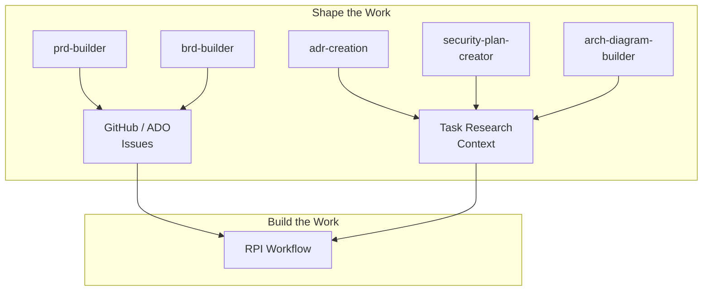

# Requirements & Architecture

## Requirements Are Compressed Decisions

Every feature starts with a series of decisions. Who is this for? What does success look like? What are we deliberately not building? What security constraints apply?

Those decisions happen whether you document them or not. The question is whether they happen once (in a structured artifact) or repeatedly (in Slack threads, PR comments, and "wait, I thought we decided...").

HVE-Core provides five agents that capture these decisions through guided conversation. You do not fill out templates. You talk through the problem, and the agent structures what you say into an artifact your team can use.

## The Art of Problem Framing

Before reaching for any tool, the skill that matters most is distinguishing a problem statement from a solution request.

"We need a mobile app" is a solution request. "Expense reporting takes 45 minutes per report and 30% are rejected" is a problem statement. The PRD and BRD builders already guide this distinction through their Q&A flow, asking about core problems and success metrics before discussing features.

When a stakeholder says "we need a dashboard," the shaping process asks *why* until the actual business problem emerges. What decision does the dashboard support? What data does the decision-maker lack today? What happens if that decision is delayed? These questions are the divergent half of shaping: broadening understanding before narrowing to a solution.

The agents in this section are the convergent half: they take the understanding you have developed and structure it into a document that your team can act on. The best results come from pairing divergent exploration (conversation, research, stakeholder interviews) with convergent capture (the agent sessions below).

## When to Use Which Tool

| Situation | Agent | Output | When to Use |
|---|---|---|---|
| Defining a new feature or product capability | 🟢 `@prd-builder` | Product Requirements Document | Starting a new initiative; need to align stakeholders on scope and acceptance criteria |
| Justifying a business investment or strategic initiative | 🟡 `@brd-builder` | Business Requirements Document | Need to articulate business case, ROI, and success metrics for leadership |
| Making a significant technical choice | 🟡 `@adr-creation` | Architecture Decision Record | Choosing between approaches where the *why* matters as much as the *what* |
| Designing cloud infrastructure security | 🟡 `@security-plan-creator` | Security Plan | New deployment, compliance review, or security hardening exercise |
| Communicating system structure visually | 🟡 `@arch-diagram-builder` | ASCII Architecture Diagram | Need a diagram that lives in markdown, not an external tool |

:::tip Start with the PRD builder
If you are unsure which tool to use, start with `@prd-builder`. A PRD session often reveals that you also need an ADR ("we need to decide on the authentication approach") or a security plan ("this handles PII"). The agents work well in sequence.
:::

## The Artifact Chain

Requirements do not exist in isolation. They feed downstream workflows, creating a chain from definition through to implementation.

A PRD feeds directly into issue discovery: run `/github-discover-issues` against a completed PRD and HVE-Core extracts requirements, matches them against existing issues, and plans the backlog changes. See [Backlog Management](backlog-management) for how this works.

ADRs, security plans, and architecture diagrams feed the Research phase of the RPI workflow. When a task researcher encounters a task that touches authentication, it reads the relevant ADR to understand the constraints before proposing changes.

<!-- TODO: link to build-the-work/rpi-workflow when Phase 2C lands -->

## Example: Walking Through a PRD Session

Start a chat session with the `@prd-builder` agent. The conversation might look like this:

**You**: We need batch export for our data platform. Users are asking for CSV and Parquet formats.

**prd-builder**: Let's define this requirement clearly. A few questions to start:
1. Who are the primary users requesting this? Data analysts, external customers, or internal teams?
2. What data volumes are typical? This affects whether we need streaming export or can batch-process.
3. Are there any compliance constraints on exported data (PII masking, audit logging)?

The agent does not accept your first answer at face value. It pushes for precision. By the time the PRD is complete, your team has already resolved the ambiguities that would otherwise surface mid-sprint.

The generated PRD includes structured sections for personas, scope, acceptance criteria, non-goals, and success metrics. This artifact becomes the input for [backlog management](backlog-management), where requirements are translated into prioritized issues.

## Supporting Tools

Two additional tools complement the requirements builders:

**`/risk-register`** generates qualitative risk assessments using a probability × impact matrix. Use it during project planning to identify risks before they become incidents.

**`@arch-diagram-builder`** is listed in the decision matrix above. It creates ASCII diagrams that live in markdown and travel with the codebase.

For the complete list of all HVE-Core artifacts with their value assessments, see the Reference section (coming soon).
