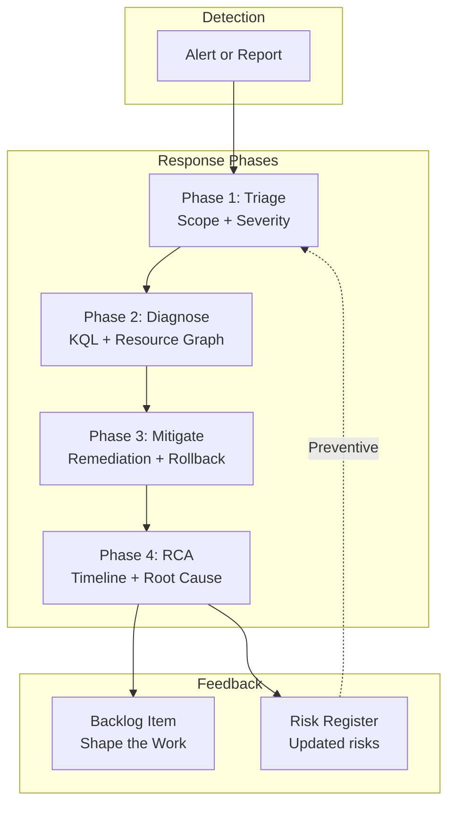

# Incident Response

When a production incident hits, the first 15 minutes determine whether you are responding systematically or scrambling. The `/incident-response` prompt provides a structured four-phase workflow that turns chaos into a repeatable process.

## The Incident Response Workflow

The prompt walks through four phases, each building on the previous:



## Using the Incident Response Prompt

Invoke the prompt with the incident description and optional parameters:

```text
/incident-response "API gateway returning 503 errors for 15% of requests
in East US region, started approximately 20 minutes ago"
severity=2 phase=triage
```

The prompt walks through structured triage questions:

- **What is happening?** Symptoms, error messages, user reports
- **When did it start?** Incident timeline and first detection
- **What is affected?** Services, resources, regions, user segments
- **What changed recently?** Deployments, configuration changes, dependency updates

Based on your answers, it generates diagnostic queries tailored to the affected Azure services and suggests immediate mitigation steps.

:::tip Severity Levels
- **Severity 1** (Critical): Complete service outage or data loss
- **Severity 2** (High): Major feature degradation affecting many users
- **Severity 3** (Medium): Partial impact with workaround available
- **Severity 4** (Low): Minor issue with minimal user impact
:::

## Phase 1: Initial Triage

Triage establishes scope and severity. The prompt asks structured questions to determine what is affected, how broadly, and what the blast radius looks like. The output is a triage summary that the rest of the response phases build on.

## Phase 2: Diagnostic Investigation

The prompt generates diagnostic queries tailored to the incident context. For Azure services, this includes KQL queries for Log Analytics, Azure Resource Graph queries for resource state, and Activity Log analysis for recent changes. You get queries you can run immediately, not generic templates.

## Phase 3: Mitigation

Based on the diagnosis, the prompt recommends immediate remediation steps, rollback procedures if a deployment caused the issue, and communication templates for stakeholders. The goal is restoring service first, understanding root cause second.

## Phase 4: Root Cause Analysis

After mitigation, the prompt helps construct an RCA document: a timeline of events, contributing factors, and systemic causes. This is where the incident becomes a learning opportunity rather than just a firefight.

## Risk Assessment with the Risk Register

The `/risk-register` prompt complements incident response by identifying risks *before* they become incidents. It uses a qualitative Probability × Impact matrix to help teams assess and prioritize operational risks.

Where incident response is reactive ("something broke, fix it"), the risk register is preventive ("what could break, and how do we reduce the likelihood?"). Teams that use both create a feedback loop between operational experience and risk awareness.

## Closing the Loop: From Incidents to Backlog

An incident is not resolved when service is restored. It is resolved when the systemic cause is addressed. The RCA output from Phase 4 connects directly to the backlog management tools in [Shape the Work](../shape-the-work/backlog-management):

1. RCA identifies a contributing factor (for example, "no circuit breaker on downstream dependency")
2. Create a backlog item using `/github-discover-issues` or `/github-add-issue` with the RCA as context
3. The item enters the triage and sprint planning flow
4. The fix is built through [the RPI workflow](../build-the-work/rpi-workflow)
5. The deployment is monitored, closing the loop

This cycle is what DORA research measures as organizational learning capability. Teams that formalize this loop improve their Change Failure Rate over time.

## Cross-References

- [Ship It: Overview](overview) — DORA metrics context for why this matters
- [Shape the Work: Backlog Management](../shape-the-work/backlog-management) — where RCA outputs feed the backlog
- [Build the Work: RPI Workflow](../build-the-work/rpi-workflow) — how fixes get implemented
- [Reference: Artifact Types](../reference/artifact-types) — prompt file mechanics
