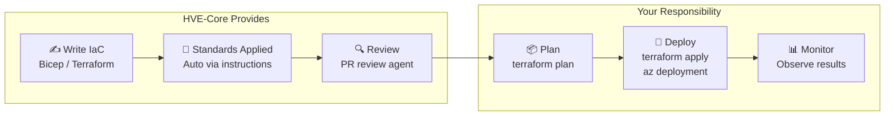

# Infrastructure as Code

When someone asks "Does HVE-Core help with deployment?" the honest answer is: **it helps you write deployment code correctly, but it does not deploy anything.**

This is an important distinction. The Bicep and Terraform instruction files are coding standards. They belong in the same category as the C# conventions or the Python script instructions. They happen to apply to infrastructure code, which makes them *adjacent* to deployment, but they are fundamentally authoring tools.

## What HVE-Core Does for IaC

HVE-Core provides auto-applied coding standards for Bicep and Terraform. These are [instruction files](../reference/artifact-types) that activate when you edit `.bicep` or `.tf` files. They enforce conventions, naming patterns, and best practices as you write.

:::info Auto-applied standards
When you open a `.bicep` file, Copilot automatically loads the Bicep instruction file. You do not invoke anything. The instructions guide naming conventions, parameter patterns, module structure, and API version selection as you write. The same pattern applies to Terraform: open a `.tf` file and the Terraform instructions activate automatically.

For more on how this mechanism works, see [How It Works](../getting-started/how-it-works).
:::

## Bicep Conventions at a Glance

| Area | What It Enforces |
|---|---|
| Naming | `kebab-case` files, `camelCase` parameters, `PascalCase` types |
| Parameters | Grouped by function (Identity, Networking, Storage, etc.) |
| Descriptions | Every parameter and type needs `@description()` |
| Resource names | Azure naming convention patterns with prefix/environment/instance |
| Modules | Main module orchestrates, sub-modules receive all values from parent |
| Types | Shared types in `types.bicep` with `@export()` and `@description()` |
| API versions | Use latest stable, consistent within files |

## Terraform Conventions at a Glance

| Area | What It Enforces |
|---|---|
| Structure | Consistent file layout: `main.tf`, `variables.tf`, `outputs.tf`, `versions.tf` |
| Naming | `snake_case` for resources, variables, outputs; `kebab-case` for files |
| Variables | Every variable includes `description`, booleans start with `should_` or `is_` |
| Modules | Child modules inherit providers and state from calling root module |
| State | Explicit backend configuration, no state files committed |
| Expressions | Prefer `coalesce()` and `try()` over verbose ternary operators |

## The IaC → Deploy Gap

A complete Ship It experience would include deployment orchestration, progressive rollout, infrastructure validation, and post-deployment monitoring. These are active areas of growth.

What exists today covers the *authoring* side of the deployment pipeline. The conventions ensure that when you do deploy (through your own CI/CD pipeline, Azure DevOps, GitHub Actions, or manual commands), the infrastructure code follows established patterns and best practices.

For the broader coding standards story, see [Coding Standards](../build-the-work/coding-standards). For future plans in this space, see [What's Coming](whats-coming).
