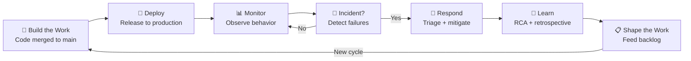

# Ship It: Closing the Loop

You shipped on Friday. The deploy was green. Monday morning, the dashboard shows a 12% error rate spike that started Saturday at 2 AM. The feature worked in staging. Production has 40x the traffic and three integrations staging does not test. Nobody closed the loop.

This is the gap that Ship It addresses. Not "how do I deploy faster" but "how do I learn faster from what I deploy."

## Why Closing the Loop Matters More Than Shipping Faster

The natural instinct is to optimize for speed: faster deployments, shorter lead times, more frequent releases. Those investments pay off, but DORA research consistently shows that elite teams do not just ship faster. They have tighter feedback loops. They learn from production. They recover faster. They feed operational insights back into planning.

Ship It covers delivery phases ⑤ (Release & Operate) and ⑥ (Learn & Adapt) of the [value delivery loop](../getting-started/value-delivery-loop). These are the phases where speed meets sustainability.

## The [DORA](https://dora.dev/guides/dora-metrics/) Insight

[DORA](https://dora.dev) defines four key metrics for engineering performance. Ship It directly owns two of them:

| Metric | What It Measures | Where It Lives |
|---|---|---|
| Deployment Frequency | How often you release | [Build the Work](../build-the-work/overview) |
| Lead Time for Changes | Time from commit to production | [Build the Work](../build-the-work/overview) |
| **Change Failure Rate** | What % of deployments cause failures | **Ship It** |
| **Mean Time to Recovery** | How quickly you restore service | **Ship It** |

Elite teams excel at all four, not by optimizing each independently but by tightening the feedback loops between them. A team that deploys 47 times a day but takes a week to recover from failures is not elite. A team that deploys weekly but recovers in minutes and feeds every incident back into planning is closer to elite than the numbers suggest.

## The [ESSP](https://github.com/resources/insights/engineering-system-success-playbook) Quality Zone

The [ESSP (Engineering Systems Success Playbook)](https://github.com/resources/insights/engineering-system-success-playbook) framework organizes measurement into four zones: Developer Happiness, Velocity, Quality, and Business Outcomes.

Ship It lives in the **Quality zone**, which bridges Velocity ([Build the Work](../build-the-work/overview)) and Impact (strategic business outcomes). Failed Deployment Recovery Time, Change Failure Rate, and operational resilience all sit here. This is where speed meets sustainability.

## What HVE-Core Provides Today

Ship It is where HVE-Core has the most room to grow. That is worth acknowledging directly.

:::note What exists
HVE-Core provides an [incident response prompt](incident-response) for Azure operations scenarios, a risk register for qualitative risk assessment, and [IaC coding standards](infrastructure-as-code) (Bicep and Terraform) that help you write deployment code correctly. Build monitoring is available through the ADO build info prompt.
:::

:::info What's on the horizon
Release management, progressive delivery (canary deployments, feature flags), SLO/SLA tooling, runbook generation, monitoring configuration, telemetry analysis, and retrospective facilitation are all areas of growth. See [What's Coming](whats-coming) for the roadmap.
:::

The concepts in this section matter regardless of tooling maturity. Teams that understand the Ship → Learn → Shape loop make better architectural decisions even without automation for every step.

## Where to Go Next

- [Incident Response](incident-response) — the primary Ship It workflow, with structured triage and RCA
- [Infrastructure as Code](infrastructure-as-code) — how Bicep and Terraform conventions fit into deployment
- [What's Coming](whats-coming) — the roadmap and how to contribute
- [Shape the Work: Overview](../shape-the-work/overview) — where learnings feed back into planning

