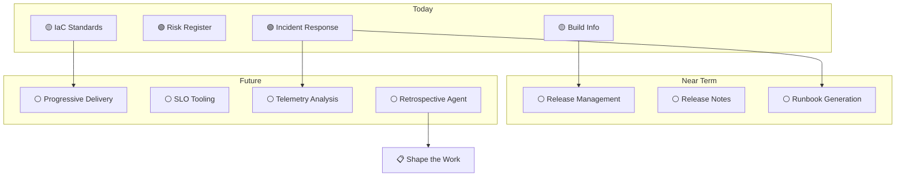

# What's Coming

Ship It has the most contribution opportunity of any HVE-Core segment. The concepts are established (DORA metrics, feedback loops, incident response), but the tooling coverage is early-stage. Every item below represents a meaningful addition to the project.

## The Vision

## Near Term

### Release Management

An agent or prompt that aggregates conventional commits into changelogs, handles semantic version bumping, and coordinates release notes. The foundation exists: the `commit-message` instruction already produces structured conventional commits. An agent that reads them and generates release artifacts would complete the chain from code to release.

### Release Notes Generation

Complementary to release management: take a set of merged PRs, extract the conventional commit messages, group by type (features, fixes, chores), and produce a formatted release note. This is a bounded problem with clear inputs and outputs.

### Runbook Generation

Incident response generates diagnostic queries and remediation steps during an incident. A runbook generator would pre-compute these for known failure modes, creating operational documentation before incidents happen rather than during them.

## Future

### Progressive Delivery

Canary deployments, feature flags, A/B testing coordination. These are complex workflows that benefit from AI-assisted configuration and monitoring. Not currently on the roadmap but represents the ideal for deployment safety.

### SLO and SLA Tooling

Service Level Objective definition, error budget tracking, SLA compliance reporting. An SLO agent could help teams define objectives, generate monitoring queries, and track burn rates. This connects strongly to the ESSP Quality zone discussed in the [overview](overview).

### Telemetry and Observability

Log analysis, metric correlation, distributed tracing investigation. An observability agent could help teams navigate complex telemetry data and identify patterns. This connects strongly to incident response: the diagnostic queries generated during incidents could be generalized into proactive monitoring.

### Retrospective Facilitation

The missing piece in the ⑥→① feedback arc. A retrospective agent could structure incident postmortems, extract action items, and ensure they reach the backlog. This is where DORA's "learning from failures" becomes concrete: every retrospective produces backlog items that feed [Shape the Work](../shape-the-work/overview), closing the loop that the [value delivery model](../getting-started/value-delivery-loop) describes.

## How to Contribute

If you are interested in closing these gaps, two paths are available:

**To build a new artifact** (agent, prompt, instruction, or skill): review the contribution workflow in [CONTRIBUTING.md](https://github.com/microsoft/hve-core/blob/main/CONTRIBUTING.md), study an existing prompt like `incident-response.prompt.md` as a pattern, and open an issue describing what you would like to build. The maintainers can help scope it.

**To improve the documentation**: see [Contributing to Docs](../reference/contributing-to-docs) for how to write and submit new pages for this site.

:::tip High-impact contribution areas
- **Release notes generation** — aggregate conventional commits into changelogs. The `commit-message` instruction already produces structured commits; an agent that reads them and generates release notes would complete the chain.
- **Retrospective facilitation** — structure RCA outputs into retrospective documents with action items that feed the backlog. This closes the ⑥→① feedback arc that DORA identifies as the differentiator for elite teams.
:::

## Research Opportunities

These topics need deeper investigation before implementation:

| Topic | Why It Matters | Complexity |
|---|---|---|
| Release management patterns | What does an AI-assisted release workflow look like? Changelog generation, version bumping, deployment coordination | Medium — clear patterns exist in the ecosystem |
| SLO definition assistance | How can AI help teams define meaningful SLOs? Error budget calculation, burn rate alerts | High — requires deep domain knowledge |
| Retrospective agent design | How do you structure a retrospective that produces actionable backlog items? | Medium — the RCA-to-backlog pattern already exists in incident-response |
| Telemetry analysis patterns | What KQL/query patterns help diagnose production issues beyond incidents? | High — broad scope, needs focused use cases |
