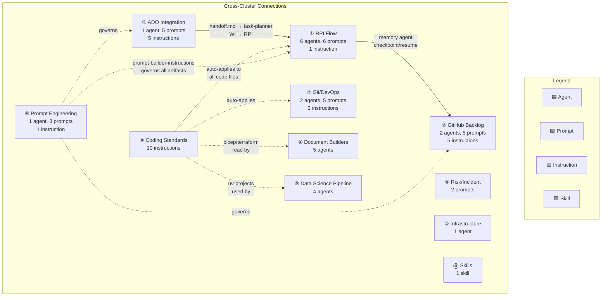
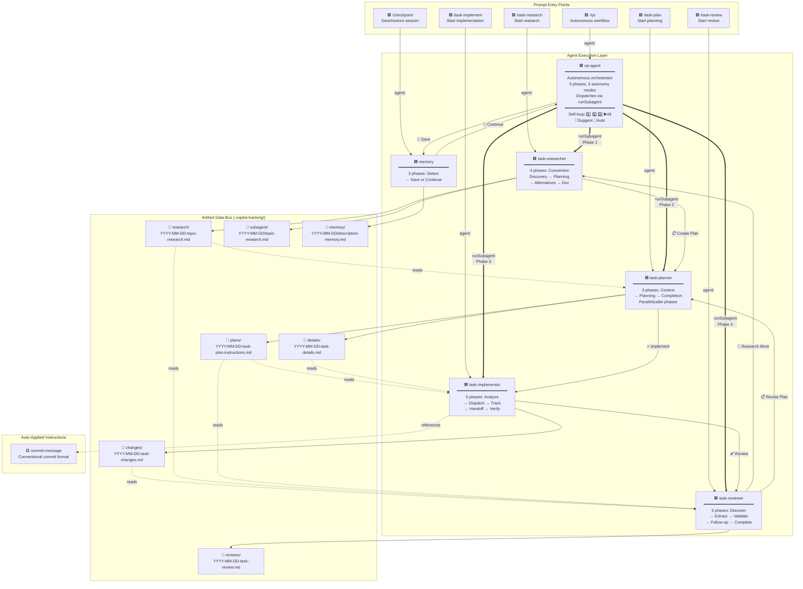
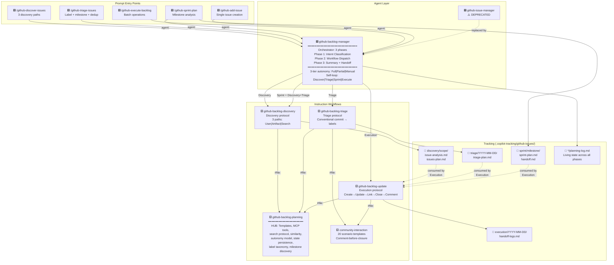
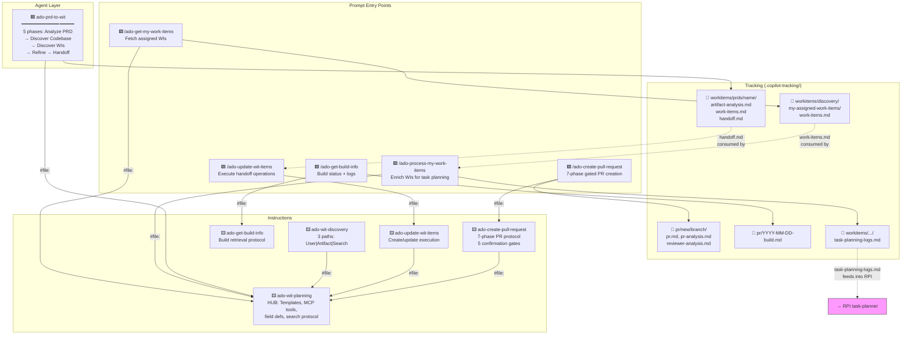
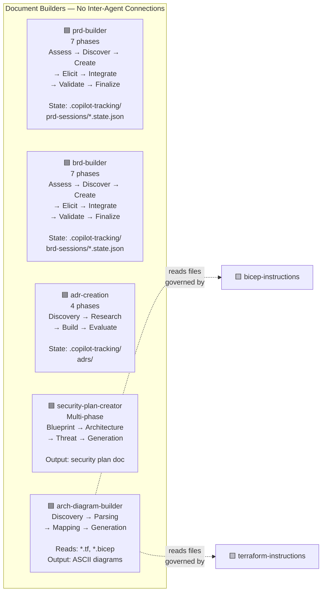
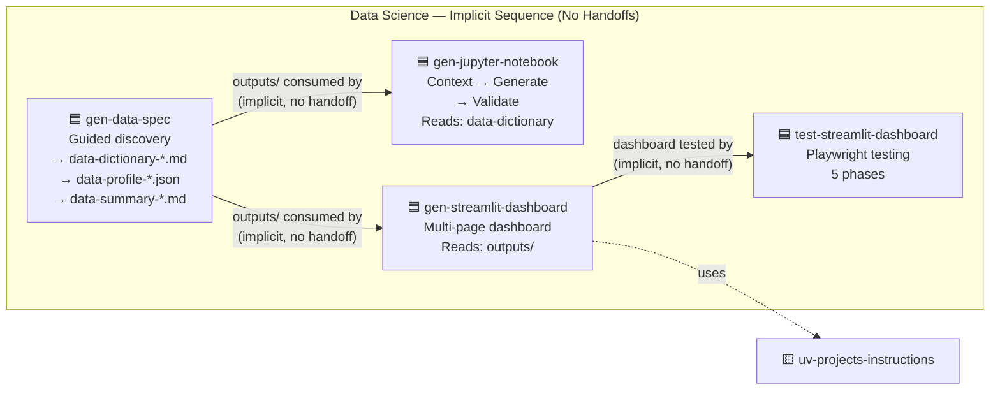
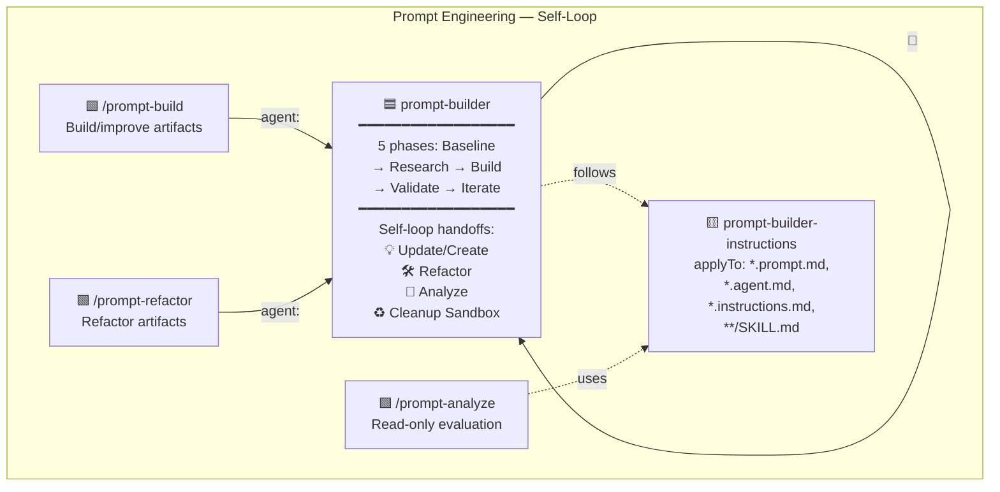
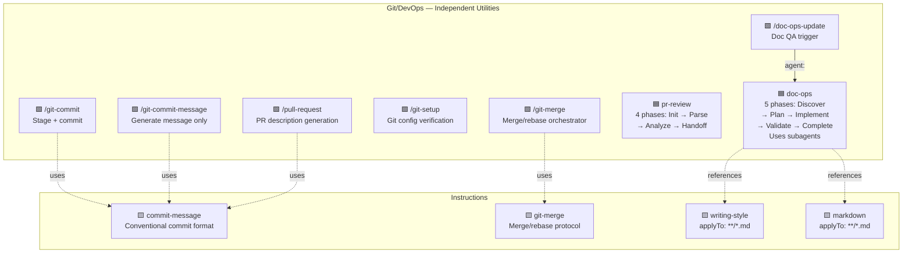
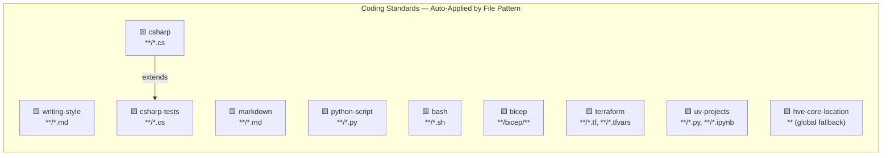
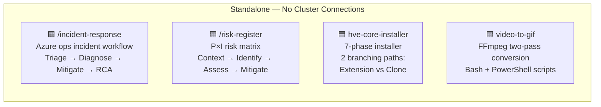

# HVE-Core: Complete Artifact Relationship Map

**Generated**: 2026-02-17
**Artifacts Mapped**: 70 (22 agents, 25 prompts, 24 instructions, 1 skill)
**Method**: All artifacts read via FlowSpace + subagent exploration, relationships extracted from frontmatter (`agent:`, `handoffs:`, `#file:`) and body references.

---

## Overview: How Everything Connects

The 70 artifacts organize into **8 clusters**. Most clusters are self-contained islands. Three clusters (RPI, GitHub Backlog, ADO) have internal flow structure. Cross-cluster connections are sparse — mostly coding standards instructions that auto-apply everywhere.

---

## ① RPI Flow (Research → Plan → Implement → Review → Discover)

**What it is**: The core coding workflow. Takes a task from uncertainty through research, planning, implementation, and review. Two modes: manual (4 agents with `/clear` between) or autonomous (`rpi-agent` orchestrating via `runSubagent`).

**When to use**: Any coding task with unknowns — new features, refactoring, multi-file changes, unfamiliar codebases.

---

## ② GitHub Backlog Management (Discover → Triage → Sprint → Execute)

**What it is**: Issue lifecycle management for GitHub repos. One orchestrator agent classifies requests and dispatches to 5 workflow types. Instruction files define the detailed protocols.

**When to use**: Managing GitHub issues — discovering gaps, triaging untriaged issues, planning sprints, executing batch operations.

---

## ③ ADO Integration (Work Items + PR Creation + Build Monitoring)

**What it is**: Azure DevOps integration. Three sub-flows: PRD-to-work-items, work item management, and PR creation. Connected to RPI via artifact handoff (work items feed into task planning).

**When to use**: Teams using Azure DevOps for project management alongside VS Code + Copilot for development.

---

## ④ Document Builders (5 Standalone Agents)

**What it is**: Five independent agents for creating structured documents. No inter-agent connections. Each is a self-contained conversational multi-phase workflow.

**When to use**: Requirements gathering (PRD/BRD), architecture decisions (ADR), security planning, or system diagramming.

---

## ⑤ Data Science Pipeline (Implicit Sequence, No Flow Wiring)

**What it is**: Four agents that form a logical pipeline (data spec → notebook/dashboard → testing) but have **zero** handoff buttons, no orchestrator, and no artifact contracts. The sequence is implied by output/input file patterns only.

**When to use**: Data exploration, EDA notebooks, Streamlit dashboards.

---

## ⑥ Prompt Engineering (Self-Looping Refinement)

**What it is**: One agent with three self-referential modes (build, refactor, analyze) for creating and improving HVE-Core's own prompt/agent/instruction files.

**When to use**: Creating or improving `.prompt.md`, `.agent.md`, `.instructions.md`, or `SKILL.md` files.

---

## ⑦ Git/DevOps (Commit, Merge, PR, Doc-Ops)

**What it is**: Standalone utilities for git operations and documentation quality. No inter-agent flow — each prompt is independently invokable.

**When to use**: Committing code, merging branches, generating PRs, or auditing documentation quality.

---

## ⑧ Coding Standards (Auto-Applied, Invisible to User)

**What it is**: 10 instruction files that auto-apply based on file type. Users never invoke these directly — they activate when Copilot edits matching files.

**When to use**: Automatically. Open a `.py` file and Python standards apply. Open a `.cs` file and C# standards apply.

---

## ⑨ Risk/Incident & ⑩ Infrastructure & ⑪ Skills (Standalone)

**What these are**: Fully independent artifacts with no connections to any other cluster.

---

## Summary: The 70 Artifacts at a Glance

| Cluster | Artifacts | Internal Flow? | Documented? | Key Entry Points |
|---|---|---|---|---|
| **① RPI** | 6 agents, 6 prompts, 1 instr | ✅ Full pipeline with loops | ✅ 7 docs | `/rpi`, `/task-research` |
| **② GitHub Backlog** | 2 agents, 5 prompts, 5 instr | ✅ Orchestrator + 5 workflows | ✅ 7 docs | `/github-discover-issues` |
| **③ ADO** | 1 agent, 5 prompts, 5 instr | ⚠️ Implicit chain via files | ❌ Planned | `/ado-get-my-work-items` |
| **④ Doc Builders** | 5 agents | ❌ 5 standalone agents | ❌ Planned | Select agent directly |
| **⑤ Data Science** | 4 agents | ⚠️ Implicit via file outputs | ❌ Planned | `gen-data-spec` first |
| **⑥ Prompt Eng** | 1 agent, 3 prompts, 1 instr | ✅ Self-loop | ❌ Planned | `/prompt-build` |
| **⑦ Git/DevOps** | 2 agents, 5 prompts, 2 instr | ❌ Independent utilities | ❌ Partial | `/git-commit`, `/doc-ops-update` |
| **⑧ Coding Standards** | 10 instructions | N/A (auto-apply) | ✅ In-file | Automatic |
| **⑨ Risk/Incident** | 2 prompts | ❌ Standalone | ❌ None | `/incident-response` |
| **⑩ Infrastructure** | 1 agent | ❌ Standalone | ❌ None | Select agent directly |
| **⑪ Skills** | 1 skill | ❌ Standalone | ✅ In-file | Invoked by agents |

### The Navigation Gap

The marketplace listing presents all 70 artifacts as a flat alphabetical list. This document shows they actually organize into **11 clusters**, of which only **2 have documented workflows**. A new user installing the extension has no way to discover this structure from the listing alone.
