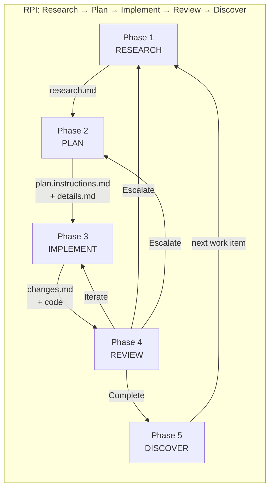
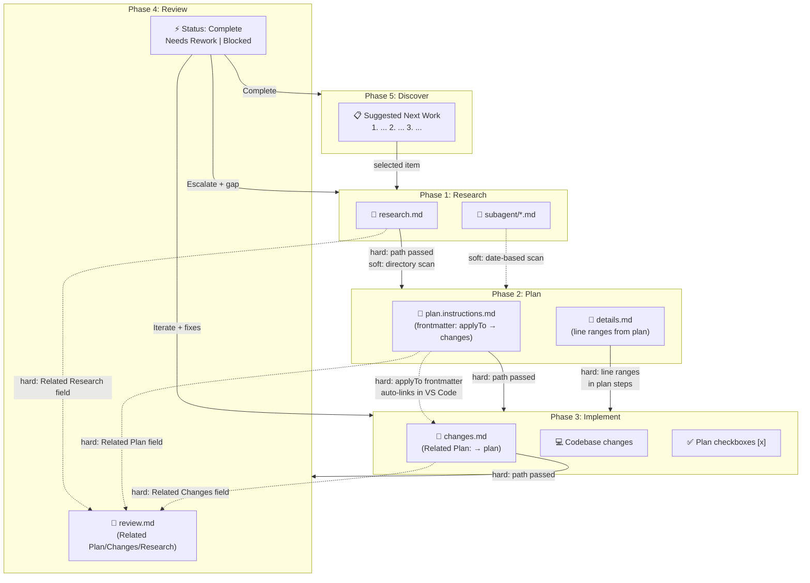

# RPI Workflow: Formal Phase Specification

**Generated**: 2026-02-17
**Source**: Extracted from all 9 RPI agent and prompt files via full content analysis
**Purpose**: Describes RPI as a first-class workflow with formal input/output schemas, gate conditions, and artifact contracts per phase

## Workflow Overview



## Shared Conventions

### Naming Convention

All artifacts share a date+description stem: `{{YYYY-MM-DD}}-{{task-description}}`

| Artifact | Suffix | Directory |
|---|---|---|
| Research | `-research.md` | `.copilot-tracking/research/` |
| Plan | `-plan.instructions.md` | `.copilot-tracking/plans/` |
| Details | `-details.md` | `.copilot-tracking/details/` |
| Changes | `-changes.md` | `.copilot-tracking/changes/` |
| Review | `-review.md` | `.copilot-tracking/reviews/` |
| Subagent outputs | `<topic>-research.md` | `.copilot-tracking/subagent/{{YYYY-MM-DD}}/` |

All artifacts begin with `<!-- markdownlint-disable-file -->`. The plan file is the sole exception — it begins with YAML frontmatter containing `applyTo:`.

### Contract Types

| Type | Mechanism | Reliability |
|---|---|---|
| **Hard (path)** | Orchestrator passes explicit file path to next agent | High — breaks only if file is deleted |
| **Hard (field)** | Artifact contains `**Related Plan**:` field pointing to another artifact | High — breaks if field is missing |
| **Hard (frontmatter)** | Plan's `applyTo:` declares the changes file path | High — VS Code auto-links files |
| **Soft (scan)** | Agent scans directory for most recent file matching pattern | Medium — may match wrong file |
| **Soft (naming)** | Agents correlate artifacts by shared date+description stem | Medium — depends on consistent naming |

### Autonomy Model (Orchestrator Only)

| Mode | Trigger | Phase 5 Behavior |
|---|---|---|
| Full | "auto", "full auto", "keep going" | Auto-continue with top-priority item |
| Partial (default) | No explicit signal | Auto-continue when obvious; present options when unclear |
| Manual | "ask me", "let me choose" | Always present options, wait for user selection |

---

## Phase 1: Research

### Identity

| Field | Value |
|---|---|
| **Agent** | `task-researcher.agent.md` |
| **Prompt** | `/task-research` → `task-research.prompt.md` |
| **Orchestrator dispatch** | `rpi-agent` Phase 1 via `runSubagent` |
| **Handoff button from** | `task-reviewer` ("🔬 Research More") |
| **Handoff button to** | `task-planner` ("📋 Create Plan") |

### Input Schema

```yaml
required:
  topic: string               # Primary research topic (from user or orchestrator)
  user_requirements: string    # Original user request text

optional:
  iteration_feedback: string   # Review findings when returning from Phase 4 Escalate
  chat_context: boolean        # Include conversation context (default: true)
  existing_research: filepath  # Path to prior research to extend
  instructions_files: filepath[] # .instructions.md files discovered by orchestrator
  skills_files: filepath[]     # SKILL.md files discovered by orchestrator
```

### Internal Phases

| # | Name | Action | Subagents |
|---|---|---|---|
| 1 | Convention Discovery | Read `.github/copilot-instructions.md`, scan `.github/instructions/` for relevant files | 1 subagent |
| 2 | Planning and Discovery | Define scope → dispatch codebase research subagent → dispatch external docs subagent → synthesize, iterate if gaps | 2+ parallel subagents |
| 3 | Alternatives Analysis | Identify approaches, dispatch evidence-gathering subagents, select one with rationale | 1+ subagents |
| 4 | Documentation and Refinement | Continuously update research doc, remove superseded content | Direct |

### Output Schema

```yaml
artifacts:
  research_document:
    path: ".copilot-tracking/research/{{YYYY-MM-DD}}-{{topic}}-research.md"
    required_sections:
      - "# Task Research: {{task_name}}"
      - "## Task Implementation Requests"    # Bulleted task list
      - "## Scope and Success Criteria"       # Coverage, assumptions, criteria
      - "## Research Executed"                # File analysis, code search, external, conventions
      - "## Key Discoveries"                  # Structure, patterns, examples, APIs, config
      - "## Technical Scenarios"              # Per-scenario: requirements, approach, file tree, code

  subagent_outputs:
    path: ".copilot-tracking/subagent/{{YYYY-MM-DD}}/<topic>-{codebase,external}-research.md"
    format: |
      ## Research Summary
      **Question:** {{research_question}}
      **Status:** Complete | Incomplete | Blocked
      **Output File:** {{file_path}}
      ### Key Findings
      * {{finding_with_source_reference}}
      ### Clarifying Questions
      * {{question_for_parent_agent}}

return_value:
  research_document_path: filepath  # Passed to orchestrator → Phase 2
```

### Exit Conditions

- [ ] Research document exists with all required sections
- [ ] Evidence log contains sources, links, and context with line numbers
- [ ] At least two alternatives evaluated, one selected with rationale
- [ ] Complete examples and references included
- [ ] Actionable next steps for implementation defined

### Gate to Phase 2

| Requirement | Contract Type |
|---|---|
| Research file exists at `research/{{YYYY-MM-DD}}-{{topic}}-research.md` | Hard (path) |
| Orchestrator passes `research_document_path` to planner | Hard (path) |
| Planner also scans `.copilot-tracking/research/` as fallback | Soft (scan) |
| User action (manual mode): `/clear` → attach research file → `/task-plan` | User-mediated |

---

## Phase 2: Plan

### Identity

| Field | Value |
|---|---|
| **Agent** | `task-planner.agent.md` |
| **Prompt** | `/task-plan` → `task-plan.prompt.md` |
| **Orchestrator dispatch** | `rpi-agent` Phase 2 via `runSubagent` |
| **Handoff button from** | `task-researcher` ("📋 Create Plan"), `task-reviewer` ("📋 Revise Plan") |
| **Handoff button to** | `task-implementor` ("⚡ Implement") |

### Input Schema

```yaml
required:
  user_requirements: string       # Original user request

optional:
  research_path: filepath         # From Phase 1 (orchestrator passes explicitly)
  iteration_feedback: string      # Review findings when returning from Phase 4 Escalate
  chat_context: boolean           # Include conversation context (default: true)
  instructions_files: filepath[]  # Referenced in plan's Standards References section
  skills_files: filepath[]        # Referenced in plan's Dependencies section
```

### Internal Phases

| # | Name | Action | Subagents |
|---|---|---|---|
| 1 | Context Assessment | Check `research/` for matching files, review user context, dispatch subagents for gaps | Optional subagents |
| 2 | Planning | Create plan + details files. Design parallelizable phases. Include validation phase. | Direct |
| 3 | Completion | Summarize, assess readiness, provide numbered handoff steps | Direct |

### Output Schema

```yaml
artifacts:
  implementation_plan:
    path: ".copilot-tracking/plans/{{YYYY-MM-DD}}-{{description}}-plan.instructions.md"
    frontmatter:
      applyTo: ".copilot-tracking/changes/{{YYYY-MM-DD}}-{{description}}-changes.md"
    required_sections:
      - "# Implementation Plan: {{task_name}}"
      - "## Overview"                          # One sentence
      - "## Objectives"                        # Specific, measurable goals
      - "## Context Summary"
      - "### Project Files"                    # File paths + relevance
      - "### References"                       # Paths/URLs + descriptions
      - "### Standards References"             # #file: refs to .github/instructions/
      - "## Implementation Checklist"
      - "### [ ] Implementation Phase N: {{name}}"
        # Each phase: <!-- parallelizable: true|false -->
        # Each step: "* [ ] Step N.M: {{action}}"
        #   with "Details: ...details.md (Lines X-Y)"
      - "### [ ] Implementation Phase N: Validation"  # Always last, parallelizable: false
      - "## Dependencies"                      # Required tools/frameworks
      - "## Success Criteria"                  # Verifiable indicators

  implementation_details:
    path: ".copilot-tracking/details/{{YYYY-MM-DD}}-{{description}}-details.md"
    required_sections:
      - "# Implementation Details: {{task_name}}"
      - "## Context Reference"
      - "## Implementation Phase N: {{name}}"
        # Each step: description, Files list, Success criteria,
        # Context references (with line ranges), Dependencies
      - "## Implementation Phase N: Validation"

return_value:
  plan_file_path: filepath      # Passed to orchestrator → Phase 3
  details_file_path: filepath   # Companion to plan
```

### Key Design Rules

- Phases marked `<!-- parallelizable: true -->` when no file/build/state dependencies between them
- Final phase is always "Validation" with `<!-- parallelizable: false -->`
- Plan steps reference details by exact line ranges: `(Lines {{start}}-{{end}})`
- The `.instructions.md` suffix on the plan file triggers VS Code auto-apply when the changes file is open

### Exit Conditions

- [ ] Plan file exists with all phases, steps, and checkboxes
- [ ] Details file exists with corresponding step specifications
- [ ] Cross-references between plan and details have correct line numbers
- [ ] All `{{placeholder}}` markers replaced with actual values
- [ ] Standards References section lists relevant instruction files

### Gate to Phase 3

| Requirement | Contract Type |
|---|---|
| Plan exists at `plans/{{YYYY-MM-DD}}-{{desc}}-plan.instructions.md` | Hard (path) |
| Details exists at `details/{{YYYY-MM-DD}}-{{desc}}-details.md` | Hard (path) |
| Plan's `applyTo:` declares expected changes file path | Hard (frontmatter) |
| Orchestrator passes `plan_file_path` to implementor | Hard (path) |
| Implementor also scans `.copilot-tracking/plans/` for most recent | Soft (scan) |
| User action (manual mode): `/clear` → attach plan file → `/task-implement` | User-mediated |

---

## Phase 3: Implement

### Identity

| Field | Value |
|---|---|
| **Agent** | `task-implementor.agent.md` |
| **Prompt** | `/task-implement` → `task-implement.prompt.md` |
| **Orchestrator dispatch** | `rpi-agent` Phase 3 via `runSubagent` |
| **Handoff button from** | `task-planner` ("⚡ Implement") |
| **Handoff button to** | `task-reviewer` ("✅ Review") |

### Input Schema

```yaml
required:
  plan_path: filepath             # From Phase 2 (or scanned)
  # Plan must contain:
  #   - Implementation Checklist with [ ] checkboxes
  #   - Details file reference with line ranges
  #   - Standards References with instruction file paths

optional:
  phase_stop: boolean             # Stop after each phase (default: false)
  step_stop: boolean              # Stop after each step (default: false)
  iteration_feedback: string      # Review findings when returning from Phase 4 Iterate
  chat_context: boolean           # Include conversation context (default: true)
```

### Required Input Artifacts

| Artifact | Path Pattern | Required |
|---|---|---|
| Implementation Plan | `.copilot-tracking/plans/<date>-<desc>-plan.instructions.md` | **Yes** |
| Implementation Details | `.copilot-tracking/details/<date>-<desc>-details.md` | **Yes** |
| Research Document | `.copilot-tracking/research/<date>-<desc>-research.md` | No |

### Internal Phases

| # | Name | Action | Subagents |
|---|---|---|---|
| 1 | Plan Analysis | Read plan, catalog phases with: ID, description, detail line ranges, dependencies, parallel flag | Direct |
| 2 | Subagent Dispatch | One subagent per plan phase. Parallel when `<!-- parallelizable: true -->`. Each receives: phase ID, steps, detail line ranges, instruction files | 1+ subagents |
| 3 | Tracking Updates | Mark `[x]` in plan, append to changes log, record deviations, note follow-ups | Direct |
| 4 | User Handoff | Summary table, blockers, suggested commit message (per `commit-message.instructions.md`) | Direct |
| 5 | Completion Checks | Verify all `[x]`, all files compile/lint/test, changes log has Release Summary | Direct |

### Subagent Dispatch Contract

Each phase subagent receives:

```yaml
inputs:
  phase_id: string                     # "Phase 1", "Phase 2", etc.
  steps: list[step]                    # Step descriptions from plan
  detail_line_ranges: list[range]      # Line ranges in details file
  instruction_files: list[filepath]    # From plan's Standards References
  skills: list[filepath]               # From plan's Dependencies

expected_response:
  format: |
    ## Phase Completion: {{phase-id}}
    **Status**: complete | partial | blocked
    ### Steps Completed
    * [x] {{step-name}} - {{brief outcome}}
    ### Files Changed
    * Added: {{paths}}
    * Modified: {{paths}}
    * Removed: {{paths}}
    ### Validation Results
    {{lint/test/build outcomes}}
    ### Clarification Needed
    {{questions or "None"}}
```

### Output Schema

```yaml
artifacts:
  changes_log:
    path: ".copilot-tracking/changes/{{YYYY-MM-DD}}-{{description}}-changes.md"
    required_sections:
      - "# Release Changes: {{task_name}}"
      - "**Related Plan**: {{plan-file-name}}"     # Hard link back to plan
      - "**Implementation Date**: {{YYYY-MM-DD}}"
      - "## Summary"
      - "## Changes"
      - "### Added"                                 # path + summary per file
      - "### Modified"                              # path + summary per file
      - "### Removed"                               # path + summary per file
      - "## Additional or Deviating Changes"        # Unplanned changes + reasons
      - "## Release Summary"                        # After final phase only

  updated_plan:
    path: same as input plan
    mutations: "Checkboxes marked [ ] → [x] as steps complete"

  codebase_changes:
    description: "Actual source code files created/modified/deleted"

return_value:
  changes_document_path: filepath  # Passed to orchestrator → Phase 4
```

### Resume Capability

If interrupted mid-execution:
1. Implementor reads plan checkboxes — `[x]` = done, `[ ]` = pending
2. Reads changes log for last recorded step
3. Resumes from first unchecked step

### Exit Conditions

- [ ] Every phase and step checkbox marked `[x]` in plan
- [ ] Changes log entries align with plan checkboxes
- [ ] All referenced files compile, lint, and test successfully
- [ ] Changes log includes Release Summary after final phase
- [ ] Deviations section explains any unplanned changes

### Gate to Phase 4

| Requirement | Contract Type |
|---|---|
| Changes log exists at `changes/{{YYYY-MM-DD}}-{{desc}}-changes.md` | Hard (path) |
| Changes log contains `**Related Plan**:` field | Hard (field) |
| All plan checkboxes marked `[x]` | Verifiable state |
| Orchestrator passes `changes_document_path` to reviewer | Hard (path) |
| Reviewer correlates by date prefix + `Related Plan` field | Soft (naming) + Hard (field) |
| User action (manual mode): `/clear` → attach changes file → `/task-review` | User-mediated |

---

## Phase 4: Review

### Identity

| Field | Value |
|---|---|
| **Agent** | `task-reviewer.agent.md` |
| **Prompt** | `/task-review` → `task-review.prompt.md` |
| **Orchestrator dispatch** | `rpi-agent` Phase 4 via `runSubagent` |
| **Handoff button from** | `task-implementor` ("✅ Review") |
| **Handoff buttons to** | `task-researcher` ("🔬 Research More"), `task-planner` ("📋 Revise Plan") |

### Input Schema

```yaml
required:
  user_requirements: string       # Original request for scope

optional:
  plan_path: filepath             # From Phase 2
  changes_path: filepath          # From Phase 3
  research_path: filepath         # From Phase 1
  scope: string                   # "today", "this week", "since last review"
  chat_context: boolean           # Include conversation context (default: true)
```

### Artifact Discovery Strategy

The reviewer discovers artifacts through a priority chain:

```
1. User-specified paths (explicit inputs)
     ↓ (if not provided)
2. Attached/open files in editor
     ↓ (if not provided)
3. Automatic discovery:
   a. Most recent review in .copilot-tracking/reviews/
   b. Find newer changes/plans/research by date prefix
   c. Correlate via **Related Plan** field in changes log
```

### Internal Phases

| # | Name | Action | Subagents |
|---|---|---|---|
| 1 | Artifact Discovery | Locate research, plan, details, changes by priority chain above | Direct |
| 2 | Checklist Extraction | Dispatch: (a) Research extraction subagent, (b) Plan extraction subagent. Build unified review checklist | 2 subagents |
| 3 | Implementation Validation | Dispatch: (a) File change validation subagent, (b) Convention compliance subagent. Run validation commands. Update checklist statuses | 2 subagents + direct |
| 4 | Follow-Up Identification | Dispatch: (a) Unplanned research items subagent. Identify review-discovered items. Update review log | 1 subagent |
| 5 | Review Completion | Determine overall status. Present findings to user | Direct |

### Subagent Response Contract

```yaml
format: |
  ## Validation Summary
  **Scope**: {{validation_area}}
  **Status**: Passed | Partial | Failed
  ### Findings
  * [{{severity}}] {{finding_description}}
    * Evidence: {{file_path}} (Lines X-Y)
    * Expected: {{expectation}}
    * Actual: {{observation}}
  ### Clarifying Questions
  * {{question or empty}}

severity_levels:
  Critical: "Incorrect or missing required functionality"
  Major: "Deviations from specs or conventions"
  Minor: "Style, docs, optimization opportunities"
```

### Output Schema

```yaml
artifacts:
  review_log:
    path: ".copilot-tracking/reviews/{{YYYY-MM-DD}}-{{description}}-review.md"
    required_sections:
      - "# Implementation Review: {{task_name}}"
      - "**Review Date**: {{YYYY-MM-DD}}"
      - "**Related Plan**: {{plan_file_name}}"
      - "**Related Changes**: {{changes_file_name}}"
      - "**Related Research**: {{research_file_name}}"
      - "## Review Summary"
      - "## Implementation Checklist"
      - "### From Research Document"            # Items with Source, Status, Evidence
      - "### From Implementation Plan"          # Items with Source, Status, Evidence
      - "## Validation Results"
      - "### Convention Compliance"             # Per instruction file: Passed|Failed
      - "### Validation Commands"              # Per command: Passed|Failed + output
      - "## Additional or Deviating Changes"
      - "## Missing Work"
      - "## Follow-Up Work"
      - "### Deferred from Current Scope"
      - "### Identified During Review"
      - "## Review Completion"
      - "**Overall Status**: Complete|Needs Rework|Blocked"
      - "**Reviewer Notes**"

    checklist_status_values:
      Verified: "Implementation matches specification"
      Missing: "Not implemented"
      Partial: "Partially implemented"
      Deviated: "Implemented differently than specified"

return_value:
  overall_status: "Complete" | "Needs Rework" | "Blocked"
  review_log_path: filepath
  findings: list[finding]        # Critical/Major/Minor items
```

### The Critical Output: Review Status

This is the only artifact in the entire RPI flow that drives **control flow branching**:

```
┌────────────────────────────────────────────────────────────────────┐
│ Review Status    │ Orchestrator Maps To │ Target Phase             │
├──────────────────┼──────────────────────┼──────────────────────────┤
│ Complete         │ Complete             │ → Phase 5 (Discover)     │
│ Needs Rework     │ Iterate              │ → Phase 3 (Implement)   │
│                  │                      │   with specific fixes    │
│ Blocked          │ Escalate             │ → Phase 1 (Research) or │
│                  │                      │   Phase 2 (Plan)        │
│                  │                      │   with identified gap    │
└────────────────────────────────────────────────────────────────────┘
```

### Exit Conditions

- [ ] All checklist items validated with evidence
- [ ] Validation commands executed and recorded
- [ ] Deviations documented with explanations
- [ ] Missing work separated from follow-up work
- [ ] Overall status determined (Complete / Needs Rework / Blocked)
- [ ] Actionable next steps provided

### Gate FROM Phase 4 (Routing)

| Status | Gate | Data Passed |
|---|---|---|
| **Complete → Phase 5** | No file gate; orchestrator proceeds | Iteration count, files changed, artifact paths |
| **Iterate → Phase 3** | Review log with specific fixes listed in Missing Work | Fixes list from review findings |
| **Escalate → Phase 1** | Review log with research gap in Missing Work | Identified gap + investigation focus |
| **Escalate → Phase 2** | Review log with scope gap in Missing Work | Missing scope description |

---

## Phase 5: Discover

### Identity

| Field | Value |
|---|---|
| **Agent** | None — defined inline in `rpi-agent.agent.md` |
| **Prompt** | `/rpi suggest` (self-handoff) |
| **Trigger** | Phase 4 returns "Complete", or user requests discovery |

### Input Schema

```yaml
required:
  completed_work: string[]          # Summaries from conversation history

optional:
  prior_suggestions: list[item]     # Previously presented Suggested Next Work lists
  research_artifacts: filepath[]    # From .copilot-tracking/research/
  plan_artifacts: filepath[]        # From .copilot-tracking/plans/
  changes_artifacts: filepath[]     # From .copilot-tracking/changes/
  review_artifacts: filepath[]      # From .copilot-tracking/reviews/
  memory_artifacts: filepath[]      # From .copilot-tracking/memory/
```

### Internal Steps

| # | Name | Action | Subagents |
|---|---|---|---|
| 1 | Gather Context | Extract completed work, identify prior suggestion lists, locate `.copilot-tracking/` artifacts, compile context summary | Direct |
| 2 | Dispatch Discovery | 3 **parallel** subagents, each returns prioritized work items | 3 parallel subagents |
| 3 | Consolidate | Merge duplicates, rank by priority (user intent → dependency order → effort), select top 3-5 | Direct |
| 4 | Present or Continue | Behavior depends on autonomy mode | Direct |

### Discovery Subagents

| Subagent | Searches | Returns |
|---|---|---|
| **Conversation Analyst** | Conversation history for deferred requests, implied follow-up, user intent vs delivered | Prioritized work items with rationale |
| **Artifact Reviewer** | Research/plan/changes docs for incomplete items, deferred decisions, TODO/FIXME markers | Artifact-derived work items |
| **Codebase Scanner** | Codebase for TODO/FIXME/HACK/XXX, recently modified files, orphaned features | Codebase-derived work items |

### Output Schema

```yaml
presentation:
  format: |
    ## Suggested Next Work
    Based on conversation history, artifacts, and codebase analysis:
    1. {{Title}} - {{description}} ({{priority}})
    2. {{Title}} - {{description}} ({{priority}})
    3. {{Title}} - {{description}} ({{priority}})
    Reply with option numbers to continue, or describe different work.

autonomy_behavior:
  full: "Announce decision, present list, auto-return to Phase 1 with top item"
  partial: "Auto-continue when clear intent; present list when unclear"
  manual: "Always present list, wait for selection"

return_value:
  selected_work_item: string       # Description passed as new topic to Phase 1
  # OR
  no_items_found: boolean          # Report to user, ask for direction
```

### Exit Conditions

- [ ] Suggestions presented to user, OR
- [ ] Auto-continuation announced and Phase 1 begun with selected item
- [ ] If no items found: reported to user

### Gate Back to Phase 1

| Requirement | Contract Type |
|---|---|
| User selects option number, OR auto-mode selects top item | Conversation-level (no file artifact) |
| Selected work item description becomes new `topic` input for Phase 1 | Parameter passthrough |

---

## Cross-Phase Artifact Data Flow



## Inter-Phase Contract Summary

| From → To | Artifact | Contract | Discovery Method |
|---|---|---|---|
| Research → Plan | `research.md` | Hard (path) + Soft (scan) | Orchestrator passes path; planner scans `research/` |
| Plan → Implement | `plan.instructions.md` | Hard (path) + Soft (scan) | Orchestrator passes path; implementor scans `plans/` |
| Plan → Implement | `details.md` | Hard (line ranges) | Plan steps contain `(Lines X-Y)` references |
| Plan → Changes | `applyTo:` frontmatter | Hard (frontmatter) | VS Code auto-applies plan when changes file is open |
| Changes → Plan | `**Related Plan**:` field | Hard (field) | Reviewer reads field to find plan |
| Implement → Review | `changes.md` | Hard (path) + Soft (naming) | Orchestrator passes path; reviewer correlates by date |
| Review → Research | `**Related Research**:` field | Hard (field) | Present if research was used |
| Review → Phase 1/2/3 | Status value | Hard (enum) | Complete / Needs Rework / Blocked |
| Discover → Research | Selected work item | Conversation | Description text becomes new topic |
