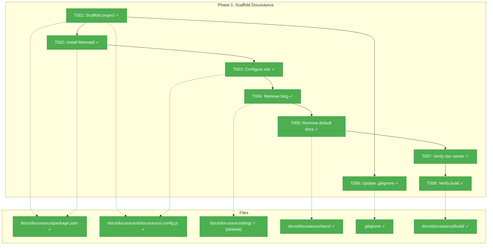

# Phase 1: Scaffold Docusaurus Project – Tasks & Alignment Brief

**Spec**: [docusaurus-site-spec.md](../../docusaurus-site-spec.md)
**Plan**: [docusaurus-site-plan.md](../../docusaurus-site-plan.md)
**Date**: 2026-02-18

---

## Executive Briefing

### Purpose

This phase creates the Docusaurus 3 project skeleton at `docs/docusaurus/` with a working local development server. It establishes the foundation that all subsequent content phases build upon — the build system, configuration, Mermaid rendering, and GitHub Pages baseUrl.

### What We're Building

A self-contained Docusaurus project that:

* Lives at `docs/docusaurus/` with its own `package.json` (isolated from root)
* Renders the default landing page at `localhost:3000/hve-core/`
* Has Mermaid diagram support enabled via `@docusaurus/theme-mermaid`
* Has blog disabled (docs-only site)
* Builds cleanly with `npm run build`

### User Value

Subsequent phases can immediately start adding content pages. The dev server provides instant feedback during content authoring.

### Example

**Before**: No documentation site exists. Users read raw markdown on GitHub.
**After**: `cd docs/docusaurus && npm start` opens a live Docusaurus site with working navigation, Mermaid support, and correct `baseUrl` for GitHub Pages deployment.

---

## Objectives & Scope

### Objective

Scaffold the Docusaurus 3 project and configure it for the `jakkaj.github.io/hve-core/` deployment target, per plan Phase 1 acceptance criteria.

### Goals

* ✅ Docusaurus project scaffolded at `docs/docusaurus/`
* ✅ `docusaurus.config.js` configured with correct URL, baseUrl, org, project
* ✅ Mermaid theme installed and enabled (`markdown.mermaid: true` + `themes` array)
* ✅ Blog disabled in preset-classic options
* ✅ Default tutorial/blog content removed (clean slate for Phase 2)
* ✅ `.gitignore` updated with build artifact patterns
* ✅ Dev server and production build both succeed

### Non-Goals

* ❌ Content pages (Phase 2, 2B, 2C, 2D)
* ❌ Custom landing page design (default hero is fine)
* ❌ GitHub Actions deploy workflow (Phase 3)
* ❌ Root `package.json` npm scripts (Phase 4)
* ❌ Custom CSS/theming beyond defaults
* ❌ Search configuration (future enhancement)

---

## Pre-Implementation Audit

### Summary

| File                                | Action  | Origin   | Modified By | Recommendation |
|-------------------------------------|---------|----------|-------------|----------------|
| `docs/docusaurus/`                  | Create  | New      | —           | keep-as-is     |
| `docs/docusaurus/package.json`      | Create  | New      | —           | keep-as-is     |
| `docs/docusaurus/docusaurus.config.js` | Create+Modify | New | T003    | keep-as-is     |
| `docs/docusaurus/blog/`            | Create+Delete | New  | T004        | keep-as-is     |
| `docs/docusaurus/docs/`            | Create+Delete | New  | T005        | keep-as-is     |
| `docs/docusaurus/sidebars.js`      | Create  | New      | —           | keep-as-is     |
| `.gitignore`                        | Modify  | Pre-plan | T006        | keep-as-is     |

### Compliance Check

No violations found. `.gitignore` modification follows existing directory-pattern conventions (trailing slash, nested path style matching `extension/` patterns at lines 419-426).

### Duplication Check

No existing static site generators found (no `docusaurus.config.js`, `gatsby-config.js`, `next.config.js`, `mkdocs.yml`, `_config.yml` anywhere in the repo). Greenfield confirmed.

---

## Requirements Traceability

### Coverage Matrix

| AC  | Description                                            | Files in Flow                          | Tasks      | Status       |
|-----|--------------------------------------------------------|----------------------------------------|------------|--------------|
| AC1 | `npm install && npm start` opens dev server            | `package.json`, `docusaurus.config.js` | T001,T003,T007 | ✅ Complete |
| AC2 | Mermaid rendering enabled                              | `package.json`, `docusaurus.config.js` | T002,T003  | ✅ Complete  |
| AC7 | Build artifacts in `.gitignore`                        | `.gitignore`                           | T006       | ✅ Complete  |
| AC8 | `npm run build` succeeds                               | All project files                      | T008       | ✅ Complete  |

*Note: AC3-6, AC9-10 are addressed in Phases 2-4, not Phase 1.*

### Gaps Found

No gaps — all Phase 1 acceptance criteria have complete file coverage.

---

## Architecture Map

### Component Diagram

<!-- Status: grey=pending, orange=in-progress, green=completed, red=blocked -->
<!-- Updated by plan-6 during implementation -->



### Task-to-Component Mapping

<!-- Status: ⬜ Pending | 🟧 In Progress | ✅ Complete | 🔴 Blocked -->

| Task | Component(s)       | Files                                      | Status     | Comment                          |
|------|--------------------|-------------------------------------------|------------|----------------------------------|
| T001 | Project scaffold   | `docs/docusaurus/*`                        | ✅ Complete | `npx create-docusaurus` output   |
| T002 | Mermaid plugin     | `docs/docusaurus/package.json`             | ✅ Complete | `npm install` adds dependency    |
| T003 | Site configuration | `docs/docusaurus/docusaurus.config.js`     | ✅ Complete | 8 config values to set           |
| T004 | Blog cleanup       | `docs/docusaurus/blog/`                    | ✅ Complete | Delete directory                 |
| T005 | Docs cleanup       | `docs/docusaurus/docs/`                    | ✅ Complete | Delete directory (replaced in P2)|
| T006 | Gitignore update   | `.gitignore`                               | ✅ Complete | Add 2 patterns                   |
| T007 | Dev server verify  | (all)                                       | ✅ Complete | `npm start` renders landing page |
| T008 | Build verify       | `docs/docusaurus/build/`                   | ✅ Complete | `npm run build` zero errors      |

---

## Tasks

| Status | ID   | Task                                                                                                   | CS | Type   | Dependencies | Absolute Path(s)                                           | Validation                                                                               | Subtasks | Notes                                   |
|--------|------|--------------------------------------------------------------------------------------------------------|----|--------|--------------|-------------------------------------------------------------|------------------------------------------------------------------------------------------|----------|-----------------------------------------|
| [x]    | T001 | Run `npx create-docusaurus@latest docusaurus classic --javascript --package-manager npm` in `docs/`    | 1  | Setup  | –            | /Users/jordanknight/repos/hve-core/docs/docusaurus/         | Directory exists with `package.json`, `docusaurus.config.js`, `sidebars.js`              | –        | `--package-manager npm` avoids prompt   |
| [x]    | T002 | Run `npm install @docusaurus/theme-mermaid` in `docs/docusaurus/`                                      | 1  | Setup  | T001         | /Users/jordanknight/repos/hve-core/docs/docusaurus/package.json | `@docusaurus/theme-mermaid` appears in `dependencies`                                    | –        | –                                       |
| [x]    | T003 | Edit `docusaurus.config.js`: set `url: 'https://jakkaj.github.io'`, `baseUrl: '/hve-core/'`, `organizationName: 'jakkaj'`, `projectName: 'hve-core'`, add `markdown: { mermaid: true }`, add `'@docusaurus/theme-mermaid'` to `themes` array, set `blog: false` in `@docusaurus/preset-classic` options | 2  | Core   | T001         | /Users/jordanknight/repos/hve-core/docs/docusaurus/docusaurus.config.js | Config has all 4 URL values, `markdown.mermaid: true`, themes array includes mermaid, blog disabled in preset | –        | 8 distinct config changes               |
| [x]    | T004 | Delete `docs/docusaurus/blog/` directory                                                               | 1  | Setup  | T003         | /Users/jordanknight/repos/hve-core/docs/docusaurus/blog/    | Directory no longer exists                                                               | –        | Default scaffold content                |
| [x] | T005 | Remove default docs content (`docs/docusaurus/docs/`) except create a minimal `docs/intro.md` placeholder with title and one-line description so the build succeeds between phases | 1 | Default tutorial pages removed; `docs/intro.md` exists with valid frontmatter | - | Prevents build failure before Phase 2 |
| [x]    | T006 | Add `.gitignore` patterns: `docs/docusaurus/build/` and `docs/docusaurus/.docusaurus/` under a `# Docusaurus` comment section | 1  | Setup  | T001         | /Users/jordanknight/repos/hve-core/.gitignore               | Both patterns present; follows existing directory-pattern style with trailing slash      | –        | Place near existing extension patterns  |
| [x]    | T007 | Verify `npm start` in `docs/docusaurus/` — dev server at `localhost:3000/hve-core/`                    | 1  | Verify | T005         | /Users/jordanknight/repos/hve-core/docs/docusaurus/         | Landing page renders with default Docusaurus hero; baseUrl path is `/hve-core/` not `/`  | –        | Manual visual check                     |
| [x]    | T008 | Verify `npm run build` in `docs/docusaurus/` — production build completes                              | 1  | Verify | T007         | /Users/jordanknight/repos/hve-core/docs/docusaurus/build/   | Build succeeds with zero errors; `build/` directory created with `index.html`            | –        | Early build gate before Phase 2 content |
| [x]    | T009 | Create `justfile` at project root with `docs-dev`, `docs-build`, `docs-serve` recipes                  | 1  | Setup  | T008         | /Users/jordanknight/repos/hve-core/justfile                 | `just docs-dev` launches dev server; `just docs-build` runs production build; `just docs-serve` serves built site | –        | Convenience commands for local dev |

---

## Alignment Brief

### Critical Findings Affecting This Phase

| # | Finding | Impact | Addressed By |
|---|---------|--------|-------------|
| 01 | `baseUrl` must be `/hve-core/` for GH Pages | Config value in `docusaurus.config.js` | T003 |
| 03 | Mermaid requires `@docusaurus/theme-mermaid` AND `markdown.mermaid: true` | Both config and dependency needed | T002, T003 |
| 05 | `build/` and `.docusaurus/` must be gitignored | Prevent build artifacts in git | T006 |
| 10 | `.npmrc` has `save-exact=true` — deps will be pinned to exact versions | Good for reproducibility, no action | – |

### Invariants & Guardrails

* Root `package.json` is NOT modified in this phase (Phase 4 adds `docs:*` scripts)
* `docs/docusaurus/` has its own isolated `node_modules/` (root `node_modules/` gitignore covers it)
* No content pages are created — Phase 2 handles all content
* Default landing page `src/pages/index.js` is kept as-is

### Inputs to Read

| File | Purpose |
|---|---|
| `/Users/jordanknight/repos/hve-core/.gitignore` | Understand pattern style before adding |
| `/Users/jordanknight/repos/hve-core/.npmrc` | Understand npm config (save-exact, audit) |
| `/Users/jordanknight/repos/hve-core/package.json` | Verify no conflicts with root deps |

### Visual Alignment

```mermaid
flowchart LR
    subgraph scaffold["T001: npx create-docusaurus"]
        PKG["package.json"]
        CFG["docusaurus.config.js"]
        SB["sidebars.js"]
        SRC["src/pages/index.js"]
        BLOG["blog/ (default)"]
        DOCS["docs/ (default)"]
    end

    subgraph configure["T002-T003: Install + Configure"]
        MRM["+ @docusaurus/theme-mermaid"]
        URL["url: jakkaj.github.io"]
        BASE["baseUrl: /hve-core/"]
        MERM["markdown.mermaid: true"]
        NOBLOG["blog: false"]
    end

    subgraph cleanup["T004-T006: Clean + Gitignore"]
        DEL1["rm blog/"]
        DEL2["rm docs/"]
        GIT["+ .gitignore patterns"]
    end

    subgraph verify["T007-T008: Verify"]
        DEV["npm start ✓"]
        BUILD["npm run build ✓"]
    end

    scaffold --> configure --> cleanup --> verify
```



### Test Plan

No automated tests — this is infrastructure scaffolding. Validation is:

| Check | Command | Expected |
|---|---|---|
| Dev server starts | `cd docs/docusaurus && npm start` | Browser opens `localhost:3000/hve-core/` with hero page |
| Production build | `cd docs/docusaurus && npm run build` | Zero errors, `build/index.html` exists |
| Mermaid in deps | `grep mermaid docs/docusaurus/package.json` | `@docusaurus/theme-mermaid` present |
| Blog removed | `ls docs/docusaurus/blog/ 2>/dev/null` | Directory not found |
| Gitignore updated | `grep docusaurus .gitignore` | Both `build/` and `.docusaurus/` patterns present |

### Implementation Outline

| Step | Maps To | Action |
|---|---|---|
| 1 | T001 | Run `npx create-docusaurus` in `docs/` — creates the entire project scaffold |
| 2 | T002 | `cd docs/docusaurus && npm install @docusaurus/theme-mermaid` |
| 3 | T003 | Edit `docusaurus.config.js` — set 8 config values (url, baseUrl, org, project, mermaid×2, blog, themes) |
| 4 | T004 | `rm -rf docs/docusaurus/blog/` |
| 5 | T005 | `rm -rf docs/docusaurus/docs/*` (keep empty dir or let Phase 2 create) |
| 6 | T006 | Add 2 patterns to `.gitignore` under `# Docusaurus` comment |
| 7 | T007 | `cd docs/docusaurus && npm start` — visual verify |
| 8 | T008 | `cd docs/docusaurus && npm run build` — must succeed |

### Commands to Run

```bash
# T001: Scaffold
cd /Users/jordanknight/repos/hve-core/docs
npx create-docusaurus@latest docusaurus classic --javascript --package-manager npm

# T002: Install Mermaid
cd /Users/jordanknight/repos/hve-core/docs/docusaurus
npm install @docusaurus/theme-mermaid

# T003: Configure (manual edit of docusaurus.config.js)

# T004-T005: Cleanup
rm -rf /Users/jordanknight/repos/hve-core/docs/docusaurus/blog/
rm -rf /Users/jordanknight/repos/hve-core/docs/docusaurus/docs/*

# T006: Gitignore (manual edit)

# T007: Dev server verify
cd /Users/jordanknight/repos/hve-core/docs/docusaurus
npm start

# T008: Build verify
cd /Users/jordanknight/repos/hve-core/docs/docusaurus
npm run build
```

### Risks & Unknowns

| Risk | Severity | Mitigation |
|---|---|---|
| `npx create-docusaurus` hangs or fails | Low | Can scaffold manually from Docusaurus template repo |
| Mermaid plugin version incompatible with Docusaurus 3 | Low | Pin to known-good version; check Docusaurus compatibility table |
| `npm start` fails after removing `docs/` content | Medium | May need at least one `.md` file — create empty `docs/intro.md` placeholder if needed |

### Ready Check

* [x] No ADRs to map (none exist)
* [x] Pre-Implementation Audit complete — all greenfield
* [x] Requirements Traceability verified — no gaps
* [x] All commands specified with absolute paths
* [x] **Human GO/NO-GO**: Approved — implementation complete

---

## Phase Footnote Stubs

| Footnote | Task | Description | Added By |
|----------|------|-------------|----------|
| | | | |

*Populated by plan-6 during implementation.*

---

## Evidence Artifacts

| Artifact | Location |
|---|---|
| Execution log | `docs/plans/002-docusaurus-site/tasks/phase-1-scaffold-docusaurus-project/execution.log.md` |
| Built site | `docs/docusaurus/build/` (gitignored) |
| Docusaurus config | `docs/docusaurus/docusaurus.config.js` |
| Justfile | `justfile` |

---

## Discoveries & Learnings

*Populated during implementation by plan-6. Log anything of interest to your future self.*

| Date | Task | Type | Discovery | Resolution | References |
|------|------|------|-----------|------------|------------|
| 2026-02-18 | T007 | gotcha | Multi-edit passes on JS config files can silently drop closing braces — T003 removed `},` from navbar items causing ParseError at line 89 | Fixed by restoring `},` and adding missing `label: 'GitHub'` | log#task-t007 |
| 2026-02-18 | T002 | insight | Root `.npmrc` `save-exact=true` does NOT cascade to `docs/docusaurus/` — npm resolves config from nearest `package.json` upward. Scaffold deps use `^` ranges, which is consistent | No action needed — documented for awareness | log#task-t002 |

**Types**: `gotcha` | `research-needed` | `unexpected-behavior` | `workaround` | `decision` | `debt` | `insight`

**What to log**:

* Things that didn't work as expected
* External research that was required
* Implementation troubles and how they were resolved
* Gotchas and edge cases discovered
* Decisions made during implementation
* Technical debt introduced (and why)
* Insights that future phases should know about

*See also: `execution.log.md` for detailed narrative.*

---

## Directory Layout

```
docs/plans/002-docusaurus-site/
├── docusaurus-site-spec.md
├── docusaurus-site-plan.md
├── research-dossier.md
├── workshops/
│   ├── value-delivery-segments.md
│   ├── overview-section.md
│   ├── shape-the-work-section.md
│   ├── build-the-work-section.md
│   └── ship-it-and-reference-sections.md
└── tasks/
    └── phase-1-scaffold-docusaurus-project/
        ├── tasks.md                 ← This file
        └── execution.log.md        ← Created by plan-6
```
