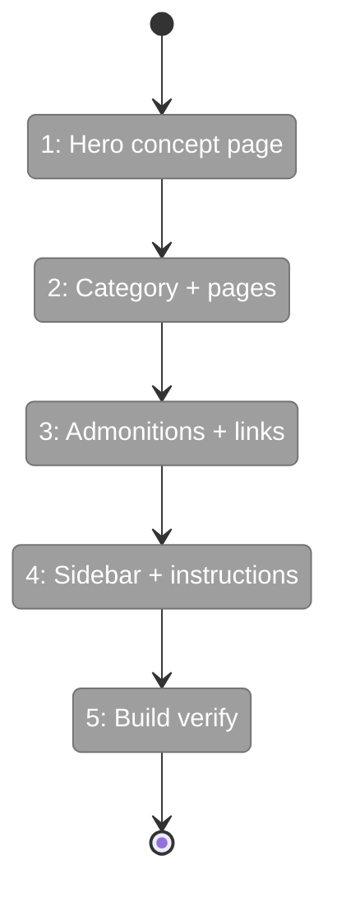
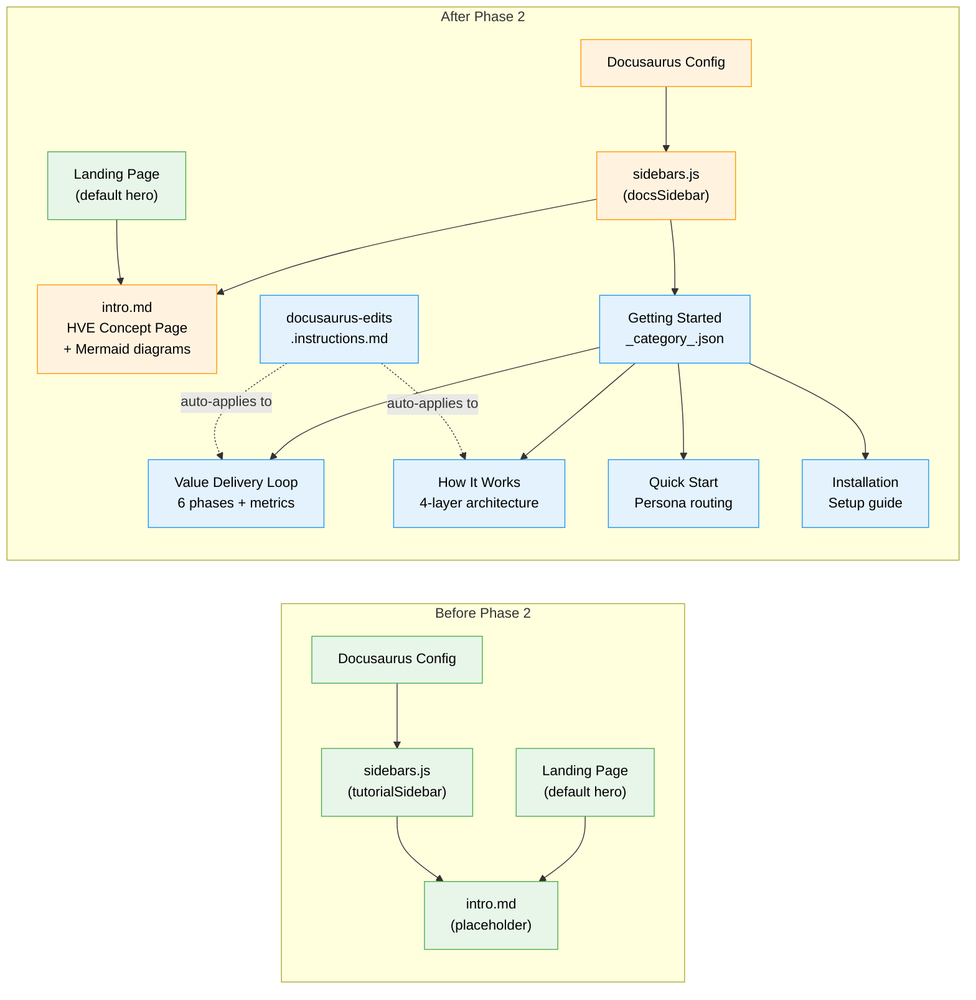

# Flight Plan: Phase 2 — Content: Getting Started & Instructions File

**Plan**: [docusaurus-site-plan.md](../../docusaurus-site-plan.md)
**Phase**: Phase 2: Content — Getting Started & Instructions File
**Generated**: 2026-02-18
**Status**: Ready for takeoff

---

## Departure → Destination

**Where we are**: Phase 1 delivered a working Docusaurus 3.9.2 project at `docs/docusaurus/` with Mermaid rendering enabled, blog disabled, and `baseUrl: '/hve-core/'` configured for GitHub Pages. The site builds and serves locally via `just docs-dev`, but contains only a single placeholder `intro.md` page. A user visiting the site sees a default Docusaurus hero and one line of placeholder text.

**Where we're going**: By the end of this phase, a user visiting the site will land on a conceptual overview of HyperVelocity Engineering with an interactive value delivery loop diagram. They can navigate through four Getting Started pages — learning about the 6 delivery phases, understanding HVE-Core's 4-layer architecture, and being routed to the right section based on their role (Product, Engineering, or Platform). An instructions file will auto-apply Docusaurus conventions to all future content edits.

---

## Flight Status

<!-- Updated by /plan-6: pending → active → done. Use blocked for problems/input needed. -->

**Legend**: grey = pending | yellow = active | red = blocked/needs input | green = done

---

## Stages

<!-- Updated by /plan-6 during implementation: [ ] → [~] → [x] -->

- [ ] **Stage 1: Write the hero concept page** — replace placeholder `intro.md` with "What is HyperVelocity Engineering?" featuring value delivery loop Mermaid diagram, coverage heatmap, and DORA/SPACE/ESSP summary (`docs/docusaurus/docs/intro.md`)
- [ ] **Stage 2: Create Getting Started category** — add `_category_.json` with position 1 and create the category directory (`docs/docusaurus/docs/getting-started/_category_.json` — new file)
- [ ] **Stage 3: Write Value Delivery Loop page** — deep-dive on 6 phases with feedback arcs diagram, per-phase activities/stakeholders/failure modes, DORA mapping table, SPACE × Phase matrix (`getting-started/value-delivery-loop.md` — new file)
- [ ] **Stage 4: Write How It Works page** — 4-layer architecture diagram, `applyTo` mechanism, `/clear` boundary pattern, `.copilot-tracking/` artifact bus, "How This Differs from ChatGPT" (`getting-started/how-it-works.md` — new file)
- [ ] **Stage 5: Write Quick Start page** — role-based decision tree Mermaid diagram, 3 persona paths with top-3 artifact tables, honest note on Ship It thinness (`getting-started/quick-start.md` — new file)
- [ ] **Stage 6: Write Installation page** — VS Code extension install, post-install checklist, verification step (`getting-started/installation.md` — new file)
- [ ] **Stage 7: Add admonitions and internal links** — weave `:::note`, `:::tip`, `:::warning` callouts into 2+ pages; add cross-page links using relative paths without `.md` extension (multiple files)
- [ ] **Stage 8: Rename sidebar and create instructions file** — rename `tutorialSidebar` → `docsSidebar` in config; create `docusaurus-edits.instructions.md` covering 11 Docusaurus conventions with `applyTo: 'docs/docusaurus/**'` (`.github/instructions/docusaurus-edits.instructions.md` — new file)
- [ ] **Stage 9: Build verify** — run `npm run build` and `npm start`, confirm all pages render, Mermaid diagrams display, admonitions styled, sidebar ordering correct (`docs/docusaurus/`)

---

## Acceptance Criteria

- [ ] `getting-started/` category visible in sidebar with 4 ordered pages
- [ ] Mermaid diagram (value delivery loop) renders on intro page
- [ ] Architecture diagram renders on how-it-works page
- [ ] Admonitions render with styling on at least 2 pages
- [ ] Internal links navigate between pages
- [ ] Instructions file has `applyTo: 'docs/docusaurus/**'`
- [ ] Instructions file covers all 11 conventions

---

## Goals & Non-Goals

**Goals**:

- Replace placeholder intro.md with hero concept page featuring Mermaid value delivery loop diagram
- Create `getting-started/` category with 4 ordered pages (value-delivery-loop, how-it-works, quick-start, installation)
- Demonstrate all Docusaurus content patterns: frontmatter, admonitions, Mermaid diagrams, internal links
- Create `docusaurus-edits.instructions.md` covering 11 conventions for future content authors
- Verify sidebar ordering matches intended reading flow
- Build succeeds with all new content

**Non-Goals**:

- Shape the Work content (Phase 2B)
- Build the Work content (Phase 2C)
- Ship It / Reference content (Phase 2D)
- Custom React components or tabs (MDX tabs deferred)
- Custom CSS or theming changes
- Landing page redesign (default hero kept)
- Full production-quality prose (skeleton + sample content)
- Root `package.json` npm scripts (Phase 4)
- GitHub Actions deploy workflow (Phase 3)

---

## Architecture: Before & After

**Legend**: existing (green, unchanged) | changed (orange, modified) | new (blue, created)

---

## Checklist

- [ ] T001: Replace intro.md with "What is HVE?" hero concept page with value loop diagram and coverage heatmap (CS-2)
- [ ] T002: Create getting-started/_category_.json with position 1 (CS-1)
- [ ] T003: Create value-delivery-loop.md — 6 phases, DORA/SPACE mapping, feedback arcs diagram (CS-2)
- [ ] T004: Create how-it-works.md — 4-layer architecture diagram, applyTo, /clear, artifact bus (CS-2)
- [ ] T005: Create quick-start.md — decision tree diagram, per-role tables, persona routing (CS-2)
- [ ] T006: Create installation.md — extension install + post-install checklist (CS-1)
- [ ] T007: Add admonitions (:::note, :::tip, :::warning) to 2+ pages (CS-1)
- [ ] T008: Add internal links between getting-started pages without .md extension (CS-1)
- [ ] T009: Rename tutorialSidebar → docsSidebar in sidebars.js and config (CS-1)
- [ ] T010: Create docusaurus-edits.instructions.md with 11 conventions (CS-2)
- [ ] T011: Build verify — npm run build zero errors, visual verify (CS-1)

---

## PlanPak

Not active for this plan.
