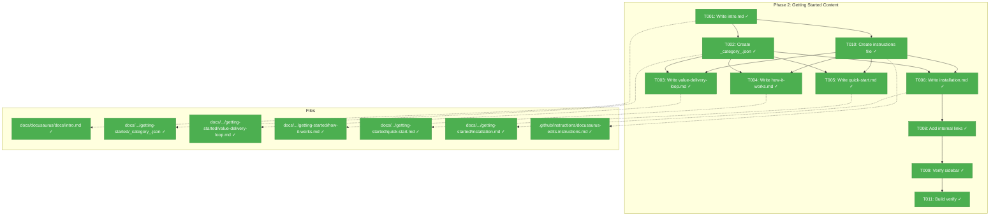
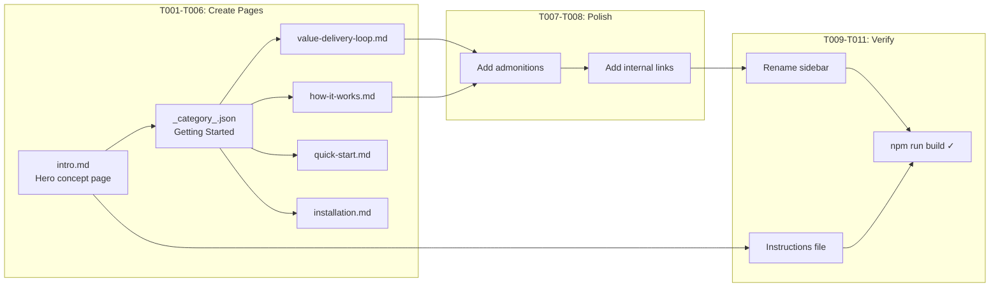

# Phase 2: Content — Getting Started & Instructions File – Tasks & Alignment Brief

**Spec**: [docusaurus-site-spec.md](../../docusaurus-site-spec.md)
**Plan**: [docusaurus-site-plan.md](../../docusaurus-site-plan.md)
**Workshop**: [overview-section.md](../../workshops/overview-section.md)
**Date**: 2026-02-18

---

## Executive Briefing

### Purpose

This phase creates the educational foundation for the entire site: four content pages under "Getting Started" that teach what Hyper Velocity Engineering is, how HVE-Core's architecture works, and where each user persona should go first. It also creates the `docusaurus-edits.instructions.md` file that ensures all future content follows Docusaurus conventions automatically.

### What We're Building

Five "Getting Started" pages plus one instructions file:

* `intro.md` — "What is Hyper Velocity Engineering?" with value delivery loop diagram, coverage heatmap, DORA/SPACE/ESSP summary
* `getting-started/value-delivery-loop.md` — deep-dive on 6 delivery phases with feedback arcs, metric mappings, per-phase analysis
* `getting-started/how-it-works.md` — 4-layer architecture (Prompts→Agents→Instructions→Skills), `applyTo` mechanism, `/clear` boundaries, artifact bus
* `getting-started/quick-start.md` — role-based decision tree routing Product/Planning → Shape, Engineering → Build, Platform/Ops → Ship
* `getting-started/installation.md` — VS Code extension install + post-install setup
* `.github/instructions/docusaurus-edits.instructions.md` — auto-applied Docusaurus conventions

### User Value

Users go from "I installed this extension and see 70 things" to "I understand the conceptual model, know how the architecture works, and know which section is for me." Every subsequent section (Shape, Build, Ship, Reference) assumes the reader has absorbed these pages.

### Example

**Before**: User visits the site and sees a single placeholder page.
**After**: User lands on a conceptual overview with value delivery loop diagram, navigates through architecture and quick-start pages, and is routed to the right segment for their role.

---

## Objectives & Scope

### Objective

Create the Getting Started content section and Docusaurus instructions file per plan Phase 2 acceptance criteria and the overview-section workshop page designs.

### Goals

* ✅ Replace placeholder `intro.md` with hero concept page featuring Mermaid value delivery loop diagram
* ✅ Create `getting-started/` category with 4 ordered pages
* ✅ Demonstrate all Docusaurus content patterns: frontmatter, admonitions, Mermaid diagrams, internal links
* ✅ Create `docusaurus-edits.instructions.md` covering 11 conventions
* ✅ Verify sidebar ordering matches intended reading flow
* ✅ Build succeeds with all new content (`npm run build` zero errors)

### Non-Goals

* ❌ Shape the Work content (Phase 2B)
* ❌ Build the Work content (Phase 2C)
* ❌ Ship It / Reference content (Phase 2D)
* ❌ Custom React components or tabs (tabs on quick-start deferred — use headings instead)
* ❌ Custom CSS or theming changes
* ❌ Landing page redesign (default hero kept)
* ❌ Full production-quality prose (skeleton + 2-3 paragraphs per section; full editorial polish is future work)
* ❌ Root `package.json` npm scripts (Phase 4)
* ❌ GitHub Actions deploy workflow (Phase 3)

---

## Pre-Implementation Audit

### Summary

| File | Action | Origin | Modified By | Recommendation |
|------|--------|--------|-------------|----------------|
| `docs/docusaurus/docs/intro.md` | Modify | Phase 1 | T001 (Phase 2) | keep-as-is |
| `docs/docusaurus/docs/getting-started/_category_.json` | Create | New | — | keep-as-is |
| `docs/docusaurus/docs/getting-started/value-delivery-loop.md` | Create | New | — | keep-as-is |
| `docs/docusaurus/docs/getting-started/how-it-works.md` | Create | New | — | keep-as-is |
| `docs/docusaurus/docs/getting-started/quick-start.md` | Create | New | — | keep-as-is |
| `docs/docusaurus/docs/getting-started/installation.md` | Create | New | — | keep-as-is |
| `.github/instructions/docusaurus-edits.instructions.md` | Create | New | — | keep-as-is |

### Compliance Check

No violations found. The instructions file follows existing naming conventions (`kebab-case.instructions.md`), frontmatter format (`description` + `applyTo`), and placement in `.github/instructions/`.

### Duplication Check

No duplication risks. All 6 new content pages are net-new Docusaurus docs. The instructions file has no overlap with existing instruction files (none target `docs/docusaurus/**`).

---

## Requirements Traceability

### Coverage Matrix

| AC | Description | Files in Flow | Tasks | Status |
|----|-------------|---------------|-------|--------|
| AC2 (spec) | Sidebar displays multi-level hierarchy with 3+ top-level sections, 2+ pages per section | `_category_.json`, all 5 docs | T002, T003-T007 | ⚠️ Partial — Phase 2 creates 1 of 5 categories; later phases add remaining |
| AC3 (spec) | Pages ordered by `sidebar_position` | All 5 docs, `_category_.json` | T001-T007, T009 | ✅ Complete for Getting Started |
| AC4 (spec) | At least one page contains a Mermaid diagram | `intro.md`, `how-it-works.md` | T001, T004 | ✅ Complete |
| AC5 (spec) | `docusaurus-edits.instructions.md` exists with `applyTo` | `.github/instructions/docusaurus-edits.instructions.md` | T010 | ✅ Complete |
| AC10 (spec) | Sample pages demonstrate frontmatter, admonitions, Mermaid, internal links, category index | All 5 docs, `_category_.json` | T001-T008 | ✅ Complete |
| P2-AC1 (plan) | `getting-started/` category visible with 4 ordered pages | `_category_.json`, 4 subpages | T002-T007 | ✅ Complete |
| P2-AC2 (plan) | Mermaid diagram renders on intro page | `intro.md` | T001 | ✅ Complete |
| P2-AC3 (plan) | Architecture diagram renders on how-it-works page | `how-it-works.md` | T004 | ✅ Complete |
| P2-AC4 (plan) | Admonitions render on at least 2 pages | 2+ pages with `:::note`/`:::tip` | T007 | ✅ Complete |
| P2-AC5 (plan) | Internal links navigate between pages | All docs | T008 | ✅ Complete |
| P2-AC6 (plan) | Instructions file has `applyTo: 'docs/docusaurus/**'` | `docusaurus-edits.instructions.md` | T010 | ✅ Complete |
| P2-AC7 (plan) | Instructions file covers all 11 conventions | `docusaurus-edits.instructions.md` | T010 | ✅ Complete |

### Gaps Found

No gaps — all Phase 2 acceptance criteria have complete file coverage. AC2 from the spec (3+ top-level sections) is partially addressed here and completed by Phases 2B-2D.

---

## Architecture Map

### Component Diagram

<!-- Status: grey=pending, orange=in-progress, green=completed, red=blocked -->
<!-- Updated by plan-6 during implementation -->



### Task-to-Component Mapping

<!-- Status: ⬜ Pending | 🟧 In Progress | ✅ Complete | 🔴 Blocked -->

| Task | Component(s) | Files | Status | Comment |
|------|-------------|-------|--------|---------|
| T001 | Hero concept page | `docs/docusaurus/docs/intro.md` | ✅ Complete | Replace placeholder with "What is HVE?" — value loop mermaid, coverage heatmap |
| T002 | Category config | `docs/docusaurus/docs/getting-started/_category_.json` | ✅ Complete | Position 1, label "Getting Started" |
| T003 | Theory deep-dive | `docs/docusaurus/docs/getting-started/value-delivery-loop.md` | ✅ Complete | 6 phases, DORA/SPACE mapping, feedback arcs |
| T004 | Architecture page | `docs/docusaurus/docs/getting-started/how-it-works.md` | ✅ Complete | 4-layer model, applyTo, /clear, artifact bus |
| T005 | Persona routing | `docs/docusaurus/docs/getting-started/quick-start.md` | ✅ Complete | Decision tree mermaid, per-role tables |
| T006 | Install guide | `docs/docusaurus/docs/getting-started/installation.md` | ✅ Complete | Extension install + setup |
| T008 | Internal links | Multiple pages | ✅ Complete | Cross-page links without .md extension |
| T009 | Sidebar verify | `docs/docusaurus/sidebars.js` | ✅ Complete | Autogenerated config, ordering matches intent |
| T010 | Instructions file | `.github/instructions/docusaurus-edits.instructions.md` | ✅ Complete | 11 conventions, `applyTo: 'docs/docusaurus/**'` |
| T011 | Build gate | — | ✅ Complete | `npm run build` zero errors with all content |

---

## Tasks

| Status | ID | Task | CS | Type | Dependencies | Absolute Path(s) | Validation | Subtasks | Notes |
|--------|------|------|-----|------|--------------|-------------------|------------|----------|-------|
| [x] | T001 | Replace `intro.md` with "What is Hyper Velocity Engineering?" hero concept page. Include: value delivery loop Mermaid diagram (6-phase circular), "where value leaks" framing, DORA/SPACE/ESSP summary (one paragraph each), coverage heatmap (concise 6-line text-based version with `<!-- TODO: This heatmap is static text. Consider generating from artifact inventory if it becomes a maintenance burden -->` comment above it), "What HVE-Core Provides (And What It Doesn't)" section, "Next Steps" cross-links. Frontmatter: `sidebar_position: 1`, `title`, `description`. Use admonitions where genuinely warranted | 2 | Core | – | /Users/jordanknight/repos/hve-core/docs/docusaurus/docs/intro.md | Page renders first in sidebar; Mermaid value loop diagram renders; educational framing present; heatmap shows coverage honestly | – | Adapt from workshops/overview-section.md Page 1 |
| [x] | T002 | Create `getting-started/_category_.json` with `label: "Getting Started"`, `position: 1`, `collapsible: true`, `collapsed: false` | 1 | Setup | T001 | /Users/jordanknight/repos/hve-core/docs/docusaurus/docs/getting-started/_category_.json | Category appears first in sidebar | – | Plan task 2.2 |
| [x] | T003 | Create `value-delivery-loop.md` (sidebar_position: 1). Include: "The Loop, Not the Line" intro, per-phase sections (①–⑥) with activities/stakeholders/failure modes/metrics, feedback arcs Mermaid diagram, DORA metrics mapping, SPACE × Phase matrix table, ESSP zones explanation | 2 | Core | T002 | /Users/jordanknight/repos/hve-core/docs/docusaurus/docs/getting-started/value-delivery-loop.md | Page renders with structured phase sections; Mermaid feedback arcs diagram renders; SPACE × Phase table renders correctly | – | Adapt from workshops/overview-section.md Page 2 |
| [x] | T004 | Create `how-it-works.md` (sidebar_position: 2). Include: "Four Layers, One System" with 4-layer architecture Mermaid diagram, Instructions (applyTo mechanism), Prompts, Agents, Skills sections, handoff pattern sequence diagram, `/clear` boundary pattern diagram, `.copilot-tracking/` artifact bus explanation, "How This Differs from Just Asking ChatGPT" | 2 | Core | T002 | /Users/jordanknight/repos/hve-core/docs/docusaurus/docs/getting-started/how-it-works.md | Architecture Mermaid diagram renders; applyTo explanation is clear and prominent; /clear pattern explained with diagram | – | Adapt from workshops/overview-section.md Page 3; elevate applyTo per DYK insight |
| [x] | T005 | Create `quick-start.md` (sidebar_position: 3). Include: "What Do You Need to Do?" decision tree Mermaid diagram, 3 persona paths (Product/Planning, Engineering, Platform/Ops) + Explorer path. Per path: first 5-minute activity, top 3 artifacts table. Segment links cannot exist yet — use plain text references with `<!-- TODO: link to shape-the-work/overview when Phase 2B lands -->` HTML comments as reminders, plus a visible :::note explaining the site is being built section by section | 2 | Core | T002 | /Users/jordanknight/repos/hve-core/docs/docusaurus/docs/getting-started/quick-start.md | Decision tree Mermaid renders; per-role tables present; TODO comments mark future link locations | – | Adapt from workshops/overview-section.md Page 4; use headings not tabs (MDX tabs deferred) |
| [x] | T006 | Create `installation.md` (sidebar_position: 4). Include: VS Code extension install (marketplace link), post-install checklist (.gitignore for .copilot-tracking/, MCP configuration if applicable), verification step ("try /rpi to verify") | 1 | Core | T002 | /Users/jordanknight/repos/hve-core/docs/docusaurus/docs/getting-started/installation.md | Page covers install steps with actionable commands | – | Plan task 2.6; not designed in workshop — straightforward procedural page |
| [x] | T008 | Add internal links between all getting-started pages. Use relative paths without `.md` extension per Docusaurus convention. Do NOT link to future segment pages (shape-the-work, build-the-work, ship-it, reference) — they don't exist yet and `onBrokenLinks: 'throw'` will fail the build. Use plain text references instead (e.g., "covered in the Build the Work section") | 1 | Polish | T006 | /Users/jordanknight/repos/hve-core/docs/docusaurus/docs/getting-started/*.md, /Users/jordanknight/repos/hve-core/docs/docusaurus/docs/intro.md | Links between getting-started pages navigate correctly; no broken forward links | – | Plan task 2.8; forward links added in Phase 4 integration |
| [x] | T009 | Verify `sidebars.js` autogenerated config works with new category structure. Confirm sidebar shows: intro.md at top, then Getting Started category with 4 pages in correct order. Rename `tutorialSidebar` to `docsSidebar` in both `sidebars.js` and `docusaurus.config.js` navbar reference | 1 | Verify | T008 | /Users/jordanknight/repos/hve-core/docs/docusaurus/sidebars.js, /Users/jordanknight/repos/hve-core/docs/docusaurus/docusaurus.config.js | Sidebar matches `_category_.json` and `sidebar_position` ordering; `tutorialSidebar` renamed | – | Plan task 2.9; also addresses Phase 1 tech debt item #1 |
| [x] | T010 | Create `docusaurus-edits.instructions.md` with `description` and `applyTo: 'docs/docusaurus/**'`. Cover all 11 conventions: frontmatter fields, admonitions syntax, link conventions, Mermaid syntax, category structure, image paths, code block language, ordering, segment hierarchy, educational tone, value tags | 2 | Core | T001 | /Users/jordanknight/repos/hve-core/.github/instructions/docusaurus-edits.instructions.md | File exists with valid frontmatter; covers all 11 conventions from plan Instructions File Content Requirements section | – | Plan task 2.10 |
| [x] | T011 | Run `npm run build` in `docs/docusaurus/` and verify zero errors. Fix any broken links or missing frontmatter surfaced by the build. Run `npm start` and visually verify sidebar, Mermaid diagrams, admonitions, and internal links | 1 | Verify | T009, T010 | /Users/jordanknight/repos/hve-core/docs/docusaurus/ | Build succeeds with zero errors; all pages render correctly; Mermaid diagrams display; admonitions styled | – | Phase exit gate |

---

## Alignment Brief

### Prior Phase Review

**Phase 1 Summary**: Docusaurus 3.9.2 scaffolded at `docs/docusaurus/` with Mermaid theme enabled, blog disabled, `baseUrl: '/hve-core/'` configured. Dev server and production build verified. Justfile created with convenience recipes.

**Key deliverables available to Phase 2**:

* Working Docusaurus project at `docs/docusaurus/` with `npm start` / `npm run build`
* `docusaurus.config.js` with `markdown.mermaid: true` and `themes: ['@docusaurus/theme-mermaid']`
* `sidebars.js` with autogenerated config (`tutorialSidebar` — to be renamed in T009)
* Placeholder `intro.md` at `docs/docusaurus/docs/intro.md` — to be replaced by T001
* `.gitignore` patterns for `build/` and `.docusaurus/`

**Key lessons from Phase 1**:

* `onBrokenLinks: 'throw'` means ANY broken internal link fails the build — Phase 2 must not link to pages that don't exist yet
* Multi-edit passes on JS config need syntax validation — always run `npm start` after config changes (T009 touches config)
* ESM module format (`import`/`export default`) in both `docusaurus.config.js` and `sidebars.js`
* `respectPrefersColorScheme: true` is active — verify Mermaid diagrams in both light/dark themes

**Phase 1 tech debt addressed in Phase 2**:

* T009 renames `tutorialSidebar` to `docsSidebar` (Phase 1 debt item #1)
* Footer duplicate GitHub links — deferred (not in Phase 2 scope)

### Critical Findings Affecting This Phase

| # | Finding | Impact | Addressed By |
|---|---------|--------|-------------|
| 01 | `baseUrl` must be `/hve-core/` | Internal links must account for this prefix in dev vs production — Docusaurus handles this automatically for relative links | All link tasks |
| 06 | Admonitions use `:::note` not `> [!NOTE]` | Content must use Docusaurus syntax, not GitHub alerts | T007, T010 |
| 09 | Internal links omit `.md` extension | All cross-page links | T008, T010 |

### Invariants & Guardrails

* `onBrokenLinks: 'throw'` — do NOT create links to pages that don't exist yet (Shape, Build, Ship, Reference pages). Use placeholder text like "Coming in a future section" instead of broken links
* Root `package.json` is NOT modified in this phase
* Default landing page `src/pages/index.js` is NOT modified (kept as-is)
* Content follows workshop designs in `workshops/overview-section.md` — adapt, don't copy verbatim
* Educational tone: lead with "why this matters" before showing tools

### Inputs to Read

| File | Purpose |
|---|---|
| `/Users/jordanknight/repos/hve-core/docs/plans/002-docusaurus-site/workshops/overview-section.md` | Page designs for all 4 Getting Started pages |
| `/Users/jordanknight/repos/hve-core/docs/plans/002-docusaurus-site/workshops/value-delivery-segments.md` | Coverage heatmap, artifact value tags, persona matrix |
| `/Users/jordanknight/repos/hve-core/docs/plans/002-docusaurus-site/docusaurus-site-plan.md` § Instructions File Content Requirements | 11 conventions for the instructions file |
| `/Users/jordanknight/repos/hve-core/docs/docusaurus/docusaurus.config.js` | Current config for T009 sidebar rename |
| `/Users/jordanknight/repos/hve-core/docs/docusaurus/sidebars.js` | Current sidebar config for T009 |

### Visual Alignment



### Broken Links Strategy

The `onBrokenLinks: 'throw'` setting creates a constraint: pages in this phase cannot link to Shape, Build, Ship, or Reference pages that don't exist yet. The strategy:

* **Within Getting Started**: Use relative links freely — all pages exist after this phase
* **To future segments**: Use descriptive text without links. Example: "The RPI workflow is covered in the Build the Work section (coming soon)" rather than `[RPI Workflow](../build-the-work/rpi-workflow)`
* **To external resources**: Use full URLs for DORA reports, SPACE paper, etc.
* **After all phases complete**: Phase 4 integration will verify cross-segment links

### Test Plan

No automated tests. Validation is manual:

| Check | Command | Expected |
|---|---|---|
| Build succeeds | `cd docs/docusaurus && npm run build` | Zero errors |
| Dev server | `cd docs/docusaurus && npm start` | Pages render at `localhost:3000/hve-core/` |
| Sidebar order | Visual check in browser | intro → Getting Started (value-delivery-loop, how-it-works, quick-start, installation) |
| Mermaid renders | Visual check on intro.md and how-it-works.md | Diagrams display correctly |
| Admonitions render | Visual check on 2+ pages | Colored callout boxes visible |
| Internal links | Click links between getting-started pages | Navigation works |
| Instructions file | Check frontmatter | `applyTo: 'docs/docusaurus/**'` present |

### Implementation Outline

| Step | Maps To | Action |
|---|---|---|
| 1 | T001 | Replace `intro.md` with hero concept page — adapt from workshop Page 1 |
| 2 | T010 | Create `.github/instructions/docusaurus-edits.instructions.md` — establishes conventions before content authoring |
| 3 | T002 | Create `getting-started/_category_.json` |
| 4 | T003 | Create `value-delivery-loop.md` — adapt from workshop Page 2 |
| 5 | T004 | Create `how-it-works.md` — adapt from workshop Page 3 |
| 6 | T005 | Create `quick-start.md` — adapt from workshop Page 4 |
| 7 | T006 | Create `installation.md` — straightforward procedural page |
| 8 | T008 | Add internal links across all pages (may be done inline during steps 4-7) |
| 9 | T009 | Rename `tutorialSidebar` → `docsSidebar` in `sidebars.js` and `docusaurus.config.js` |
| 10 | T011 | Run `npm run build`, fix any issues, visual verify with `npm start` |

### Commands to Run

```bash
# Create category directory
mkdir -p /Users/jordanknight/repos/hve-core/docs/docusaurus/docs/getting-started

# Verify build after all content
cd /Users/jordanknight/repos/hve-core/docs/docusaurus
npm run build

# Dev server for visual verification
cd /Users/jordanknight/repos/hve-core/docs/docusaurus
npm start

# Or use justfile
cd /Users/jordanknight/repos/hve-core
just docs-build
just docs-dev
```

### Risks & Unknowns

| Risk | Severity | Mitigation |
|---|---|---|
| Mermaid diagrams look bad in dark mode | Low | Check `respectPrefersColorScheme` rendering; use minimal color styling |
| SPACE × Phase table too wide for sidebar layout | Low | Use abbreviations (①–⑥) in headers; test responsive rendering |
| Educational content scope creep | Medium | Stick to workshop page designs — skeleton + sample content, not production prose |
| `onBrokenLinks: 'throw'` breaks build on forward links | High | Do NOT link to Shape/Build/Ship/Reference pages — use text references only |

### Ready Check

* [x] Pre-Implementation Audit complete — all files new or clean provenance
* [x] Requirements Traceability verified — no gaps
* [x] No ADRs to map (none exist)
* [x] Broken links strategy defined for forward references
* [ ] **Human GO/NO-GO**: Approve to proceed with implementation

---

## Phase Footnote Stubs

| Footnote | Task | Description | Added By |
|----------|------|-------------|----------|
| [^2] | T001-T011 | Phase 2 implemented: 5 content pages, 1 instructions file, sidebar rename, build verified. DYK removed T007, reordered T010 early, added JTBD framing and design thinking elements. | plan-6 |

*Populated by plan-6 during implementation.*

---

## Evidence Artifacts

| Artifact | Location |
|---|---|
| Execution log | `docs/plans/002-docusaurus-site/tasks/phase-2-content-getting-started/execution.log.md` |
| Built site | `docs/docusaurus/build/` (gitignored) |
| Instructions file | `.github/instructions/docusaurus-edits.instructions.md` |

---

## Discoveries & Learnings

_Populated during implementation by plan-6. Log anything of interest to your future self._

| Date | Task | Type | Discovery | Resolution | References |
|------|------|------|-----------|------------|------------|
| | | | | | |

**Types**: `gotcha` | `research-needed` | `unexpected-behavior` | `workaround` | `decision` | `debt` | `insight`

**What to log**:

* Things that didn't work as expected
* External research that was required
* Implementation troubles and how they were resolved
* Gotchas and edge cases discovered
* Decisions made during implementation
* Technical debt introduced (and why)
* Insights that future phases should know about

_See also: `execution.log.md` for detailed narrative._

---

## Directory Layout

```
docs/plans/002-docusaurus-site/
├── docusaurus-site-spec.md
├── docusaurus-site-plan.md
├── research-dossier.md
├── workshops/
│   ├── value-delivery-segments.md
│   ├── overview-section.md          ← Primary content source for this phase
│   ├── shape-the-work-section.md
│   ├── build-the-work-section.md
│   └── ship-it-and-reference-sections.md
└── tasks/
    ├── phase-1-scaffold-docusaurus-project/
    │   ├── tasks.md                 ← Completed
    │   └── execution.log.md         ← Completed
    └── phase-2-content-getting-started/
        ├── tasks.md                 ← This file
        └── execution.log.md         ← Created by plan-6
```

---

## Critical Insights (2026-02-18)

| # | Insight | Decision |
|---|---------|----------|
| 1 | T008 forward links to future segments contradict `onBrokenLinks: 'throw'` — build would fail | Removed forward link instruction; only link within existing pages, plain text for future segments |
| 2 | T007 (admonitions) is a phantom task — admonitions happen naturally during content writing | Removed standalone task; be mindful of admonitions, use when genuinely warranted |
| 3 | Quick Start "Go Deeper" links will be dead text until Phases 2B-2D land | Add visible :::note about progressive build + HTML TODO comments marking future link locations |
| 4 | Instructions file (T010) should be created before content pages, not after | Moved T010 to execute right after T001 so conventions auto-apply during content authoring |
| 5 | Coverage heatmap is static text that will go stale when artifacts change | Keep concise 6-line version with TODO comment flagging maintenance risk |

Action items: None — all decisions applied to tasks.md
