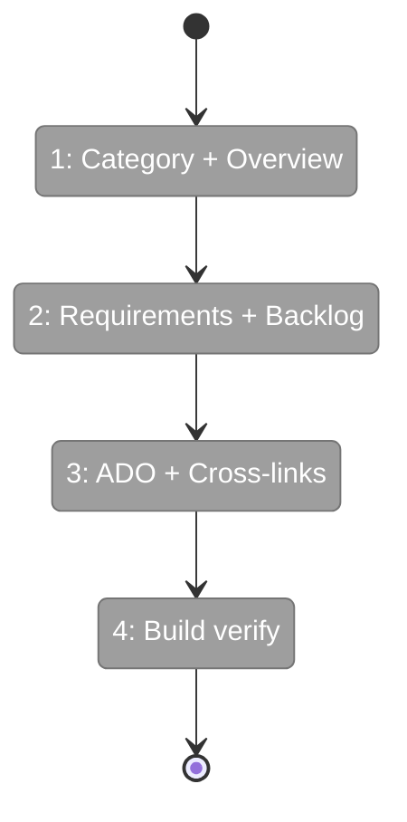
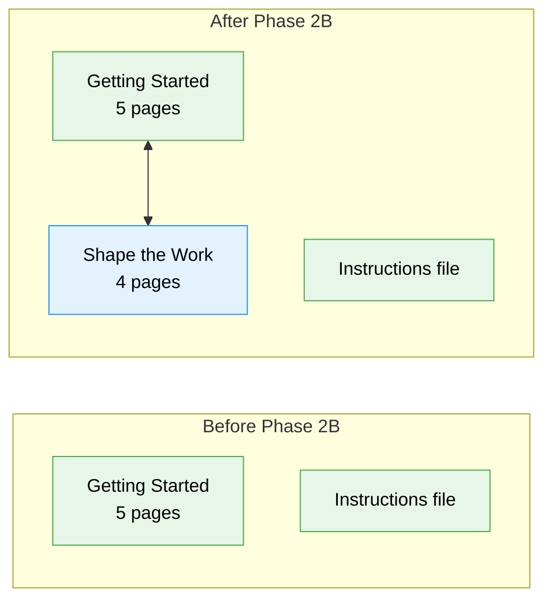

# Flight Plan: Phase 2B — Content: Shape the Work

**Plan**: [docusaurus-site-plan.md](../../docusaurus-site-plan.md)
**Phase**: Phase 2B: Content — Shape the Work
**Generated**: 2026-02-18
**Status**: Ready for takeoff

---

## Departure → Destination

**Where we are**: The site has a Getting Started section with 5 pages covering HVE concepts, architecture, persona routing, and installation. The sidebar shows one category. Users understand *what* HVE-Core is but have no guidance on the first delivery segment: turning ideas into actionable plans.

**Where we're going**: A new "Shape the Work" section with 4 pages teaches Product Managers, Tech Leads, and TPMs how to use requirements builders, the GitHub Backlog Manager pipeline, and ADO integration to turn vague ideas into sprint-ready work items. The sidebar shows two categories. The connection from shaping through to Build the Work is framed in text (links activate in Phase 2C).

---

## Flight Status

---

## Stages

- [ ] **Stage 1: Category + Overview** — create `_category_.json` (position 2) and `overview.md` with empathy moment, shaping workflow Mermaid, problem framing teaching
- [ ] **Stage 2: Requirements + Backlog** — create `requirements-architecture.md` with decision matrix and artifact chain diagram; create `backlog-management.md` with 4-workflow pipeline Mermaid, autonomy model, handoff contract (crown jewel)
- [ ] **Stage 3: ADO + Cross-links** — create `ado-integration.md` with platform comparison; add cross-links to Getting Started pages and plain-text forward refs with TODO comments
- [ ] **Stage 4: Build verify** — `npm run build` zero errors, sidebar ordering correct, Mermaid diagrams render

---

## Acceptance Criteria

- [ ] `shape-the-work/` category visible with 4 ordered pages
- [ ] Mermaid diagrams render on overview and backlog-management pages
- [ ] Cross-links to getting-started pages work (build-the-work links deferred as plain text)

---

## Goals & Non-Goals

**Goals**: Create 4 Shape the Work pages adapting workshop designs with educational framing, Mermaid diagrams, decision matrices, and the 3-tier autonomy model. Cross-link to existing Getting Started pages.

**Non-Goals**: Build the Work content (Phase 2C), forward links to unbuilt segments, full production prose, ADO MCP tool demos.

---

## Architecture: Before & After

---

## Checklist

- [ ] T001: Create `_category_.json` with position 2 (CS-1)
- [ ] T002: Write `overview.md` — empathy moment, shaping workflow Mermaid, DORA framing (CS-2)
- [ ] T003: Write `requirements-architecture.md` — decision matrix, artifact chain diagram, PRD walkthrough (CS-2)
- [ ] T004: Write `backlog-management.md` — 4-workflow pipeline Mermaid, autonomy model, handoff contract (CS-2)
- [ ] T005: Write `ado-integration.md` — ADO workflow Mermaid, platform comparison (CS-1)
- [ ] T006: Add cross-links to Getting Started + TODO comments for Build the Work (CS-1)
- [ ] T007: Build verify — `npm run build` zero errors, visual verify (CS-1)

---

## PlanPak

Not active for this plan.
