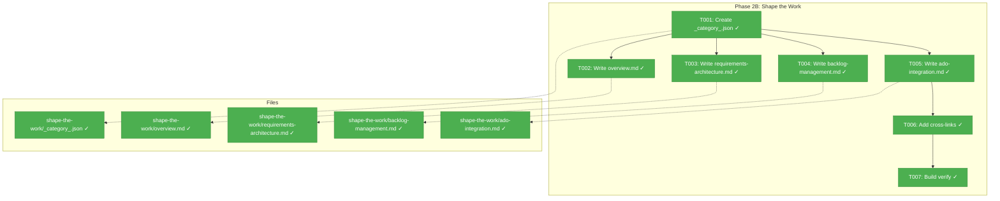
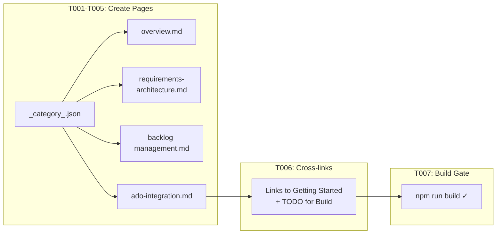

# Phase 2B: Content — Shape the Work – Tasks & Alignment Brief

**Spec**: [docusaurus-site-spec.md](../../docusaurus-site-spec.md)
**Plan**: [docusaurus-site-plan.md](../../docusaurus-site-plan.md)
**Workshop**: [shape-the-work-section.md](../../workshops/shape-the-work-section.md)
**Date**: 2026-02-18

---

## Executive Briefing

### Purpose

This phase creates the "Shape the Work" section: four pages that teach users how to turn vague ideas into prioritized, actionable plans using HVE-Core's requirements and backlog management tools. This is the repo's second-deepest segment (20 artifacts, two complete flows) and directly addresses the value delivery loop phases ① Discovery & Strategy and ② Demand Management & Prioritization.

### What We're Building

Four content pages under `shape-the-work/`:

* **Overview** — Why shaping work before coding prevents the most expensive failure mode; the shaping workflow diagram; what HVE-Core provides for this phase
* **Requirements & Architecture** — When and how to use PRD, BRD, ADR, Security Plan, and Architecture Diagram builders; decision matrix for tool selection; artifact chain diagram
* **Backlog Management** — The GitHub Backlog Manager's 4-workflow pipeline (Discover → Triage → Sprint Plan → Execute); 3-tier autonomy model; handoff file contract
* **ADO Integration** — Azure DevOps parallel flow; platform comparison; when to use ADO vs GitHub

### User Value

Product managers, tech leads, and TPMs go from "I have a vague idea" to "I know which HVE-Core tools to use, in what order, to create a structured plan." The connection from shaping through to Build the Work is made explicit.

### Example

**Before**: The site has Getting Started pages but no guidance on how to define and prioritize work.
**After**: A PM can follow the shaping workflow diagram from idea → requirements → backlog → sprint plan, with specific tool recommendations at each step.

---

## Objectives & Scope

### Objective

Create the Shape the Work content section per plan Phase 2B acceptance criteria and the shape-the-work-section workshop page designs.

### Goals

* ✅ Create `shape-the-work/` category with 4 ordered pages (position: 2)
* ✅ Mermaid diagrams on overview (shaping workflow) and backlog-management (4-workflow pipeline)
* ✅ Cross-links to Getting Started pages (existing)
* ✅ Demonstrate the educational-tone-first pattern established in Phase 2
* ✅ Build succeeds with all new content

### Non-Goals

* ❌ Build the Work content (Phase 2C)
* ❌ Ship It / Reference content (Phase 2D)
* ❌ Full production prose (skeleton + sample content per workshop designs)
* ❌ Forward links to Build the Work pages (don't exist yet — same `onBrokenLinks: 'throw'` constraint)
* ❌ ADO MCP tool integration demos (the page describes the workflow, not live API interaction)

---

## Pre-Implementation Audit

### Summary

| File | Action | Origin | Modified By | Recommendation |
|------|--------|--------|-------------|----------------|
| `docs/docusaurus/docs/shape-the-work/_category_.json` | Create | New | — | keep-as-is |
| `docs/docusaurus/docs/shape-the-work/overview.md` | Create | New | — | keep-as-is |
| `docs/docusaurus/docs/shape-the-work/requirements-architecture.md` | Create | New | — | keep-as-is |
| `docs/docusaurus/docs/shape-the-work/backlog-management.md` | Create | New | — | keep-as-is |
| `docs/docusaurus/docs/shape-the-work/ado-integration.md` | Create | New | — | keep-as-is |

### Compliance Check

No violations found. All files are net-new. Category structure follows the pattern established in Phase 2 (`_category_.json` with label, position, collapsible, collapsed).

### Duplication Check

No duplication risks. All 5 files are new Docusaurus docs in a new category.

---

## Requirements Traceability

### Coverage Matrix

| AC | Description | Files in Flow | Tasks | Status |
|----|-------------|---------------|-------|--------|
| P2B-AC1 (plan) | `shape-the-work/` category visible with 4 ordered pages | `_category_.json`, 4 content pages | T001-T005 | ✅ Complete |
| P2B-AC2 (plan) | Mermaid diagrams render on overview and backlog-management | `overview.md`, `backlog-management.md` | T002, T004 | ✅ Complete |
| P2B-AC3 (plan) | Cross-links to getting-started work | All pages | T006 | ⚠️ Partial — links to getting-started only; build-the-work links deferred |
| AC2 (spec) | Sidebar displays multi-level hierarchy with 3+ sections | Cumulative: Getting Started (Phase 2) + Shape the Work (this phase) = 2 of 5 | — | ⚠️ Progressing |

### Gaps Found

P2B-AC3 says "Cross-links to getting-started **and build-the-work** sections work" but Build the Work pages don't exist yet. The `onBrokenLinks: 'throw'` constraint means we can only link to Getting Started. Forward references to Build the Work will use plain text + HTML TODO comments (same strategy as Phase 2).

---

## Architecture Map

### Component Diagram



### Task-to-Component Mapping

| Task | Component(s) | Files | Status | Comment |
|------|-------------|-------|--------|---------|
| T001 | Category config | `shape-the-work/_category_.json` | ✅ Complete | Position 2, label "Shape the Work" |
| T002 | Segment overview | `shape-the-work/overview.md` | ✅ Complete | Shaping workflow Mermaid, empathy moment, DORA framing |
| T003 | Requirements page | `shape-the-work/requirements-architecture.md` | ✅ Complete | Decision matrix, artifact chain diagram, PRD walkthrough |
| T004 | Backlog page | `shape-the-work/backlog-management.md` | ✅ Complete | 4-workflow pipeline Mermaid, autonomy model, handoff contract |
| T005 | ADO page | `shape-the-work/ado-integration.md` | ✅ Complete | ADO workflow, platform comparison |
| T006 | Cross-links | Multiple pages | ✅ Complete | Links to Getting Started; plain text for Build the Work |
| T007 | Build gate | — | ✅ Complete | `npm run build` zero errors |

---

## Tasks

| Status | ID | Task | CS | Type | Dependencies | Absolute Path(s) | Validation | Subtasks | Notes |
|--------|------|------|-----|------|--------------|-------------------|------------|----------|-------|
| [x] | T001 | Create `shape-the-work/_category_.json` with `label: "Shape the Work"`, `position: 2`, `collapsible: true`, `collapsed: false` | 1 | Setup | – | /Users/jordanknight/repos/hve-core/docs/docusaurus/docs/shape-the-work/_category_.json | Category appears second in sidebar after Getting Started | – | Plan task 2B.1 |
| [x] | T002 | Create `overview.md` (sidebar_position: 1). Open with empathy moment for PM/TPM persona ("You've been in the meeting..."). Include: why shaping prevents building the wrong thing, DORA insight (lead time starts at backlog), shaping workflow Mermaid diagram (Idea → Requirements → Architecture → Backlog Discovery → Triage → Sprint Plan → sprint-ready items), what HVE-Core provides (20 artifacts, 2 flows), honest coverage note (no OKR/roadmap/capacity planning — framed as opportunity). Route to sub-pages. Keep focused: orient and route, not teach | 2 | Core | T001 | /Users/jordanknight/repos/hve-core/docs/docusaurus/docs/shape-the-work/overview.md | Mermaid shaping workflow renders; empathy moment present; educational framing before tools; routes to sub-pages | – | Plan task 2B.2; apply empathy moment from design thinking notes |
| [x] | T003 | Create `requirements-architecture.md` (sidebar_position: 2). Include: "Requirements Aren't Bureaucracy" framing, problem framing teaching (problem statements vs solution requests, "5 Whys" applied to requirements, diverge-then-converge in requirements — BRD builder as convergent tool after divergent discovery), decision matrix table (situation → agent → output → when to use), artifact chain Mermaid diagram (PRD/BRD → Issues, ADR/SecPlan → Research → RPI), example PRD walkthrough showing agent Q&A flow, brief coverage of risk-register and arch-diagram-builder | 2 | Core | T001 | /Users/jordanknight/repos/hve-core/docs/docusaurus/docs/shape-the-work/requirements-architecture.md | Decision matrix present; artifact chain Mermaid renders; PRD walkthrough demonstrates agent interaction; problem framing concept taught | – | Plan task 2B.3; design thinking problem framing moved here from overview |
| [x] | T004 | Create `backlog-management.md` (sidebar_position: 3). Structure with concept sections first, then a clearly separated "Reference: Handoff File Contract" section at the bottom for practical users to jump to directly. Concept sections: "Why Backlog Management Is Engineering Work" framing, 4-workflow pipeline Mermaid (Discover → Triage → Sprint Plan → Execute), per-workflow summary table (prompt, input, output), orchestrator vs direct prompts explanation, 3-tier autonomy model table (Full/Partial/Manual × operations). Reference section: handoff file contract showing `.copilot-tracking/github-issues/` structure with example checkbox syntax. Closing: "From Backlog to Build" connection showing issues becoming RPI tasks | 2 | Core | T001 | /Users/jordanknight/repos/hve-core/docs/docusaurus/docs/shape-the-work/backlog-management.md | Pipeline Mermaid renders; autonomy tiers table present; handoff file structure in distinct reference section | – | Plan task 2B.4; crown jewel of this segment |
| [x] | T005 | Create `ado-integration.md` (sidebar_position: 4). Include: "Same Goals, Different Platform" framing, ADO workflow Mermaid (get → process → update → PR), comparison table mapping ADO prompts to GitHub equivalents, work item hierarchy (Epic → Feature → User Story → Task/Bug), planning file contract (`.copilot-tracking/workitems/`), "When to Use ADO vs GitHub" guide | 1 | Core | T001 | /Users/jordanknight/repos/hve-core/docs/docusaurus/docs/shape-the-work/ado-integration.md | ADO Mermaid renders; comparison table present; platform choice guidance clear | – | Plan task 2B.5 |
| [x] | T006 | Add cross-links: Shape pages link to Getting Started pages (existing). Backlog management and ADO pages link to each other bidirectionally (both exist in this phase). Update `getting-started/quick-start.md` to convert the Shape the Work TODO comment into a real link (Build and Ship TODOs remain as text). Update `intro.md` to link Shape-relevant mentions ("shaping work", "backlog manager") to shape-the-work pages. Forward references to Build the Work use plain text + `<!-- TODO: link to build-the-work/X when Phase 2C lands -->` HTML comments. Backlog management page references RPI as text | 1 | Polish | T005 | /Users/jordanknight/repos/hve-core/docs/docusaurus/docs/shape-the-work/*.md, /Users/jordanknight/repos/hve-core/docs/docusaurus/docs/getting-started/quick-start.md, /Users/jordanknight/repos/hve-core/docs/docusaurus/docs/intro.md | Links to getting-started navigate correctly; backlog↔ADO links work; quick-start and intro Shape refs resolved; no broken forward links | – | Resolve stale TODOs and add links as segments land |
| [x] | T007 | Run `npm run build` and verify zero errors. Run `npm start` and verify sidebar shows Shape the Work category with 4 pages in correct order. Verify Mermaid diagrams render on overview and backlog-management pages | 1 | Verify | T006 | /Users/jordanknight/repos/hve-core/docs/docusaurus/ | Build succeeds; sidebar ordering correct; Mermaid renders | – | Phase exit gate |

---

## Alignment Brief

### Prior Phase Review

**Phase 1** delivered the Docusaurus 3.9.2 scaffold with Mermaid rendering, blog disabled, and `baseUrl: '/hve-core/'`. Key lesson: multi-edit on JS config files needs syntax validation. Key export: working build system, autogenerated sidebar, justfile recipes.

**Phase 2** delivered 5 Getting Started pages, the `docusaurus-edits.instructions.md` file, and renamed the sidebar. Key lessons: `onBrokenLinks: 'throw'` means no forward links to unbuilt pages; instructions file should be created before content; admonitions happen naturally during writing. Key exports: content patterns (frontmatter triple, `_category_.json` template, educational structure), link conventions (no `.md` extension, plain text for unbuilt segments), cross-page reference network within Getting Started.

**Cumulative deliverables available to Phase 2B**:
* Working Docusaurus project with Mermaid, blog disabled, baseUrl configured
* 5 content pages in Getting Started with established editorial patterns
* `docusaurus-edits.instructions.md` auto-applying conventions
* Sidebar config with `docsSidebar` autogenerated
* Link conventions: relative without `.md`, plain text + TODO for forward refs

### Critical Findings Affecting This Phase

| # | Finding | Impact | Addressed By |
|---|---------|--------|-------------|
| 06 | Admonitions use `:::note` not `> [!NOTE]` | Content must use Docusaurus syntax | All content tasks |
| 09 | Internal links omit `.md` extension | All cross-page links | T006 |
| — | `onBrokenLinks: 'throw'` (Phase 2 discovery) | No links to Build the Work pages | T006 |

### Invariants & Guardrails

* `onBrokenLinks: 'throw'` — do NOT link to Build the Work, Ship It, or Reference pages
* Content follows workshop designs in `workshops/shape-the-work-section.md` — adapt, don't copy
* Educational tone: concept before tool, per the instructions file conventions
* Apply design thinking notes from the workshop appendix (empathy moments, problem framing)
* Use admonitions where genuinely warranted, not prescriptively

### Inputs to Read

| File | Purpose |
|---|---|
| `/Users/jordanknight/repos/hve-core/docs/plans/002-docusaurus-site/workshops/shape-the-work-section.md` | Page designs for all 4 Shape the Work pages + design thinking integration notes |
| `/Users/jordanknight/repos/hve-core/docs/docusaurus/docs/intro.md` | Cross-link target; coverage heatmap for consistency |
| `/Users/jordanknight/repos/hve-core/docs/docusaurus/docs/getting-started/quick-start.md` | Cross-link target; forward ref TODO comment locations |
| `/Users/jordanknight/repos/hve-core/.github/instructions/docusaurus-edits.instructions.md` | Active conventions for all content |

### Visual Alignment



### Test Plan

No automated tests. Validation is manual:

| Check | Command | Expected |
|---|---|---|
| Build succeeds | `cd docs/docusaurus && npm run build` | Zero errors |
| Dev server | `npm start` | Pages render at `localhost:3000/hve-core/docs/shape-the-work/overview` |
| Sidebar order | Visual check | Getting Started → Shape the Work (overview, requirements, backlog, ado) |
| Mermaid renders | Visual check on overview + backlog-management | Diagrams display correctly |
| Cross-links | Click links to Getting Started | Navigation works |

### Implementation Outline

| Step | Maps To | Action |
|---|---|---|
| 1 | T001 | Create `shape-the-work/_category_.json` |
| 2 | T002 | Create `overview.md` — adapt from workshop Page 1 with empathy moment and problem framing |
| 3 | T003 | Create `requirements-architecture.md` — adapt from workshop Page 2 |
| 4 | T004 | Create `backlog-management.md` — adapt from workshop Page 3 (crown jewel) |
| 5 | T005 | Create `ado-integration.md` — adapt from workshop Page 4 |
| 6 | T006 | Add cross-links and TODO comments for future segments |
| 7 | T007 | Build verify + visual check |

### Commands to Run

```bash
mkdir -p /Users/jordanknight/repos/hve-core/docs/docusaurus/docs/shape-the-work

cd /Users/jordanknight/repos/hve-core/docs/docusaurus
npm run build
npm start

# Or
cd /Users/jordanknight/repos/hve-core
just docs-build
just docs-dev
```

### Risks & Unknowns

| Risk | Severity | Mitigation |
|---|---|---|
| Backlog management page too long (6 sections, multiple diagrams) | Medium | Follow workshop structure; keep each subsection to 2-3 paragraphs |
| ADO page feels like GitHub page's junior sibling | Low | Lead with "Same Goals, Different Platform" framing; show architectural difference honestly |
| Forward link TODOs accumulate across phases | Low | Phase 4 integration sweep will resolve all TODOs |

### Ready Check

* [x] Pre-Implementation Audit complete — all files new
* [x] Requirements Traceability verified — P2B-AC3 gap documented (forward links)
* [x] No ADRs to map
* [x] Forward link strategy confirmed (plain text + TODO)
* [x] Design thinking integration notes reviewed in workshop appendix
* [ ] **Human GO/NO-GO**: Approve to proceed with implementation

---

## Phase Footnote Stubs

| Footnote | Task | Description | Added By |
|----------|------|-------------|----------|
| [^3] | T001-T007 | Phase 2B implemented: 4 content pages, category config, cross-links to Getting Started, instructions file updated with educational design conventions. | plan-6 |

*Populated by plan-6 during implementation.*

---

## Evidence Artifacts

| Artifact | Location |
|---|---|
| Execution log | `docs/plans/002-docusaurus-site/tasks/phase-2b-content-shape-the-work/execution.log.md` |
| Built site | `docs/docusaurus/build/` (gitignored) |

---

## Discoveries & Learnings

*Populated during implementation by plan-6. Log anything of interest to your future self.*

| Date | Task | Type | Discovery | Resolution | References |
|------|------|------|-----------|------------|------------|
| 2026-02-18 | T002-T005 | insight | Content authoring revealed need for 4 new instruction conventions (page length, progressive disclosure, search keywords, cross-linking) | Updated docusaurus-edits.instructions.md with 4 new sections | educational-design-research.md |

**Types**: `gotcha` | `research-needed` | `unexpected-behavior` | `workaround` | `decision` | `debt` | `insight`

---

## Directory Layout

```
docs/plans/002-docusaurus-site/
├── docusaurus-site-spec.md
├── docusaurus-site-plan.md
├── research-dossier.md
├── workshops/
│   ├── value-delivery-segments.md
│   ├── overview-section.md
│   ├── shape-the-work-section.md      ← Primary content source for this phase
│   ├── build-the-work-section.md
│   └── ship-it-and-reference-sections.md
└── tasks/
    ├── phase-1-scaffold-docusaurus-project/    ← Completed
    ├── phase-2-content-getting-started/        ← Completed
    └── phase-2b-content-shape-the-work/
        ├── tasks.md                            ← This file
        ├── tasks.fltplan.md                    ← Generated by plan-5b
        └── execution.log.md                    ← Created by plan-6
```

---

## Critical Insights (2026-02-18)

| # | Insight | Decision |
|---|---------|----------|
| 1 | Backlog management page does two jobs (concept + reference) | Keep as one page; concept sections first, then distinct "Reference: Handoff File Contract" section at bottom |
| 2 | ADO and Backlog pages both exist in this phase — can cross-link with real links | Use real bidirectional links between backlog-management and ado-integration |
| 3 | Quick-start Shape TODO can be resolved when Shape pages land | T006 converts quick-start Shape TODO to real link; Build/Ship TODOs remain as text |
| 4 | Intro.md Shape mentions can also become real links | T006 also wires intro.md "shaping work" and "backlog manager" mentions to shape-the-work pages |
| 5 | Overview page overloaded with problem framing teaching | Moved problem framing (problem statements vs solution requests, diverge-then-converge) from overview to requirements-architecture page |

Action items: None — all decisions applied to tasks.md
