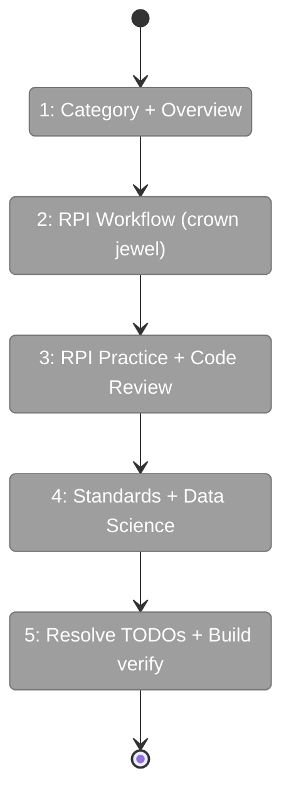
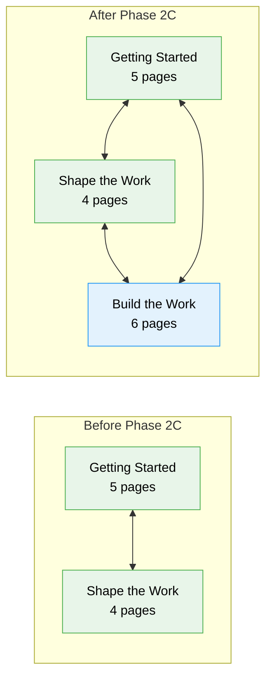

# Flight Plan: Phase 2C — Content: Build the Work

**Plan**: [docusaurus-site-plan.md](../../docusaurus-site-plan.md)
**Phase**: Phase 2C: Content — Build the Work
**Generated**: 2026-02-18
**Status**: Ready for takeoff

---

## Departure → Destination

**Where we are**: The site has Getting Started (5 pages) and Shape the Work (4 pages) sections. Users understand the value delivery loop and know how to turn ideas into sprint-ready issues. But the engineering workflow itself (how to actually research, plan, implement, and review code with AI assistance) is unaddressed. The RPI workflow is referenced on 6 existing pages but never explained.

**Where we're going**: A new "Build the Work" section with 6 pages delivers the site's deepest content. The crown jewel RPI workflow page teaches phase separation with multiple Mermaid diagrams and a decision guide. A full walkthrough shows RPI running on a real task. Code review, coding standards, and data science complete the engineering picture. Five forward-link TODOs across existing pages are resolved to real links. The sidebar shows three categories.

---

## Flight Status

---

## Stages

- [ ] **Stage 1: Category + Overview** — create `_category_.json` (position 3) and `overview.md` with cognitive separation argument and constraint-as-design-pattern framing
- [ ] **Stage 2: RPI Workflow** — create `rpi-workflow.md` with 5-phase flow diagram, strict vs autonomous modes diagram, artifact data bus, decision guide table (**crown jewel**)
- [ ] **Stage 3: RPI Practice + Code Review** — create `rpi-in-practice.md` with prompts/artifacts walkthrough and sequence diagram; create `code-review-prs.md` with PR pipeline and git ops
- [ ] **Stage 4: Standards + Data Science** — create `coding-standards.md` with applyTo flow and language table; create `data-science.md` with implicit pipeline diagram
- [ ] **Stage 5: Resolve TODOs + Build verify** — resolve 5 forward-link TODOs in existing pages, add intro.md Build link, `npm run build` zero errors, visual verify

---

## Acceptance Criteria

- [ ] `build-the-work/` category visible with 6 ordered pages
- [ ] RPI flow page has multiple Mermaid diagrams rendering correctly
- [ ] RPI in practice page has code blocks with example prompts
- [ ] Cross-links between all pages work
- [ ] All 5 forward-link TODOs resolved (zero `grep` results for `TODO.*build-the-work`)

---

## Goals & Non-Goals

**Goals**: 6 Build the Work pages with RPI crown jewel, cognitive separation framing, design thinking constraint-as-pattern, walkthrough with real prompts, coding standards with applyTo, data science pipeline. Resolve all existing forward-link TODOs.

**Non-Goals**: Ship It / Reference content (Phase 2D), interactive MDX, tabs, forward links to Ship It or Reference, full editorial polish.

---

## Architecture: Before & After

---

## Checklist

- [ ] T001: Create `_category_.json` with position 3 (CS-1)
- [ ] T002: Write `overview.md` — cognitive separation, constraint-as-design-pattern (CS-2)
- [ ] T003: Write `rpi-workflow.md` — 5-phase flow, 3+ Mermaid diagrams, strict/autonomous, decision guide (CS-3) **CROWN JEWEL**
- [ ] T004: Write `rpi-in-practice.md` — walkthrough with prompts, artifacts, iteration loop (CS-2)
- [ ] T005: Write `code-review-prs.md` — PR pipeline Mermaid, git ops table (CS-2)
- [ ] T006: Write `coding-standards.md` — applyTo flow Mermaid, language table, plan trick (CS-2)
- [ ] T007: Write `data-science.md` — implicit pipeline Mermaid, no-orchestrator rationale (CS-1)
- [ ] T008: Resolve 5 forward-link TODOs + add intro.md Build link (CS-1)
- [ ] T009: Build verify — `npm run build` zero errors, visual verify (CS-1)

---

## PlanPak

Not active for this plan.
