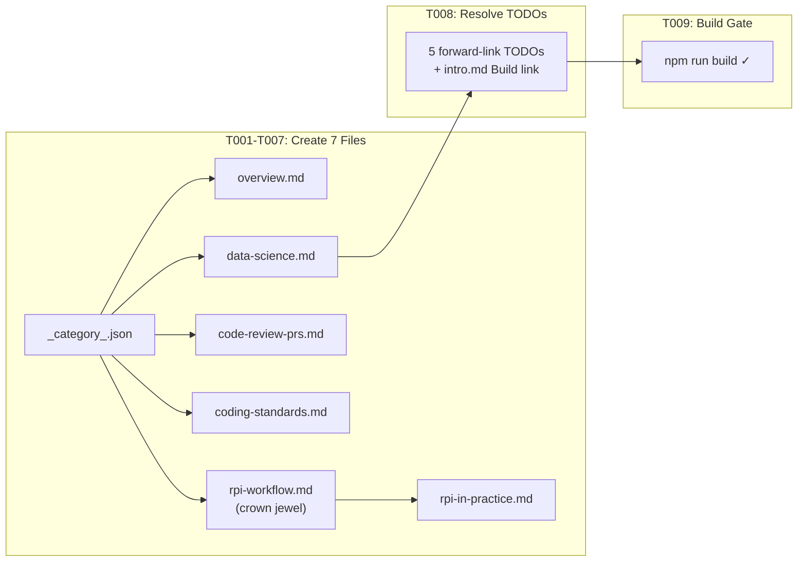

# Phase 2C: Content — Build the Work – Tasks & Alignment Brief

**Spec**: [docusaurus-site-spec.md](../../docusaurus-site-spec.md)
**Plan**: [docusaurus-site-plan.md](../../docusaurus-site-plan.md)
**Workshop**: [build-the-work-section.md](../../workshops/build-the-work-section.md)
**Date**: 2026-02-18

---

## Executive Briefing

### Purpose

This phase creates the "Build the Work" section: six pages covering the deepest segment of HVE-Core with 29 artifacts. The centrepiece is the RPI workflow (Research → Plan → Implement → Review), the repo's crown jewel and most original contribution. This section teaches the cognitive separation insight (constrained phases produce better AI output than unconstrained "just code it") and walks through the complete engineering workflow from task pickup to merged PR.

### What We're Building

Six content pages under `build-the-work/`:

* **Overview** — The cognitive separation problem; why constraints improve AI output; SPACE connection
* **RPI Workflow** — Complete 5-phase loop with diagrams, strict vs autonomous modes, artifact data bus, decision guide (**crown jewel of the entire site**)
* **RPI in Practice** — Full walkthrough with actual prompts, artifacts produced per phase, iteration loop
* **Code Review & PRs** — PR generation, pr-review agent, git operations, ADO PR linking
* **Coding Standards** — applyTo mechanism, invisible guardrails, language standards list, plan file trick
* **Data Science Workflows** — Implicit pipeline: gen-data-spec → notebook → dashboard → test

### User Value

Engineers go from "I have a task" to understanding how RPI's phase separation produces better code, then can follow a concrete walkthrough to try it themselves. The invisible guardrails (coding standards) and downstream workflow (PRs, git ops) complete the picture.

### Example

**Before**: The site explains concepts and shaping but has no content about the actual engineering workflow.
**After**: An engineer reads the cognitive separation insight, follows the RPI walkthrough with real prompts, understands how coding standards auto-apply, and knows how to generate PRs — the complete Build the Work journey.

---

## Objectives & Scope

### Objective

Create the Build the Work content section per plan Phase 2C acceptance criteria and the build-the-work-section workshop page designs.

### Goals

* ✅ Create `build-the-work/` category with 6 ordered pages (position: 3)
* ✅ RPI flow page with multiple Mermaid diagrams (flow, artifact bus, strict vs autonomous)
* ✅ RPI in practice page with code blocks showing actual prompts
* ✅ Cross-links to Getting Started and Shape the Work pages (both exist)
* ✅ Resolve all 5 forward-link TODOs in existing pages (4 in shape-the-work, 1 in quick-start)
* ✅ Apply design thinking "constraint-as-design-pattern" framing on overview
* ✅ Build succeeds with all new content

### Non-Goals

* ❌ Ship It / Reference content (Phase 2D)
* ❌ Full production prose (skeleton + sample content per workshop)
* ❌ Interactive MDX components (deferred)
* ❌ Forward links to Ship It or Reference pages
* ❌ Custom CSS or theming changes
* ❌ Tabs for strict vs autonomous modes (use headings)

---

## Pre-Implementation Audit

### Summary

| File | Action | Origin | Modified By | Recommendation |
|------|--------|--------|-------------|----------------|
| `docs/docusaurus/docs/build-the-work/_category_.json` | Create | New | — | keep-as-is |
| `docs/docusaurus/docs/build-the-work/overview.md` | Create | New | — | keep-as-is |
| `docs/docusaurus/docs/build-the-work/rpi-workflow.md` | Create | New | — | keep-as-is |
| `docs/docusaurus/docs/build-the-work/rpi-in-practice.md` | Create | New | — | keep-as-is |
| `docs/docusaurus/docs/build-the-work/code-review-prs.md` | Create | New | — | keep-as-is |
| `docs/docusaurus/docs/build-the-work/coding-standards.md` | Create | New | — | keep-as-is |
| `docs/docusaurus/docs/build-the-work/data-science.md` | Create | New | — | keep-as-is |
| `docs/docusaurus/docs/shape-the-work/overview.md` | Modify | Phase 2B | T006 | Resolve 2 TODO comments |
| `docs/docusaurus/docs/shape-the-work/requirements-architecture.md` | Modify | Phase 2B | T006 | Resolve 1 TODO comment |
| `docs/docusaurus/docs/shape-the-work/backlog-management.md` | Modify | Phase 2B | T006 | Resolve 1 TODO comment |
| `docs/docusaurus/docs/getting-started/quick-start.md` | Modify | Phase 2 | T006 | Resolve 1 TODO comment |
| `docs/docusaurus/docs/intro.md` | Modify | Phase 2 | T006 | Add Build the Work link |

### Compliance Check

No violations found. All 7 new files follow established `_category_.json` and frontmatter conventions. 5 modified files are existing pages with clean provenance — modifications are link resolution only.

---

## Requirements Traceability

### Coverage Matrix

| AC | Description | Files in Flow | Tasks | Status |
|----|-------------|---------------|-------|--------|
| P2C-AC1 (plan) | `build-the-work/` category visible with 6 ordered pages | `_category_.json`, 6 content pages | T001-T007 | ✅ Complete |
| P2C-AC2 (plan) | RPI flow page has multiple Mermaid diagrams | `rpi-workflow.md` | T003 | ✅ Complete |
| P2C-AC3 (plan) | RPI in practice has code blocks with example prompts | `rpi-in-practice.md` | T004 | ✅ Complete |
| P2C-AC4 (plan) | Cross-links between all pages work | All pages | T008 | ✅ Complete |
| AC2 (spec) | Sidebar displays 3+ top-level sections | Cumulative: Getting Started + Shape + Build = 3 of 5 | — | ✅ Met |

### Gaps Found

No gaps. P2C-AC4 can now include cross-links to Getting Started AND Shape the Work (both exist). Forward links to Ship It / Reference use the established plain-text + TODO pattern.

---

## Architecture Map

### Component Diagram

```mermaid
flowchart TD
    classDef pending fill:#9E9E9E,stroke:#757575,color:#fff
    classDef inprogress fill:#FF9800,stroke:#F57C00,color:#fff
    classDef completed fill:#4CAF50,stroke:#388E3C,color:#fff
    classDef blocked fill:#F44336,stroke:#D32F2F,color:#fff

    subgraph Phase["Phase 2C: Build the Work"]
        T001["T001: Create _category_.json ✓"]:::completed
        T002["T002: Write overview.md ✓"]:::completed
        T003["T003: Write rpi-workflow.md ✓"]:::completed
        T004["T004: Write rpi-in-practice.md ✓"]:::completed
        T005["T005: Write code-review-prs.md ✓"]:::completed
        T006["T006: Write coding-standards.md ✓"]:::completed
        T007["T007: Write data-science.md ✓"]:::completed
        T008["T008: Resolve TODOs ✓"]:::completed
        T009["T009: Build verify ✓"]:::completed

        T001 --> T002
        T001 --> T003
        T003 --> T004
        T001 --> T005
        T001 --> T006
        T001 --> T007
        T007 --> T008
        T008 --> T009
    end

    subgraph Files["New Files"]
        F1["build-the-work/_category_.json"]:::pending
        F2["build-the-work/overview.md"]:::pending
        F3["build-the-work/rpi-workflow.md"]:::pending
        F4["build-the-work/rpi-in-practice.md"]:::pending
        F5["build-the-work/code-review-prs.md"]:::pending
        F6["build-the-work/coding-standards.md"]:::pending
        F7["build-the-work/data-science.md"]:::pending
    end

    T001 -.-> F1
    T002 -.-> F2
    T003 -.-> F3
    T004 -.-> F4
    T005 -.-> F5
    T006 -.-> F6
    T007 -.-> F7
```



### Task-to-Component Mapping

| Task | Component(s) | Files | Status | Comment |
|------|-------------|-------|--------|---------|
| T001 | Category config | `build-the-work/_category_.json` | ✅ Complete | Position 3, label "Build the Work" |
| T002 | Segment overview | `build-the-work/overview.md` | ✅ Complete | Cognitive separation, constraint-as-design-pattern |
| T003 | RPI crown jewel | `build-the-work/rpi-workflow.md` | ✅ Complete | 5-phase loop, 3+ Mermaid diagrams, strict/autonomous |
| T004 | RPI walkthrough | `build-the-work/rpi-in-practice.md` | ✅ Complete | Prompts, artifacts, /clear, iteration |
| T005 | PR/review page | `build-the-work/code-review-prs.md` | ✅ Complete | PR generation, pr-review, git ops |
| T006 | Standards page | `build-the-work/coding-standards.md` | ✅ Complete | applyTo, language list, plan trick |
| T007 | Data science | `build-the-work/data-science.md` | ✅ Complete | Implicit pipeline, why no orchestrator |
| T008 | TODO resolution | 5 existing pages | ✅ Complete | Resolve 5 forward-link TODOs + add intro.md link |
| T009 | Build gate | — | ✅ Complete | `npm run build` zero errors |

---

## Tasks

| Status | ID | Task | CS | Type | Dependencies | Absolute Path(s) | Validation | Subtasks | Notes |
|--------|------|------|-----|------|--------------|-------------------|------------|----------|-------|
| [x] | T001 | Create `build-the-work/_category_.json` with `label: "Build the Work"`, `position: 3`, `collapsible: true`, `collapsed: false` | 1 | Setup | – | /Users/jordanknight/repos/hve-core/docs/docusaurus/docs/build-the-work/_category_.json | Category appears third in sidebar after Shape the Work | – | Plan task 2C.1 |
| [x] | T002 | Create `overview.md` (sidebar_position: 1). Open with engineer empathy moment (the "failure mode you'll recognize" pattern from why-rpi.md). Teach the cognitive separation problem: AI interleaves research/design/implementation producing plausible-but-wrong output. Frame constraint as a design pattern (per design thinking notes): "A brainstorming session with constraints produces better results than one without." SPACE connection: constrained phases optimize Communication + Efficiency. Route to sub-pages. Keep page focused: motivate, don't teach the full workflow | 2 | Core | T001 | /Users/jordanknight/repos/hve-core/docs/docusaurus/docs/build-the-work/overview.md | Cognitive separation argument present; constraint-as-design-pattern framing; routes to RPI page | – | Plan task 2C.2; design thinking constraint insight |
| [x] | T003 | Create `rpi-workflow.md` (sidebar_position: 2). **Crown jewel.** Include: "The Five Phases" overview table (input → output per phase), full RPI flow Mermaid (5 phases with review branching: Complete/Rework/Escalate/Replan), strict vs autonomous modes Mermaid (manual /clear vs rpi-agent dispatch), decision guide table (when to use which mode). Keep this page conceptual — the artifact data bus and handoff chain details belong in rpi-in-practice.md where they have walkthrough context. Aim for 5-10 minute read | 3 | Core | T001 | /Users/jordanknight/repos/hve-core/docs/docusaurus/docs/build-the-work/rpi-workflow.md | Multiple Mermaid diagrams render; both modes explained; decision guide table present; page stays under ~150 lines | – | Plan task 2C.3; crown jewel — conceptual model only |
| [x] | T004 | Create `rpi-in-practice.md` (sidebar_position: 3). Walk through a complete RPI cycle on a realistic task (adding a Go instruction file — per workshop recommendation). Include the artifact data bus text diagram showing `.copilot-tracking/` structure (moved from T003 for walkthrough context). Show: the prompt typed per phase, what the agent discovers/produces, the /clear boundary, the research artifact structure, the plan artifact structure, the iteration loop when review finds issues. Use code blocks for prompt examples and artifact snippets. Include walkthrough timeline sequence diagram | 2 | Core | T003 | /Users/jordanknight/repos/hve-core/docs/docusaurus/docs/build-the-work/rpi-in-practice.md | Walkthrough with code blocks; artifact bus diagram present; sequence diagram renders; iteration loop explained | – | Plan task 2C.4; artifact bus moved here from T003 |
| [x] | T005 | Create `code-review-prs.md` (sidebar_position: 4). Include: "From Reviewed Code to Merged Code" framing, code-to-merge pipeline Mermaid (RPI review → commit → PR → pr-review → merge), /pull-request and /ado-create-pull-request prompt descriptions, pr-review agent (high signal-to-noise: bugs/security/logic only), git operations table (/git-commit, /git-commit-message, /git-merge), ADO PR creation with work item linking | 2 | Core | T001 | /Users/jordanknight/repos/hve-core/docs/docusaurus/docs/build-the-work/code-review-prs.md | Pipeline Mermaid renders; git ops table present; PR generation documented | – | Plan task 2C.5 |
| [x] | T006 | Create `coding-standards.md` (sidebar_position: 5). Open with brief "Invisible Guardrails" framing, then reference [How It Works](../getting-started/how-it-works) for the applyTo mechanism explanation (don't re-explain from scratch). Focus unique content on: standards coverage table (language, file pattern, key conventions per language), "Adding Your Own Standards" with example frontmatter, "The Plan File Trick" explaining .instructions.md suffix on plan files. Mention `uv-projects` instruction in a :::tip for Python environment management | 2 | Core | T001 | /Users/jordanknight/repos/hve-core/docs/docusaurus/docs/build-the-work/coding-standards.md | Standards table present; plan trick explained; references how-it-works for applyTo mechanism | – | Plan task 2C.6; avoids re-explaining applyTo |
| [x] | T007 | Create `data-science.md` (sidebar_position: 6). Include: "The Implicit Pipeline" with Mermaid (data sources → gen-data-spec → gen-jupyter-notebook → gen-streamlit-dashboard → test-streamlit-dashboard), "Why No Orchestrator?" explanation (softer dependencies, exploratory workflows), per-agent table (input/output/persona), "Connection to RPI" for larger data science projects, :::tip for uv-projects Python environment management | 1 | Core | T001 | /Users/jordanknight/repos/hve-core/docs/docusaurus/docs/build-the-work/data-science.md | Pipeline Mermaid renders; orchestrator rationale clear; connection to RPI present | – | Plan task 2C.7 |
| [x] | T008 | Resolve all forward-link TODOs pointing to build-the-work pages. 5 locations: shape-the-work/overview.md (2 TODOs at lines 55-56), shape-the-work/requirements-architecture.md (1 TODO at line 66), shape-the-work/backlog-management.md (1 TODO at line 81), getting-started/quick-start.md (1 TODO at line 77). Also add "building work" link in intro.md to match the existing "shaping work" link, and add `<!-- TODO: link to ship-it/overview when Phase 2D lands -->` on the "Emerging coverage in shipping" line for Phase 2D to resolve. Add intra-segment cross-links between build-the-work pages | 1 | Polish | T007 | /Users/jordanknight/repos/hve-core/docs/docusaurus/docs/shape-the-work/overview.md, /Users/jordanknight/repos/hve-core/docs/docusaurus/docs/shape-the-work/requirements-architecture.md, /Users/jordanknight/repos/hve-core/docs/docusaurus/docs/shape-the-work/backlog-management.md, /Users/jordanknight/repos/hve-core/docs/docusaurus/docs/getting-started/quick-start.md, /Users/jordanknight/repos/hve-core/docs/docusaurus/docs/intro.md | All 5 TODOs resolved to real links; intro.md has Build link + Ship TODO; no broken links | – | Pattern from Phase 2B T006; add Ship TODO for Phase 2D |
| [x] | T009 | Run `npm run build` and verify zero errors. Run `npm start` and verify sidebar shows Build the Work category with 6 pages in correct order. Verify Mermaid diagrams on rpi-workflow.md. Verify code blocks on rpi-in-practice.md | 1 | Verify | T008 | /Users/jordanknight/repos/hve-core/docs/docusaurus/ | Build succeeds; sidebar ordering correct; Mermaid renders; code blocks present | – | Phase exit gate |

---

## Alignment Brief

### Prior Phase Review

**Phase 1** delivered the Docusaurus scaffold with Mermaid, blog disabled, baseUrl configured. Key lesson: validate JS config syntax after edits.

**Phase 2** delivered 5 Getting Started pages + instructions file. Key patterns: frontmatter triple (title/description/sidebar_position), educational structure (concept → framework → tools), forward-link strategy (plain text + TODO), JTBD persona routing, Double Diamond reference, self-referential proof callout.

**Phase 2B** delivered 4 Shape the Work pages. Key patterns: empathy moment openings, concept/reference split with `<details>` blocks, bidirectional intra-segment links, problem framing teaching. Created 4 forward-link TODOs pointing to build-the-work pages that this phase resolves.

**Cumulative**: 11 content pages across 2 categories (Getting Started, Shape the Work) + instructions file. Sidebar autogenerated. All pages use educational tone, Mermaid diagrams, admonitions where warranted.

### Critical Findings Affecting This Phase

| # | Finding | Impact | Addressed By |
|---|---------|--------|-------------|
| 06 | Admonitions use `:::note` not `> [!NOTE]` | All content | All tasks |
| 09 | Internal links omit `.md` extension | All links | T008 |
| — | `onBrokenLinks: 'throw'` | Cannot link to Ship It or Reference | T008 |
| — | 5-10 minute page guideline (educational design research) | RPI pages risk being long; use progressive disclosure | T003, T004 |

### Invariants & Guardrails

* `onBrokenLinks: 'throw'` — can now link to Getting Started AND Shape the Work. Cannot link to Ship It or Reference
* RPI workflow page (T003) is the crown jewel — invest most content quality here
* Concept/reference split pattern from Phase 2B: apply to RPI workflow page
* Self-referential proof: RPI page should mention "this site was built with RPI"
* Constraint-as-design-pattern: overview page frames RPI constraints as design thinking, not engineering process
* Page length: aim for 5-10 minute reads; use `<details>` blocks for reference material on longer pages

### Inputs to Read

| File | Purpose |
|---|---|
| `/Users/jordanknight/repos/hve-core/docs/plans/002-docusaurus-site/workshops/build-the-work-section.md` | Page designs for all 6 Build the Work pages + design thinking notes |
| `/Users/jordanknight/repos/hve-core/docs/plans/001-hve-flow-mapping/rpi-phase-specification.md` | Formal RPI input/output schemas for T003/T004 content |
| `/Users/jordanknight/repos/hve-core/docs/plans/002-docusaurus-site/educational-design-research.md` | 10 educational design principles |
| `/Users/jordanknight/repos/hve-core/.github/instructions/docusaurus-edits.instructions.md` | Active conventions |

### Visual Alignment



### Test Plan

No automated tests. Validation is manual:

| Check | Command | Expected |
|---|---|---|
| Build succeeds | `cd docs/docusaurus && npm run build` | Zero errors |
| Dev server | `npm start` | Pages render at `localhost:3000/hve-core/docs/build-the-work/overview` |
| Sidebar order | Visual check | Getting Started → Shape the Work → Build the Work (6 pages in order) |
| RPI Mermaid | Visual check rpi-workflow.md | 3+ diagrams render (flow, modes, artifact bus) |
| Code blocks | Visual check rpi-in-practice.md | Prompt examples in code blocks |
| TODO resolution | `grep -r "TODO.*build-the-work" docs/docusaurus/docs/` | Zero results |

### Implementation Outline

| Step | Maps To | Action |
|---|---|---|
| 1 | T001 | Create `build-the-work/_category_.json` |
| 2 | T002 | Create `overview.md` — cognitive separation, constraint-as-design-pattern |
| 3 | T003 | Create `rpi-workflow.md` — crown jewel, 3+ Mermaid diagrams, concept/reference split |
| 4 | T004 | Create `rpi-in-practice.md` — walkthrough with prompts and artifacts |
| 5 | T005 | Create `code-review-prs.md` — PR pipeline, git ops |
| 6 | T006 | Create `coding-standards.md` — applyTo, language table, plan trick |
| 7 | T007 | Create `data-science.md` — implicit pipeline |
| 8 | T008 | Resolve 5 TODOs in shape-the-work + quick-start; add intro.md Build link |
| 9 | T009 | Build verify + visual check |

### Commands to Run

```bash
mkdir -p /Users/jordanknight/repos/hve-core/docs/docusaurus/docs/build-the-work

cd /Users/jordanknight/repos/hve-core/docs/docusaurus
npm run build
npm start

# Verify TODO resolution
grep -r "TODO.*build-the-work" docs/docusaurus/docs/
```

### Risks & Unknowns

| Risk | Severity | Mitigation |
|---|---|---|
| RPI workflow page too long (3+ Mermaid + decision guide + artifact bus) | Medium | Apply concept/reference split with `<details>` for artifact bus |
| RPI in practice walkthrough hard to keep concise | Medium | Use clear phase headings so readers can jump; aim for 5-10 min read |
| Coding standards page becomes a language catalog | Low | Keep per-language content to one-line convention summaries, not full docs |

### Ready Check

* [x] Pre-Implementation Audit complete — 7 new files, 5 modifications
* [x] Requirements Traceability verified — no gaps
* [x] No ADRs to map
* [x] Forward link resolution plan: 5 TODOs identified with exact line numbers
* [x] Design thinking integration notes reviewed (constraint-as-design-pattern for overview)
* [x] Educational design principles reviewed (5-10 min pages, progressive disclosure)
* [ ] **Human GO/NO-GO**: Approve to proceed with implementation

---

## Phase Footnote Stubs

| Footnote | Task | Description | Added By |
|----------|------|-------------|----------|
| | | | |

*Populated by plan-6 during implementation.*

---

## Evidence Artifacts

| Artifact | Location |
|---|---|
| Execution log | `docs/plans/002-docusaurus-site/tasks/phase-2c-content-build-the-work/execution.log.md` |
| Built site | `docs/docusaurus/build/` (gitignored) |

---

## Discoveries & Learnings

*Populated during implementation by plan-6. Log anything of interest to your future self.*

| Date | Task | Type | Discovery | Resolution | References |
|------|------|------|-----------|------------|------------|
| | | | | | |

**Types**: `gotcha` | `research-needed` | `unexpected-behavior` | `workaround` | `decision` | `debt` | `insight`

---

## Directory Layout

```
docs/plans/002-docusaurus-site/
├── docusaurus-site-spec.md
├── docusaurus-site-plan.md
├── research-dossier.md
├── educational-design-research.md
├── workshops/
│   ├── value-delivery-segments.md
│   ├── overview-section.md
│   ├── shape-the-work-section.md
│   ├── build-the-work-section.md      ← Primary content source for this phase
│   └── ship-it-and-reference-sections.md
└── tasks/
    ├── phase-1-scaffold-docusaurus-project/    ← Completed
    ├── phase-2-content-getting-started/        ← Completed
    ├── phase-2b-content-shape-the-work/        ← Completed
    └── phase-2c-content-build-the-work/
        ├── tasks.md                            ← This file
        ├── tasks.fltplan.md                    ← Generated by plan-5b
        └── execution.log.md                    ← Created by plan-6
```

---

## Critical Insights (2026-02-18)

| # | Insight | Decision |
|---|---------|----------|
| 1 | RPI workflow page (T003) has 3 Mermaid + 2 tables + text diagram — exceeds 10-min guideline | Split: T003 stays conceptual (phases, modes, decision guide); artifact bus + handoff details move to T004 |
| 2 | Coding standards page re-explains applyTo already covered in how-it-works.md | Reference back to how-it-works for mechanism; focus on language table, custom standards, plan file trick |
| 3 | Self-referential proof ("site built with RPI") not assigned to any task | Skip on RPI pages — existing callout on how-it-works.md is sufficient |
| 4 | Data science page covers 4 agents with no orchestrator — will be thin (~3 min read) | Keep as a page but stay deliberately concise; short page that stops when done is fine |
| 5 | Intro.md "Emerging coverage in shipping" has no TODO for Phase 2D link | Add Ship It TODO comment alongside the Build link for consistent Phase 2D resolution |

Action items: None — all decisions applied to tasks.md
