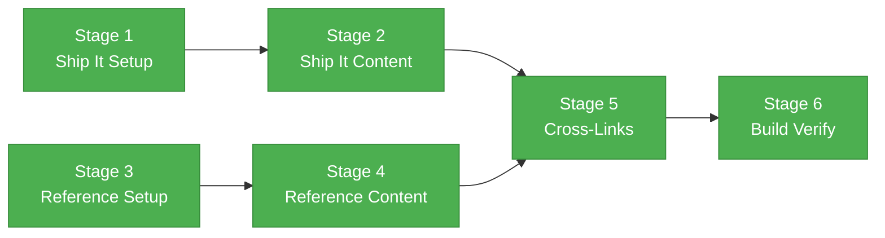

# Phase 2D Flight Plan — Ship It & Reference Content

## What This Phase Does

Adds the final two sidebar categories to the Docusaurus site: **Ship It** (DORA/ESSP-framed conceptual education about deployment feedback loops, with honest gap acknowledgment) and **Reference** (artifact catalog, frontmatter schemas, and contributing guide). After this phase, all five sidebar sections are complete with bidirectional cross-links.

## Flight Status



## Stages

### Stage 1: Ship It Category Setup

- [x] **T001** — Create `ship-it/_category_.json` (position 4, label "Ship It")

### Stage 2: Ship It Content

- [x] **T002** — `ship-it/overview.md` — DORA/ESSP framing, empathy moment, honest coverage gaps
- [x] **T003** — `ship-it/incident-response.md` — 4-phase model, prompt walkthrough, RCA→backlog loop
- [x] **T004** — `ship-it/infrastructure-as-code.md` — "writes IaC ≠ deploys IaC" distinction
- [x] **T005** — `ship-it/whats-coming.md` — Roadmap diagram, contribution CTA, research table

### Stage 3: Reference Category Setup

- [x] **T006** — Create `reference/_category_.json` (position 5, label "Reference")

### Stage 4: Reference Content

- [x] **T007** — `reference/artifact-types.md` — 4-layer model, comparison table, decision guide
- [x] **T008** — `reference/frontmatter-schema.md` — Per-type schema tables, platform support matrix
- [x] **T009** — `reference/contributing-to-docs.md` — Page creation workflow, syntax guide
- [x] **T010** — `reference/all-artifacts.md` — 75-artifact catalog with value tags (🟢/🟡/⚪/🔴)

### Stage 5: Cross-Linking & TODOs

- [x] **T011** — Resolve Ship It TODOs in `intro.md` and `quick-start.md`, add Reference links, wire coding-standards cross-refs

### Stage 6: Build Verification

- [x] **T012** — `npm run build` zero errors, 8 new pages HTTP 200, cross-links verified

## Before / After

```
BEFORE (Phase 2C)                 AFTER (Phase 2D)
─────────────────                 ─────────────────
📖 Introduction                   📖 Introduction
📂 Getting Started (5 pages)      📂 Getting Started (5 pages)
📂 Shape the Work  (4 pages)      📂 Shape the Work  (4 pages)
📂 Build the Work  (6 pages)      📂 Build the Work  (6 pages)
                                  📂 Ship It         (4 pages)  ← NEW
                                  📂 Reference       (4 pages)  ← NEW

Pages: 16 → 24  |  Categories: 3 → 5
```
