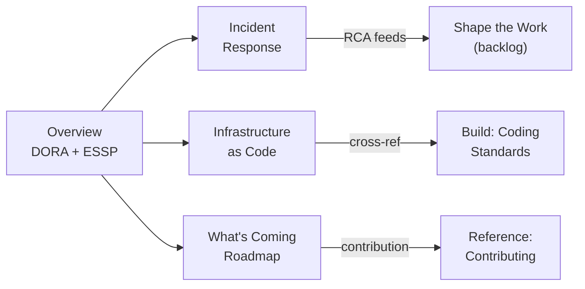
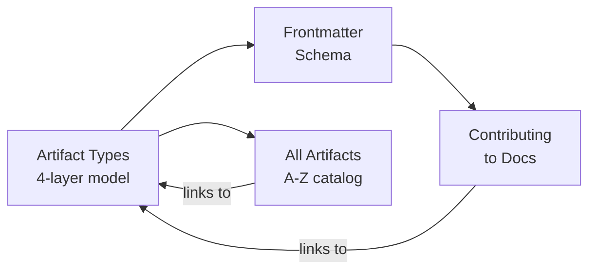

# Phase 2D: Content — Ship It & Reference – Tasks & Alignment Brief

**Spec**: [docusaurus-site-spec.md](../../docusaurus-site-spec.md)
**Plan**: [docusaurus-site-plan.md](../../docusaurus-site-plan.md)
**Workshop**: [ship-it-and-reference-sections.md](../../workshops/ship-it-and-reference-sections.md)
**Date**: 2026-02-18

---

## Executive Briefing

### Purpose

This phase completes the site's content by adding the final two sidebar categories: **Ship It** (the honest-about-gaps deployment and feedback segment) and **Reference** (the lookup section with artifact catalog, frontmatter schemas, and contributing guide). After this phase, all four delivery-aligned segments plus the reference section are in place.

### What We're Building

Eight documentation pages across two new categories:

- **Ship It** (4 pages): DORA/ESSP-framed conceptual education about closing the feedback loop, incident response walkthrough, IaC distinction page, and an honest "What's Coming" roadmap with contribution call-to-action
- **Reference** (4 pages): The 4-layer artifact type guide, complete frontmatter schema reference, documentation contributing guide, and the full 74-artifact A-Z catalog

### User Value

Users gain a complete site that covers the entire Software Value Delivery lifecycle end-to-end. Ship It teaches *why* feedback loops matter (even with thin tooling). Reference lets users look up any artifact, understand the frontmatter contract, and learn how to contribute.

### Example

A platform engineer searching for "incident response" finds the Ship It section, understands the DORA framing, works through the prompt walkthrough, and discovers the contribution opportunities on the What's Coming page. A new contributor reads the artifact types page, checks the frontmatter schema, and uses the contributing guide to submit a new prompt.

---

## Objectives & Scope

### Objective

Create the "Ship It" segment (honest about gaps, concept-led) and the "Reference" catalog section per plan acceptance criteria P2D-AC1 through P2D-AC5.

### Goals

- ✅ Create `ship-it/` category with 4 ordered pages (overview, incident-response, infrastructure-as-code, whats-coming)
- ✅ Create `reference/` category with 4 ordered pages (artifact-types, frontmatter-schema, contributing-to-docs, all-artifacts)
- ✅ Ship It leads with DORA/ESSP concepts, not tooling showcase
- ✅ Ship It honestly acknowledges gaps with "What's Coming" page and contribution path
- ✅ Reference All Artifacts page catalogs all 74 artifacts with name, type, description, segment, value tag
- ✅ Resolve remaining forward-link TODOs from intro.md and quick-start.md
- ✅ Cross-links to all 3 delivery segments work bidirectionally
- ✅ Build succeeds with zero errors

### Non-Goals

- ❌ Custom React components for filtering the artifact catalog (spec explicitly excludes)
- ❌ Generated/dynamic artifact catalog (manual markdown tables per workshop decision)
- ❌ Self-referential proof page ("How We Built This Site") — deferred per user decision
- ❌ "Was this page helpful?" feedback component (deferred to future enhancement)
- ❌ Design Decisions transparency page (could be future Reference addition)
- ❌ Dark mode Mermaid verification (known debt from Phase 1, not this phase's scope)

---

## Pre-Implementation Audit

### Summary

| File | Action | Origin | Modified By | Recommendation |
|------|--------|--------|-------------|----------------|
| `docs/docusaurus/docs/ship-it/_category_.json` | Create | New | — | keep-as-is |
| `docs/docusaurus/docs/ship-it/overview.md` | Create | New | — | keep-as-is |
| `docs/docusaurus/docs/ship-it/incident-response.md` | Create | New | — | keep-as-is |
| `docs/docusaurus/docs/ship-it/infrastructure-as-code.md` | Create | New | — | keep-as-is |
| `docs/docusaurus/docs/ship-it/whats-coming.md` | Create | New | — | keep-as-is |
| `docs/docusaurus/docs/reference/_category_.json` | Create | New | — | keep-as-is |
| `docs/docusaurus/docs/reference/artifact-types.md` | Create | New | — | keep-as-is |
| `docs/docusaurus/docs/reference/frontmatter-schema.md` | Create | New | — | keep-as-is |
| `docs/docusaurus/docs/reference/contributing-to-docs.md` | Create | New | — | keep-as-is |
| `docs/docusaurus/docs/reference/all-artifacts.md` | Create | New | — | keep-as-is |
| `docs/docusaurus/docs/intro.md` | Modify | Phase 2 | Phase 2C | keep-as-is |
| `docs/docusaurus/docs/getting-started/quick-start.md` | Modify | Phase 2 | Phase 2C | keep-as-is |

### Compliance Check

No violations found. All new files follow established patterns from Phases 2–2C.

---

## Requirements Traceability

### Coverage Matrix

| AC | Description | Flow Summary | Files in Flow | Tasks | Status |
|----|-------------|-------------|---------------|-------|--------|
| P2D-AC1 | `ship-it/` category visible with 4 ordered pages | _category_.json + 4 .md files | 5 | T001,T002,T003,T004,T005 | ✅ Complete |
| P2D-AC2 | `reference/` category visible with 4 ordered pages | _category_.json + 4 .md files | 5 | T006,T007,T008,T009,T010 | ✅ Complete |
| P2D-AC3 | Ship It acknowledges gaps with "What's Coming" page | whats-coming.md | 1 | T005 | ✅ Complete |
| P2D-AC4 | Reference catalog covers all artifacts with value tags | all-artifacts.md | 1 | T010 | ✅ Complete |
| P2D-AC5 | Cross-links to other segments work | intro.md, quick-start.md, all new pages | 12 | T011 | ✅ Complete |

### Gaps Found

No gaps — all acceptance criteria have complete file coverage.

### Orphan Files

None — all files map to at least one AC.

---

## Architecture Map

### Component Diagram

```mermaid
flowchart TD
    classDef pending fill:#9E9E9E,stroke:#757575,color:#fff
    classDef inprogress fill:#FF9800,stroke:#F57C00,color:#fff
    classDef completed fill:#4CAF50,stroke:#388E3C,color:#fff
    classDef blocked fill:#F44336,stroke:#D32F2F,color:#fff

    style ShipIt fill:#F5F5F5,stroke:#E0E0E0
    style Reference fill:#F5F5F5,stroke:#E0E0E0
    style CrossLinks fill:#F5F5F5,stroke:#E0E0E0
    style Build fill:#F5F5F5,stroke:#E0E0E0

    subgraph ShipIt["Ship It (position 4)"]
        T001["T001: Ship It category ✓"]:::completed
        T002["T002: Ship It overview ✓"]:::completed
        T003["T003: Incident response ✓"]:::completed
        T004["T004: IaC page ✓"]:::completed
        T005["T005: What's Coming ✓"]:::completed

        T001 --> T002 --> T003
        T001 --> T004
        T001 --> T005
    end

    subgraph Reference["Reference (position 5)"]
        T006["T006: Reference category ✓"]:::completed
        T007["T007: Artifact types ✓"]:::completed
        T008["T008: Frontmatter schema ✓"]:::completed
        T009["T009: Contributing ✓"]:::completed
        T010["T010: All artifacts A-Z ✓"]:::completed

        T006 --> T007 --> T008
        T006 --> T009
        T006 --> T010
    end

    subgraph CrossLinks["Cross-Linking"]
        T011["T011: Resolve TODOs + links ✓"]:::completed
    end

    subgraph Build["Build Verification"]
        T012["T012: Build + verify ✓"]:::completed
    end

    T005 --> T011
    T010 --> T011
    T011 --> T012

    F1["ship-it/_category_.json ✓"]:::completed
    F2["ship-it/overview.md ✓"]:::completed
    F3["ship-it/incident-response.md ✓"]:::completed
    F4["ship-it/infrastructure-as-code.md ✓"]:::completed
    F5["ship-it/whats-coming.md ✓"]:::completed
    F6["reference/_category_.json ✓"]:::completed
    F7["reference/artifact-types.md ✓"]:::completed
    F8["reference/frontmatter-schema.md ✓"]:::completed
    F9["reference/contributing-to-docs.md ✓"]:::completed
    F10["reference/all-artifacts.md ✓"]:::completed
    F11["intro.md ✓"]:::completed
    F12["quick-start.md ✓"]:::completed

    T001 -.-> F1
    T002 -.-> F2
    T003 -.-> F3
    T004 -.-> F4
    T005 -.-> F5
    T006 -.-> F6
    T007 -.-> F7
    T008 -.-> F8
    T009 -.-> F9
    T010 -.-> F10
    T011 -.-> F11
    T011 -.-> F12
```

<!-- Status: grey=pending, orange=in-progress, green=completed, red=blocked -->
<!-- Updated by plan-6 during implementation -->



### Task-to-Component Mapping

<!-- Status: ⬜ Pending | 🟧 In Progress | ✅ Complete | 🔴 Blocked -->

| Task | Component(s) | Files | Status | Comment |
|------|-------------|-------|--------|---------|
| T001 | Ship It category | `ship-it/_category_.json` | ✅ Complete | Position 4, label "Ship It" |
| T002 | Ship It overview | `ship-it/overview.md` | ✅ Complete | DORA/ESSP framing, empathy moment, honest coverage, empathy moment |
| T003 | Incident response | `ship-it/incident-response.md` | ✅ Complete | 4-phase incident model, prompt walkthrough, feedback loop |
| T004 | IaC page | `ship-it/infrastructure-as-code.md` | ✅ Complete | Writes IaC ≠ deploys IaC distinction |
| T005 | What's Coming | `ship-it/whats-coming.md` | ✅ Complete | Honest roadmap, contribution CTA, research opportunities |
| T006 | Reference category | `reference/_category_.json` | ✅ Complete | Position 5, label "Reference" |
| T007 | Artifact types | `reference/artifact-types.md` | ✅ Complete | 4-layer model, comparison table, decision guide |
| T008 | Frontmatter schema | `reference/frontmatter-schema.md` | ✅ Complete | Per-type field tables, platform support matrix |
| T009 | Contributing guide | `reference/contributing-to-docs.md` | ✅ Complete | Page creation, syntax guide, conventions |
| T010 | All Artifacts A-Z | `reference/all-artifacts.md` | ✅ Complete | 75-artifact catalog with value tags |
| T011 | Cross-linking | `intro.md`, `quick-start.md` | ✅ Complete | All Ship It TODOs resolved, Path D fixed, coding-standards forward link |
| T012 | Build verification | All files | ✅ Complete | Build zero errors, 8 pages HTTP 200 |

---

## Tasks

| Status | ID | Task | CS | Type | Dependencies | Absolute Path(s) | Validation | Subtasks | Notes |
|--------|------|------|-----|------|-------------|-------------------|------------|----------|-------|
| [x] | T001 | Create `ship-it/_category_.json` (position: 4, label: "Ship It") | 1 | Setup | – | `/Users/jordanknight/repos/hve-core/docs/docusaurus/docs/ship-it/_category_.json` | Category appears in sidebar at position 4 | – | Plan 2D.1 |
| [x] | T002 | Create `ship-it/overview.md` (sidebar_position: 1) — DORA/ESSP framing. Empathy moment opening ("You shipped on Friday..."). Ship→Learn→Shape loop diagram. Honest coverage assessment with :::note/:::info callouts. Cross-links to incident-response, whats-coming, and back to shape-the-work | 2 | Core | T001 | `/Users/jordanknight/repos/hve-core/docs/docusaurus/docs/ship-it/overview.md` | Educational framing present, empathy moment, honest gaps acknowledged | – | Plan 2D.2. Design thinking suggestion #2 applied |
| [x] | T003 | Create `ship-it/incident-response.md` (sidebar_position: 2) — 4-phase incident model (Triage→Diagnose→Mitigate→RCA). Prompt invocation example. Risk register as preventive complement. Feedback loop from RCA to backlog management | 2 | Core | T001 | `/Users/jordanknight/repos/hve-core/docs/docusaurus/docs/ship-it/incident-response.md` | Prompt walkthrough present, feedback loop to Shape explained | – | Plan 2D.3 |
| [x] | T004 | Create `ship-it/infrastructure-as-code.md` (sidebar_position: 3) — Clear "writes IaC ≠ deploys IaC" distinction. Bicep + Terraform convention summaries. Auto-applied instruction mechanism. IaC→Deploy gap acknowledgment | 1 | Core | T001 | `/Users/jordanknight/repos/hve-core/docs/docusaurus/docs/ship-it/infrastructure-as-code.md` | Distinction clear, links to coding-standards | – | Plan 2D.4 |
| [x] | T005 | Create `ship-it/whats-coming.md` (sidebar_position: 4) — Aspirational roadmap diagram (Today/Near-Term/Future). Contribution CTA with specific guidance linking BOTH repo CONTRIBUTING.md AND docs contributing page. Research opportunities table. Per-item contribution path, not just generic "edit this page" | 2 | Core | T001 | `/Users/jordanknight/repos/hve-core/docs/docusaurus/docs/ship-it/whats-coming.md` | Roadmap present, contribution path clear, research table included | – | Plan 2D.5. DYK#5: dual contributing links (repo + docs) |
| [x] | T006 | Create `reference/_category_.json` (position: 5, label: "Reference") | 1 | Setup | – | `/Users/jordanknight/repos/hve-core/docs/docusaurus/docs/reference/_category_.json` | Category appears in sidebar at position 5 | – | Plan 2D.6 |
| [x] | T007 | Create `reference/artifact-types.md` (sidebar_position: 1) — 4-layer model diagram (Agents, Prompts, Instructions, Skills). Comparison table (extension, activation, interaction, state, tools, handoffs, input variables, required frontmatter). Decision guide. Common patterns with real artifact examples | 2 | Core | T006 | `/Users/jordanknight/repos/hve-core/docs/docusaurus/docs/reference/artifact-types.md` | All 4 types documented with examples and comparison table | – | Plan 2D.7 |
| [x] | T008 | Create `reference/frontmatter-schema.md` (sidebar_position: 2) — Skip architecture framing (DYK#3: don't triple-explain the 4-layer model). Open directly with per-type schema tables. One-line reference to artifact-types page. Platform support matrix (VS Code Chat, Copilot CLI, Coding Agent, Claude Code). Input variable syntax reference. Validation section | 2 | Core | T006 | `/Users/jordanknight/repos/hve-core/docs/docusaurus/docs/reference/frontmatter-schema.md` | Tables render correctly, platform matrix present, validation documented | – | Plan 2D.8. DYK#3: skip framing, open with tables. Source: frontmatter-reference.md from plan 001 |
| [x] | T009 | Create `reference/contributing-to-docs.md` (sidebar_position: 3) — How to write Docusaurus pages. Frontmatter requirements. Admonition syntax reference. Internal link conventions. Category structure. Reference to docusaurus-edits instructions file | 1 | Core | T006 | `/Users/jordanknight/repos/hve-core/docs/docusaurus/docs/reference/contributing-to-docs.md` | Contribution workflow clear, syntax examples present | – | Plan 2D.9 |
| [x] | T010 | Create `reference/all-artifacts.md` (sidebar_position: 4) — Complete catalog: Agents table (22 rows), Prompts table (27 rows), Instructions table (25 rows incl. docusaurus-edits, with applyTo column), Skills table (1 row). Use "more than 70" in prose (DYK#1), exact counts in tables only. Summary counts by type and segment. Value tags (🟢/🟡/⚪/🔴) | 3 | Core | T006 | `/Users/jordanknight/repos/hve-core/docs/docusaurus/docs/reference/all-artifacts.md` | Catalog complete with all 75 artifacts, value tags present, summary counts accurate | – | Plan 2D.10. DYK#1: 75 not 74, approximate in prose. Source: value-delivery-segments.md |
| [x] | T011 | Resolve forward-link TODOs: (1) intro.md line 64 Ship It TODO → real link. (2) quick-start.md line 99 Ship It TODO → real link + update plain text to link. (3) Fix quick-start Path D "coming soon" → real Reference link (DYK#2). (4) Add one-line forward link from coding-standards IaC rows to ship-it/infrastructure-as-code (DYK#4). (5) Add Reference links where appropriate | 1 | Integration | T005, T010 | `/Users/jordanknight/repos/hve-core/docs/docusaurus/docs/intro.md`, `/Users/jordanknight/repos/hve-core/docs/docusaurus/docs/getting-started/quick-start.md`, `/Users/jordanknight/repos/hve-core/docs/docusaurus/docs/build-the-work/coding-standards.md` | All Ship It TODOs resolved to real links, no broken links, Path D updated | – | DYK#2: Path D stale. DYK#4: coding-standards forward link |
| [x] | T012 | Build verification: `npm run build` in docs/docusaurus/. Verify all 8 new pages render via dev server (HTTP 200). Spot-check cross-links, Mermaid diagrams, tables | 1 | Validation | T011 | `/Users/jordanknight/repos/hve-core/docs/docusaurus/` | Build zero errors, 8 pages HTTP 200, cross-links work | – | |

---

## Alignment Brief

### Prior Phases Review

**Phase 1 (Scaffold)**: Docusaurus 3.9.2 at `docs/docusaurus/` with Mermaid theme, blog disabled, `baseUrl: '/hve-core/'`. Justfile recipes. `onBrokenLinks: 'throw'` established the forward-link constraint. Key gotcha: multi-edit on JS config can drop braces — always verify with `npm start`.

**Phase 2 (Getting Started)**: 5 pages + instructions file. Patterns established: frontmatter triple (`title`/`description`/`sidebar_position`), `_category_.json` template, JTBD decision tree, educational tone. Key gotcha: instructions file should be created early to guide authoring. DYK insight: removed forward-link instructions, added TODO comment pattern.

**Phase 2B (Shape the Work)**: 4 pages. Patterns: empathy moment openings, concept/reference split with `<details>`, bidirectional cross-links within phase. Key insight: overview page overloaded → split problem framing to requirements page. Instructions file updated with 4 new conventions (page length, progressive disclosure, keywords, cross-linking).

**Phase 2C (Build the Work)**: 6 pages including RPI crown jewel. Patterns: walkthrough with real prompts, artifact bus diagram, decision matrices. Key insight: RPI workflow too long → split conceptual model from practice walkthrough. Resolved all 5 forward-link TODOs. Added Ship It TODO to intro.md for this phase to resolve.

### Cumulative Deliverables

- **15 content pages** across 3 categories + intro.md hero
- **3 `_category_.json`** configs (Getting Started, Shape the Work, Build the Work)
- **1 instructions file** with 16 conventions
- **Sidebar**: autogenerated from `_category_.json` + `sidebar_position`
- **Cross-link network**: Getting Started ↔ Shape ↔ Build (all bidirectional)

### Dependencies for This Phase

From prior phases:
- Workshop designs for all 8 pages in `workshops/ship-it-and-reference-sections.md`
- Artifact value assessment data in `workshops/value-delivery-segments.md`
- Frontmatter reference schemas in `docs/plans/001-hve-flow-mapping/frontmatter-reference.md`
- All prior category pages available for cross-linking
- Instructions file auto-applies to all new content

### Critical Findings Affecting This Phase

No critical research findings apply — this is a content-only phase using established patterns.

### Content Strategy Differences by Section

| Section | Strategy | Reason |
|---------|----------|--------|
| Ship It | **Conceptual education** — DORA/ESSP teach why feedback loops matter | 8 artifacts, mostly secondary; concepts carry the weight |
| Reference | **Lookup utility** — scannable tables, precise schemas, comprehensive catalog | Users come with a specific question, not to learn |

### Inputs to Read

1. `workshops/ship-it-and-reference-sections.md` — complete page designs with diagrams, sample content, cross-links
2. `workshops/value-delivery-segments.md` — artifact value assessment (full 74-artifact inventory with tags)
3. `docs/plans/001-hve-flow-mapping/frontmatter-reference.md` — schema source for frontmatter-schema.md page
4. Existing pages for cross-link targets: `intro.md`, `quick-start.md`, `build-the-work/coding-standards.md`

### Visual Alignment Aids

**Ship It page flow**:



**Reference page flow**:



### Test Plan

**Approach**: Manual validation (per plan testing philosophy)

1. `npm run build` succeeds with zero errors (catches broken links, missing frontmatter)
2. Dev server verification: all 8 new pages return HTTP 200
3. Spot-check: Mermaid diagrams render, tables display correctly, cross-links navigate properly
4. Verify intro.md and quick-start.md Ship It TODOs resolved to working links

### Implementation Outline

1. **T001**: Create ship-it category JSON — copy pattern from prior phases
2. **T002**: Write Ship It overview — adapt workshop page design, apply empathy moment
3. **T003**: Write incident response — adapt 4-phase model from workshop, include prompt walkthrough
4. **T004**: Write IaC page — focus on "writes ≠ deploys" distinction from workshop
5. **T005**: Write What's Coming — adapt roadmap diagram, contribution CTA from workshop
6. **T006**: Create reference category JSON
7. **T007**: Write artifact types — adapt 4-layer model from workshop, include comparison table
8. **T008**: Write frontmatter schema — source from plan 001 frontmatter-reference.md + workshop
9. **T009**: Write contributing guide — adapt from workshop, reference instructions file
10. **T010**: Write All Artifacts A-Z — source from value-delivery-segments.md artifact tables
11. **T011**: Resolve all forward-link TODOs and add cross-links
12. **T012**: Build verify + HTTP 200 check

### Commands to Run

```bash
# Build
cd /Users/jordanknight/repos/hve-core/docs/docusaurus && npm run build

# Dev server
cd /Users/jordanknight/repos/hve-core/docs/docusaurus && npm start
# Then check: http://localhost:3000/hve-core/ship-it/overview
#              http://localhost:3000/hve-core/reference/artifact-types
```

### Risks & Unknowns

| Risk | Severity | Mitigation |
|------|----------|------------|
| All Artifacts A-Z catalog might have inaccurate counts | Medium | Cross-reference against value-delivery-segments.md inventory |
| Platform support matrix might be stale | Low | Verify against current prompt-builder.instructions.md |
| Ship It empathy moment tone could feel forced | Low | Test with natural read-through; adjust if contrived |

### Ready Check

- [ ] Workshop source material read and understood
- [ ] All prior phase cross-links verified (no broken links before starting)
- [ ] Artifact inventory data located in value-delivery-segments.md
- [ ] Frontmatter reference source located in plan 001

---

## Phase Footnote Stubs

_Populated during implementation by plan-6._

| Footnote | Phase | Summary |
|----------|-------|---------|
| | | |

---

## Evidence Artifacts

Implementation will produce:
- `execution.log.md` — per-task implementation log in this directory
- Build output confirming zero errors
- Dev server HTTP 200 verification for all 8 new pages

---

## Discoveries & Learnings

_Populated during implementation by plan-6. Log anything of interest to your future self._

| Date | Task | Type | Discovery | Resolution | References |
|------|------|------|-----------|------------|------------|
| 2026-02-18 | T010 | insight | Artifact count is 75 not 74 — docusaurus-edits.instructions.md added in Phase 2 | Used 75 in tables, approximate "more than 70" in prose | DYK#1, log#task-t010 |
| 2026-02-18 | T011 | debt | quick-start.md had stale "coming soon" text and outdated :::note about progressive build | Fixed both: real links, removed stale note | DYK#2, log#task-t011 |
| 2026-02-18 | T008 | decision | Frontmatter schema page risks triple-explaining 4-layer architecture | Skipped framing, opened directly with tables per DYK#3 | DYK#3, log#task-t008 |
| 2026-02-18 | T011 | insight | coding-standards.md listed IaC in table but had no forward link to Ship It | Added one-line forward link to ship-it/infrastructure-as-code | DYK#4, log#task-t011 |
| 2026-02-18 | T005 | decision | What's Coming CTA needs both repo CONTRIBUTING.md and docs contributing page | Linked to both: repo-level for artifacts, docs-level for site content | DYK#5, log#task-t005 |
| 2026-02-18 | T012 | insight | `docusaurus serve` uses baseUrl routing that makes curl checks 404; dev server handles it correctly | Use `docusaurus start` for HTTP 200 verification, not `docusaurus serve` with curl | log#task-t012 |

**Types**: `gotcha` | `research-needed` | `unexpected-behavior` | `workaround` | `decision` | `debt` | `insight`

**What to log**:
- Things that didn't work as expected
- External research that was required
- Implementation troubles and how they were resolved
- Gotchas and edge cases discovered
- Decisions made during implementation
- Technical debt introduced (and why)
- Insights that future phases should know about

_See also: `execution.log.md` for detailed narrative._

---

## Directory Layout

```
docs/plans/002-docusaurus-site/
  ├── docusaurus-site-plan.md
  └── tasks/phase-2d-content-ship-it-and-reference/
      ├── tasks.md                 # This file
      ├── tasks.fltplan.md         # Generated by /plan-5b (Flight Plan summary)
      └── execution.log.md        # Created by /plan-6
```
