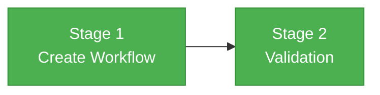

# Phase 3 Flight Plan — GitHub Actions Deploy Workflow

## What This Phase Does

Creates the GitHub Actions workflow that automatically builds and deploys the Docusaurus site to GitHub Pages when documentation changes merge to main. A single workflow file with two jobs (build + deploy), all actions SHA-pinned per repo security conventions.

## Flight Status



## Stages

### Stage 1: Create Workflow

- [x] **T001** — Create `.github/workflows/deploy-docs.yml` with build + deploy jobs, SHA-pinned actions, path filter, permissions, concurrency

### Stage 2: Validation

- [x] **T002** — Validate YAML syntax, SHA pinning compliance, no forbidden tag-only refs

## Before / After

```
BEFORE (Phase 2D)                 AFTER (Phase 3)
─────────────────                 ─────────────────
25 workflow files                 26 workflow files
No docs deployment                deploy-docs.yml triggers on
                                  docs/docusaurus/** changes
                                  → builds + deploys to Pages
```
