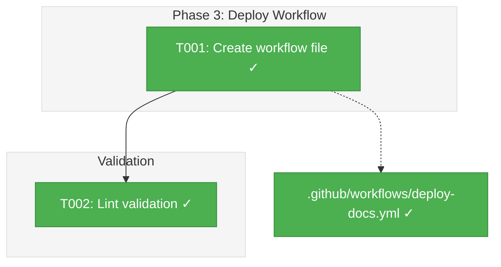
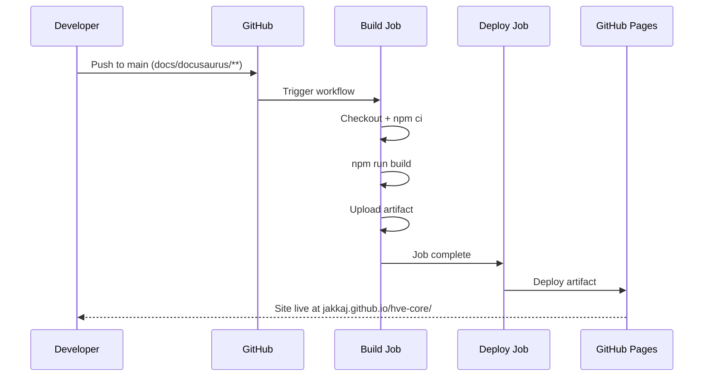

# Phase 3: GitHub Actions Deploy Workflow — Tasks & Alignment Brief

**Spec**: [docusaurus-site-spec.md](../../docusaurus-site-spec.md)
**Plan**: [docusaurus-site-plan.md](../../docusaurus-site-plan.md)
**Date**: 2026-02-18

---

## Executive Briefing

### Purpose

This phase creates the GitHub Actions workflow that builds and deploys the Docusaurus site to GitHub Pages automatically when docs content changes on the main branch. This is the bridge between "content exists locally" and "content is published to the web."

### What We're Building

A single workflow file (`.github/workflows/deploy-docs.yml`) with two jobs:
- **Build**: Checks out, installs, builds the Docusaurus site, and uploads the artifact
- **Deploy**: Takes the build artifact and deploys it to GitHub Pages

### User Value

Documentation site is automatically published when content changes merge to main. No manual deployment steps required. The workflow is isolated from other CI pipelines via path filtering.

### Example

**Trigger**: PR merges to `main` that touches any file under `docs/docusaurus/**`
**Result**: Site deploys to `https://jakkaj.github.io/hve-core/` within minutes

---

## Objectives & Scope

### Objective

Create a GitHub Actions workflow that deploys the Docusaurus site to GitHub Pages per spec AC6 and plan Phase 3 acceptance criteria.

### Goals

- ✅ Create `.github/workflows/deploy-docs.yml`
- ✅ All actions SHA-pinned with version comments per repo conventions
- ✅ Path-filtered trigger on `docs/docusaurus/**` + `workflow_dispatch`
- ✅ Explicit least-privilege permissions at workflow and job levels
- ✅ Concurrency group prevents duplicate deployments
- ✅ Build job uses `docs/docusaurus/` working directory
- ✅ Deploy job uses `github-pages` environment
- ✅ `persist-credentials: false` on checkout

### Non-Goals

- ❌ Enabling GitHub Pages in repo settings (manual step, documented)
- ❌ Custom domain configuration
- ❌ Preview deployments for PRs
- ❌ Build caching beyond npm ci
- ❌ Notifications on deploy success/failure

---

## Pre-Implementation Audit

### Summary

| File | Action | Origin | Modified By | Recommendation |
|------|--------|--------|-------------|----------------|
| `.github/workflows/deploy-docs.yml` | Create | New | — | keep-as-is |

### Compliance Check

Checked against `workflows.instructions.md`:
- SHA pinning required: ✅ All 5 actions will be SHA-pinned
- `ubuntu-latest` runners: ✅
- Explicit permissions: ✅ Workflow-level + job-level
- `persist-credentials: false`: ✅
- Concurrency group: ✅
- No violations found

---

## Requirements Traceability

### Coverage Matrix

| AC | Description | Flow Summary | Files in Flow | Tasks | Status |
|----|-------------|-------------|---------------|-------|--------|
| P3-AC1 | Workflow file exists at `.github/workflows/deploy-docs.yml` | Single file creation | 1 | T001 | ✅ Complete |
| P3-AC2 | All actions SHA-pinned with version comments | 5 action references in workflow | 1 | T001 | ✅ Complete |
| P3-AC3 | Triggers on `docs/docusaurus/**` + manual dispatch | `on:` block in workflow | 1 | T001 | ✅ Complete |
| P3-AC4 | Build job runs in `docs/docusaurus/` | `defaults.run.working-directory` | 1 | T001 | ✅ Complete |
| P3-AC5 | Deploy job uses `github-pages` environment | `environment:` in deploy job | 1 | T001 | ✅ Complete |

### Gaps Found

No gaps — single file covers all acceptance criteria.

---

## Architecture Map

### Component Diagram



### Task-to-Component Mapping

| Task | Component(s) | Files | Status | Comment |
|------|-------------|-------|--------|---------|
| T001 | Deploy workflow | `.github/workflows/deploy-docs.yml` | ✅ Complete | Build + deploy jobs with SHA-pinned actions |
| T002 | Lint validation | `.github/workflows/deploy-docs.yml` | ✅ Complete | YAML valid, all SHA pins verified, structural checks pass |

---

## Tasks

| Status | ID | Task | CS | Type | Dependencies | Absolute Path(s) | Validation | Subtasks | Notes |
|--------|------|------|-----|------|-------------|-------------------|------------|----------|-------|
| [x] | T001 | Create `.github/workflows/deploy-docs.yml` with: (1) `on: push` to `main` AND `jordo-explore` (temporary for testing, remove before merge) with `paths: ['docs/docusaurus/**', '.github/workflows/deploy-docs.yml']` (DYK#2: include workflow file itself) + `workflow_dispatch`. (2) Prerequisite comment at top documenting Pages must be set to "GitHub Actions" source (DYK#5). (3) Workflow-level `permissions: contents: read`. (4) Concurrency group. (5) Build job: checkout (persist-credentials: false), setup-node (20), npm ci, npm run build, configure-pages, upload-pages-artifact. (6) Deploy job: needs build, deploy-pages with github-pages environment. All actions SHA-pinned per verified SHAs below | 2 | Core | – | `/Users/jordanknight/repos/hve-core/.github/workflows/deploy-docs.yml` | File exists, YAML valid, all 5 actions SHA-pinned, path filter present, permissions explicit | – | Plan 3.1 + 3.2 + 3.3 combined. DYK#1: temp branch. DYK#2: self-trigger. DYK#5: prereq comment |
| [x] | T002 | Validate workflow: verify YAML syntax is valid, verify SHA pinning passes `Test-DependencyPinning.ps1` pattern (or manual grep), verify no forbidden patterns (tag-only refs) | 1 | Validation | T001 | `/Users/jordanknight/repos/hve-core/.github/workflows/deploy-docs.yml` | No YAML errors, all refs use full SHA | – | |

---

## Alignment Brief

### Prior Phases Review

**Phase 1**: Scaffolded Docusaurus at `docs/docusaurus/`. `npm run build` produces `docs/docusaurus/build/` directory. `npm ci` installs from `package-lock.json`. `baseUrl: '/hve-core/'` configured.

**Phase 2–2D**: Content complete (24 pages across 5 categories). Build verified zero errors after every phase. No workflow-related changes.

### SHA Pins (Verified from GitHub)

These SHAs were looked up directly from GitHub on 2026-02-18:

| Action | SHA | Version | Source |
|--------|-----|---------|--------|
| `actions/checkout` | `de0fac2e4500dabe0009e67214ff5f5447ce83dd` | v4.2.2 | Existing repo pin |
| `actions/setup-node` | `6044e13b5dc448c55e2357c09f80417699197238` | v4.1.0 | Existing repo pin |
| `actions/configure-pages` | `983d7736d9b0ae728b81ab479565c72886d7745b` | v5.0.0 | GitHub API lookup |
| `actions/upload-pages-artifact` | `56afc609e74202658d3ffba0e8f6dda462b719fa` | v3.0.1 | GitHub API lookup |
| `actions/deploy-pages` | `d6db90164ac5ed86f2b6aed7e0febac5b3c0c03e` | v4.0.5 | GitHub API lookup |

### Workflow Structure

```yaml
name: Deploy Docs

on:
  push:
    branches: [main]
    paths: ['docs/docusaurus/**']
  workflow_dispatch:

permissions:
  contents: read

concurrency:
  group: ${{ github.workflow }}-${{ github.ref }}
  cancel-in-progress: false

jobs:
  build:
    name: Build Docusaurus
    runs-on: ubuntu-latest
    permissions:
      contents: read
    steps:
      - Checkout (persist-credentials: false)
      - Setup Node 20
      - npm ci (working-directory: docs/docusaurus)
      - npm run build (working-directory: docs/docusaurus)
      - Configure Pages
      - Upload Pages artifact (path: docs/docusaurus/build)

  deploy:
    name: Deploy to GitHub Pages
    needs: build
    runs-on: ubuntu-latest
    permissions:
      pages: write
      id-token: write
    environment:
      name: github-pages
      url: ${{ steps.deployment.outputs.page_url }}
    steps:
      - Deploy Pages (id: deployment)
```

### Visual Alignment



### Test Plan

**Approach**: Manual validation

1. YAML syntax: verified by reading the file structure
2. SHA pinning: grep for `@` patterns, verify all use 40-char hex
3. No forbidden patterns: grep for tag-only refs like `@v4`
4. Structural correctness: verify against plan Workflow Requirements section

### Implementation Outline

1. **T001**: Write the complete workflow YAML file with all SHA pins and configuration
2. **T002**: Validate YAML structure, SHA pinning, and compliance

### Commands to Run

```bash
# Validate YAML syntax
cat .github/workflows/deploy-docs.yml | python3 -c "import yaml,sys; yaml.safe_load(sys.stdin); print('YAML valid')"

# Check SHA pinning (no tag-only refs)
grep -n 'uses:' .github/workflows/deploy-docs.yml | grep -v '@[a-f0-9]\{40\}'
# Should return empty (no violations)
```

### Risks & Unknowns

| Risk | Severity | Mitigation |
|------|----------|------------|
| GitHub Pages not enabled in repo settings | High (blocking deploy) | Workflow builds correctly regardless; deploy job fails gracefully. Document enablement as manual step |
| SHA pins become stale over time | Low | `Test-SHAStaleness.ps1` catches this in CI |

### Ready Check

- [x] SHA pins verified from GitHub API (not copied from research dossier)
- [x] Workflow conventions reviewed from `workflows.instructions.md`
- [x] Existing workflow patterns reviewed for consistency
- [x] Plan Workflow Requirements section reviewed
- [ ] ADR constraints mapped to tasks — N/A (no ADRs)

---

## Phase Footnote Stubs

_Populated during implementation by plan-6._

| Footnote | Phase | Summary |
|----------|-------|---------|
| | | |

---

## Evidence Artifacts

Implementation will produce:
- `execution.log.md` — per-task implementation log in this directory
- YAML validation output confirming syntax correctness
- SHA pinning grep output confirming compliance

---

## Discoveries & Learnings

_Populated during implementation by plan-6. Log anything of interest to your future self._

| Date | Task | Type | Discovery | Resolution | References |
|------|------|------|-----------|------------|------------|
| 2026-02-18 | T001 | decision | npm cache needs `cache-dependency-path` when package.json is in subdirectory | Added `cache-dependency-path: docs/docusaurus/package-lock.json` to setup-node step | log#task-t001 |
| 2026-02-18 | T001 | debt | `jordo-explore` branch in trigger list is temporary — must remove before merge to upstream | Comment in workflow file documents this | log#task-t001 |

**Types**: `gotcha` | `research-needed` | `unexpected-behavior` | `workaround` | `decision` | `debt` | `insight`

---

## Directory Layout

```
docs/plans/002-docusaurus-site/
  ├── docusaurus-site-plan.md
  └── tasks/phase-3-github-actions-deploy-workflow/
      ├── tasks.md                 # This file
      ├── tasks.fltplan.md         # Generated by /plan-5b
      └── execution.log.md        # Created by /plan-6
```
