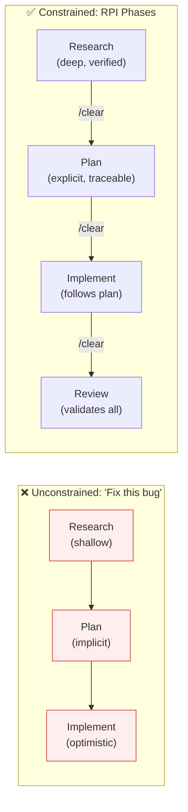
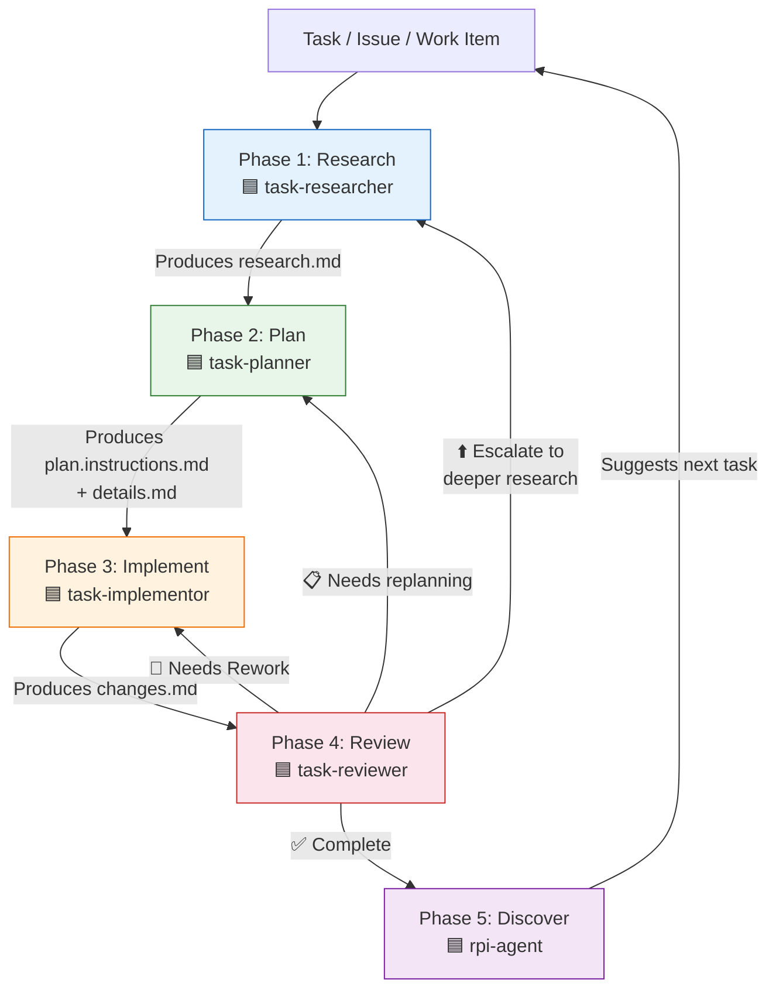
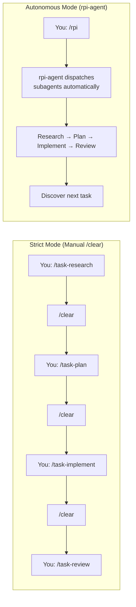
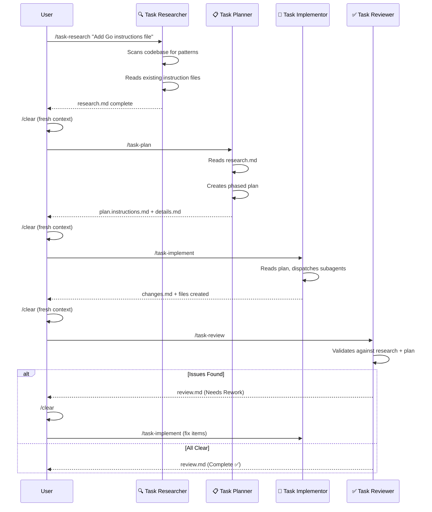
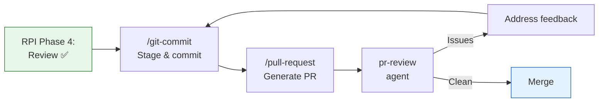
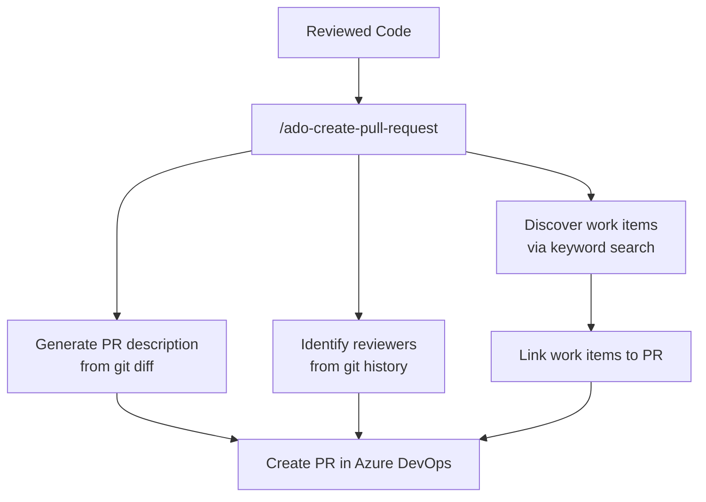
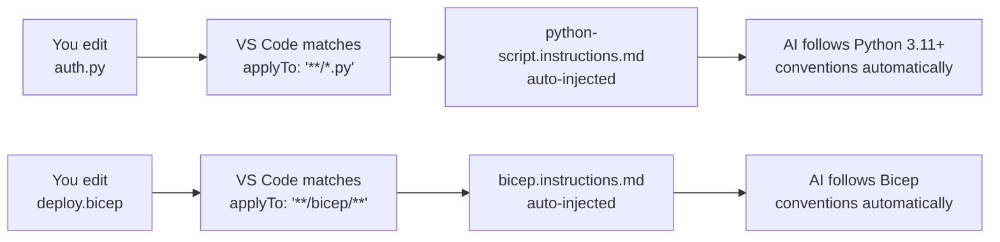
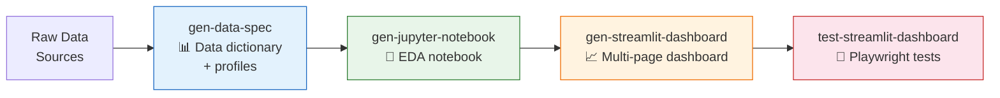

# Workshop: Build the Work — Section Design & Page Specifications

**Type**: Integration Pattern
**Plan**: 002-docusaurus-site
**Spec**: [./docusaurus-site-spec.md](../docusaurus-site-spec.md)
**Created**: 2026-02-18
**Status**: Draft

**Related Documents**:

* [Value Delivery Segments Workshop](./value-delivery-segments.md) — Segment definitions and sidebar structure
* [Research Dossier](../research-dossier.md) — HVE-Core artifact inventory and flow analysis
* [Artifact Relationship Map](../../001-hve-flow-mapping/artifact-relationship-map.md) — Mermaid diagrams of all 70 artifacts
* [RPI Phase Specification](../../001-hve-flow-mapping/rpi-phase-specification.md) — Formal input/output schemas
* [RPI Documentation](./../../../.github/docs/rpi/) — Source documentation for the RPI workflow

---

## Purpose

Design the complete page set for the "Build the Work" section of the Docusaurus site. This section covers delivery phases ③ Development & Collaboration and ④ Verification & Integration — the deepest segment in HVE-Core with 29 artifacts, including the crown jewel RPI workflow.

The central educational argument: constrained phases (Research → Plan → Implement → Review) produce better AI output than unconstrained "just code it" approaches. This is counterintuitive and requires careful explanation. The pages must convince skeptics who think phase separation is overhead, then equip believers with practical workflows.

## Key Questions Addressed

* How should the RPI workflow be presented — as a formal methodology or as a practical problem solver?
* What's the right depth for the walkthrough — enough to follow along, not so much it overwhelms?
* How do coding standards, git operations, and code review connect back to the RPI loop?
* Where does the data science pipeline fit — is it a parallel workflow or a sub-case of RPI?
* How do we make the SPACE framework connection actionable rather than academic?
* What's the decision framework for strict vs autonomous RPI?

---

## The Educational Arc

The six pages follow a deliberate learning progression:

```
Overview          "Why constraints help"          (Motivation)
     ↓
RPI Workflow      "The 5-phase loop"              (Conceptual model)
     ↓
RPI in Practice   "Watch it happen"               (Concrete example)
     ↓
Code Review & PRs "From code to merged"           (Downstream integration)
     ↓
Coding Standards  "The invisible guardrails"      (Background machinery)
     ↓
Data Science      "The implicit pipeline"          (Specialized variant)
```

Each page builds on the previous one. A reader who only reads the Overview gets the core insight. A reader who goes through all six can run the complete workflow.

---

## Page 1: Build the Work — Overview

**Title**: `Build the Work: Overview`
**sidebar_position**: 1
**Slug**: `build-the-work/overview`

### Purpose

Establish the core insight that motivates the entire section: AI cannot distinguish between investigating a problem and implementing a solution. When you ask an LLM to "fix this bug," it simultaneously researches, plans, and codes — optimizing for plausible output rather than correct output. Phase separation forces each cognitive mode to operate independently, producing better results at each stage.

Connect this to the SPACE framework: separating phases optimizes for Communication (knowledge transfers through artifacts, not ephemeral context) and Efficiency (no context pollution between investigation and implementation).

### Section Headings

1. **The Cognitive Separation Problem**
2. **Why Constraints Improve AI Output**
3. **The SPACE Connection**
4. **What This Section Covers**

### Key Diagrams

#### Diagram 1: Unconstrained vs Constrained AI Behavior



#### Diagram 2: SPACE Framework Mapping

```
SPACE Dimension          Without Phase Separation     With Phase Separation
─────────────────────    ─────────────────────────    ──────────────────────────
Satisfaction             Frustrating rework loops     Confidence in each phase
Performance              Plausible but fragile code   Verified, traceable code
Activity                 Lots of typing, less value   Focused work per phase
Communication            Context lives in one chat    Artifacts transfer knowledge
Efficiency               Context pollution degrades   Clean slate per phase
```

### Sample Content

> #### The Cognitive Separation Problem
>
> When you ask an AI assistant to "implement feature X," three cognitive modes activate simultaneously: investigation (what exists?), design (what should change?), and implementation (write the code). The AI interleaves these modes in a single conversation, and each one contaminates the others.
>
> The investigation phase suffers because the AI is already planning how to implement — so it stops searching when it finds something "good enough" rather than verifying what's actually there. The design phase suffers because the AI is already writing code — so it commits to the first approach that looks plausible. The implementation phase suffers because the AI is still discovering things it missed — so it makes assumptions that contradict reality.
>
> This is not a model quality problem. It's a prompt architecture problem. The same model, given the same task, produces measurably different output when constrained to one cognitive mode at a time.

> #### Why Constraints Improve AI Output
>
> The counterintuitive finding: telling an AI it *cannot* write code makes it a better researcher. When the Task Researcher agent knows it will never implement anything, it optimizes for verified truth instead of plausible code. It searches for existing patterns instead of inventing new ones. It cites specific files and line numbers instead of describing what "probably" exists.
>
> The constraint changes the optimization target. An unconstrained agent optimizes for "generate something that looks right." A research-constrained agent optimizes for "find evidence that something is right." These produce fundamentally different outputs.

### Cross-Links

* Forward: [The RPI Workflow](./rpi-workflow) — the concrete system that implements phase separation
* Up: [Getting Started: How It Works](../getting-started/how-it-works) — the 4-layer architecture
* Lateral: [Shape the Work: Overview](../shape-the-work/overview) — the upstream planning that feeds into Build

---

## Page 2: The RPI Workflow

**Title**: `The RPI Workflow`
**sidebar_position**: 2
**Slug**: `build-the-work/rpi-workflow`

### Purpose

This is the crown jewel page. Present the complete RPI workflow as both a conceptual model and a practical system. Cover the 5-phase loop (Research → Plan → Implement → Review → Discover), two operational modes (strict manual vs autonomous orchestration), and the artifact data bus that enables inter-phase communication.

The reader should leave understanding: what each phase does, what artifacts it produces, how phases communicate, and when to use strict vs autonomous mode.

### Section Headings

1. **The Five Phases**
2. **Phase 1: Research — From Uncertainty to Knowledge**
3. **Phase 2: Plan — From Knowledge to Strategy**
4. **Phase 3: Implement — From Strategy to Working Code**
5. **Phase 4: Review — From Working Code to Validated Code**
6. **Phase 5: Discover — Finding the Next Task**
7. **The Artifact Data Bus**
8. **Two Modes: Strict vs Autonomous**
9. **Decision Guide: When to Use Which Mode**
10. **The Handoff Button Chain**

### Key Diagrams

#### Diagram 1: Full RPI Flow with Branching



#### Diagram 2: Artifact Data Bus

```
.copilot-tracking/
│
├── research/
│   └── 2026-02-18-auth-refactor-research.md     ← Phase 1 writes
│                                                   Phase 2 reads
├── plans/
│   └── 2026-02-18-auth-refactor-plan.instructions.md  ← Phase 2 writes
│                                                        Phase 3 reads
├── details/
│   └── 2026-02-18-auth-refactor-details.md       ← Phase 2 writes
│                                                   Phase 3 reads
├── changes/
│   └── 2026-02-18-auth-refactor-changes.md       ← Phase 3 writes
│                                                   Phase 4 reads
├── reviews/
│   └── 2026-02-18-auth-refactor-review.md        ← Phase 4 writes
│                                                   Phase 5 reads
└── memory/
    └── 2026-02-18/
        └── auth-refactor-memory.md               ← /checkpoint saves
                                                     /checkpoint restores
```

#### Diagram 3: Strict vs Autonomous Modes



### Sample Content

> #### The Five Phases
>
> RPI treats code tasks as a type transformation pipeline. Each phase takes one kind of input and produces a different kind of output:
>
> | Phase | Input | Output | Transformation |
> |---|---|---|---|
> | Research | Uncertainty | Verified knowledge | "What exists? What's true?" |
> | Plan | Knowledge | Actionable strategy | "What should change? In what order?" |
> | Implement | Strategy | Working code | "Execute the plan, check the boxes" |
> | Review | Working code | Validated code | "Does it match the plan, research, and conventions?" |
> | Discover | Completed work | Next task | "What else needs doing?" |
>
> The critical insight: each phase starts with a clean context. The `/clear` command (in strict mode) or subagent dispatch (in autonomous mode) ensures that the agent in each phase works only from documented artifacts, not from residual conversation context. This prevents the cognitive contamination described in the Overview.

> #### The Artifact Data Bus
>
> Phases communicate through files, not through conversation history. The `.copilot-tracking/` directory serves as a structured data bus where each phase writes its output and the next phase reads it as input.
>
> This design has three benefits:
>
> * **Persistence**: Artifacts survive conversation resets. You can start researching on Monday and implement on Wednesday.
> * **Traceability**: The plan references specific line numbers in the research. The review validates against both. Every decision has a paper trail.
> * **Parallelism**: Multiple researchers can contribute findings to the same research document. Multiple implementors can work on different plan phases.

> #### Decision Guide: When to Use Which Mode
>
> | Factor | Choose Strict | Choose Autonomous |
> |---|---|---|
> | Task complexity | High — needs deep research | Moderate — well-defined scope |
> | Research depth | Extensive codebase exploration needed | Scope is already understood |
> | Your involvement | Want to review between phases | Trust the pipeline, check at end |
> | Context window | Large changes that benefit from fresh context per phase | Changes that fit in a single context |
> | Learning | You're new to RPI and want to see each phase | You know the workflow, want speed |
>
> Start with strict mode when learning RPI. Move to autonomous mode once you trust the artifact quality at each phase.

### Cross-Links

* Back: [Build the Work: Overview](./overview) — the motivation for phase separation
* Forward: [RPI in Practice](./rpi-in-practice) — see this workflow running on a real task
* Down: [RPI Documentation](./../../../.github/docs/rpi/) — detailed agent reference documentation
* Lateral: [Shape the Work: Backlog Management](../shape-the-work/backlog-management) — where tasks come from before they enter RPI

---

## Page 3: RPI in Practice

**Title**: `RPI in Practice`
**sidebar_position**: 3
**Slug**: `build-the-work/rpi-in-practice`

### Purpose

Walk through a complete RPI cycle on a realistic task. Show the actual prompts typed, the actual artifacts produced, the `/clear` boundary in action, and what happens when the review finds issues (iteration loop). This page is the "try it yourself" companion to the conceptual RPI Workflow page.

Richer than the existing "first workflow" guide — this walkthrough shows the full lifecycle including iteration and edge cases.

### Section Headings

1. **The Task: Adding a New Instruction File**
2. **Phase 1: Research**
   * The prompt you type
   * What the researcher discovers
   * The research artifact
   * The `/clear` boundary
3. **Phase 2: Plan**
   * Reading the research artifact
   * The plan artifact with checkboxes
   * The details artifact with line references
4. **Phase 3: Implement**
   * Subagent dispatch per phase
   * Tracking progress in changes.md
   * What the implementor's commit message looks like
5. **Phase 4: Review**
   * The validation checklist
   * When review finds issues (the iteration loop)
   * Review passes: what "Complete" looks like
6. **Phase 5: Discover**
   * Follow-up items surfaced by review
   * Choosing the next task
7. **The Complete Artifact Trail**
8. **Tips and Common Mistakes**

### Key Diagrams

#### Diagram 1: Walkthrough Timeline



### Sample Content

> #### The Task: Adding a New Instruction File
>
> You need to add a Go language instruction file to HVE-Core, similar to the existing C#, Python, and Bash instructions. This is a realistic task that touches conventions, file structure, and cross-references.
>
> In an unconstrained approach, you'd say: "Create a Go instruction file like the Python one." The AI would skim the Python file, make some analogies, and produce something plausible but potentially inconsistent with the repo's conventions for instruction files.
>
> With RPI, you separate the work into phases.

> #### Phase 1: Research
>
> **What you type:**
>
> ```
> /task-research Add a Go language instruction file following existing conventions
> ```
>
> **What the researcher does:**
>
> The Task Researcher cannot write the instruction file. It can only investigate. This constraint causes it to:
>
> * Search `.github/instructions/` for all existing language instruction files
> * Compare their structures (headings, sections, code examples, frontmatter)
> * Read `prompt-builder.instructions.md` for instruction file authoring standards
> * Check if Go-specific conventions exist elsewhere in the repo
> * Look at `markdown.instructions.md` for formatting requirements
> * Search for existing Go code patterns in the codebase
>
> **The research artifact** (`.copilot-tracking/research/2026-02-18-go-instructions-research.md`):
>
> ```markdown
> ## Evidence Log
>
> ### Existing Instruction File Structure
> * `.github/instructions/csharp/csharp.instructions.md` (lines 1-380)
>   - Frontmatter: description + applyTo: '**/*.cs'
>   - Sections: Project Structure, Coding Standards, Documentation, Complete Example
> * `.github/instructions/python-script.instructions.md` (lines 1-210)
>   - Frontmatter: description + applyTo: '**/*.py'
>   - Sections: Entry Points, CLI Parsing, Logging, Path Handling, Type Hints
> * `.github/instructions/bash/bash.instructions.md` (lines 1-290)
>   - Frontmatter: description + applyTo: '**/*.sh'
>   - Sections: Script Structure, Formatting, Variables, Functions, Error Handling
>
> ### Common Structure Across All Language Instructions
> 1. Frontmatter with description and applyTo glob
> 2. Language version targeting
> 3. Project/file structure conventions
> 4. Naming conventions table
> 5. Code documentation standards
> 6. Error handling patterns
> 7. Complete example demonstrating all conventions
> ```
>
> **Then you type `/clear`** — clearing the conversation context entirely. The research artifact persists in `.copilot-tracking/research/`.

> #### When Review Finds Issues
>
> Review doesn't always pass on the first attempt. When the reviewer finds issues, it categorizes them by severity:
>
> * **Critical**: The implementation contradicts the research findings or violates a convention
> * **Major**: A plan item was missed or implemented incorrectly
> * **Minor**: Style issues, missing comments, or optional improvements
>
> For Critical and Major issues, the review status is "Needs Rework" and the iteration loop begins:
>
> 1. You `/clear` and re-enter the implementor with `/task-implement`
> 2. The implementor reads the review findings alongside the original plan
> 3. It addresses each rework item and updates `changes.md`
> 4. You `/clear` and re-enter the reviewer with `/task-review`
> 5. The reviewer validates the rework
>
> This loop typically converges in 1-2 iterations.

### Cross-Links

* Back: [The RPI Workflow](./rpi-workflow) — the conceptual model this page demonstrates
* Forward: [Code Review & PRs](./code-review-prs) — what happens after RPI produces reviewed code
* Lateral: [Getting Started: Quick Start](../getting-started/quick-start) — a simpler first-touch walkthrough

---

## Page 4: Code Review & Pull Requests

**Title**: `Code Review & Pull Requests`
**sidebar_position**: 4
**Slug**: `build-the-work/code-review-prs`

### Purpose

Cover the downstream workflow after RPI produces reviewed code: generating PR descriptions, automated code review, ADO PR creation with work item linking, and git operations. Show how these tools connect back to the RPI loop — the implementor produces code, which becomes a PR, which gets reviewed.

### Section Headings

1. **From Reviewed Code to Merged Code**
2. **Generating Pull Requests**
   * The `/pull-request` prompt — GitHub PR descriptions
   * The `/ado-create-pull-request` prompt — ADO with work item linking
   * What gets generated: title, description, linked items
3. **Automated Code Review**
   * The `pr-review` agent — quality, security, and convention compliance
   * What it checks and what it ignores (high signal-to-noise)
   * When to run it: before pushing, during PR review
4. **Git Operations**
   * `/git-commit` — stage and commit with conventional messages
   * `/git-commit-message` — message-only generation
   * `/git-merge` — merge and rebase with conflict resolution
5. **The RPI → PR → Review Pipeline**
6. **ADO Integration Details**

### Key Diagrams

#### Diagram 1: Code to Merge Pipeline



#### Diagram 2: ADO PR Flow with Work Item Linking



### Sample Content

> #### Generating Pull Requests
>
> After the RPI workflow produces reviewed code, you need a pull request. Two prompts handle this:
>
> **`/pull-request`** generates a GitHub PR description from your branch diff. It reads the commit history, groups changes by type and scope, and produces a conventional-commit-formatted title with a structured body.
>
> **`/ado-create-pull-request`** does the same for Azure DevOps, with additional capabilities: it searches ADO for related work items, identifies reviewers from git history, and links everything together. The process follows a 7-phase protocol with user confirmation gates at each stage.
>
> Both prompts read from `pr-reference.xml` — a structured diff generated by `scripts/dev-tools/pr-ref-gen.sh`. This ensures the PR description reflects exactly what changed, not what the AI thinks changed.

> #### Automated Code Review
>
> The `pr-review` agent reviews code changes with an extremely high signal-to-noise ratio. It analyzes staged/unstaged changes and branch diffs, surfacing only issues that genuinely matter:
>
> * Bugs and logic errors
> * Security vulnerabilities
> * Convention violations specific to this codebase
>
> It deliberately ignores style, formatting, and trivial matters. The goal is zero false positives — every comment should be actionable.

> #### Git Operations
>
> Three prompts handle the git workflow:
>
> | Prompt | Purpose | When to Use |
> |---|---|---|
> | `/git-commit` | Stage files and create a conventional commit | After implementation, before PR |
> | `/git-commit-message` | Generate only the commit message (no staging) | When you've already staged manually |
> | `/git-merge` | Merge or rebase with intelligent conflict resolution | Syncing branches, resolving conflicts |
>
> The `/git-merge` prompt follows a strict protocol: it confirms the working tree is clean, fetches latest refs, executes the operation, and walks through any conflicts file by file. It never force-pushes or rewrites remote history.

### Cross-Links

* Back: [RPI in Practice](./rpi-in-practice) — the workflow that produces the code being reviewed
* Forward: [Coding Standards](./coding-standards) — the conventions that pr-review validates against
* Lateral: [Shape the Work: Backlog Management](../shape-the-work/backlog-management) — where work items originate
* Lateral: [Shape the Work: ADO Integration](../shape-the-work/ado-integration) — ADO work item context

---

## Page 5: Coding Standards

**Title**: `Coding Standards`
**sidebar_position**: 5
**Slug**: `build-the-work/coding-standards`

### Purpose

Explain how `.instructions.md` files with `applyTo:` patterns auto-inject coding conventions into every AI interaction. These are "invisible guardrails" — the user never invokes them, they just work. Cover the available language standards, how to add project-specific standards, and the clever trick where plan files use the `.instructions.md` suffix for auto-binding.

### Section Headings

1. **The Invisible Guardrails**
2. **How Auto-Application Works**
3. **Available Language Standards**
4. **What Each Standard Covers**
5. **Adding Your Own Standards**
6. **The Plan File Trick**
7. **Interaction with Code Review**

### Key Diagrams

#### Diagram 1: Auto-Application Flow



#### Diagram 2: Standards Coverage Map

```
Language / Domain        File Pattern        Key Conventions
──────────────────────   ─────────────────   ─────────────────────────────
C# (.NET 10, C# 14)     **/*.cs             Primary constructors, PascalCase,
                                             XML docs, nullable refs
C# Tests                **/*.cs              XUnit + NSubstitute, BDD naming,
                                             Arrange/Act/Assert
Python 3.11+            **/*.py              pathlib, type hints, click CLI,
                                             Google docstrings
Bash 5.x                **/*.sh              strict mode, ShellCheck, main()
                                             pattern, 2-space indent
Bicep 0.36+             **/bicep/**          camelCase params, PascalCase types,
                                             MCP tools for schema lookup
Terraform 1.6+          **/*.tf, **/*.tfvars snake_case resources, modules/,
                                             coalesce() over ternary
Markdown                **/*.md              markdownlint, frontmatter required,
                                             ATX headings, GitHub alerts
Writing Style           **/*.md              Voice/tone, no em dashes, no hedging,
                                             pronoun conventions per context
```

### Sample Content

> #### The Invisible Guardrails
>
> When you open a Python file and ask Copilot to help, something happens before the AI generates a single token: the `python-script.instructions.md` file is automatically injected into the context. The AI now knows to use `pathlib.Path` instead of `os.path`, type hints with Python 3.11+ syntax, Google-style docstrings, and `click` for complex CLIs.
>
> You didn't invoke anything. You didn't configure anything. The `applyTo: '**/*.py'` frontmatter pattern matched your file, and the conventions appeared.
>
> This is the "invisible guardrails" concept: coding standards that enforce themselves through the instruction file system. Every language-specific instruction file defines conventions that activate when you touch a matching file.

> #### Adding Your Own Standards
>
> Create a `.github/instructions/` file with an `applyTo` pattern:
>
> ```yaml
> ---
> description: "Project-specific API conventions for our REST endpoints"
> applyTo: "src/api/**/*.ts"
> ---
>
> # API Conventions
>
> * Use Zod for request validation
> * Return RFC 7807 problem details for errors
> * Rate limit all public endpoints
> ```
>
> Every time you (or an AI agent) edits a file matching `src/api/**/*.ts`, these conventions activate. The AI follows your project's API patterns without being told.

> #### The Plan File Trick
>
> The RPI workflow's plan files use the `.instructions.md` suffix intentionally:
>
> ```
> .copilot-tracking/plans/2026-02-18-auth-refactor-plan.instructions.md
> ```
>
> This is not an accident. When the Task Implementor opens the plan file, VS Code recognizes the `.instructions.md` extension and auto-applies it as context. The plan becomes a self-activating instruction set — the implementor literally cannot ignore it because the file system makes it part of the active instructions.

### Cross-Links

* Back: [Code Review & PRs](./code-review-prs) — the pr-review agent validates these standards
* Forward: [Data Science Workflows](./data-science-workflows) — data science has its own implicit conventions
* Up: [Getting Started: How It Works](../getting-started/how-it-works) — the instruction layer in the 4-layer architecture
* Lateral: [Reference: Artifact Types](../reference/artifact-types) — instruction files as an artifact type

---

## Page 6: Data Science Workflows

**Title**: `Data Science Workflows`
**sidebar_position**: 6
**Slug**: `build-the-work/data-science-workflows`

### Purpose

Present the implicit data science pipeline: `gen-data-spec` → `gen-jupyter-notebook` → `gen-streamlit-dashboard` → `test-streamlit-dashboard`. Explain why this is an implicit sequence (no orchestrator, no handoffs between agents) and why that's okay — each agent's output is the natural input for the next, but a data scientist might only need one or two steps.

### Section Headings

1. **The Implicit Pipeline**
2. **Why No Orchestrator?**
3. **Step 1: Data Specification** (`gen-data-spec`)
4. **Step 2: Exploratory Analysis** (`gen-jupyter-notebook`)
5. **Step 3: Dashboard** (`gen-streamlit-dashboard`)
6. **Step 4: Dashboard Testing** (`test-streamlit-dashboard`)
7. **Using Individual Agents**
8. **Connection to RPI**

### Key Diagrams

#### Diagram 1: The Implicit Pipeline



#### Diagram 2: Implicit vs Orchestrated Comparison

```
RPI Flow (Orchestrated)              Data Science Pipeline (Implicit)
─────────────────────────            ─────────────────────────────────
rpi-agent dispatches subagents       No orchestrator
/clear between phases                No context reset required
Artifacts are mandatory handoffs     Outputs are natural inputs
Must follow sequence                 Can enter at any step
Built for code tasks                 Built for data exploration
```

### Sample Content

> #### The Implicit Pipeline
>
> The data science workflow is a sequence of four agents, each producing output that naturally feeds the next:
>
> | Agent | Input | Output | Persona |
> |---|---|---|---|
> | `gen-data-spec` | Raw data sources (CSV, DB, API) | Data dictionary, machine-readable profiles, summaries | Data Engineer |
> | `gen-jupyter-notebook` | Data spec + data sources | Structured EDA notebook with visualizations | Data Scientist |
> | `gen-streamlit-dashboard` | Data spec + analysis findings | Multi-page Streamlit dashboard | Data Scientist / Analyst |
> | `test-streamlit-dashboard` | Running Streamlit app | Playwright test suite with issue tracking | QA Engineer |
>
> Unlike the RPI workflow, this pipeline has no orchestrator and no formal handoff mechanism. Each agent is self-contained. You invoke them individually and pass context through conversation or by referencing previously generated files.

> #### Why No Orchestrator?
>
> The RPI workflow needs an orchestrator because its phases have a strict dependency chain and require context isolation between phases. A research finding must be documented before planning can reference it. A plan must be written before implementation can follow it.
>
> The data science pipeline has softer dependencies. A data scientist who already knows their data can skip `gen-data-spec` and go straight to `gen-jupyter-notebook`. An analyst who has a notebook can jump to `gen-streamlit-dashboard`. The sequence is a recommendation, not a requirement.
>
> This implicit structure is a deliberate design choice, not a gap. An orchestrator would add overhead without adding value, because data science workflows are inherently exploratory. You often loop back, skip steps, or branch in directions that a rigid pipeline would constrain.

> #### Connection to RPI
>
> For larger data science projects — building a production ML pipeline, creating a data platform, or refactoring an analytics codebase — RPI applies normally. Use the Task Researcher to investigate existing data infrastructure, the Task Planner to design the pipeline, and the Task Implementor to build it.
>
> The data science agents complement RPI rather than replacing it. Use `gen-data-spec` during the Research phase to understand your data. Use `gen-jupyter-notebook` during prototyping. Use `gen-streamlit-dashboard` to build the presentation layer that the Implementor plans.

### Cross-Links

* Back: [Coding Standards](./coding-standards) — Python conventions apply to generated notebooks
* Up: [Build the Work: Overview](./overview) — how data science fits the constrained phases model
* Lateral: [Getting Started: Quick Start](../getting-started/quick-start) — data science quick-start path

---

## Artifact Inventory for Build the Work

The 29 artifacts mapped to this section, organized by page coverage:

| Artifact | Type | Page | Role |
|---|---|---|---|
| `rpi-agent` | 🟦 Agent | Pages 2, 3 | Crown jewel orchestrator |
| `task-researcher` | 🟦 Agent | Pages 2, 3 | RPI Phase 1 |
| `task-planner` | 🟦 Agent | Pages 2, 3 | RPI Phase 2 |
| `task-implementor` | 🟦 Agent | Pages 2, 3 | RPI Phase 3 |
| `task-reviewer` | 🟦 Agent | Pages 2, 3 | RPI Phase 4 |
| `memory` | 🟦 Agent | Page 2 | Session persistence (mentioned, not spotlighted) |
| `/rpi` | 🟩 Prompt | Pages 2, 3 | Orchestrator entry point |
| `/task-research` | 🟩 Prompt | Pages 2, 3 | Research entry point |
| `/task-plan` | 🟩 Prompt | Pages 2, 3 | Planning entry point |
| `/task-implement` | 🟩 Prompt | Pages 2, 3 | Implementation entry point |
| `/task-review` | 🟩 Prompt | Pages 2, 3 | Review entry point |
| `/checkpoint` | 🟩 Prompt | Page 2 | Session persistence (mentioned) |
| `pr-review` | 🟦 Agent | Page 4 | Code review |
| `/pull-request` | 🟩 Prompt | Page 4 | GitHub PR generation |
| `/ado-create-pull-request` | 🟩 Prompt | Page 4 | ADO PR with linking |
| `/git-commit` | 🟩 Prompt | Page 4 | Stage and commit |
| `/git-commit-message` | 🟩 Prompt | Page 4 | Message generation |
| `/git-merge` | 🟩 Prompt | Page 4 | Merge/rebase |
| `csharp` | 🟨 Instruction | Page 5 | C# conventions |
| `csharp-tests` | 🟨 Instruction | Page 5 | C# test conventions |
| `python-script` | 🟨 Instruction | Page 5 | Python conventions |
| `bash` | 🟨 Instruction | Page 5 | Bash conventions |
| `bicep` | 🟨 Instruction | Page 5 | Bicep IaC conventions |
| `terraform` | 🟨 Instruction | Page 5 | Terraform conventions |
| `markdown` | 🟨 Instruction | Page 5 | Markdown conventions |
| `writing-style` | 🟨 Instruction | Page 5 | Voice and tone |
| `gen-data-spec` | 🟦 Agent | Page 6 | Data specification |
| `gen-jupyter-notebook` | 🟦 Agent | Page 6 | EDA notebooks |
| `gen-streamlit-dashboard` | 🟦 Agent | Page 6 | Streamlit dashboards |
| `test-streamlit-dashboard` | 🟦 Agent | Page 6 | Dashboard testing |
| `doc-ops` | 🟦 Agent | Page 4 | Documentation QA (mentioned) |

**Total**: 6 agents + 6 prompts + 1 instruction context = 13 core RPI artifacts, plus 18 supporting artifacts across git ops, coding standards, and data science.

---

## Open Questions

### Q1: Should "RPI in Practice" use a real HVE-Core task or a generic example?

**OPEN**: Two options:

* **Option A**: Use a real task like "add Go instruction file" — feels authentic, demonstrates the repo's own conventions
* **Option B**: Use a generic external example like "add user authentication" — more universally relatable

**Recommendation**: Option A. The site is about HVE-Core, and demonstrating RPI on an HVE-Core task is both authentic and self-referential in a way that builds trust. A reader who follows along is actually learning the repo's conventions as a side effect.

### Q2: How much SPACE framework theory belongs on the Overview page?

**OPEN**: The SPACE connection is compelling but risks being academic. Two options:

* **Option A**: Full section with the mapping table and research citations
* **Option B**: Brief mention with a link to the SPACE paper, focusing on the two relevant dimensions (Communication and Efficiency)

**Recommendation**: Option B. The Overview page's job is to motivate phase separation, not to teach SPACE. A concise connection to Communication and Efficiency is enough. Readers who want depth can follow the citation.

### Q3: Should the Data Science page mention the `uv-projects` instruction file?

**OPEN**: The `uv-projects.instructions.md` file auto-applies to Python files and sets up virtual environments with `uv`. Data scientists working in Python benefit from it, but it's an instruction file (auto-applied), not something they invoke. Mentioning it might confuse the narrative.

**Recommendation**: Brief mention in a tip callout on the Data Science page: "Python environments are managed automatically via the `uv-projects` instruction file. When you create a new data science project, `uv init` and `uv add` handle dependencies."

---

## Research Opportunities

| # | Topic | Why Needed | Impact | Priority |
|---|---|---|---|---|
| 1 | **RPI metrics and evidence** | The "constraints improve output" claim needs data — even anecdotal before/after comparisons | Strengthens the Overview's argument substantially | High |
| 2 | **Testing conventions gap** | Only C# has test instructions — Python, Go, TypeScript are missing | Weakens the Coding Standards page's "comprehensive" claim | Medium |
| 3 | **doc-ops positioning** | doc-ops agent straddles Build and Ship — should it get its own page or stay as a mention on Page 4? | Minor structural question | Low |

## Workshop Opportunities

| # | Topic | Type | Why Workshop | Key Questions | Priority |
|---|---|---|---|---|---|
| 1 | **End-to-End User Journey** | CLI Flow | Map a feature from PRD → Backlog → RPI → PR → Release showing tool transitions | How do segment boundaries feel in practice? Where are the friction points? | High |
| 2 | **RPI Walkthrough Content** | Content Design | Design the exact task, prompts, and artifact examples for Page 3 | What task is representative enough to teach all RPI phases without being contrived? | High |
| 3 | **Coding Standards Gallery** | Content Design | Design the visual format for presenting each language standard on Page 5 | Tabs? Collapsible sections? Separate sub-pages per language? | Medium |

---

## Impact on Plan

The plan's Phase 2 content skeleton should include these six pages under `build-the-work/`:

| File | sidebar_position | Content Status |
|---|---|---|
| `build-the-work/index.md` (Overview) | 1 | Designed — needs writing |
| `build-the-work/rpi-workflow.md` | 2 | Designed — needs writing |
| `build-the-work/rpi-in-practice.md` | 3 | Designed — needs walkthrough content workshop |
| `build-the-work/code-review-prs.md` | 4 | Designed — needs writing |
| `build-the-work/coding-standards.md` | 5 | Designed — needs writing |
| `build-the-work/data-science-workflows.md` | 6 | Designed — needs writing |

Dependencies on other workshops:

* The "RPI Walkthrough Content" workshop (Opportunity #2 above) blocks final content for Page 3
* The "End-to-End User Journey" workshop blocks cross-segment navigation design
* The Coding Standards Gallery workshop informs Page 5 visual format

No changes to the existing segment structure from the Value Delivery Segments workshop. This workshop deepens Segment 2 without altering the top-level architecture.
