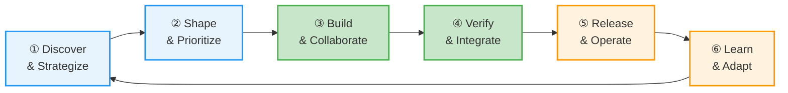
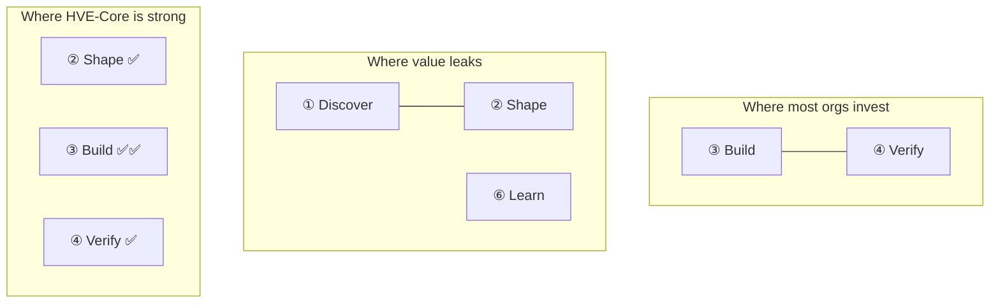
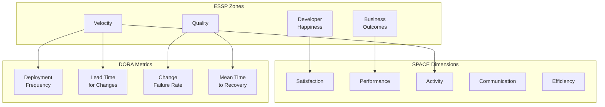
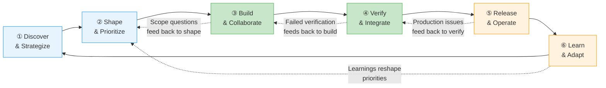
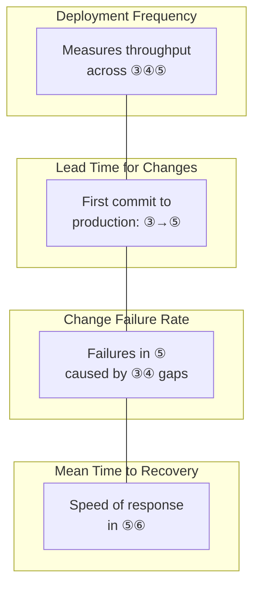
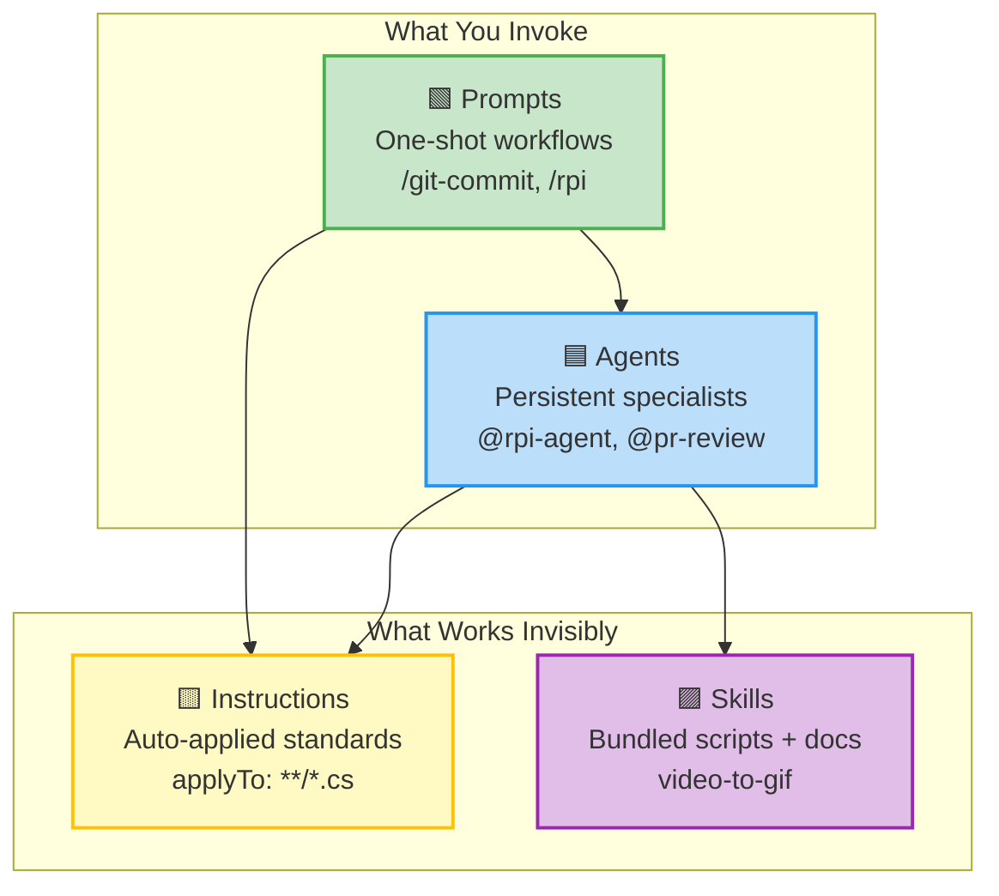
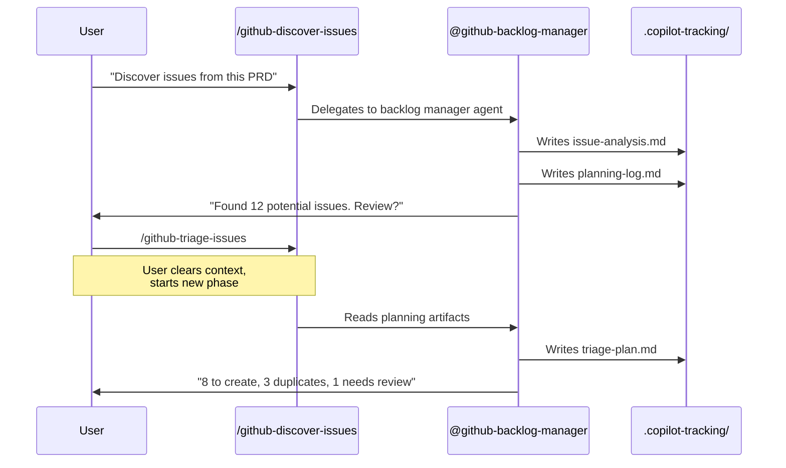
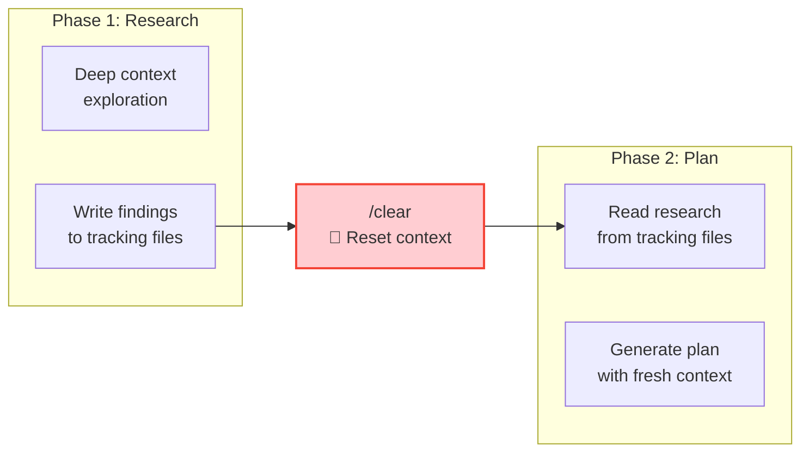
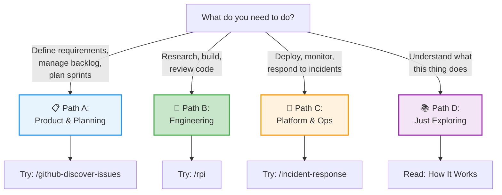

# Workshop: Overview Section — The Educational Foundation

**Type**: Content Design
**Plan**: 002-docusaurus-site
**Spec**: [./docusaurus-site-spec.md](../docusaurus-site-spec.md)
**Created**: 2026-02-18
**Status**: Draft

**Related Documents**:

* [Value Delivery Segments Workshop](./value-delivery-segments.md) — Sidebar structure, artifact assessment, coverage heatmap
* [Research Dossier](../research-dossier.md) — HVE-Core artifact inventory and flow analysis
* [Artifact Relationship Map](../../001-hve-flow-mapping/artifact-relationship-map.md) — Mermaid diagrams of all 70 artifacts

---

## Purpose

Design the four pages that live under "Getting Started" in the site sidebar. These pages do the heaviest conceptual lifting on the entire site: they teach what HyperVelocity Engineering *is*, why the value delivery loop matters, how HVE-Core's architecture works, and where each user should go first.

Every other section on the site assumes the reader has absorbed these pages. Getting them right is the difference between "oh, this is a prompt library" and "oh, this changes how I think about AI-assisted delivery."

## Key Questions Addressed

* What is the conceptual pitch for HVE-Core that distinguishes it from "AI code assistant"?
* How do DORA, SPACE, and ESSP frameworks connect to the value delivery loop?
* What architectural concepts must users understand before the segment pages make sense?
* How do different personas find their entry point without reading everything?

## Design Principles for These Pages

1. **Teach the concept, then show the tool.** Every page leads with the *why* before revealing HVE-Core's answer.
2. **Honest scope.** Where HVE-Core has gaps, say so. Credibility earns trust faster than completeness.
3. **Diagrams carry the argument.** The value delivery loop and architecture diagrams should be understood at a glance. Text reinforces what the diagram already communicated.
4. **Warm and opinionated.** This is thought leadership, not a user manual. The voice has conviction without being prescriptive.
5. **Cross-link aggressively.** These pages exist to route people deeper. Every concept introduced should link to where it's explored further.

---

## Page 1: What is HyperVelocity Engineering?

**Sidebar position**: 1
**Slug**: `getting-started/what-is-hve`
**Purpose**: The hero concept page. Teaches the mental model before showing any tooling. This is the page you send someone when they ask "what is this thing?"

### Section Headings

1. **The Problem: Fast Code, Slow Value**
2. **The Value Delivery Loop** (with mermaid diagram)
3. **Where Organizations Leak Value**
4. **How We Measure What Matters** (DORA, SPACE, ESSP)
5. **What HVE-Core Provides (And What It Doesn't)**
6. **Where HVE-Core Helps** (heatmap)
7. **Next Steps**

### Key Diagrams

#### The Value Delivery Loop



#### Where Most Investment Goes vs Where Value Leaks



#### The Measurement Stack



### Sample Content

#### The Problem: Fast Code, Slow Value

> Most engineering teams optimize for code velocity. Faster builds. Faster deploys. Faster CI pipelines. And those investments pay off — but only in phases ③ and ④ of the value delivery loop.
>
> Meanwhile, a product manager spends three weeks turning a business need into a coherent set of requirements. A tech lead spends another week breaking those requirements into work items that developers can actually act on. After the code ships, nobody closes the loop to ask: did this actually solve the problem?
>
> HyperVelocity Engineering is the practice of shortening the *entire* value delivery loop, not just the build-and-verify phases. It's the difference between "we deploy 47 times a day" and "we consistently deliver the right thing, fast, with confidence."

#### Where Organizations Leak Value

> DORA research consistently shows that elite engineering organizations don't just ship faster — they ship *differently*. Their lead time for changes is measured in hours because the upstream work (discovery, shaping, prioritization) is already structured when it reaches the development team.
>
> The pattern is predictable: organizations invest heavily in CI/CD automation, code review tooling, and testing infrastructure. These are phases ③ and ④. But the requirements were fuzzy going in, and nobody measures whether the shipped feature moved a business metric. Value leaks at the seams between phases, not within them.
>
> HVE-Core takes an unusual position: its deepest investment is in phase ② (Shape & Prioritize), where AI-assisted planning tools turn vague ideas into structured, actionable backlogs. The second-deepest is phase ③ (Build & Collaborate), where the RPI workflow provides research-plan-implement discipline that most AI coding tools skip entirely.

#### What HVE-Core Provides (And What It Doesn't)

> HVE-Core is a collection of prompts, agents, instructions, and skills for GitHub Copilot. It provides structured workflows for the phases of software delivery where AI assistance is most impactful and where most tools offer nothing.
>
> What it provides:
>
> * **Strong coverage in shaping work** — PRD builders, backlog management flows, architecture decision records, security planning
> * **Deep coverage in building work** — the RPI research-plan-implement workflow, coding standards that apply automatically, code review, PR generation
> * **Emerging coverage in shipping** — incident response, IaC conventions, operational risk assessment
>
> What it doesn't provide:
>
> * Release management, progressive delivery, or deployment orchestration
> * Monitoring, alerting, SLO/SLA tooling, or telemetry analysis
> * Retrospective facilitation or formal learning-loop automation
> * Portfolio-level strategy, OKR management, or capacity planning
>
> This is deliberate honesty, not apology. HVE-Core focuses on phases where AI-assisted workflows create measurable improvement today. The gaps represent future direction, not missing features.

### Cross-Links

* "The Value Delivery Loop" → [Page 2: The Value Delivery Loop](#page-2-the-value-delivery-loop)
* "Shape & Prioritize" → `shape-the-work/overview`
* "Build & Collaborate" → `build-the-work/overview`
* "RPI workflow" → `build-the-work/rpi-workflow`
* DORA metrics → [Page 2: The Value Delivery Loop](#page-2-the-value-delivery-loop) (DORA mapping section)
* "Choose your path" → [Page 4: Quick Start — Choose Your Path](#page-4-quick-start-choose-your-path)

---

## Page 2: The Value Delivery Loop

**Sidebar position**: 2
**Slug**: `getting-started/value-delivery-loop`
**Purpose**: The deep-dive reference for the 6-phase model. Each phase gets a thorough treatment with activities, stakeholders, failure modes, and metric mappings. This is where the reader who wants to *understand the theory* spends their time.

### Section Headings

1. **The Loop, Not the Line** (intro)
2. **Phase ①: Discover & Strategize**
3. **Phase ②: Shape & Prioritize**
4. **Phase ③: Build & Collaborate**
5. **Phase ④: Verify & Integrate**
6. **Phase ⑤: Release & Operate**
7. **Phase ⑥: Learn & Adapt**
8. **How DORA Metrics Map to Phases**
9. **How SPACE Dimensions Cross-Cut Everything**
10. **How ESSP Zones Layer On Top**
11. **The Feedback Arcs**

### Key Diagrams

#### The Full Loop with Feedback Arcs



#### DORA Metrics Mapped to Phases



#### SPACE × Phase Matrix (described as table, rendered in Docusaurus)

| SPACE Dimension | ① Discover | ② Shape | ③ Build | ④ Verify | ⑤ Release | ⑥ Learn |
|---|---|---|---|---|---|---|
| **Satisfaction** | Clarity of mission | Confidence in plan | Flow state, low friction | Trust in test suite | Deployment confidence | Sense of progress |
| **Performance** | Strategy quality | Backlog actionability | Code quality, PR throughput | Defect escape rate | Deployment success rate | Insight quality |
| **Activity** | Research volume | Stories created/refined | Commits, PRs, reviews | Test runs, builds | Deploys, rollbacks | Retro actions closed |
| **Communication** | Stakeholder alignment | Cross-team prioritization | PR review cycles | CI/CD signal clarity | Incident comms | Knowledge sharing |
| **Efficiency** | Idea-to-backlog time | Backlog-to-sprint time | Cycle time | Build time | Deploy time | Learning-to-action time |

### Per-Phase Template

Each phase section follows this structure:

#### Phase ②: Shape & Prioritize (example)

**What happens**: Business needs, user feedback, and technical insights are translated into structured, prioritized work items. Vague ideas become concrete requirements with acceptance criteria. Backlogs are groomed, deduplicated, and organized into milestones or sprints.

**Who's involved**: Product Managers, Tech Leads, TPMs, Engineering Managers. Sometimes the entire team during sprint planning.

**What can go wrong**:

* Requirements stay vague because nobody invested time in shaping them — developers start building from ambiguous tickets and make assumption-driven decisions that create rework.
* Prioritization happens by loudest voice rather than strategic framework. The backlog becomes a stack of "urgent" items with no coherent delivery sequence.
* Work items are shaped in isolation from the codebase. The requirements look reasonable on paper but ignore architectural constraints, creating hidden complexity that surfaces mid-sprint.

**Which metrics apply**:

* **DORA: Lead Time for Changes** — upstream shaping directly determines how fast work flows into development. Fuzzy requirements increase lead time by forcing mid-sprint clarification.
* **SPACE: Efficiency** — backlog-to-sprint time measures how quickly shaped work becomes actionable. High efficiency here means developers start sprints with clarity, not questions.
* **ESSP: Velocity** — well-shaped work moves faster through the build phase because assumptions are validated before code is written.

**Where HVE-Core helps**:

* `prd-builder` and `brd-builder` agents structure requirements into consistent, reviewable documents.
* `github-backlog-manager` orchestrates a 4-step flow: discover → triage → sprint plan → execute. This turns "I have a pile of issues" into "I have a prioritized sprint" in a single session.
* `ado-prd-to-wit` translates PRDs into Azure DevOps work items with traceability back to requirements.
* Auto-applied `commit-message` instructions ensure that even the naming of work follows conventional patterns.

**Where HVE-Core doesn't help (yet)**: Portfolio-level prioritization (WSJF, RICE scoring), OKR alignment, capacity-based sprint planning, cross-team dependency management.

### Sample Content

#### The Loop, Not the Line

> Software delivery is often drawn as a pipeline: requirements go in one end, deployed features come out the other. This mental model is comforting and wrong.
>
> In practice, delivery is a loop. Learnings from production reshape priorities. Failed verifications send work back to development. Scope questions during build feed back to shaping. The "pipeline" metaphor obscures these feedback arcs, and obscured feedback arcs are where organizations lose velocity.
>
> The value delivery loop makes these feedback arcs explicit. Six phases, continuously cycling, with four feedback arcs that are just as important as the forward flow.

#### How ESSP Zones Layer On Top

> Where DORA gives you four metrics and SPACE gives you five dimensions, ESSP (Engineering System Service Plan) organizes the conversation into four outcome zones:
>
> * **Developer Happiness**: Are engineers satisfied with their tools, processes, and work environment? This is measured through SPACE's Satisfaction dimension, but ESSP treats it as a first-class outcome rather than a secondary indicator. Happy engineers aren't a nice-to-have — they're a leading indicator of retention and sustained velocity.
> * **Quality**: Are we shipping work that stays shipped? Change Failure Rate and defect escape rate are the primary signals. Quality isn't just about testing — it's about the upstream shaping that determines whether the right thing was built in the first place.
> * **Velocity**: How fast does value move through the loop? This isn't deployment frequency alone — it's the end-to-end lead time from "we have an idea" to "a user benefits from it." DORA's Lead Time for Changes captures the development slice, but the full loop includes shaping time and learning time.
> * **Business Outcomes**: Did the shipped feature actually achieve its intended impact? This is the zone most engineering organizations ignore because it crosses the boundary between engineering metrics and product metrics. Closing this gap is the purpose of phase ⑥.

### Cross-Links

* Each phase section → corresponding segment overview (`shape-the-work/overview`, `build-the-work/overview`, `ship-it/overview`)
* DORA section → external link to DORA State of DevOps reports
* SPACE section → external link to SPACE framework paper (Nicole Forsgren et al.)
* Specific HVE-Core tools mentioned → their respective guide pages
* "Feedback arcs" → reinforces the loop diagram from Page 1

---

## Page 3: How HVE-Core Works

**Sidebar position**: 3
**Slug**: `getting-started/how-it-works`
**Purpose**: The architecture page for users, not contributors. Explains the 4-layer model, auto-injection, guided flows, and the artifact bus so users understand *why* HVE-Core works differently from just chatting with an AI.

### Section Headings

1. **Four Layers, One System**
2. **Instructions: Invisible Standards**
3. **Prompts: One-Shot Workflows**
4. **Agents: Persistent Specialists**
5. **Skills: Bundled Utilities**
6. **The Handoff Pattern: Guided Flows**
7. **The `/clear` Boundary: Why Constrained Phases Win**
8. **The Artifact Bus: `.copilot-tracking/`**
9. **How This Differs from Just Asking ChatGPT**

### Key Diagrams

#### The 4-Layer Architecture



#### The Handoff Flow (Shape the Work example)



#### The `/clear` Boundary Pattern



### Sample Content

#### Four Layers, One System

> HVE-Core isn't a single tool — it's a system of four artifact types that work together. Understanding these layers explains why using HVE-Core feels different from other AI coding assistants.
>
> Two layers are things you invoke directly: **prompts** (type `/rpi` in Copilot Chat) and **agents** (type `@rpi-agent`). Two layers work invisibly: **instructions** (auto-applied conventions based on what file you're editing) and **skills** (bundled scripts and documentation that agents can reference).
>
> The magic is in the invisible layers. When you edit a C# file, `csharp.instructions.md` automatically applies — your AI assistant follows .NET 10 conventions without being told. When you write a commit message, `commit-message.instructions.md` enforces conventional commit format. You don't configure this. You don't remember to invoke it. It just works because the `applyTo` pattern matches the file you're editing.

#### The `/clear` Boundary: Why Constrained Phases Win

> Here's a counterintuitive insight: giving an AI *less* context often produces *better* results.
>
> In a long Copilot Chat session, context accumulates. Early research pollutes later planning decisions. Implementation details bleed into architectural choices. The AI's attention spreads across everything rather than focusing on the task at hand.
>
> HVE-Core's answer is the `/clear` boundary pattern. Each workflow phase writes its outputs to `.copilot-tracking/` files, then the user clears the chat context with `/clear`. The next phase reads *only* the structured artifacts, not the messy exploration that produced them.
>
> This is the same principle that makes Unix pipes powerful: each stage transforms a clean input into a clean output. The intermediate thinking is discarded, not accumulated.

#### How This Differs from Just Asking ChatGPT

> You can ask any AI assistant to "write me a PRD" or "plan this feature." The result will be plausible and generic. It won't know your team's naming conventions, your backlog's current state, your codebase's architectural constraints, or the commit message format your CI pipeline requires.
>
> HVE-Core's architecture addresses this gap in three ways:
>
> * **Instructions files encode your standards.** Conventions aren't remembered from previous conversations — they're loaded automatically based on file patterns. The AI follows your team's C# conventions because `csharp.instructions.md` says so, not because you reminded it.
> * **Agents carry workflow knowledge.** The `github-backlog-manager` agent knows the 4-step backlog flow because its definition includes the protocol. It doesn't "figure out" how to triage issues — it follows a defined sequence with similarity assessment, label mapping, and duplicate detection built in.
> * **Tracking files create continuity.** The `.copilot-tracking/` directory is an artifact bus. Each workflow phase writes structured outputs that the next phase reads. This means a planning session on Monday produces artifacts that an implementation session on Friday can consume, even across different chat sessions and context windows.

### Cross-Links

* "Instructions auto-apply" → `reference/artifact-types` (instructions section)
* "RPI workflow" → `build-the-work/rpi-workflow`
* "Backlog management flow" → `shape-the-work/backlog-management`
* "Artifact types" → `reference/artifact-types`
* `.copilot-tracking/` explanation → links to specific tracking directory documentation in each segment
* `/clear` pattern → referenced again in RPI walkthrough

---

## Page 4: Quick Start — Choose Your Path

**Sidebar position**: 4
**Slug**: `getting-started/quick-start`
**Purpose**: A role-based routing page that gets each persona to their first meaningful interaction in under 5 minutes. This is the action-oriented complement to the concept-heavy first three pages.

### Section Headings

1. **What Do You Need to Do?** (decision tree)
2. **Path A: I Define What to Build** (Product/Planning persona)
3. **Path B: I Build Features** (Engineering persona)
4. **Path C: I Ship and Operate** (Platform/Ops persona)
5. **Path D: I'm Just Exploring** (curious persona)
6. **What to Try Next**

### Key Diagrams

#### Decision Tree



### Per-Persona Template

Each path section follows this structure:

#### Path A: I Define What to Build

**Role**: Product Manager, Tech Lead, TPM, Engineering Manager

**Your first 5 minutes**: Try the PRD builder

> Open Copilot Chat and type:
>
> ```text
> @prd-builder
> ```
>
> Describe a feature you're working on. The agent walks you through a structured requirements gathering process, asking clarifying questions and producing a formatted Product Requirements Document.
>
> When you're done, you'll have a PRD that can feed directly into the backlog management flow.

**The 3 artifacts that matter most to you**:

| Artifact | What It Does | Try It |
|---|---|---|
| `@prd-builder` | Builds structured Product Requirements Documents through guided Q&A | `@prd-builder` in Copilot Chat |
| `@github-backlog-manager` | Orchestrates issue discovery, triage, sprint planning, and batch execution | `/github-discover-issues` in Copilot Chat |
| `@adr-creation` | Guides you through Architecture Decision Records for technical choices | `@adr-creation` in Copilot Chat |

**Go deeper**: [Shape the Work →](../shape-the-work/overview)

#### Path B: I Build Features

**Role**: Software Engineer, DevOps Engineer, Data Scientist

**Your first 5 minutes**: Try the RPI workflow

> Open Copilot Chat in a repository with an open issue or task. Type:
>
> ```text
> /rpi
> ```
>
> Point it at your issue. The RPI agent autonomously researches your codebase, creates a phased implementation plan, implements changes with tracking, and reviews its own work. It's the closest thing to a pair programmer that actually reads the codebase before writing code.

**The 3 artifacts that matter most to you**:

| Artifact | What It Does | Try It |
|---|---|---|
| `@rpi-agent` | Autonomous Research → Plan → Implement → Review loop | `/rpi` in Copilot Chat |
| `@pr-review` | Code review focused on bugs, security, and logic errors (not style) | `@pr-review` in Copilot Chat |
| `/git-commit` | Stage changes, generate conventional commit messages, commit | `/git-commit` in Copilot Chat |

**Go deeper**: [Build the Work →](../build-the-work/overview)

#### Path C: I Ship and Operate

**Role**: Platform Engineer, SRE, Release Manager

**Your first 5 minutes**: Try incident response

> Open Copilot Chat and type:
>
> ```text
> /incident-response
> ```
>
> Describe an incident scenario. The prompt walks you through an Azure-focused incident response workflow with structured assessment, communication templates, and remediation tracking.

**The 3 artifacts that matter most to you**:

| Artifact | What It Does | Try It |
|---|---|---|
| `/incident-response` | Azure incident response workflow with structured assessment | `/incident-response` in Copilot Chat |
| `bicep.instructions.md` | Auto-applied Azure Bicep conventions when editing `.bicep` files | Automatic — just edit a `.bicep` file |
| `terraform.instructions.md` | Auto-applied Terraform conventions when editing `.tf` files | Automatic — just edit a `.tf` file |

**An honest note**: The Ship It segment is HVE-Core's thinnest area today. If you're looking for release management, SLO tooling, or monitoring automation, those don't exist yet. See [What's Coming](../ship-it/whats-coming) for the roadmap.

**Go deeper**: [Ship It →](../ship-it/overview)

#### Path D: I'm Just Exploring

**Role**: Anyone curious about HVE-Core

**Your first 5 minutes**: Understand the architecture

> Read [How HVE-Core Works](./how-it-works) to understand the 4-layer model. Then browse the [Reference → Artifact Types](../reference/artifact-types) page to see the complete inventory organized by type.
>
> When you're ready to try something, come back to this page and pick Path A, B, or C based on what you do day-to-day.

### Sample Content

#### What Do You Need to Do?

> HVE-Core has 70+ artifacts. You don't need most of them.
>
> Your role determines which artifacts matter. A product manager managing a GitHub backlog uses completely different tools than an engineer implementing a feature, who uses completely different tools than a platform engineer responding to a production incident.
>
> Pick the path that matches what you do today. Each path gives you one artifact to try right now, three artifacts to learn first, and a link to the site section that covers your workflow in depth.

#### What to Try Next

> After your first 5 minutes, the natural next step depends on your path:
>
> * **Product/Planning**: Take a real PRD or requirements document and run it through `/github-discover-issues` to see how HVE-Core translates requirements into a structured backlog. The [Backlog Management guide](../shape-the-work/backlog-management) walks through the full flow.
> * **Engineering**: Pick a real issue in your project and run `/rpi` end-to-end. Watch how it researches your codebase before planning, and how the phased plan creates checkpoints you can review. The [RPI Workflow guide](../build-the-work/rpi-workflow) explains each phase.
> * **Platform/Ops**: Edit a Bicep or Terraform file and notice how conventions apply automatically. Then check [Infrastructure as Code](../ship-it/infrastructure-as-code) for the full IaC story.

### Cross-Links

* Each persona path → corresponding segment overview page
* "3 artifacts" tables → specific artifact guide pages within each segment
* "Artifact Types" → `reference/artifact-types`
* Path D → Page 3 (How It Works)
* "What to Try Next" → deep-dive pages in each segment

---

## Content Voice Guidelines for Overview Pages

These pages set the voice for the entire site. The following patterns should be consistent across all four pages:

### Do

* Lead with the problem before the solution ("Most orgs optimize phases ③-④" before "HVE-Core addresses this with...")
* Use the value delivery loop as the recurring conceptual anchor — reference it by phase number (①-⑥) throughout
* Name specific metrics (DORA, SPACE, ESSP) when explaining *why* something matters
* Acknowledge gaps directly ("HVE-Core's thinnest area today")
* Use "we" sparingly — for the project's perspective, not the reader's
* Address the reader as "you" and "your"
* Give concrete examples that a practitioner would recognize ("a product manager spends three weeks...")

### Don't

* Don't use marketing language ("powerful," "seamless," "revolutionary")
* Don't claim HVE-Core replaces human judgment — it structures and accelerates it
* Don't hide behind jargon without explaining it first
* Don't present the 4-layer architecture as unique to HVE-Core — acknowledge Copilot extensibility as the platform
* Don't make claims about productivity gains without citing the framework (DORA, SPACE, ESSP) that would measure them
* Don't oversell the Ship It segment — credibility depends on honesty about current coverage

---

## Where HVE-Core Helps: Coverage Heatmap

This heatmap should appear on Page 1 and be referenced from Page 2. It's the visual anchor for the honest-scope commitment.

```text
Phase                       Coverage    HVE-Core Tooling
───────────────────────────────────────────────────────────────
① Discover & Strategize     ░░██░░░░    risk-register, security-plan
② Shape & Prioritize        ████████    PRD/BRD builders, backlog flows, ADR, arch diagrams
③ Build & Collaborate       ██████████  RPI flow, coding standards, git ops, data science
④ Verify & Integrate        ████████░░  pr-review, doc-ops, test instructions (C# only)
⑤ Release & Operate         ██░░░░░░    incident-response, IaC conventions
⑥ Learn & Adapt             ░░░░░░░░    community-interaction (minimal)

████ = Rich tooling     ██ = Some tooling     ░░ = Gap
```

### Heatmap Narrative

The heatmap tells a specific story:

* **Phase ② is unusually strong.** Most AI coding tools skip planning entirely. HVE-Core has two complete backlog management flows (GitHub and ADO), multiple requirements builders, and architecture decision tooling. This is the "Shape the Work" segment.
* **Phase ③ is the deepest.** The RPI workflow is the crown jewel — a fully orchestrated research-plan-implement-review loop. Six language-specific instruction files apply conventions automatically. This is the "Build the Work" segment.
* **Phase ④ is solid but narrow.** Code review is comprehensive, but testing conventions only exist for C#. No SAST/DAST, no integration testing framework.
* **Phase ⑤ is thin.** One incident response prompt, two IaC instruction files. No release management, no progressive delivery, no SLO tooling.
* **Phase ⑥ barely exists.** Community interaction templates are the only artifact here. No retrospective tooling, no learning-loop automation, no telemetry analysis.
* **Phase ① is sparse.** Risk registers and security plans are relevant but don't cover strategy, OKR alignment, or portfolio planning.

This distribution is not accidental. HVE-Core invested where AI-assisted workflows create the clearest improvement today: structured planning (②) and disciplined implementation (③). The gaps represent the next frontier, not neglected areas.

---

## Implementation Notes

### Docusaurus Frontmatter

Each page uses standard Docusaurus frontmatter:

```yaml
---
sidebar_position: 1
title: What is HyperVelocity Engineering?
description: Understanding the value delivery loop and how HVE-Core shortens it
---
```

Pages in the Overview section omit the `title:` frontmatter field when the first H1 heading matches the desired title (Docusaurus uses H1 as the page title by default). Use `title:` frontmatter when the sidebar label should differ from the page heading.

### Mermaid Support

All diagrams use Mermaid syntax, which Docusaurus 3 renders natively with the `@docusaurus/theme-mermaid` package. No additional configuration needed beyond what the project scaffold provides.

### Tabs for Persona Content

Page 4 (Quick Start) should use Docusaurus tabs (`@docusaurus/theme-classic` MDX component) for the persona paths, allowing users to expand only their relevant path without scrolling past others.

```mdx
import Tabs from '@theme/Tabs';
import TabItem from '@theme/TabItem';

<Tabs>
  <TabItem value="product" label="Product & Planning" default>
    Path A content here
  </TabItem>
  <TabItem value="engineering" label="Engineering">
    Path B content here
  </TabItem>
  <TabItem value="platform" label="Platform & Ops">
    Path C content here
  </TabItem>
</Tabs>
```

---

## Open Questions

### Q1: Should the Overview section be called "Getting Started" or "Overview"?

**Context**: The segments workshop calls it "Getting Started" with sidebar position 1. But installation and quick-start guides are different from conceptual education. Users coming to "Getting Started" might expect a 2-minute install guide, not a theory of value delivery.

**Options**:

* **Option A**: Keep "Getting Started" as the top-level label. Include installation within it. Users expect "Getting Started" as the first section.
* **Option B**: Split into "Overview" (conceptual pages 1-3) and "Getting Started" (installation + quick start). Creates a 5th top-level section.
* **Option C**: Call it "Getting Started" but lead with the concept page, not installation. Installation becomes sidebar_position 2 instead of 1.

**Recommendation**: Option C. "Getting Started" is the conventional name and belongs at position 1. Leading with "What is HVE-Core?" before "Installation" signals that understanding the concept matters — but the section label remains approachable.

### Q2: How deep should the DORA/SPACE/ESSP treatment go?

**Context**: These frameworks are the intellectual foundation for *why* HVE-Core exists. But most users want to use the tools, not read a paper.

**Options**:

* **Option A**: Light treatment on Page 1, full treatment on Page 2. Page 2 becomes the deep-dive for readers who want the theory.
* **Option B**: Full treatment on both pages (repetitive but self-contained).
* **Option C**: Light treatment on Page 1, link to external resources for deep-dive. Keep Page 2 focused on the 6 phases without the framework overlay.

**Recommendation**: Option A. Page 1 introduces the frameworks as measurement lenses (one paragraph each). Page 2 maps them to phases with the SPACE × Phase matrix table. This gives enough depth for thought leadership without overwhelming the quick-start reader.

### Q3: Should Page 4 include an Installation section or assume prior installation?

**Context**: The segments workshop has Installation as a separate page (sidebar_position 2). This workshop's Page 4 assumes the user already has HVE-Core installed.

**Resolution**: Page 4 (Quick Start) assumes installation is complete. A separate Installation page (not designed in this workshop) handles the setup steps. Page 4 links to Installation at the top with a note: "Haven't installed yet? Start with [Installation](./installation)."

---

## Impact on Plan

This workshop defines the content design for 4 pages under "Getting Started." The plan's Phase 2 (content skeleton) should create these files:

| File | Content Source |
|---|---|
| `docs/docusaurus/docs/getting-started/what-is-hve.md` | Page 1 from this workshop |
| `docs/docusaurus/docs/getting-started/value-delivery-loop.md` | Page 2 from this workshop |
| `docs/docusaurus/docs/getting-started/how-it-works.md` | Page 3 from this workshop |
| `docs/docusaurus/docs/getting-started/quick-start.md` | Page 4 from this workshop |

A separate Installation page (`installation.md`) is needed but not designed in this workshop. It should be a straightforward procedural page covering VS Code extension installation, `.gitignore` setup, and MCP configuration.

### Dependencies

* **Requires**: Docusaurus project scaffolded (Phase 1 of plan)
* **Requires**: Mermaid theme configured in `docusaurus.config.js`
* **Informs**: Every segment overview page (Shape, Build, Ship) — they can assume the reader has seen the value delivery loop
* **Informs**: Reference section — artifact types page is cross-linked from Page 3 and Page 4

### Estimated Content Volume

| Page | Estimated Words | Reading Time |
|---|---|---|
| What is HVE? | 1,200–1,500 | 6–8 min |
| Value Delivery Loop | 2,500–3,000 | 12–15 min |
| How It Works | 1,500–2,000 | 8–10 min |
| Quick Start | 800–1,000 | 4–5 min |
| **Total** | **6,000–7,500** | **30–38 min** |

The Value Delivery Loop is intentionally the longest page. Readers who want the theory will find it here; readers who want to get started can skip directly from Page 1 to Page 4.
