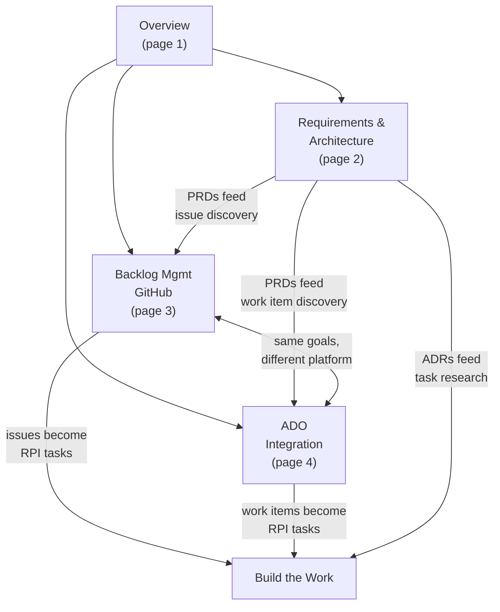
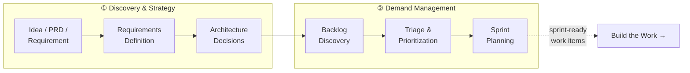
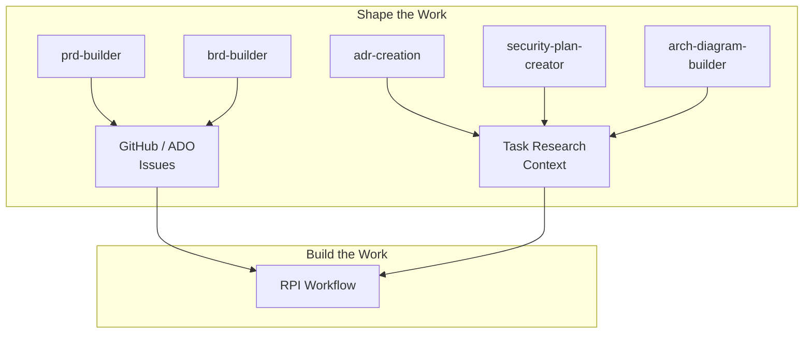
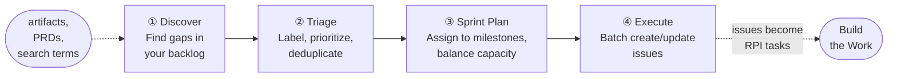
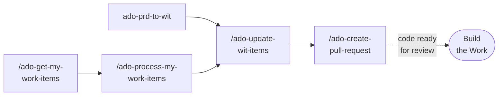

# Workshop: Shape the Work — Section Page Designs

**Type**: CLI Flow
**Plan**: 002-docusaurus-site
**Spec**: [./docusaurus-site-spec.md](../docusaurus-site-spec.md)
**Parent Workshop**: [./value-delivery-segments.md](./value-delivery-segments.md)
**Created**: 2026-02-18
**Status**: Draft

**Related Documents**:

* [Value Delivery Segments Workshop](./value-delivery-segments.md) — defines the 4-segment structure and artifact assessments
* [Research Dossier](../research-dossier.md) — HVE-Core artifact inventory and flow analysis
* [Artifact Relationship Map](../../001-hve-flow-mapping/artifact-relationship-map.md) — Mermaid diagrams of all 70 artifacts

---

## Purpose

Design the four pages that compose the "Shape the Work" section of the Docusaurus site. Each page needs a title, purpose statement, section headings, key diagrams, sample content showing voice and tone, and cross-links to adjacent sections.

The parent workshop identified this segment as covering delivery phases ① Discovery & Strategy and ② Demand Management & Prioritization, targeting Product Managers, Tech Leads, and TPMs. Twenty artifacts map here (8 Core, 12 Supporting), organized into two complete flows (GitHub Backlog Manager, ADO Work Items) and five standalone agents.

This workshop produces page blueprints ready for content authoring in Phase 2 of the plan.

## Key Questions Addressed

* What should each page teach, and in what order?
* Where does the "teach the concept, then show the tool" boundary sit for each page?
* What Mermaid diagrams make the flows learnable (not just documentable)?
* How do the four pages connect to each other and to "Build the Work"?
* What sample content establishes the right voice — educational, practical, honest about gaps?

---

## Design Principles for This Section

Three principles distinguish "Shape the Work" pages from reference documentation:

1. **Concept before tool.** Every page opens with WHY this activity matters in software delivery. The tool demonstration earns its place by solving a real problem the reader already understands.

2. **Honest coverage assessment.** Shape the Work is the repo's second-deepest area (20 artifacts, two complete flows), but it has real gaps: no OKR/roadmap tooling, no portfolio prioritization, no capacity planning. The pages acknowledge what's missing without apologizing.

3. **Flow over catalog.** Users don't arrive wanting a list of agents. They arrive with a question: "How do I turn this vague idea into an actionable plan?" The pages follow that journey.

---

## Page 1: Shape the Work — Overview

**Frontmatter**:

```yaml
---
title: "Shape the Work: Overview"
description: Why shaping work before writing code prevents the most expensive failure mode in software delivery, and what HVE-Core provides for this phase.
sidebar_position: 1
sidebar_label: Overview
tags: [shape-the-work, planning, demand-management]
keywords: [backlog, prioritization, requirements, PRD, strategy]
---
```

**Purpose**: Set the conceptual frame for the entire section. Teach the reader that lead time starts at backlog definition, not at first commit — and that most engineering organizations under-invest in this phase. Then introduce what HVE-Core provides, honestly.

### Section Headings

#### 1. The Most Expensive Bug Is Building the Wrong Thing

The opening section. No tools, no HVE-Core — just the insight.

**Key idea**: DORA research shows that lead time for changes is the #1 predictor of elite team performance, and most teams measure it from first commit. But cycle time starts when someone writes a vague ticket and drops it in the backlog. The gap between "someone had an idea" and "an engineer starts coding" is where organizations bleed time — through ambiguity, re-prioritization, missing context, and duplicated work.

**Sample content** (establishing the educational, direct voice):

> Most engineering teams optimize the wrong bottleneck. They invest in CI/CD pipelines, code review automation, and deployment tooling. Those matter. But the research tells a different story about where time actually goes.
>
> DORA's State of DevOps reports consistently show that elite-performing teams don't just code faster — they start with clearer work. The backlog isn't a parking lot for ideas. It's the first artifact in your delivery pipeline, and it deserves the same engineering discipline as your code.
>
> "Shape the Work" is about that discipline: turning vague ideas into clear, prioritized, actionable plans before anyone opens an editor.

#### 2. What "Shaping" Looks Like

A brief, concrete description of the shaping workflow. No tools yet — describe the human activities.

**Key idea**: Shaping is the progression from "we should probably do something about X" to "here is a scoped, prioritized work item with acceptance criteria that an engineer can pick up." It crosses two delivery phases: Discovery & Strategy (understanding the problem space) and Demand Management (deciding what to build, in what order).

**Diagram**: The shaping workflow from idea to sprint-ready backlog.

```
Mermaid: flowchart LR
  Idea/PRD/Requirement → Requirements Definition → Architecture Decisions
  → Backlog Discovery → Triage & Prioritization → Sprint Planning
  → Sprint-Ready Work Items

  Annotate the first three as "① Discovery & Strategy"
  Annotate the last three as "② Demand Management"
  Final node connects to "Build the Work" section with a dashed arrow
```

#### 3. What HVE-Core Provides for This Phase

The honest assessment. Two complete flows, five standalone agents, and the gaps.

**Sample content**:

> HVE-Core covers this phase with 20 artifacts organized into three areas:
>
> **Requirements & Architecture** — Five agents that help you define *what* to build. Generate PRDs, BRDs, architecture decision records, security plans, and architecture diagrams through guided, multi-turn conversations.
>
> **GitHub Backlog Management** — A complete orchestrated pipeline: discover issues from artifacts, triage and label them, plan sprints, and batch-execute changes. The GitHub Backlog Manager agent coordinates four specialized workflows with a 3-tier autonomy model.
>
> **Azure DevOps Integration** — The same capabilities for teams using ADO: discover work items, plan updates, and execute changes through instruction-driven prompts.
>
> **What's not here (yet)**: OKR and roadmap tooling, portfolio-level prioritization frameworks like WSJF, and capacity planning. Strategy today is project-scoped, not product-scoped. If your team needs these, the backlog management flows give you a foundation to build on.

#### 4. How This Section Is Organized

Navigation guide to the three sub-pages with one-sentence descriptions.

**Cross-links**:

* [Requirements & Architecture](./requirements-architecture) — defining what to build
* [Backlog Management with GitHub](./backlog-management-github) — the 4-workflow pipeline
* [Azure DevOps Integration](./ado-integration) — the ADO equivalent
* Forward link to [Build the Work: Overview](../build-the-work/overview) — where sprint-ready items become implemented features

---

## Page 2: Requirements & Architecture

**Frontmatter**:

```yaml
---
title: Requirements & Architecture
description: How to use PRD builder, BRD builder, ADR creation, security plan creator, and architecture diagram builder to define what your team should build.
sidebar_position: 2
sidebar_label: Requirements & Architecture
tags: [shape-the-work, requirements, architecture, prd, brd, adr]
keywords: [product requirements, business requirements, architecture decisions, security plan, diagrams]
---
```

**Purpose**: Teach the reader when and why to create different requirement and architecture artifacts, then show them how each agent works. The decision matrix ("which tool do I use?") is the centerpiece — readers should leave knowing which agent to reach for in a given situation.

### Section Headings

#### 1. Requirements Aren't Bureaucracy — They're Compressed Decisions

The conceptual opening. Frame requirements as a communication tool, not a compliance exercise.

**Key idea**: A PRD isn't a document someone files and forgets. It's compressed decision-making: every line is a choice you're making once so your team doesn't re-derive it fifty times during implementation. Architecture decisions are the same — an ADR captures *why* you chose one approach over another so future engineers don't reverse those decisions without understanding the tradeoffs.

**Sample content**:

> Every feature starts with a series of decisions. Who is this for? What does success look like? What are we deliberately not building? What security constraints apply?
>
> Those decisions happen whether you document them or not. The question is whether they happen once (in a structured artifact) or repeatedly (in Slack threads, PR comments, and "wait, I thought we decided...").
>
> HVE-Core provides five agents that capture these decisions through guided conversation. You don't fill out templates — you talk through the problem, and the agent structures what you say into an artifact your team can use.

#### 2. When to Use Which: Decision Matrix

The practical heart of the page. A table that maps situations to agents.

**Decision Matrix**:

```
Table with columns: Situation | Agent | Output | When to Use

Rows:
- "Defining a new feature or product capability"
  → prd-builder → Product Requirements Document
  → "Starting a new initiative; need to align stakeholders on scope"

- "Justifying a business investment or strategic initiative"
  → brd-builder → Business Requirements Document
  → "Need to articulate business case, ROI, success metrics"

- "Making a significant technical choice"
  → adr-creation → Architecture Decision Record
  → "Choosing between approaches where the 'why' matters as much as the 'what'"

- "Designing cloud infrastructure security"
  → security-plan-creator → Security Plan
  → "New deployment, compliance review, or security hardening exercise"

- "Communicating system structure visually"
  → arch-diagram-builder → ASCII Architecture Diagram
  → "Need a diagram that lives in markdown, not an external tool"
```

:::tip
If you're unsure, start with the PRD builder. A PRD session often reveals that you also need an ADR ("we need to decide on the authentication approach") or a security plan ("this handles PII"). The agents work well in sequence.
:::

#### 3. The Artifact Chain: How Requirements Feed Everything Downstream

Connect this page to the larger workflow. Requirements aren't endpoints — they feed backlog management and RPI research.

**Diagram**: The artifact chain from requirements to implementation.

```
Mermaid: flowchart TD
  PRD["PRD Builder"] --> Issues["GitHub / ADO Issues"]
  BRD["BRD Builder"] --> Issues
  ADR["ADR Creation"] --> Research["RPI Task Research"]
  SecPlan["Security Plan"] --> Research
  ArchDiag["Arch Diagram Builder"] --> Research
  Issues --> RPI["Build the Work<br>(RPI Flow)"]
  Research --> RPI

  Group PRD, BRD, ADR, SecPlan, ArchDiag as "Shape the Work"
  Group Issues, RPI as "Build the Work"
```

**Key idea**: A PRD doesn't just sit in a Google Doc. When you run issue discovery against a PRD, HVE-Core extracts requirements and translates them into GitHub issues or ADO work items — with acceptance criteria, labels, and milestone assignments. Those issues then feed the RPI workflow (Research → Plan → Implement → Review) in "Build the Work."

#### 4. Example: Walking Through a PRD Session

A concrete walkthrough showing the conversational flow. Use a realistic scenario (not "todo app" — something with enough complexity to demonstrate value).

**Sample scenario**: A team needs to add batch export functionality to a data platform. The walkthrough shows:

1. Starting the `prd-builder` agent in VS Code
2. The guided Q&A (the agent asks about personas, scope, success metrics, non-goals)
3. How the agent structures responses into PRD sections
4. The generated PRD output
5. How to feed the PRD into issue discovery (forward link to Backlog Management)

**Sample content** (showing agent interaction voice):

> Start a chat session with the `@prd-builder` agent. The conversation might look like this:
>
> **You**: We need batch export for our data platform. Users are asking for CSV and Parquet formats.
>
> **prd-builder**: Let's define this requirement clearly. A few questions to start:
> 1. Who are the primary users requesting this? Data analysts, external customers, or internal teams?
> 2. What data volumes are typical? This affects whether we need streaming export or can batch-process.
> 3. Are there any compliance constraints on exported data (PII masking, audit logging)?
>
> The agent doesn't accept your first answer at face value — it pushes for precision. That's the point. By the time the PRD is complete, your team has already resolved the ambiguities that would otherwise surface mid-sprint.

#### 5. The Supporting Cast: Risk Register and Architecture Diagrams

Brief coverage of the lower-profile tools. Not full walkthroughs — just enough to know they exist and when to use them.

* `/risk-register` — qualitative risk assessment for project planning
* `arch-diagram-builder` — ASCII architecture diagrams that live in markdown

**Cross-links**:

* Back to [Shape the Work: Overview](./overview)
* Forward to [Backlog Management with GitHub](./backlog-management-github) — turning requirements into issues
* Forward to [Build the Work: The RPI Workflow](../build-the-work/rpi-workflow) — how ADRs feed task research

---

## Page 3: Backlog Management with GitHub

**Frontmatter**:

```yaml
---
title: Backlog Management with GitHub
description: The GitHub Backlog Manager orchestrates four workflows — discover, triage, sprint plan, and execute — to turn requirements into a prioritized, sprint-ready backlog.
sidebar_position: 3
sidebar_label: Backlog Management
tags: [shape-the-work, github, backlog, issues, triage, sprint-planning]
keywords: [github issues, backlog management, triage, sprint planning, autonomy model]
---
```

**Purpose**: Teach the complete GitHub backlog management flow. This is the deepest page in the section — it covers an orchestrated agent with four sub-workflows, a 3-tier autonomy model, and a file-based handoff contract. The reader should understand the pipeline conceptually before diving into any single workflow.

### Section Headings

#### 1. Why Backlog Management Is Engineering Work

The conceptual opener. Frame backlog management as a discipline, not clerical work.

**Key idea**: A backlog isn't a list — it's a priority queue with dependencies, and maintaining it is engineering work. Triage isn't "reading issues and adding labels." It's classification, deduplication, and priority assessment against a versioning strategy. Sprint planning isn't "picking 10 issues." It's capacity-constrained optimization with dependency awareness. HVE-Core treats these as automatable engineering workflows, not manual chores.

**Sample content**:

> In most teams, backlog management follows one of two patterns. Either one person spends Friday afternoon manually triaging the week's issues (and hates it), or nobody does it (and the backlog becomes a graveyard of good intentions).
>
> Both patterns fail because they treat backlog management as clerical work. It isn't. Triage requires understanding the versioning strategy. Sprint planning requires dependency analysis. Issue discovery requires semantic matching against existing work. These are algorithmic problems dressed up as "project management."
>
> The GitHub Backlog Manager treats them as such.

#### 2. The Four-Workflow Pipeline

The architectural overview. Present the pipeline as a progression, not a list of features.

**Diagram**: The 4-workflow pipeline.

```
Mermaid: flowchart LR
  D["① Discover<br>Find gaps in<br>your backlog"]
  T["② Triage<br>Label, prioritize,<br>deduplicate"]
  S["③ Sprint Plan<br>Assign to milestones,<br>balance capacity"]
  E["④ Execute<br>Batch create/update<br>issues"]

  D --> T --> S --> E

  D -. "artifacts, PRDs,<br>search terms" .-> D
  E -. "issues become<br>RPI tasks" .-> Build["Build the Work"]

  Annotate: "The github-backlog-manager agent orchestrates
  all four workflows through a single conversation"
```

**Per-workflow summary** (brief — the detail is in how they connect, not in each workflow's internals):

| Workflow | Prompt | What It Does | Input | Output |
|---|---|---|---|---|
| Discover | `/github-discover-issues` | Find missing issues from PRDs, search terms, or "show me my issues" | Documents, search terms, or assignment query | `issue-analysis.md`, `issues-plan.md`, `handoff.md` |
| Triage | `/github-triage-issues` | Auto-label using conventional commit patterns, assign milestones, detect duplicates | `needs-triage` labeled issues | `triage-plan.md` with recommendations |
| Sprint Plan | `/github-sprint-plan` | Organize issues into milestones with dependency awareness | Open issues, milestone definitions | Sprint assignment plan |
| Execute | `/github-execute-backlog` | Batch create, update, link, and close issues from a handoff file | `handoff.md` from any upstream workflow | Created/updated GitHub issues |

#### 3. The Orchestrator vs Direct Prompts

Explain the two ways to use the backlog workflows.

**Key idea**: The `github-backlog-manager` agent is the orchestrator — you describe what you need in natural language, and it classifies your intent (triage? discovery? sprint planning?) and dispatches the right workflow. But you can also invoke any workflow directly with its prompt (`/github-discover-issues`, `/github-triage-issues`, etc.) if you know what you want.

**Sample content**:

> You have two entry points into backlog management:
>
> **The orchestrator** (`@github-backlog-manager`): Describe what you need in natural language. "Triage the untriaged issues in our repo." "Create issues from this PRD." "Plan the next sprint for milestone v2.3.0." The agent classifies your intent and dispatches the right workflow.
>
> **Direct prompts**: If you already know which workflow you need, invoke it directly. `/github-triage-issues` skips intent classification and goes straight to triage.
>
> Both paths produce the same output files and respect the same autonomy settings. The orchestrator adds convenience; the direct prompts add precision.

#### 4. The 3-Tier Autonomy Model

Explain the autonomy model with a clear decision guide.

**Key idea**: Different operations carry different risk. Creating an issue is low-risk (you can close it). Closing an issue might lose context. The autonomy model lets you tune how much the agent does without asking.

```
Table with columns: Tier | Create | Update | Link | Close | Best For

Rows:
- Full Autonomy
  → Auto | Auto | Auto | Auto
  → "Well-defined batch ops, high-confidence assessments"

- Partial (default)
  → Gate | Auto | Auto | Gate
  → "Most workflows — creation and deletion need human eyes"

- Manual
  → Gate | Gate | Gate | Gate
  → "Unfamiliar repos, sensitive backlogs, first-time use"
```

:::note
Partial autonomy is the default. The agent will create a plan and execute updates and links automatically, but pause for your approval before creating new issues or closing existing ones. Say "use full autonomy" to skip all gates, or "use manual" to approve every operation.
:::

#### 5. The Handoff File Contract

Explain the `.copilot-tracking/github-issues/` structure. This is the "how it actually works" section for users who want to understand the mechanism.

**Key idea**: Every backlog workflow produces markdown files in `.copilot-tracking/github-issues/<type>/<scope>/`. These files are the contract between planning and execution — they're human-readable, git-trackable, and resumable.

**File structure**:

```
.copilot-tracking/github-issues/
  discovery/
    <scope-name>/
      issue-analysis.md      ← Requirements extracted from artifacts
      issues-plan.md         ← Source of truth for planned operations
      planning-log.md        ← Operational log with phase tracking
      handoff.md             ← Execution checklist with checkboxes
      handoff-logs.md        ← Per-operation results (after execution)
  triage/
    <date>/
      triage-plan.md         ← Triage recommendations
      planning-log.md        ← Progress tracking
```

**Sample content**:

> The handoff file is the bridge between planning and execution. Each checkbox represents one GitHub API operation:
>
> ```markdown
> ## Issues
> ### Create
> - [ ] feat(agents): add batch triage support
>   - Labels: feature, agents, Milestone: v2.2.0
>   - Body: Add batch label operations to the triage workflow...
>
> ### Update
> - [x] #38: Update existing triage workflow scope
>   - Changes: labels, milestone
> ```
>
> Checked boxes (`[x]`) are done. Unchecked boxes (`[ ]`) are pending. If execution is interrupted — network failure, rate limit, context window — the agent resumes from the first unchecked box. No work is repeated.

#### 6. From Backlog to Build: The Handoff

Connect this section to "Build the Work." Show that issues created here become RPI tasks there.

**Key idea**: The output of backlog management is sprint-ready issues. The input to the RPI workflow (in "Build the Work") is an issue or task to implement. The connection is direct: point the RPI agent at an issue created by the backlog manager, and it picks up where shaping left off.

**Sample content**:

> An issue created by the backlog manager might look like this:
>
> ```
> feat(agents): add batch triage support
>
> ## Summary
> Add batch label operations to the triage workflow agent.
>
> ## Acceptance Criteria
> - [ ] Batch apply labels to multiple issues in a single operation
> - [ ] Support undo of batch label changes
> ```
>
> That same issue becomes the input to the RPI workflow. When an engineer picks it up, they invoke `/rpi` or `@rpi-agent` with the issue number, and the Research phase begins — reading the issue, understanding the codebase, and producing an implementation plan.
>
> The loop closes: requirements defined in "Shape the Work" become tasks executed in "[Build the Work](../build-the-work/overview)."

**Cross-links**:

* Back to [Shape the Work: Overview](./overview)
* Back to [Requirements & Architecture](./requirements-architecture) — PRDs feed discovery
* Parallel to [Azure DevOps Integration](./ado-integration) — the ADO equivalent
* Forward to [Build the Work: The RPI Workflow](../build-the-work/rpi-workflow) — where issues become implementations

---

## Page 4: Azure DevOps Integration

**Frontmatter**:

```yaml
---
title: Azure DevOps Integration
description: How HVE-Core manages Azure DevOps work items through instruction-driven prompts that parallel the GitHub backlog flow.
sidebar_position: 4
sidebar_label: ADO Integration
tags: [shape-the-work, azure-devops, work-items, ado]
keywords: [azure devops, work items, ADO, user stories, backlog, pull requests]
---
```

**Purpose**: Show teams using Azure DevOps how to accomplish the same outcomes as the GitHub flow. The page should make the parallel structure clear without making ADO users feel like second-class citizens. The architectural difference (instruction-driven vs orchestrated) is explained honestly but not framed as a weakness.

### Section Headings

#### 1. Same Goals, Different Platform

Brief opener acknowledging that GitHub and ADO serve the same purpose here. Frame the choice as organizational, not technical.

**Sample content**:

> If your team uses Azure DevOps for work item tracking, this page is your starting point. The goals are identical to the [GitHub Backlog Management](./backlog-management-github) flow: discover missing work items, plan updates, and execute changes in batch.
>
> The difference is architectural: GitHub backlog management has a single orchestrator agent (`github-backlog-manager`) that dispatches specialized workflows. ADO integration uses individual prompts that you invoke directly. The prompts follow shared instruction files that ensure consistency, but there's no orchestrator coordinating between them.
>
> This isn't a maturity gap — it reflects how each platform's API and tooling works best. Choose based on which platform your team already uses for work tracking.

#### 2. The ADO Workflow

Present the ADO flow as a pipeline that mirrors the GitHub one.

**Diagram**: The ADO workflow pipeline.

```
Mermaid: flowchart LR
  G["/ado-get-my-<br>work-items<br>Fetch assigned items"]
  D["/ado-process-my-<br>work-items<br>Discover & enrich"]
  P["ado-prd-to-wit<br>PRD → Work Items"]
  U["/ado-update-<br>wit-items<br>Execute changes"]
  PR["/ado-create-<br>pull-request<br>PR with linking"]

  G --> D --> U
  P --> U
  U --> PR
  PR -. "code becomes<br>RPI tasks" .-> Build["Build the Work"]

  Annotate: "Each box is a separate prompt — invoke them individually"
```

#### 3. The ADO Prompts

A summary table of the available prompts, mapping each to its GitHub equivalent.

```
Table with columns: ADO Prompt | Purpose | GitHub Equivalent

Rows:
- /ado-get-my-work-items
  → "Fetch work items assigned to you or recently modified"
  → "Path A of /github-discover-issues"

- /ado-process-my-work-items
  → "Enrich work items with context for task planning"
  → "(No direct equivalent — combines discovery enrichment with sprint context)"

- ado-prd-to-wit (agent)
  → "Analyze PRDs and plan ADO work item hierarchies"
  → "Path B of /github-discover-issues"

- /ado-update-wit-items
  → "Batch create, update, and link work items from a handoff file"
  → "/github-execute-backlog"

- /ado-create-pull-request
  → "Create ADO pull request with automated description, work item linking, reviewer identification"
  → "/pull-request (GitHub PR generation)"

- /ado-get-build-info
  → "Retrieve build status, logs, and changes from ADO pipelines"
  → "(No GitHub equivalent — GitHub Actions uses different tooling)"
```

#### 4. Work Item Hierarchy

Explain the ADO-specific hierarchy: Epic → Feature → User Story → Task/Bug.

**Key idea**: ADO enforces a stricter hierarchy than GitHub. Features require Epic parents. User Stories require Feature parents. The planning prompts respect this hierarchy — when creating work items from a PRD, they'll create the parent structure if it doesn't exist.

#### 5. The Planning File Contract

Show that ADO uses the same `.copilot-tracking/` pattern as GitHub, with ADO-specific templates.

**File structure**:

```
.copilot-tracking/workitems/
  discovery/
    <artifact-name>/
      artifact-analysis.md     ← Extracted requirements with working field values
      work-items.md            ← Source of truth for planned operations
      planning-log.md          ← Operational log with similarity assessments
      handoff.md               ← Execution checklist
```

**Sample content**:

> The planning file structure mirrors the GitHub flow. Work items planned for creation have `WI` reference numbers (WI001, WI002) that resolve to ADO System.Id values during execution. The similarity assessment framework is identical — discovered work items are classified as Match, Similar, Distinct, or Uncertain before deciding whether to create new items or update existing ones.
>
> For details on the planning file templates and field conventions, see the [artifact contracts reference](../reference/artifact-contracts).

#### 6. When to Use ADO vs GitHub

A brief, non-prescriptive guide. The decision is organizational, but the page should help teams who haven't decided yet.

**Sample content**:

> Choose based on where your team already tracks work:
>
> * **Your team uses GitHub Issues**: Use the [GitHub Backlog Manager](./backlog-management-github). It's orchestrated, has the deepest integration, and handles triage, sprint planning, and execution through a single agent.
> * **Your team uses Azure DevOps**: Use the ADO prompts. They cover the same workflow through individual invocations and support ADO's richer work item hierarchy (Epics, Features, User Stories, Tasks).
> * **Your team uses both**: This happens. The planning file formats are compatible, but there's no cross-platform sync. Pick one as the source of truth for work items and use the other for platform-specific operations (like ADO build info or GitHub Actions).

**Cross-links**:

* Back to [Shape the Work: Overview](./overview)
* Parallel to [Backlog Management with GitHub](./backlog-management-github)
* Forward to [Build the Work: Code Review & PRs](../build-the-work/code-review-prs) — ADO PR creation
* Reference to [Artifact Contracts](../reference/artifact-contracts) — planning file schemas

---

## Cross-Section Navigation Map

How the four pages connect to each other and to adjacent sections:



Every page should include:

* **Breadcrumb context**: Where this page sits in Shape the Work
* **Forward links**: At least one explicit connection to Build the Work
* **Platform parity links**: GitHub pages link to ADO equivalent and vice versa

---

## Voice and Tone Guidelines for This Section

The parent workshop established three personas for Shape the Work: Product Managers, Tech Leads, and TPMs. The voice should match.

### Do

* **Teach the concept first.** "Triage is classification against a versioning strategy" before "here's how to run `/github-triage-issues`."
* **Use concrete examples.** Show a real-looking PRD excerpt, a real-looking issue, a real-looking handoff file. Abstract descriptions don't land with PMs.
* **Acknowledge gaps honestly.** "No portfolio prioritization yet" is more trustworthy than silence.
* **Show the connection to downstream work.** Every page should answer "and then what?" — requirements become issues, issues become RPI tasks, RPI tasks become merged PRs.
* **Be direct about tradeoffs.** "Full autonomy is faster but skips review gates. Partial is the default for a reason."

### Don't

* **Don't catalog agents.** "Here are 5 agents with their descriptions" is a reference page, not a tutorial.
* **Don't over-qualify.** Avoid "it's worth noting that..." and "it should be mentioned that..." — state the thing directly.
* **Don't use em dashes** for asides. Use commas, colons, or separate sentences per the writing style instructions.
* **Don't assume familiarity** with HVE-Core internals. Shape the Work readers may never read the instruction files. They interact through agents and prompts.
* **Don't speculate** about benefits not demonstrated by the tooling. "Reduces planning time by 50%" requires evidence.

### Sample tone comparison

**Too formal (strategic document voice)**:

> The platform provides comprehensive demand management capabilities through orchestrated workflow automation, enabling stakeholders to achieve alignment on deliverables prior to engineering commitment.

**Too casual (blog post voice)**:

> So you've got a pile of ideas and no plan? Let's fix that! The backlog manager is super easy to use and will save you tons of time.

**Right (educational, direct, practical)**:

> A pile of ideas isn't a plan. The backlog manager turns unstructured requirements into prioritized, sprint-ready issues through four workflows: discover what's missing, triage what exists, plan the sprint, and execute the changes. Each workflow produces files you can review before anything hits GitHub.

---

## Diagram Specifications

All diagrams use Mermaid fenced code blocks. Line breaks within nodes use `<br>` per the Docusaurus conventions. Colors and styling are minimal — the diagrams should be readable in both light and dark themes.

### Diagram 1: The Shaping Workflow (Page 1)



### Diagram 2: The Artifact Chain (Page 2)



### Diagram 3: The 4-Workflow Pipeline (Page 3)



### Diagram 4: The ADO Workflow (Page 4)



---

## Content Estimation

| Page | Sections | Diagrams | Estimated Word Count | Complexity |
|---|---|---|---|---|
| Overview | 4 | 1 | 600–800 | Low |
| Requirements & Architecture | 5 | 1 | 1000–1400 | Medium |
| Backlog Management (GitHub) | 6 | 1 | 1400–1800 | High |
| ADO Integration | 6 | 1 | 800–1100 | Medium |

Total section: ~3800–5100 words across 4 pages, 4 Mermaid diagrams.

The GitHub Backlog Management page is the longest because it covers an orchestrated agent with a 3-tier autonomy model and file-based contracts. The Overview is shortest because it frames the section without duplicating content from sub-pages.

---

## Open Questions

### Q1: Should the PRD walkthrough example use a real HVE-Core scenario or a fictional product?

**OPEN**: A real HVE-Core scenario (like "add batch export to the backlog manager") is authentic but risks being self-referential. A fictional product scenario is more relatable to diverse readers but loses the "dogfooding" credibility. Recommendation: use a realistic but fictional scenario in a domain readers recognize (data platform, API service, mobile app feature).

### Q2: How much of the handoff file format should the Backlog Management page show?

**OPEN**: The full template is in `github-backlog-planning.instructions.md` and runs to ~50 lines. Options:

* **Option A**: Show a minimal example (5-10 lines) with a link to the reference page for the full schema. Keeps the page focused on concepts.
* **Option B**: Show a complete example with annotations explaining each section. More self-contained but longer.

Recommendation: Option A. The Backlog Management page teaches the workflow; the Reference section documents the schema. Link to [Artifact Contracts](../reference/artifact-contracts) for the full specification.

### Q3: Should the ADO page include a walkthrough equivalent to the GitHub page?

**OPEN**: The GitHub page has a detailed "how the handoff file works" section. Adding an equivalent ADO walkthrough doubles the effort for what is architecturally the same mechanism with different field names. Recommendation: explain the differences from GitHub (hierarchy requirements, field naming, prompt-based vs orchestrated) and link to the GitHub page for the shared concepts.

---

## Workshop Opportunities

| # | Topic | Type | Why Workshop | Priority |
|---|---|---|---|---|
| 1 | **PRD-to-Issue End-to-End** | CLI Flow | Walk through a complete PRD → discovery → triage → sprint plan → execute cycle showing every artifact produced at each stage | High — becomes the hero demo for Shape the Work |
| 2 | **Autonomy Model UX Patterns** | Integration Pattern | Design the Docusaurus content for explaining the 3-tier model interactively (toggleable examples? tabbed content?) | Medium — affects page 3 presentation |
| 3 | **ADO vs GitHub Comparison Table** | Storage Design | Build a comprehensive feature parity table covering all operations across both platforms | Low — useful reference but not blocking |

---

## Impact on Plan

Phase 2 content authoring for the "Shape the Work" section should follow the page designs in this workshop:

| Page | Source of Truth | Key Dependencies |
|---|---|---|
| Overview (position 1) | This workshop, Page 1 design | None — can be authored first |
| Requirements & Architecture (position 2) | This workshop, Page 2 design | PRD builder agent exists and is stable |
| Backlog Management (position 3) | This workshop, Page 3 design | GitHub Backlog Manager agent, instruction files |
| ADO Integration (position 4) | This workshop, Page 4 design | ADO instruction files, Page 3 authored first |

Authoring order recommendation: Overview → Requirements & Architecture → Backlog Management → ADO Integration. Each page builds on concepts introduced in the previous one, and the ADO page explicitly references the GitHub page for shared concepts.
