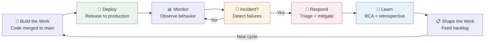
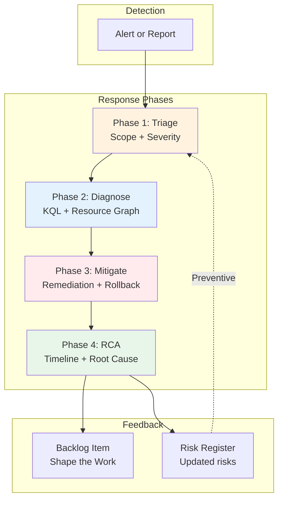
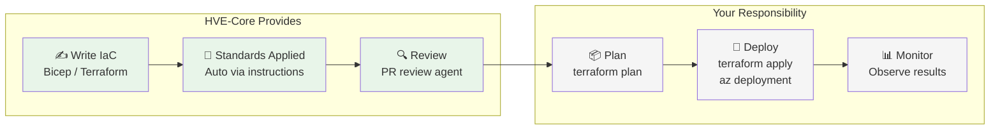
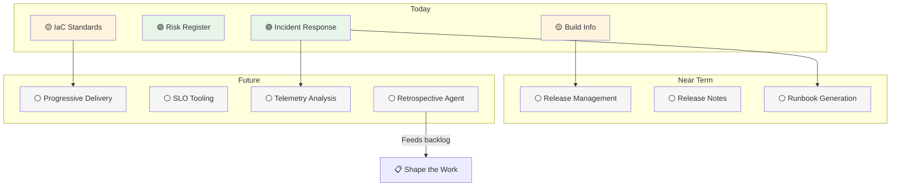
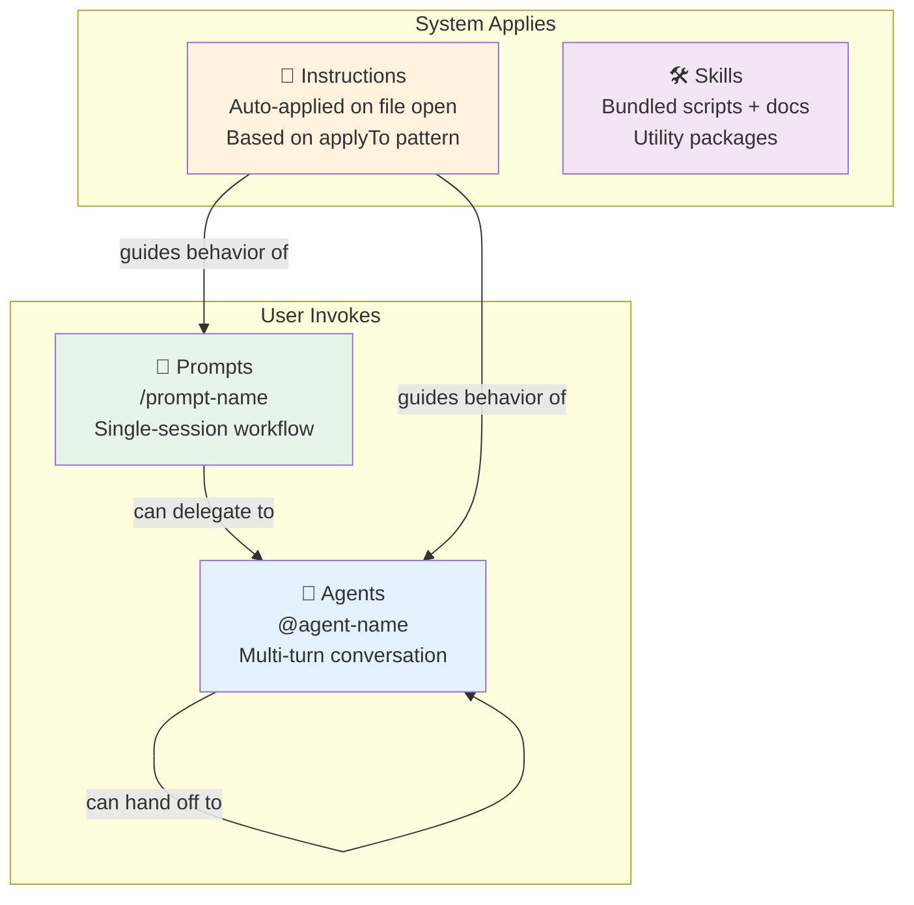

# Workshop: Ship It & Reference Section Design

**Type**: Integration Pattern
**Plan**: 002-docusaurus-site
**Spec**: [./docusaurus-site-spec.md](../docusaurus-site-spec.md)
**Created**: 2026-02-18
**Status**: Draft

**Related Documents**:

* [Value Delivery Segments Workshop](./value-delivery-segments.md) — Segment definitions, artifact assessments, coverage heatmap
* [Research Dossier](../research-dossier.md) — HVE-Core artifact inventory and flow analysis
* [Docusaurus Site Plan](../docusaurus-site-plan.md) — Implementation phases and task breakdown

---

## Purpose

Design the page-level content for two site segments: **Ship It** (sidebar position 4) and **Reference** (sidebar position 5). These are the thinnest and most meta sections of the site respectively, and each presents a distinct authoring challenge.

Ship It covers delivery phases ⑤ Deployment & Operations and ⑥ Closing the Loop. Only 8 artifacts map here, most are secondary mappings, and only one (incident-response) is a primary operations tool. The educational framing matters more than the tooling showcase because the concepts of feedback loops, failure recovery, and learning from production are central to the value delivery model even when the current tooling is sparse.

Reference is the meta-section: artifact catalog, frontmatter contracts, contributing guide. It serves users who need to look things up, extend the system, or understand the architecture of HVE-Core itself.

## Key Questions Addressed

* How do you write compelling pages for a segment with thin tooling coverage?
* What's the right balance between honesty about gaps and vision for the future?
* How should the educational narrative frame the DORA and ESSP connections?
* What format should the all-artifacts reference page use?
* How does the Reference section serve both consumers and contributors?

---

## Ship It: Design Rationale

### The Honesty Problem

The value delivery segments workshop identified Ship It as the weakest segment:

```
                    SHAPE        BUILD        SHIP
                    THE WORK     THE WORK     IT
                    ──────────   ──────────   ──────────
Deployment          ░░░░░░░░░░   ░░░░░░░░░░   ████░░░░░░
Ops & Monitoring    ░░░░░░░░░░   ░░░░░░░░░░   ██░░░░░░░░
Feedback Loop       ░░░░░░░░░░   ░░░░░░░░░░   █░░░░░░░░░
```

Eight artifacts total. One primary prompt. Zero orchestrated flows. The temptation is to either inflate what exists or hide the section entirely. Both are wrong.

The right approach: **lead with the concepts, anchor to the artifacts that exist, and be transparent about what's coming.** The DORA and ESSP research gives Ship It intellectual weight that compensates for thin tooling. Users reading this section learn *why* closing the loop matters even if HVE-Core can't automate all of it today.

### The DORA and ESSP Connection

Two research frameworks give Ship It its narrative backbone:

**DORA Four Key Metrics** — Ship It directly measures two of them:

* **Change Failure Rate**: What percentage of deployments cause a failure requiring remediation? The incident-response prompt lives here.
* **Mean Time to Recovery (MTTR)**: How quickly does the team restore service? Incident response workflow directly impacts this.

The other two metrics (Deployment Frequency, Lead Time for Changes) are Build the Work concerns. Ship It is where you learn whether your speed is sustainable.

**ESSP (Engineering Systems Success Platform) Quality Zone**:

* **Failed Deployment Recovery Time**: How long from "deployment broke something" to "service restored"? This maps directly to incident response and monitoring.
* **Change Failure Rate**: Same metric, measured at the deployment boundary.

The Quality zone sits between the Velocity zone (Build the Work) and the Impact zone (strategic outcomes). Ship It is the bridge.

### Current Artifact Inventory

| Artifact | Type | Tag | Primary/Secondary | DORA Metric |
|---|---|---|---|---|
| `/incident-response` | Prompt | 🟡 Supporting | Primary | MTTR, CFR |
| `/risk-register` | Prompt | 🟡 Supporting | Primary (Shape crossover) | CFR (preventive) |
| `/ado-get-build-info` | Prompt | 🟡 Supporting | Secondary | — |
| `bicep` | Instruction | 🟡 Supporting | Secondary (Build crossover) | — |
| `terraform` | Instruction | 🟡 Supporting | Secondary (Build crossover) | — |
| `community-interaction` | Instruction | 🟡 Supporting | Secondary | — |
| `hve-core/workflows` | Instruction | ⚪ Meta | Secondary | — |
| `video-to-gif` | Skill | 🟡 Supporting | Unrelated | — |

Of these 8 artifacts, only `incident-response` and `risk-register` are genuine Ship It tools. The IaC instructions (`bicep`, `terraform`) help write deployment code but are coding standards, not deployment automation. `community-interaction` handles contributor communication (feedback loop adjacent). `ado-get-build-info` monitors ADO builds. `video-to-gif` has no Ship It connection.

The honest count: **2 primary operations tools, 3 secondary crossovers, 3 weak or unrelated mappings.**

---

## Ship It: Page Designs

### Page 1: Ship It Overview

**File**: `docs/docusaurus/docs/ship-it/overview.md`

```yaml
---
title: "Ship It: Closing the Loop"
description: Why the feedback loop from production back to planning matters more than shipping faster
sidebar_position: 1
---
```

**Purpose**: Frame the Ship It segment around the insight that elite engineering teams differentiate not by deployment speed but by learning speed. Introduce the DORA and ESSP connections. Be honest about current coverage.

**Section Outline**:

```markdown
## Why Closing the Loop Matters More Than Shipping Faster

[Opening paragraph: The natural instinct is to optimize for speed — faster
deployments, shorter lead times. But DORA research consistently shows that
elite teams don't just ship faster; they have tighter feedback loops. They
learn from production. They recover faster. They feed operational insights
back into planning.]

## The DORA Insight

[Explain the four key metrics and how Ship It owns two of them:
Change Failure Rate and Mean Time to Recovery. Include a simple table
showing which segment owns which metric.]

## The ESSP Quality Zone

[Explain how the Quality zone bridges Velocity (Build) and Impact
(strategic outcomes). Failed Deployment Recovery Time lives here.
This is where speed meets sustainability.]
```

**Key Diagram — The Ship → Learn → Shape Loop**:



**Sample Content — Honest Coverage Statement**:

```markdown
## What HVE-Core Provides Today

Ship It is the thinnest segment in HVE-Core's current tooling. That's worth
acknowledging directly.

:::note What exists
HVE-Core provides an **incident response prompt** for Azure operations
scenarios, a **risk register** for qualitative risk assessment, and
**IaC coding standards** (Bicep and Terraform) that help you write
deployment code correctly. Build monitoring is available through the
ADO build info prompt.
:::

:::info What's missing
Release management, progressive delivery (canary deployments, feature
flags), SLO/SLA tooling, runbook generation, monitoring configuration,
telemetry analysis, and retrospective facilitation are all gaps today.
See [What's Coming](whats-coming) for the roadmap.
:::

The concepts in this section matter regardless of tooling maturity. Teams
that understand the Ship → Learn → Shape loop make better architectural
decisions even without automation for every step.
```

**Cross-links**:

* [Build the Work: Coding Standards](../build-the-work/coding-standards) — where IaC instructions live
* [Shape the Work: Overview](../shape-the-work/overview) — where learnings feed back
* [What's Coming](whats-coming) — future roadmap
* [Incident Response](incident-response) — the primary Ship It tool

---

### Page 2: Incident Response

**File**: `docs/docusaurus/docs/ship-it/incident-response.md`

```yaml
---
title: Incident Response
description: AI-assisted incident triage, diagnosis, and root cause analysis for Azure operations
sidebar_position: 2
---
```

**Purpose**: Showcase the incident-response prompt as a structured workflow for SRE teams. Connect to the risk-register prompt as a preventive complement. Show how incident learnings feed back to Shape the Work.

**Section Outline**:

```markdown
## The Incident Response Workflow

[Explain the four-phase model: Triage → Diagnose → Mitigate → RCA.
Each phase is a structured set of AI-guided questions and actions.]

## Using the Incident Response Prompt

[Practical walkthrough of invoking `/incident-response` with severity
levels and phase targeting. Show the argument hint:
`[incident-description] [severity={1|2|3|4}] [phase={triage|diagnose|mitigate|rca}]`]

## Phase 1: Initial Triage

[What the prompt asks for, what it helps you assess. Show sample
interaction with an Azure service disruption.]

## Phase 2: Diagnostic Investigation

[KQL query generation, resource graph queries, activity log analysis.
The prompt generates diagnostic queries tailored to the incident context.]

## Phase 3: Mitigation

[Recommendations for immediate remediation, rollback procedures,
communication templates.]

## Phase 4: Root Cause Analysis

[RCA document generation, timeline construction, contributing factor
identification.]

## Risk Assessment with the Risk Register

[The risk-register prompt complements incident response by identifying
risks before they become incidents. Qualitative P×I matrix approach.
This is the preventive counterpart to the reactive incident workflow.]

## Closing the Loop: From Incidents to Backlog

[How RCA findings and risk register outputs feed back into Shape the
Work. An incident isn't truly resolved until the systemic fix is
planned, prioritized, and tracked.]
```

**Key Diagram — The Incident Lifecycle**:



**Sample Content — Invocation Example**:

```markdown
## Using the Incident Response Prompt

Invoke the prompt with the incident description and optional parameters:

```text
/incident-response "API gateway returning 503 errors for 15% of requests
in East US region, started approximately 20 minutes ago"
severity=2 phase=triage
```

The prompt walks through structured triage questions:

* **What is happening?** Symptoms, error messages, user reports
* **When did it start?** Incident timeline and first detection
* **What is affected?** Services, resources, regions, user segments
* **What changed recently?** Deployments, configuration changes, dependency updates

Based on your answers, it generates diagnostic queries tailored to the
affected Azure services and suggests immediate mitigation steps.

:::tip Severity Levels
* **Severity 1** (Critical): Complete service outage or data loss
* **Severity 2** (High): Major feature degradation affecting many users
* **Severity 3** (Medium): Partial impact with workaround available
* **Severity 4** (Low): Minor issue with minimal user impact
:::
```

**Sample Content — Feedback Loop**:

```markdown
## Closing the Loop: From Incidents to Backlog

An incident isn't resolved when service is restored. It's resolved when
the systemic cause is addressed. The RCA output from Phase 4 connects
directly to the backlog management tools in
[Shape the Work](../shape-the-work/backlog-management):

1. RCA identifies a contributing factor (e.g., "No circuit breaker on
   downstream dependency")
2. Create a backlog item using `/github-discover-issues` or
   `/github-add-issue` with the RCA as context
3. The item enters the triage and sprint planning flow
4. The fix is built through [the RPI workflow](../build-the-work/rpi-workflow)
5. The deployment is monitored — closing the loop

This cycle is what DORA research measures as organizational learning
capability. Teams that formalize this loop improve their Change Failure
Rate over time.
```

**Cross-links**:

* [Shape the Work: Backlog Management](../shape-the-work/backlog-management) — where RCA outputs go
* [Build the Work: RPI Workflow](../build-the-work/rpi-workflow) — how fixes get implemented
* [Ship It: Overview](overview) — DORA metrics context
* [Reference: Artifact Types](../reference/artifact-types) — prompt file mechanics

---

### Page 3: Infrastructure as Code

**File**: `docs/docusaurus/docs/ship-it/infrastructure-as-code.md`

```yaml
---
title: Infrastructure as Code
description: How Bicep and Terraform instruction files help you write deployment code correctly
sidebar_position: 3
---
```

**Purpose**: Explain what the IaC instruction files do and what they don't do. The distinction between writing IaC correctly (what HVE-Core provides) and deploying it (what HVE-Core doesn't provide) is critical for setting expectations.

**Section Outline**:

```markdown
## What HVE-Core Does for IaC

[Clear statement: HVE-Core provides auto-applied coding standards for
Bicep and Terraform. These are instruction files that activate when you
edit `.bicep` or `.tf` files. They enforce conventions, naming patterns,
and best practices.]

## What HVE-Core Does NOT Do

[Equally clear: HVE-Core does not deploy infrastructure. It does not
manage state files, run terraform apply, create Bicep deployments, or
orchestrate release pipelines. The instructions help you write correct
IaC; deploying it remains your responsibility.]

## Bicep Conventions

[Summary of what the Bicep instruction file enforces: naming conventions,
parameter patterns, module structure, API versioning, type system usage.
Reference the full instruction file for details.]

## Terraform Conventions

[Summary of what the Terraform instruction file enforces: project
structure, variable conventions, module patterns, state management
practices, provider configuration.]

## How Auto-Applied Instructions Work

[Explain the applyTo mechanism: when you edit a `.tf` file, Copilot
automatically loads the terraform instructions. No invocation needed.
This is invisible quality assurance.]

## The IaC → Deploy Gap

[Honest acknowledgment: a complete Ship It experience would include
deployment orchestration, progressive rollout, and infrastructure
validation. These are future opportunities.]
```

**Key Diagram — Where IaC Instructions Fit**:



**Sample Content — The Distinction**:

```markdown
## The Distinction Matters

When someone asks "Does HVE-Core help with deployment?" the honest
answer is: **it helps you write deployment code correctly, but it
doesn't deploy anything.**

This is an important distinction. The Bicep and Terraform instruction
files are coding standards — they belong in the same category as the
C# conventions or the Python script instructions. They happen to apply
to infrastructure code, which makes them *adjacent* to deployment, but
they're fundamentally authoring tools.

:::info Auto-applied standards
When you open a `.bicep` file, Copilot automatically loads the Bicep
instruction file. You don't invoke anything. The instructions guide
naming conventions, parameter patterns, module structure, and API
version selection as you write.
:::

The same pattern applies to Terraform. Open a `.tf` file and the
Terraform instructions activate, enforcing project structure,
variable conventions, and provider configuration.

For more on how auto-applied instructions work, see
[Artifact Types](../reference/artifact-types).
```

**Sample Content — Bicep Highlights**:

```markdown
## Bicep Conventions at a Glance

The Bicep instruction file covers:

| Area | What It Enforces |
|---|---|
| Naming | `kebab-case` files, `camelCase` parameters, `PascalCase` types |
| Parameters | Grouped by function (Identity, Networking, Storage, etc.) |
| Descriptions | Every parameter and type needs `@description()` |
| Resource names | Azure naming convention patterns with prefix/environment/instance |
| Modules | Main module orchestrates, sub-modules receive all values from parent |
| Types | Shared types in `types.bicep` with `@export()` and `@description()` |
| API versions | Use latest stable, consistent within files |

These conventions are enforced through the instruction file at
`.github/instructions/bicep/bicep.instructions.md`. Copilot follows
them automatically when you're working in Bicep files.
```

**Cross-links**:

* [Build the Work: Coding Standards](../build-the-work/coding-standards) — the broader coding standards story
* [Reference: Artifact Types](../reference/artifact-types) — how instructions auto-apply
* [Ship It: What's Coming](whats-coming) — deployment orchestration as a future direction

---

### Page 4: What's Coming

**File**: `docs/docusaurus/docs/ship-it/whats-coming.md`

```yaml
---
title: What's Coming
description: Roadmap for Ship It tooling — release management, SLO tooling, and closing the feedback loop
sidebar_position: 4
---
```

**Purpose**: Honest roadmap for Ship It. This page serves three audiences: users wanting to know the vision, potential contributors looking for impactful work, and the team itself for tracking aspirational direction.

**Section Outline**:

```markdown
## The Vision: A Complete Ship It

[What would a fully-equipped Ship It segment look like? Paint the
picture without overpromising timelines.]

## Release Management

[Release agents/prompts that help with changelogs, semantic versioning,
release notes generation, and deployment coordination. Currently
a gap — the commit-message instruction produces conventional commits,
but nothing aggregates them into releases.]

## Progressive Delivery

[Canary deployments, feature flags, A/B testing coordination. These
are complex workflows that benefit from AI-assisted configuration and
monitoring. Not currently on the roadmap but represents the ideal.]

## SLO and SLA Tooling

[Service Level Objective definition, error budget tracking, SLA
compliance reporting. An SLO agent could help teams define objectives,
generate monitoring queries, and track burn rates.]

## Telemetry and Observability

[Log analysis, metric correlation, distributed tracing investigation.
An observability agent could help teams navigate complex telemetry
data and identify patterns. This connects strongly to
incident response.]

## Retrospective Facilitation

[The missing piece in the ⑥→① feedback arc. A retrospective agent
could structure incident postmortems, extract action items, and
ensure they reach the backlog. This is where DORA's
"learning from failures" becomes concrete.]

## How to Contribute

[Specific guidance for contributors who want to close these gaps.
Point to the contributing guide, the prompt-builder instructions,
and the existing patterns they can follow.]

## Research Opportunities

[Topics identified in the value-delivery-segments workshop that
need deeper investigation before implementation.]
```

**Key Diagram — Aspirational Ship It**:



**Sample Content — Contributing Call-to-Action**:

```markdown
## How to Contribute

Ship It has the most contribution opportunity of any HVE-Core segment.
Every item in the "Near Term" and "Future" categories represents a
meaningful addition to the project.

If you're interested in contributing:

1. Review the [artifact types](../reference/artifact-types) to
   understand the difference between agents, prompts, and instructions
2. Study an existing prompt like `incident-response.prompt.md` as a
   pattern to follow
3. Read the [contributing guide](../reference/contributing-to-docs)
   for documentation conventions
4. Open an issue describing what you'd like to build — the maintainers
   can help scope it

:::tip High-impact contribution areas
* **Release notes generation** — aggregate conventional commits into
  changelogs. The `commit-message` instruction already produces
  structured commits; an agent that reads them and generates release
  notes would complete the chain.
* **Retrospective facilitation** — structure RCA outputs into
  retrospective documents with action items that feed the backlog.
  This closes the ⑥→① feedback arc that DORA identifies as the
  differentiator for elite teams.
:::
```

**Sample Content — Research Opportunities**:

```markdown
## Research Opportunities

These topics were identified in the site planning process as areas
needing investigation before implementation:

| Topic | Why It Matters | Complexity |
|---|---|---|
| Release management patterns | What does an AI-assisted release workflow look like? Changelog generation, version bumping, deployment coordination | Medium — clear patterns exist in the ecosystem |
| SLO definition assistance | How can AI help teams define meaningful SLOs? Error budget calculation, burn rate alerts | High — requires deep domain knowledge |
| Retrospective agent design | How do you structure a retrospective that produces actionable backlog items? | Medium — the RCA-to-backlog pattern already exists in incident-response |
| Telemetry analysis patterns | What KQL/query patterns help diagnose production issues beyond incidents? | High — broad scope, needs focused use cases |
```

**Cross-links**:

* [Ship It: Overview](overview) — the DORA/ESSP framing for why this matters
* [Ship It: Incident Response](incident-response) — the foundation to build on
* [Shape the Work: Overview](../shape-the-work/overview) — where the feedback loop lands
* [Reference: Artifact Types](../reference/artifact-types) — how to build new artifacts
* [Reference: Contributing to Docs](../reference/contributing-to-docs) — contribution guidelines

---

## Reference: Design Rationale

### The Meta-Section Challenge

Reference serves users with a fundamentally different intent than the three delivery segments. Shape, Build, and Ship answer "How do I do this?" Reference answers:

* "What types of artifacts exist and how do they work?"
* "What fields go in frontmatter?"
* "How do I contribute new content?"
* "What's the complete list of everything in HVE-Core?"

These are lookup tasks, not learning journeys. The pages need to be scannable, precise, and comprehensive. Tables, schema definitions, and catalogs dominate.

### Audience Split

Reference has two distinct audiences:

| Audience | Need | Key Page |
|---|---|---|
| **Consumers** (using HVE-Core) | Understand what's available and how to find it | Artifact Types, All Artifacts A-Z |
| **Contributors** (extending HVE-Core) | Understand the contracts and conventions | Frontmatter Schema, Contributing to Docs |

The page order reflects this: consumers first (Artifact Types → All Artifacts), then contributors (Frontmatter Schema → Contributing).

---

## Reference: Page Designs

### Page 1: Artifact Types

**File**: `docs/docusaurus/docs/reference/artifact-types.md`

```yaml
---
title: Artifact Types
description: The four types of AI artifacts in HVE-Core — agents, prompts, instructions, and skills
sidebar_position: 1
---
```

**Purpose**: Explain the 4-layer artifact model that structures every AI customization in HVE-Core. Help users understand which type to use for what purpose and how each type activates.

**Section Outline**:

```markdown
## The Four Artifact Types

[Opening: HVE-Core organizes AI customizations into four types, each
with a distinct activation model and purpose. Understanding these
types is essential for using and extending the system.]

## Agents (.agent.md)

[Multi-turn conversational or autonomous workflows. Agents have
tools, can hand off to other agents, and maintain context across
turns. Invoked by mentioning @agent-name in chat.]

## Prompts (.prompt.md)

[Single-session workflows. Invoke with /prompt-name and Copilot
executes to completion. Prompts can delegate to agents. Accept
input variables.]

## Instructions (.instructions.md)

[Auto-applied coding standards. No invocation needed — they activate
based on file patterns (applyTo glob). The invisible quality layer.]

## Skills (SKILL.md)

[Self-contained packages bundling documentation with executable
scripts. Skills provide utilities rather than conversational
guidance.]

## When to Use Which Type

[Decision guide: conversational → agent, one-shot → prompt,
auto-applied standard → instruction, utility with scripts → skill.]

## The Frontmatter Contract

[Every artifact starts with YAML frontmatter. The required and
optional fields vary by type. Link to the full schema reference.]
```

**Key Diagram — The 4-Layer Model**:



**Sample Content — Artifact Comparison Table**:

```markdown
## Artifact Type Comparison

| Aspect | Agents | Prompts | Instructions | Skills |
|---|---|---|---|---|
| File extension | `.agent.md` | `.prompt.md` | `.instructions.md` | `SKILL.md` |
| Activation | `@agent-name` in chat | `/prompt-name` command | Automatic on file open | Referenced by agents/prompts |
| Interaction | Multi-turn conversation | Single invocation | Invisible (no interaction) | Script execution |
| State | Persists across turns | Single session | Stateless | Stateless |
| Tools | Declared in frontmatter | Inherited from agent | N/A | Bundled scripts |
| Handoffs | Can hand off to other agents | Can delegate to one agent | N/A | N/A |
| Input variables | N/A | `${input:name}` syntax | N/A | Parameters in SKILL.md |
| Required frontmatter | `description` | `description` | `description`, `applyTo` | `name`, `description` |
```

**Sample Content — When to Use Which**:

```markdown
## When to Use Which Type

:::tip Decision Guide
* **"I need a multi-step conversation with a specialist"** → Agent
* **"I need to run a workflow once and get results"** → Prompt
* **"I need coding standards enforced whenever I edit certain files"** → Instruction
* **"I need a utility with scripts I can run"** → Skill
:::

### Common Patterns

* An **agent** that orchestrates other agents: `rpi-agent` dispatches
  `task-researcher`, `task-planner`, `task-implementor`, and
  `task-reviewer` in sequence
* A **prompt** that delegates to an agent: `/github-discover-issues`
  delegates to `@github-backlog-manager`
* An **instruction** that guides all agents: `commit-message.instructions.md`
  applies whenever any agent creates a git commit
* A **skill** with cross-platform scripts: `video-to-gif` bundles
  FFmpeg conversion for bash and PowerShell
```

**Cross-links**:

* [Frontmatter Schema Reference](frontmatter-schema) — complete field documentation
* [Getting Started: How It Works](../getting-started/how-it-works) — overview for new users
* [Contributing to Docs](contributing-to-docs) — how to create new artifacts
* [All Artifacts A-Z](all-artifacts) — complete catalog

---

### Page 2: Frontmatter Schema Reference

**File**: `docs/docusaurus/docs/reference/frontmatter-schema.md`

```yaml
---
title: Frontmatter Schema Reference
description: Complete schema reference for agent, prompt, instruction, and skill frontmatter fields
sidebar_position: 2
---
```

**Purpose**: Authoritative reference for every frontmatter field across all artifact types. Includes platform support matrix and validation rules.

**Section Outline**:

```markdown
## Frontmatter Basics

[Every artifact file starts with YAML frontmatter between `---`
delimiters. The fields control how the platform discovers, activates,
and presents the artifact.]

## Agent Frontmatter (.agent.md)

[Complete field table with types, required/optional, descriptions,
and examples.]

## Prompt Frontmatter (.prompt.md)

[Complete field table. Include argument-hint and input variable syntax.]

## Instruction Frontmatter (.instructions.md)

[Complete field table. Focus on applyTo patterns and glob syntax.]

## Skill Frontmatter (SKILL.md)

[Complete field table. Name must match directory name.]

## Platform Support Matrix

[Which platforms support which fields: VS Code Chat, Copilot CLI,
Coding Agent, Claude Code.]

## Input Variable Syntax

[Detailed reference for ${input:name} and ${input:name:default}
patterns used in prompts.]

## Validation

[How to validate frontmatter: schema files, npm scripts, CI checks.]
```

**Sample Content — Agent Schema Table**:

```markdown
## Agent Frontmatter

| Field | Required | Type | Description | Example |
|---|---|---|---|---|
| `description` | Yes | string | Brief description of the agent's purpose | `"Code review assistant for quality and security"` |
| `tools` | No | string[] | Tool restrictions. Omit for all tools | `["codebase", "terminal", "browser"]` |
| `handoffs` | No | object[] | Agent handoff declarations | See below |
| `model` | No | string | Model specification | `"claude-sonnet-4"` |

### Handoffs Syntax

```yaml
handoffs:
  - agent: task-researcher
  - agent: task-planner
```

When `tools` is omitted, all tools available in the current VS Code
context are accessible. When specified, only the listed tools are
available to the agent.
```

**Sample Content — Prompt Schema Table**:

```markdown
## Prompt Frontmatter

| Field | Required | Type | Description | Example |
|---|---|---|---|---|
| `description` | Yes | string | Brief description of the prompt's purpose | `"Stage and commit changes with conventional commit messages"` |
| `agent` | No | string | Agent to delegate execution to | `"github-backlog-manager"` |
| `argument-hint` | No | string | Hint text shown in the prompt picker | `"[topic] [chat={true\|false}]"` |
| `model` | No | string | Model specification | `"claude-sonnet-4"` |
| `name` | No | string | Display name for the prompt | `"git-commit"` |

### Input Variables

Prompts accept user-provided values through input variable syntax:

| Syntax | Behavior | Example |
|---|---|---|
| `${input:name}` | Required input, inferred from context | `${input:topic}` |
| `${input:name:default}` | Optional with default value | `${input:severity:3}` |

Document input variables in an `## Inputs` section within the prompt file.
```

**Sample Content — Platform Support Matrix**:

```markdown
## Platform Support Matrix

Not all platforms support all frontmatter fields. This matrix shows
current support:

| Field | VS Code Chat | Copilot CLI | Coding Agent | Claude Code |
|---|---|---|---|---|
| `description` | ✅ | ✅ | ✅ | ✅ |
| `tools` | ✅ | ❌ | ✅ | ❌ |
| `handoffs` | ✅ | ❌ | ❌ | ❌ |
| `agent` (delegation) | ✅ | ✅ | ✅ | ❌ |
| `argument-hint` | ✅ | ❌ | ❌ | ❌ |
| `applyTo` | ✅ | ✅ | ✅ | ✅ |
| `model` | ✅ | ✅ | ✅ | ❌ |

:::warning Platform differences
Features like `handoffs` and `tools` restrictions are VS Code Chat
features. When using HVE-Core artifacts through other platforms,
these fields are ignored. The core functionality (description,
applyTo, agent delegation) works across all supported platforms.
:::
```

**Cross-links**:

* [Artifact Types](artifact-types) — what each type does
* [Contributing to Docs](contributing-to-docs) — creating new artifacts
* [All Artifacts A-Z](all-artifacts) — see frontmatter in practice

---

### Page 3: Contributing to Docs

**File**: `docs/docusaurus/docs/reference/contributing-to-docs.md`

```yaml
---
title: Contributing to Docs
description: How to write, structure, and contribute new pages to the HVE-Core documentation site
sidebar_position: 3
---
```

**Purpose**: Guide contributors through writing Docusaurus pages that follow site conventions. Cover frontmatter, admonition syntax, link conventions, and category structure.

**Section Outline**:

```markdown
## Writing New Pages

[How to add a page: create the .md file, add frontmatter, place it
in the correct category directory.]

## Page Frontmatter

[Required fields for every Docusaurus page: title, description,
sidebar_position. Optional fields: sidebar_label, keywords, tags.]

## Docusaurus Syntax Guide

[Key syntax differences from standard GitHub-flavored markdown.]

### Admonitions

[Use :::note, :::tip, :::info, :::warning, :::danger — NOT GitHub
> [!NOTE] alerts. Show examples of each.]

### Internal Links

[Relative paths without .md extension. Show examples of linking
between categories.]

### Mermaid Diagrams

[Fenced ```mermaid code blocks. Use <br> for line breaks in nodes.]

### Code Blocks

[Always specify language. Show examples.]

## Adding New Categories

[Create a directory with _category_.json. Set label, position,
collapsible. Discuss before adding top-level categories.]

## The docusaurus-edits Instructions File

[Explain that .github/instructions/docusaurus-edits.instructions.md
auto-applies to all files under docs/docusaurus/. Copilot follows
these conventions automatically when editing site content.]

## Style and Voice

[Follow writing-style.instructions.md conventions. Instructional
context: address the reader as "you", keep guidance actionable.]
```

**Sample Content — Admonition Reference**:

````markdown
## Admonitions

Docusaurus uses a triple-colon syntax for callout boxes. Do not use
GitHub-style `> [!NOTE]` alerts — they don't render in Docusaurus.

```markdown
:::note
Useful information that users should know, even when skimming.
:::

:::tip
Helpful advice for doing things better or more easily.
:::

:::info
Additional context that clarifies a concept.
:::

:::warning
Important information that could prevent problems.
:::

:::danger
Critical information about potential data loss or security issues.
:::
```

Each admonition renders as a colored callout box with an icon matching
its severity level.
````

**Sample Content — Link Conventions**:

```markdown
## Internal Links

Docusaurus links between pages use relative paths **without** the
`.md` extension:

```markdown
<!-- Correct -->
See [Artifact Types](../reference/artifact-types) for details.

<!-- Incorrect — .md extension will cause build warnings -->
See [Artifact Types](../reference/artifact-types.md) for details.
```

Link to pages in other categories using relative paths from the
current file's location:

```markdown
<!-- From ship-it/overview.md to build-the-work/rpi-workflow.md -->
[RPI Workflow](../build-the-work/rpi-workflow)

<!-- From reference/artifact-types.md to getting-started/how-it-works.md -->
[How It Works](../getting-started/how-it-works)
```
```

**Sample Content — Category Structure**:

```markdown
## Adding New Categories

Each sidebar category is a directory with a `_category_.json` file:

```json
{
  "label": "Ship It",
  "position": 4,
  "collapsible": true,
  "collapsed": false
}
```

| Field | Purpose |
|---|---|
| `label` | Display name in the sidebar |
| `position` | Order among sibling categories (lower = higher) |
| `collapsible` | Whether the category can be collapsed |
| `collapsed` | Whether the category starts collapsed |

Adding a new top-level category changes the site's information
architecture. Discuss with maintainers before creating one. Adding
pages within existing categories is encouraged.
```

**Cross-links**:

* [Artifact Types](artifact-types) — understanding what you're creating
* [Frontmatter Schema Reference](frontmatter-schema) — field requirements for artifacts
* [Getting Started: Installation](../getting-started/installation) — example of a well-structured page

---

### Page 4: All Artifacts A-Z

**File**: `docs/docusaurus/docs/reference/all-artifacts.md`

```yaml
---
title: All Artifacts A-Z
description: Complete catalog of every agent, prompt, instruction, and skill in HVE-Core
sidebar_position: 4
---
```

**Purpose**: Comprehensive, scannable reference of every artifact in the repository. Each entry shows name, type, description, segment mapping, and value tag. This is the lookup page — users come here when they know (or suspect) something exists and want to find it.

**Section Outline**:

```markdown
## How to Use This Catalog

[This is a reference page. Browse by type or use your browser's
find (Ctrl+F / Cmd+F) to search for specific artifacts.]

## Agents

[Table of all 22 agents with name, description, segment, value tag]

## Prompts

[Table of all 27 prompts with name, description, segment, value tag]

## Instructions

[Table of all 24 instruction files with name, applyTo pattern,
description, segment, value tag]

## Skills

[Table of the 1 skill with name, description, segment, value tag]

## Summary

[Counts by type and segment. Cross-reference to segment pages.]
```

**Sample Content — Agent Catalog Table**:

```markdown
## Agents

| Name | Description | Segment | Value |
|---|---|---|---|
| `@adr-creation` | Interactive architectural decision record creation | 📋 Shape | 🟡 Supporting |
| `@ado-prd-to-wit` | PRD analysis for Azure DevOps work item hierarchies | 📋 Shape | 🟡 Supporting |
| `@arch-diagram-builder` | ASCII architecture diagram generation | 📋 Shape | 🟡 Supporting |
| `@brd-builder` | Business Requirements Document creation | 📋 Shape | 🟡 Supporting |
| `@doc-ops` | Autonomous documentation quality operations | 🔨 Build | 🟡 Supporting |
| `@gen-data-spec` | Data dictionary and profile generation | 🔨 Build | 🟡 Supporting |
| `@gen-jupyter-notebook` | Exploratory data analysis notebook creation | 🔨 Build | 🟡 Supporting |
| `@gen-streamlit-dashboard` | Streamlit dashboard development | 🔨 Build | 🟡 Supporting |
| `@github-backlog-manager` | GitHub backlog orchestration (discover, triage, sprint, execute) | 📋 Shape | 🟢 Core |
| `@github-issue-manager` | ~~Deprecated~~ — replaced by github-backlog-manager | — | 🔴 Cleanup |
| `@hve-core-installer` | HVE-Core installation agent | — | ⚪ Meta |
| `@memory` | Conversation memory persistence | 🔨 Build | 🟡 Supporting |
| `@pr-review` | Pull request code review | 🔨 Build | 🟢 Core |
| `@prd-builder` | Product Requirements Document creation | 📋 Shape | 🟢 Core |
| `@prompt-builder` | Prompt engineering and artifact authoring | — | ⚪ Meta |
| `@rpi-agent` | Autonomous Research → Plan → Implement → Review orchestrator | 🔨 Build | 🟢 Core |
| `@security-plan-creator` | Cloud security plan generation | 📋 Shape | 🟡 Supporting |
| `@task-implementor` | Plan execution with progressive tracking | 🔨 Build | 🟢 Core |
| `@task-planner` | Implementation plan creation | 🔨 Build | 🟢 Core |
| `@task-researcher` | Codebase and external research | 🔨 Build | 🟢 Core |
| `@task-reviewer` | Implementation review against plan and conventions | 🔨 Build | 🟢 Core |
| `@test-streamlit-dashboard` | Automated Streamlit dashboard testing | 🔨 Build | 🟡 Supporting |
```

**Sample Content — Prompt Catalog Table (partial)**:

```markdown
## Prompts

| Name | Description | Segment | Value |
|---|---|---|---|
| `/ado-create-pull-request` | Azure DevOps PR creation with work item linking | 🔨 Build | 🟡 Supporting |
| `/ado-get-build-info` | ADO build status and log retrieval | 🚀 Ship | 🟡 Supporting |
| `/ado-get-my-work-items` | Fetch assigned ADO work items | 📋 Shape | 🟡 Supporting |
| `/ado-process-my-work-items` | Enrich work items for task planning | 📋 Shape | 🟡 Supporting |
| `/ado-update-wit-items` | Execute planned work item changes | 📋 Shape | 🟡 Supporting |
| `/checkpoint` | Session state persistence | 🔨 Build | 🟡 Supporting |
| `/doc-ops-update` | Trigger documentation quality checks | 🔨 Build | 🟡 Supporting |
| `/git-commit` | Stage and commit with conventional messages | 🔨 Build | 🟢 Core |
| `/git-commit-message` | Generate conventional commit message only | 🔨 Build | 🟡 Supporting |
| `/git-merge` | Merge or rebase with conflict handling | 🔨 Build | 🟡 Supporting |
| `/git-setup` | One-time git configuration | 🔨 Build | 🟡 Supporting |
| `/github-add-issue` | Single GitHub issue creation | 📋 Shape | 🟡 Supporting |
| `/github-discover-issues` | Backlog gap discovery from artifacts | 📋 Shape | 🟢 Core |
| `/github-execute-backlog` | Batch issue create/update/close | 📋 Shape | 🟢 Core |
| `/github-sprint-plan` | Sprint and milestone planning | 📋 Shape | 🟢 Core |
| `/github-triage-issues` | Auto-label and prioritize issues | 📋 Shape | 🟢 Core |
| `/incident-response` | Azure incident triage, diagnosis, and RCA | 🚀 Ship | 🟡 Supporting |
| `/prompt-analyze` | Evaluate prompt engineering artifacts | — | ⚪ Meta |
| `/prompt-build` | Create prompt engineering artifacts | — | ⚪ Meta |
| `/prompt-refactor` | Refactor prompt engineering artifacts | — | ⚪ Meta |
| `/pull-request` | PR description generation | 🔨 Build | 🟢 Core |
| `/risk-register` | Qualitative risk assessment (P×I matrix) | 📋 Shape / 🚀 Ship | 🟡 Supporting |
| `/rpi` | Primary RPI flow entry point | 🔨 Build | 🟢 Core |
| `/task-implement` | RPI implementation phase entry | 🔨 Build | 🟢 Core |
| `/task-plan` | RPI planning phase entry | 🔨 Build | 🟢 Core |
| `/task-research` | RPI research phase entry | 🔨 Build | 🟢 Core |
| `/task-review` | RPI review phase entry | 🔨 Build | 🟢 Core |
```

**Sample Content — Summary Counts**:

```markdown
## Summary

| Type | Count | 🟢 Core | 🟡 Supporting | ⚪ Meta | 🔴 Cleanup |
|---|---|---|---|---|---|
| Agents | 22 | 8 | 11 | 2 | 1 |
| Prompts | 27 | 11 | 12 | 3 | 0 |
| Instructions | 24 | 4 | 17 | 3 | 0 |
| Skills | 1 | 0 | 1 | 0 | 0 |
| **Total** | **74** | **23** | **41** | **8** | **1** |

### By Segment

| Segment | Core | Supporting | Total |
|---|---|---|---|
| 📋 Shape the Work | 9 | 11 | 20 |
| 🔨 Build the Work | 14 | 15 | 29 |
| 🚀 Ship It | 0 | 8 | 8 |
| ⚪ Meta / ❌ Cleanup | 0 | 0 | 9 |
```

**Cross-links**:

* [Artifact Types](artifact-types) — understand the four types
* [Shape the Work: Overview](../shape-the-work/overview) — segment context
* [Build the Work: Overview](../build-the-work/overview) — segment context
* [Ship It: Overview](../ship-it/overview) — segment context

---

## Cross-Section Design Decisions

### Decision 1: Ship It leads with concepts, not tooling

The three delivery segments have different content strategies:

| Segment | Strategy | Reason |
|---|---|---|
| Shape the Work | **Tooling showcase** — rich artifacts to demonstrate | 20 artifacts, 2 complete flows |
| Build the Work | **Workflow walkthrough** — RPI is the crown jewel | 29 artifacts, deeply orchestrated |
| Ship It | **Conceptual education** — teach why it matters | 8 artifacts, mostly secondary |

Ship It's value comes from the DORA/ESSP framing, not from artifact demonstrations. The overview page carries more weight than in other segments.

### Decision 2: Reference prioritizes consumers over contributors

The page order (Artifact Types → All Artifacts → Frontmatter Schema → Contributing) puts the consumer use case first. Most users want to browse and understand, not extend. Contributors willing to read the schema reference and contributing guide are already committed.

### Decision 3: All Artifacts A-Z is a flat catalog, not a filtered app

A React-based filterable table would be ideal but exceeds the current scope (the spec explicitly excludes custom React components beyond the landing page). The flat markdown tables with browser search (Ctrl+F) serve the purpose. A future enhancement could add client-side filtering via a custom Docusaurus component.

### Decision 4: IaC instructions live in Ship It, not Build the Work

The Bicep and Terraform instructions are coding standards, which conceptually belong with the other coding standards in Build the Work. But they are *about* infrastructure deployment, which is a Ship It concern. The compromise: the primary home is the Ship It IaC page with a clear cross-link from the Build the Work Coding Standards page. Both pages explain the distinction.

---

## File Structure Summary

```
docs/docusaurus/docs/
├── ship-it/
│   ├── _category_.json          # label: "Ship It", position: 4
│   ├── overview.md              # sidebar_position: 1
│   ├── incident-response.md     # sidebar_position: 2
│   ├── infrastructure-as-code.md # sidebar_position: 3
│   └── whats-coming.md          # sidebar_position: 4
│
└── reference/
    ├── _category_.json          # label: "Reference", position: 5
    ├── artifact-types.md        # sidebar_position: 1
    ├── frontmatter-schema.md    # sidebar_position: 2
    ├── contributing-to-docs.md  # sidebar_position: 3
    └── all-artifacts.md         # sidebar_position: 4
```

### Category JSON Files

**ship-it/_category_.json**:

```json
{
  "label": "🚀 Ship It",
  "position": 4,
  "collapsible": true,
  "collapsed": false
}
```

**reference/_category_.json**:

```json
{
  "label": "📚 Reference",
  "position": 5,
  "collapsible": true,
  "collapsed": false
}
```

---

## Integration with Other Workshops

### From Value Delivery Segments Workshop

This workshop resolves the following items from the value delivery segments workshop:

| Item | Resolution |
|---|---|
| Q4: How do we handle the "Ship It" gap? | Option A confirmed: include Ship It with honest coverage, "What's Coming" page, and contribution invitation |
| Workshop Opportunity #2: Reference Section Design | All Artifacts A-Z uses flat markdown tables with type/segment/value columns; client-side filtering deferred |
| Workshop Opportunity #3: Ship It Roadmap Content | What's Coming page designed with near-term and future categories, contribution call-to-action, and research opportunities |
| Research Opportunity #2: Release management tooling | Captured as a "Near Term" item on the What's Coming page |
| Research Opportunity #3: Retrospective/learning agent | Captured as a "Future" item on the What's Coming page with explicit ⑥→① feedback arc framing |

### Dependencies for Implementation

These pages can be implemented in Phase 2 of the site plan alongside the other segment pages. No additional tooling or dependencies are required beyond the standard Docusaurus scaffold from Phase 1.

The All Artifacts A-Z page should be among the last pages written because it references all other segment pages and benefits from final artifact counts.

---

## Open Questions

### Q1: Should the IaC page include Bicep/Terraform code examples?

**Recommendation**: Yes, but brief. Show one naming convention example per language to demonstrate what the instructions enforce. Don't reproduce the full instruction files — link to them. The purpose is to show users what "auto-applied standards" look like in practice, not to teach Bicep or Terraform.

### Q2: Should the platform support matrix be maintained manually or generated?

**Recommendation**: Manual for now. The matrix changes infrequently (when new platforms add feature support). A generated version would require a data source that doesn't exist today. Revisit if the matrix becomes a maintenance burden.

### Q3: Should All Artifacts A-Z include the `applyTo` patterns for instructions?

**Recommendation**: Yes. The `applyTo` pattern is the most important metadata for instruction files — it tells users when the instruction activates. Add it as a column in the Instructions table.

---

## Impact on Plan

Phase 2 of the site plan should include these 8 pages (4 Ship It + 4 Reference) alongside the other segment pages. The estimated effort per page:

| Page | Effort | Notes |
|---|---|---|
| Ship It: Overview | Medium | DORA/ESSP framing requires careful writing |
| Ship It: Incident Response | Medium | Walkthrough of prompt phases with sample interactions |
| Ship It: Infrastructure as Code | Low | Mostly summarizing existing instruction files |
| Ship It: What's Coming | Low | Roadmap and contribution guidance |
| Reference: Artifact Types | Medium | Core architectural explanation with comparison table |
| Reference: Frontmatter Schema | Medium | Schema tables require accuracy verification |
| Reference: Contributing to Docs | Low | Summarizing existing conventions |
| Reference: All Artifacts A-Z | High | 74 artifacts to catalog with accurate metadata |

Total: 8 pages, estimated 3-4 hours of focused writing time.

---

## Design Thinking Integration Notes (from review)

These suggestions should be applied during Phase 2D content authoring:

**Empathy moment for Ship It opening** (Suggestion #2): Add concrete scenario: "You shipped on Friday. The deploy was green. Monday morning, the dashboard shows a 12% error rate spike that started Saturday at 2 AM. The feature worked in staging. Production has 40x the traffic and three integrations staging doesn't test. Nobody closed the loop."

**Feedback loops for the site itself** (Suggestion #5): The "What's Coming" page should include a contribution path per page, not just "edit this page" but "tell us what's missing." Consider a "Was this page helpful?" custom component recommendation (deferred to Phase 4 or future enhancement).

**Design Decisions transparency** (Suggestion #7): Add a "Design Decisions" section to the Reference pages documenting: why 4 segments not 6, the artifact value assessment methodology, the "concept before tool" and "honest gaps" design principles, and references to the workshops as design artifacts. Could use the ADR creation agent to formalize these.
