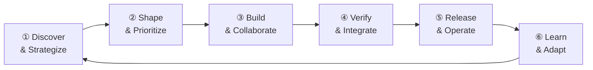
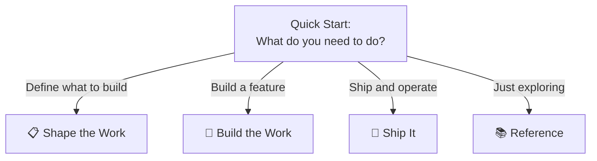

# Workshop: Software Value Delivery Segments & Site Information Architecture

**Type**: Integration Pattern
**Plan**: 002-docusaurus-site
**Spec**: [./docusaurus-site-spec.md](../docusaurus-site-spec.md)
**Created**: 2026-02-17
**Status**: Draft

**Related Documents**:

* [Research Dossier](../research-dossier.md) — HVE-Core artifact inventory and flow analysis
* [Artifact Relationship Map](../../001-hve-flow-mapping/artifact-relationship-map.md) — Mermaid diagrams of all 70 artifacts
* [RPI Phase Specification](../../001-hve-flow-mapping/rpi-phase-specification.md) — Formal input/output schemas

---

## Purpose

Define the top-level segments of the Docusaurus documentation site based on the Software Value Delivery lifecycle. These segments become the primary navigation structure — the "big chapters" users see in the sidebar. Each segment maps to a real phase of delivering software, not to repo internals.

The site teaches users how to use HVE-Core across the full delivery lifecycle. Not every segment has tooling today — some segments exist to frame the journey even when the current answer is "coming soon."

## Key Questions Addressed

* What are the large segments for the documentation site?
* Which user personas map to each segment?
* What HVE-Core tooling exists per segment today?
* Where are the gaps — and should the site acknowledge them or stay silent?
* How does a user navigate from "I installed this" to "I'm productive" across their role?

---

## The Value Delivery Loop

Everything flows from this loop. Six phases, continuously cycling:



The insight from DORA/SPACE research: most engineering tooling investment goes into phases ③–④, but most organizations leak value in phases ①–② and ⑥. HVE-Core is unusual in having strong coverage in ②, which is worth highlighting.

---

## The Four Site Segments

After mapping all 70+ repo artifacts against the 6 delivery phases, four natural segments emerge. These are deliberately large — each covers 1-2 delivery phases and represents a distinct user journey.

```
┌─────────────────────────────────────────────────────────────────────┐
│                                                                     │
│   SEGMENT 1          SEGMENT 2         SEGMENT 3      SEGMENT 4    │
│   ┌──────────┐      ┌──────────┐      ┌────────┐    ┌──────────┐  │
│   │ Shape    │      │ Build    │      │ Ship   │    │ Getting  │  │
│   │ the Work │ ──→  │ the Work │ ──→  │   It   │    │ Started  │  │
│   │          │      │          │      │        │    │          │  │
│   │ ①②      │      │ ③④      │      │ ⑤⑥    │    │ (meta)   │  │
│   └──────────┘      └──────────┘      └────────┘    └──────────┘  │
│                                                                     │
│   20 artifacts       29 artifacts      8 artifacts    Onboarding   │
│   2 flows            2 flows           0 flows        & reference  │
│                                                                     │
└─────────────────────────────────────────────────────────────────────┘
```

### Why four, not six?

The 6 delivery phases are a conceptual model. But users don't think in 6 phases — they think in roles and activities:

* "I need to figure out what to build" → **Shape the Work**
* "I need to build it" → **Build the Work**
* "I need to ship and maintain it" → **Ship It**
* "I just installed this, where do I start?" → **Getting Started**

Merging Discovery+Strategy (①) with Demand Management (②) into "Shape the Work" reflects reality: the same people do both, often in the same session. Merging Deployment (⑤) with Feedback (⑥) into "Ship It" reflects that this area is thin in the repo today and doesn't warrant two separate top-level segments.

---

## Segment 1: Shape the Work

**Delivery phases covered**: ① Discovery & Strategy + ② Demand Management & Prioritization

**Persona**: Product Managers, Tech Leads, TPMs — anyone deciding *what* to build

**User question**: "I have a vague idea / PRD / pile of issues. How do I turn that into a clear, prioritized, actionable plan?"

### What the repo provides today

```
SHAPE THE WORK
│
├── Requirements & Architecture
│   ├── 🟦 prd-builder         ← Build a Product Requirements Document
│   ├── 🟦 brd-builder         ← Build a Business Requirements Document
│   ├── 🟦 adr-creation        ← Create Architecture Decision Records
│   ├── 🟦 arch-diagram-builder ← Generate architecture diagrams
│   ├── 🟦 security-plan-creator ← Cloud security blueprints
│   └── 🟩 /risk-register       ← Qualitative risk assessment
│
├── GitHub Backlog Flow (documented, orchestrated)
│   ├── 🟦 github-backlog-manager  ← Orchestrator
│   ├── 🟩 /github-discover-issues ← Find gaps in your backlog
│   ├── 🟩 /github-triage-issues   ← Auto-label and prioritize
│   ├── 🟩 /github-sprint-plan     ← Plan a sprint/milestone
│   └── 🟩 /github-execute-backlog ← Batch create/update issues
│
└── Azure DevOps Flow (instruction-driven, no orchestrator)
    ├── 🟦 ado-prd-to-wit           ← PRD → ADO work items
    ├── 🟩 /ado-get-my-work-items   ← Fetch assigned items
    ├── 🟩 /ado-process-my-work-items ← Enrich for task planning
    └── 🟩 /ado-update-wit-items    ← Execute planned changes
```

**Coverage assessment**: ✅ **Strong.** This is the repo's second-deepest area (20 artifacts). Two complete backlog management flows (GitHub + ADO). Requirements and architecture well-covered.

**Gap**: No OKR/roadmap tooling, no portfolio-level prioritization (WSJF etc.), no capacity planning. Strategy is project-scoped, not product-scoped.

### Recommended site pages

| Page | Content | sidebar_position |
|---|---|---|
| Overview | The "Shape the Work" philosophy — why AI-driven planning matters | 1 |
| Requirements & Architecture | How to use PRD/BRD/ADR/Security Plan builders | 2 |
| Backlog Management | The GitHub Backlog flow explained (Discover → Triage → Sprint → Execute) | 3 |
| ADO Integration | The Azure DevOps flow for work item management | 4 |

---

## Segment 2: Build the Work

**Delivery phases covered**: ③ Development & Collaboration + ④ Verification & Integration

**Persona**: Software Engineers, DevOps Engineers — anyone writing and reviewing code

**User question**: "I have a task / issue / work item. How do I research it, plan it, implement it, and get it reviewed?"

### What the repo provides today

```
BUILD THE WORK
│
├── RPI Flow (documented, orchestrated — the crown jewel)
│   ├── 🟦 rpi-agent              ← Autonomous orchestrator
│   ├── 🟦 task-researcher        ← Deep codebase + external research
│   ├── 🟦 task-planner           ← Phased implementation plans
│   ├── 🟦 task-implementor       ← Execute plans with checkboxes
│   ├── 🟦 task-reviewer          ← Validate against plan + conventions
│   └── 🟦 memory                 ← Session persistence across phases
│
├── Code Review & PRs
│   ├── 🟦 pr-review              ← Quality + security review
│   ├── 🟩 /pull-request          ← PR description generation
│   ├── 🟩 /ado-create-pull-request ← ADO PR with linking
│   ├── 🟩 /git-commit            ← Stage + commit
│   ├── 🟩 /git-commit-message    ← Conventional commit messages
│   └── 🟩 /git-merge             ← Merge/rebase with conflict handling
│
├── Coding Standards (auto-applied, invisible)
│   ├── 🟨 csharp / csharp-tests  ← .NET 10, C# 14 conventions
│   ├── 🟨 python-script          ← Python 3.11+ conventions
│   ├── 🟨 bash                   ← Bash 5.x with ShellCheck
│   ├── 🟨 bicep                  ← Azure Bicep IaC
│   ├── 🟨 terraform              ← Terraform IaC
│   └── 🟨 markdown / writing-style ← Documentation standards
│
├── Documentation
│   ├── 🟦 doc-ops                ← Autonomous doc QA
│   └── 🟩 /doc-ops-update        ← Trigger doc quality checks
│
└── Data Science
    ├── 🟦 gen-data-spec           ← Data dictionaries
    ├── 🟦 gen-jupyter-notebook    ← EDA notebooks
    ├── 🟦 gen-streamlit-dashboard ← Dashboards
    └── 🟦 test-streamlit-dashboard ← Dashboard testing
```

**Coverage assessment**: ✅ **Deepest coverage in the repo (29 artifacts).** RPI is the fully orchestrated crown jewel. Git operations, coding standards, and code review are comprehensive. Data science has its own pipeline.

**Gap**: Test conventions only exist for C# — no Python test instructions, no generic testing guidance. No security scanning agent (SAST/DAST).

### Recommended site pages

| Page | Content | sidebar_position |
|---|---|---|
| Overview | The "Build the Work" philosophy — constrained phases beat unconstrained AI | 1 |
| The RPI Workflow | Complete guide: Research → Plan → Implement → Review → Discover | 2 |
| RPI in Practice | Walkthrough with a real example (adapted from existing first-workflow) | 3 |
| Code Review & PRs | PR generation, review, git operations | 4 |
| Coding Standards | How instruction files auto-apply conventions per language | 5 |
| Data Science Workflows | Data specs → notebooks → dashboards → testing | 6 |

---

## Segment 3: Ship It

**Delivery phases covered**: ⑤ Deployment & Operations + ⑥ Closing the Loop

**Persona**: Platform Engineers, SREs, Release Managers — anyone shipping and monitoring

**User question**: "I've got code merged. How do I release it safely and learn from production?"

### What the repo provides today

```
SHIP IT
│
├── Operations (sparse)
│   ├── 🟩 /incident-response      ← Azure incident response workflow
│   ├── 🟩 /risk-register          ← Operational risk assessment
│   └── 🟩 /ado-get-build-info     ← Build status + logs
│
├── IaC (via coding standards)
│   ├── 🟨 bicep                   ← Azure Bicep deployment conventions
│   └── 🟨 terraform               ← Terraform deployment conventions
│
└── Feedback (minimal)
    └── 🟨 community-interaction   ← Contributor communication templates
```

**Coverage assessment**: ⚠️ **Thin.** Only 8 artifacts, most are secondary mappings. The sole primary operations tool is `incident-response`. IaC instructions help with deployment but aren't deployment tooling themselves.

**Gap**: No release management, no progressive delivery (canary/feature flags), no SLO/SLA tooling, no runbook generation, no monitoring/alerting setup, no telemetry analysis, no retrospective tooling, no learning-loop formalization.

### Recommended site pages

| Page | Content | sidebar_position |
|---|---|---|
| Overview | The "Ship It" philosophy — closing the loop matters more than shipping faster | 1 |
| Incident Response | Azure incident response with the incident-response prompt | 2 |
| Infrastructure as Code | How Bicep and Terraform instructions support deployment | 3 |
| What's Coming | Honest roadmap: release management, SLO tooling, telemetry — future direction | 4 |

**Decision: Show the gap honestly.** A "What's Coming" page with a clear roadmap is more valuable than pretending this segment is mature. It invites contribution and sets expectations.

---

## Segment 0: Getting Started

**Not a delivery phase** — this is the meta-segment for onboarding and reference.

**Persona**: Anyone new to HVE-Core, regardless of role

**User question**: "I just installed this extension and I see 70 things. Where do I start?"

### Recommended site pages

| Page | Content | sidebar_position |
|---|---|---|
| What is HVE-Core? | One-paragraph pitch + the value delivery loop diagram | 1 |
| Installation | Extension install + post-install setup (.gitignore, MCP) | 2 |
| Quick Start | 5-minute walkthrough: pick a role → see the relevant segment | 3 |
| How It Works | The 4-layer architecture: Prompts → Agents → Instructions → Skills | 4 |
| FAQ | Common questions, troubleshooting | 5 |

---

## Complete Sidebar Structure

```
📖 HVE Core

├── 🏠 Getting Started (position: 1)
│   ├── What is HVE-Core?
│   ├── Installation
│   ├── Quick Start
│   ├── How It Works
│   └── FAQ
│
├── 📋 Shape the Work (position: 2)
│   ├── Overview
│   ├── Requirements & Architecture
│   ├── Backlog Management
│   └── ADO Integration
│
├── 🔨 Build the Work (position: 3)
│   ├── Overview
│   ├── The RPI Workflow
│   ├── RPI in Practice
│   ├── Code Review & PRs
│   ├── Coding Standards
│   └── Data Science Workflows
│
├── 🚀 Ship It (position: 4)
│   ├── Overview
│   ├── Incident Response
│   ├── Infrastructure as Code
│   └── What's Coming
│
└── 📚 Reference (position: 5)
    ├── Artifact Types (Agents, Prompts, Instructions, Skills)
    ├── Frontmatter Schema
    ├── Contributing to Docs
    └── All Artifacts A–Z
```

---

## Persona Decision Matrix

Rather than 10 personas, three roles map cleanly to the segments:

| Role | Primary Segment | Secondary | Entry Point |
|---|---|---|---|
| **Product/Planning** (PM, TPM, Tech Lead) | Shape the Work | Getting Started | "I need to define and prioritize work" |
| **Engineering** (Dev, DevOps, Data Scientist) | Build the Work | Shape the Work, Ship It | "I need to build a feature" |
| **Platform/Ops** (SRE, Platform Eng, Release Mgr) | Ship It | Build the Work | "I need to release and monitor" |

The Quick Start page should ask "What's your role?" and route to the right segment.



---

## Artifact Value Assessment

Every artifact gets a value tag based on whether it earns its place in the site narrative and extension bundle.

### Value Tags

| Tag | Meaning | Action |
|---|---|---|
| 🟢 **Core** | High value, directly supports a documented flow or fills a clear user need | Feature prominently on the site |
| 🟡 **Supporting** | Useful but secondary — auto-applied standards, utilities, or niche tools | Mention in context, don't spotlight |
| 🔴 **Cleanup Candidate** | Unclear value, redundant, deprecated, or confusing to users | Consider removing from extension or merging |
| ⚪ **Meta** | Internal tooling for building HVE-Core itself, not for end users | Exclude from site narrative |

### Assessment by Artifact

#### Agents (22)

| Artifact | Tag | Rationale |
|---|---|---|
| `rpi-agent` | 🟢 **Core** | The crown jewel orchestrator — autonomous RPI loop |
| `task-researcher` | 🟢 **Core** | Essential RPI phase 1 |
| `task-planner` | 🟢 **Core** | Essential RPI phase 2 |
| `task-implementor` | 🟢 **Core** | Essential RPI phase 3 |
| `task-reviewer` | 🟢 **Core** | Essential RPI phase 4 |
| `github-backlog-manager` | 🟢 **Core** | Backlog orchestrator with 5 workflows |
| `pr-review` | 🟢 **Core** | Code review is universal |
| `prd-builder` | 🟢 **Core** | Requirements definition — Shape the Work anchor |
| `doc-ops` | 🟡 **Supporting** | Useful but niche — documentation quality auditing |
| `brd-builder` | 🟡 **Supporting** | Business requirements — less common than PRDs |
| `adr-creation` | 🟡 **Supporting** | Architecture decisions — valuable but situational |
| `security-plan-creator` | 🟡 **Supporting** | Cloud security — specialized audience |
| `arch-diagram-builder` | 🟡 **Supporting** | ASCII diagrams — nice-to-have utility |
| `gen-data-spec` | 🟡 **Supporting** | Data science pipeline entry — niche audience |
| `gen-jupyter-notebook` | 🟡 **Supporting** | Depends on gen-data-spec |
| `gen-streamlit-dashboard` | 🟡 **Supporting** | Depends on gen-data-spec |
| `test-streamlit-dashboard` | 🟡 **Supporting** | Depends on gen-streamlit-dashboard |
| `memory` | 🟡 **Supporting** | Session utility — users don't invoke directly for value |
| `ado-prd-to-wit` | 🟡 **Supporting** | ADO-specific — only relevant if team uses ADO |
| `hve-core-installer` | ⚪ **Meta** | Installs HVE-Core itself, not a user workflow |
| `prompt-builder` | ⚪ **Meta** | Builds HVE-Core artifacts, not user-facing |
| `github-issue-manager` | 🔴 **Cleanup** | Deprecated — replaced by github-backlog-manager |

#### Prompts (25)

| Artifact | Tag | Rationale |
|---|---|---|
| `/rpi` | 🟢 **Core** | Primary entry point for RPI flow |
| `/task-research` | 🟢 **Core** | RPI phase 1 entry |
| `/task-plan` | 🟢 **Core** | RPI phase 2 entry |
| `/task-implement` | 🟢 **Core** | RPI phase 3 entry |
| `/task-review` | 🟢 **Core** | RPI phase 4 entry |
| `/github-discover-issues` | 🟢 **Core** | Backlog flow entry |
| `/github-triage-issues` | 🟢 **Core** | Backlog flow entry |
| `/github-sprint-plan` | 🟢 **Core** | Backlog flow entry |
| `/github-execute-backlog` | 🟢 **Core** | Backlog flow entry |
| `/git-commit` | 🟢 **Core** | Universal git utility |
| `/pull-request` | 🟢 **Core** | PR generation — universal |
| `/git-merge` | 🟡 **Supporting** | Merge/rebase — useful but specific |
| `/git-commit-message` | 🟡 **Supporting** | Message-only variant — overlaps with /git-commit |
| `/github-add-issue` | 🟡 **Supporting** | Single-issue creation — lighter than full backlog flow |
| `/checkpoint` | 🟡 **Supporting** | Session persistence utility |
| `/doc-ops-update` | 🟡 **Supporting** | Doc QA trigger — niche |
| `/incident-response` | 🟡 **Supporting** | Azure ops — specialized |
| `/risk-register` | 🟡 **Supporting** | Risk assessment — situational |
| `/ado-create-pull-request` | 🟡 **Supporting** | ADO-specific PR creation |
| `/ado-get-build-info` | 🟡 **Supporting** | ADO build monitoring |
| `/ado-get-my-work-items` | 🟡 **Supporting** | ADO work item retrieval |
| `/ado-process-my-work-items` | 🟡 **Supporting** | ADO task planning bridge |
| `/ado-update-wit-items` | 🟡 **Supporting** | ADO work item execution |
| `/git-setup` | 🟡 **Supporting** | One-time git configuration |
| `/prompt-build` | ⚪ **Meta** | Builds HVE-Core artifacts |
| `/prompt-refactor` | ⚪ **Meta** | Refactors HVE-Core artifacts |
| `/prompt-analyze` | ⚪ **Meta** | Evaluates HVE-Core artifacts |

#### Instructions (24)

| Artifact | Tag | Rationale |
|---|---|---|
| `commit-message` | 🟢 **Core** | Conventional commits — universal standard |
| `markdown` | 🟢 **Core** | Markdown conventions — touches every .md file |
| `writing-style` | 🟢 **Core** | Voice/tone — consistency across all content |
| `git-merge` | 🟢 **Core** | Merge protocol — prevents merge disasters |
| `csharp` | 🟡 **Supporting** | Language-specific — only if team uses C# |
| `csharp-tests` | 🟡 **Supporting** | C# test conventions |
| `python-script` | 🟡 **Supporting** | Language-specific — only if team uses Python |
| `bash` | 🟡 **Supporting** | Language-specific |
| `bicep` | 🟡 **Supporting** | IaC-specific — Azure Bicep |
| `terraform` | 🟡 **Supporting** | IaC-specific — Terraform |
| `uv-projects` | 🟡 **Supporting** | Python env management — niche |
| `github-backlog-planning` | 🟡 **Supporting** | Hub spec for backlog flow — users don't read directly |
| `github-backlog-discovery` | 🟡 **Supporting** | Discovery protocol — consumed by backlog-manager |
| `github-backlog-triage` | 🟡 **Supporting** | Triage protocol — consumed by backlog-manager |
| `github-backlog-update` | 🟡 **Supporting** | Execution protocol — consumed by backlog-manager |
| `community-interaction` | 🟡 **Supporting** | GitHub communication templates |
| `ado-wit-planning` | 🟡 **Supporting** | ADO hub spec |
| `ado-wit-discovery` | 🟡 **Supporting** | ADO discovery protocol |
| `ado-update-wit-items` | 🟡 **Supporting** | ADO execution protocol |
| `ado-create-pull-request` | 🟡 **Supporting** | ADO PR protocol |
| `ado-get-build-info` | 🟡 **Supporting** | ADO build protocol |
| `prompt-builder` | ⚪ **Meta** | Authoring standards for HVE-Core artifacts |
| `hve-core-location` | ⚪ **Meta** | Internal fallback resolution |
| `hve-core/workflows` | ⚪ **Meta** | Repo-specific CI conventions (already excluded from extension) |

#### Skills (1)

| Artifact | Tag | Rationale |
|---|---|---|
| `video-to-gif` | 🟡 **Supporting** | Standalone utility — no flow connection |

### Summary Counts

| Tag | Agents | Prompts | Instructions | Skills | Total |
|---|---|---|---|---|---|
| 🟢 **Core** | 8 | 11 | 4 | 0 | **23** |
| 🟡 **Supporting** | 11 | 12 | 17 | 1 | **41** |
| 🔴 **Cleanup** | 1 | 0 | 0 | 0 | **1** |
| ⚪ **Meta** | 2 | 3 | 3 | 0 | **8** |

### Key Takeaway

**23 Core artifacts** are what the site should feature. The remaining 41 Supporting artifacts are mentioned in context but don't get hero treatment. 1 should be cleaned up (deprecated issue manager). 8 are meta-tooling for HVE-Core authors, not end users.

The site's "Shape + Build + Ship" segments are built around the 23 Core artifacts. Supporting artifacts appear as "also available" within their relevant segment pages.

---

## What NOT to Put on the Site

The repo has 70+ artifacts. The site should NOT be a flat catalog of all of them. These artifacts are **excluded from the site narrative** (they're internal tooling, deprecated, or meta):

| Artifact | Reason |
|---|---|
| `github-issue-manager` | Deprecated |
| `hve-core-installer` | Internal installation tooling, not user workflow |
| `memory` / `checkpoint` | Implementation detail of session persistence — documented as part of RPI, not standalone |
| `prompt-builder` / `prompt-build` / `prompt-refactor` / `prompt-analyze` | Meta-tooling for building HVE-Core itself, not for using it |
| `hve-core-location` instruction | Internal fallback resolution |
| `video-to-gif` skill | Utility, not a workflow |

These still exist in the extension. They just don't get dedicated site pages. A user who needs them will find them in the "All Artifacts A–Z" reference page.

---

## Coverage Heatmap: What's Real vs What's Aspirational

```
                    SHAPE        BUILD        SHIP
                    THE WORK     THE WORK     IT
                    ──────────   ──────────   ──────────
Requirements        ████████░░   ░░░░░░░░░░   ░░░░░░░░░░
Backlog Mgmt        ████████░░   ░░░░░░░░░░   ░░░░░░░░░░
Sprint Planning     ██████████   ░░░░░░░░░░   ░░░░░░░░░░
Research            ░░████░░░░   ██████████   ░░░░░░░░░░
Planning            ░░░░██░░░░   ██████████   ░░░░░░░░░░
Implementation      ░░░░░░░░░░   ██████████   ░░░░░░░░░░
Code Review         ░░░░░░░░░░   ██████████   ░░░░░░░░░░
Coding Standards    ░░░░░░░░░░   ██████████   ░░░░░░░░░░
Testing             ░░░░░░░░░░   ████░░░░░░   ░░░░░░░░░░
Deployment          ░░░░░░░░░░   ░░░░░░░░░░   ████░░░░░░
Ops & Monitoring    ░░░░░░░░░░   ░░░░░░░░░░   ██░░░░░░░░
Feedback Loop       ░░░░░░░░░░   ░░░░░░░░░░   █░░░░░░░░░

████ = Rich tooling     ██ = Some tooling     ░░ = Gap
```

---

## Open Questions

### Q1: Should the site structure match the spec's skeleton or this workshop's structure?

**RESOLVED**: This workshop supersedes the spec's placeholder skeleton. The spec had 5 categories (getting-started, workflows, agents, reference, contributing). This workshop has 5 categories (getting-started, shape-the-work, build-the-work, ship-it, reference) organized around user journeys rather than artifact types. Update the plan to use this structure.

### Q2: Should "Data Science" be its own segment?

**RESOLVED**: No. Data Science artifacts (gen-data-spec, gen-jupyter-notebook, gen-streamlit-dashboard, test-streamlit-dashboard) fit under "Build the Work" as a subsection. They're a development workflow, not a separate delivery phase. A dedicated page within Build the Work covers the pipeline.

### Q3: Should ADO and GitHub backlog management be presented as alternatives or separate?

**RESOLVED**: Present as alternatives within "Shape the Work." Most teams use one or the other, not both. The Backlog Management page covers the GitHub flow in detail, the ADO Integration page covers the ADO equivalent, and a brief note explains they serve the same purpose for different platforms.

### Q4: How do we handle the "Ship It" gap?

**OPEN**: Two options:

* **Option A**: Include Ship It with a "What's Coming" page that's honest about the gap. Shows the vision, invites contribution. Risk: looks incomplete.
* **Option B**: Omit Ship It entirely. Only show segments with strong coverage. Risk: misrepresents HVE-Core as "just a coding tool."

**Recommendation**: Option A. The value delivery loop is the site's organizing principle — removing a segment breaks the conceptual model. A thin-but-honest segment with a clear roadmap is better than a gap in the story.

---

## Research Opportunities

| # | Topic | Why Needed | Impact |
|---|---|---|---|
| 1 | **Testing conventions gap** | Only C# has test instructions. Python, TypeScript, Go, Bash are missing. This is a content gap in "Build the Work" | Could become a contribution campaign — easy community PRs |
| 2 | **Release management tooling** | No agent/prompt for release workflows, changelogs, or progressive delivery. This is the biggest "Ship It" gap | Would complete the delivery loop from Build → Ship |
| 3 | **Retrospective/learning agent** | No "Closing the Loop" tooling. DORA research shows this is where elite teams differentiate | Would close the ⑥→① feedback arc |
| 4 | **Cross-segment user journeys** | How does a user flow from Shape → Build → Ship in a single project lifecycle? No documentation covers the transitions | Workshop opportunity: "End-to-End User Journey" |

## Workshop Opportunities

| # | Topic | Type | Why Workshop | Priority |
|---|---|---|---|---|
| 1 | **End-to-End User Journey** | CLI Flow | Map a complete feature from PRD → Backlog → RPI → PR → Release showing exactly which HVE-Core tools are used at each transition | High — this becomes the site's hero walkthrough |
| 2 | **Reference Section Design** | Storage Design | The "All Artifacts A–Z" page needs a format: searchable, filterable, with per-artifact cards showing type, segment, flow membership | Medium — affects the reference section |
| 3 | **Ship It Roadmap Content** | Integration Pattern | Define what "Ship It" should contain when the tooling exists — this sets the vision for future contributions | Low — aspirational, not blocking |

---

## Impact on Plan

The plan's Phase 2 content skeleton should be updated to use this workshop's segment structure instead of the spec's placeholder:

| Spec Skeleton (old) | Workshop Structure (new) |
|---|---|
| `getting-started/` | `getting-started/` (same, refined pages) |
| `workflows/` | → Split into `shape-the-work/` and `build-the-work/` |
| `agents/` | → Merged into segment pages (not a standalone section) |
| `reference/` | `reference/` (same, expanded) |
| `contributing/` | → Merged into `reference/contributing-to-docs` |
| *(missing)* | `ship-it/` (new) |
