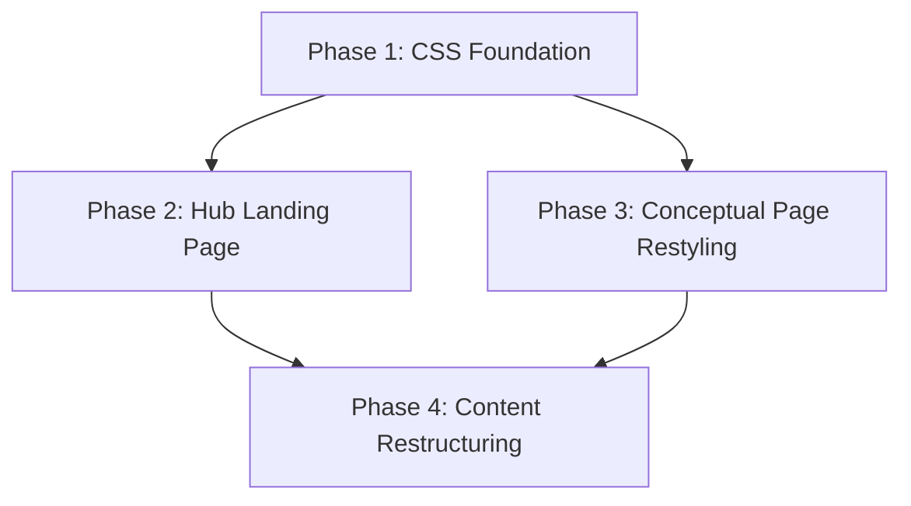

# Microsoft Learn Theme Implementation Plan

**Plan Version**: 1.0.0
**Created**: 2026-02-19
**Spec**: [ms-learn-theme-spec.md](./ms-learn-theme-spec.md)
**Research**: [research-dossier.md](./research-dossier.md)
**Status**: DRAFT

## Table of Contents

1. [Executive Summary](#executive-summary)
2. [Technical Context](#technical-context)
3. [Critical Research Findings](#critical-research-findings)
4. [Testing Philosophy](#testing-philosophy)
5. [Phase 1: CSS Foundation & Color System](#phase-1-css-foundation--color-system)
6. [Phase 2: Hub Landing Page](#phase-2-hub-landing-page)
7. [Phase 3: Conceptual Page Restyling](#phase-3-conceptual-page-restyling)
8. [Phase 4: Content Restructuring & Navigation](#phase-4-content-restructuring--navigation)
9. [Cross-Cutting Concerns](#cross-cutting-concerns)
10. [Complexity Tracking](#complexity-tracking)
11. [Progress Tracking](#progress-tracking)
12. [Change Footnotes Ledger](#change-footnotes-ledger)

## Executive Summary

The HVE Core documentation site currently uses a minimal hero landing page with a single "Get Started" button, deployed via Docusaurus 3.9.2 on GitHub Pages. The redesign transforms this into a Microsoft Learn Architecture Center-style site with a rich hub landing page (gradient hero + card grids), restyled conceptual docs pages (breadcrumbs, article metadata, TOC), an expanded 6-category content structure, and a polished dark mode — all using the Azure Architecture Center's extracted three-blue color system (`#005ba1`, `#0078d4`, `#0f6cbd`).

**Solution approach**:

- Replace the current `#0078D4` single-color palette with a dual-layer CSS architecture: Infima variable overrides + custom `--ms-learn-*` properties
- Build 3 custom React components (HeroSection, IconCard, BoxCard) with CSS Modules for scoped styling
- Swizzle-wrap 3 Docusaurus components (Footer, DocBreadcrumbs, TOCCollapsible) for visual restyling
- Restructure content into 6 categories with Docusaurus `generated-index` auto-cards
- Derive dark mode from the light palette using WCAG contrast ratios (no MS Learn dark reference available)

**Expected outcomes**: A professional documentation site visually aligned with the Microsoft Learn ecosystem, discoverable content via card-based navigation, and a maintainable customization layer using component wrapping over ejection.

**Implementation location**: `docs/docusaurus/` in the worktree on `docs/docusaurus-site` branch (at `../hve-core-docs-pr/` relative to the plan repository root)

## Technical Context

### Current System State

```
docs/docusaurus/                    # (worktree: ../hve-core-docs-pr/docs/docusaurus/)
├── docs/
│   ├── intro.md
│   ├── getting-started/
│   │   ├── overview.md
│   │   └── installation.md
│   └── workflows/
│       ├── overview.md
│       └── rpi-workflow.md
├── src/
│   ├── css/custom.css              # 31 lines, 9 Infima variable overrides
│   └── pages/
│       ├── index.js                # Simple hero landing page
│       └── index.module.css        # Landing page styles
├── static/img/                     # Microsoft logo, favicon
├── docusaurus.config.js            # Site config (future: {v4: true})
├── sidebars.js                     # Auto-generated sidebar
└── package.json                    # Docusaurus 3.9.2, React 19
```

- **Primary color**: `#0078D4` (9 Infima variable overrides in `custom.css`)
- **Dark mode**: Simple inversion to `#4DA3E5`
- **Font**: Segoe UI → system-ui → -apple-system → sans-serif
- **Build flags**: `onBrokenLinks: 'throw'`, `baseUrl: '/hve-core/'`, `future: { v4: true }`
- **Mermaid**: Dual-config (`markdown.mermaid: true` + `themes: ['@docusaurus/theme-mermaid']`)
- **Content**: 5 pages across 2 categories (Getting Started, Workflows)

### Integration Requirements

| Extension Point | Type | Phase | Purpose |
|---|---|---|---|
| `src/css/custom.css` | Global CSS | P1 | Infima overrides + custom properties |
| `src/pages/index.tsx` | Custom page | P2 | Hub landing page (replaces `index.js`) |
| CSS Modules (`.module.css`) | Scoped CSS | P2 | Component-scoped styles |
| `src/theme/Footer/index.tsx` | Swizzle wrap | P3 | MS Learn-style footer |
| `src/theme/DocBreadcrumbs/index.tsx` | Swizzle wrap | P3 | Breadcrumb visual styling |
| `src/theme/TOCCollapsible/index.tsx` | Swizzle wrap | P3 | "In this article" heading |
| `_category_.json` | Content config | P4 | `generated-index` category pages |
| `docusaurus.config.js` | Theme config | P3-P4 | Footer, navbar updates |
| `static/` | Static assets | P2 | Hero pattern SVG |

### Constraints and Limitations

- No Tailwind CSS (conflicts with Infima — PL-01)
- No component ejection unless wrapping is demonstrably insufficient (AC#15)
- All links must resolve at build time (`onBrokenLinks: 'throw'` — PL-04)
- All assets must work under `baseUrl: '/hve-core/'` (PL-07)
- Mermaid dual-config must remain intact (PL-03, AC#17)
- No MS Learn dark mode reference available — derive from light palette

### Assumptions

1. Docusaurus 3.9.2 Infima CSS variables are stable and supported
2. GitHub Pages handles static output without special configuration
3. Two-directory workflow: plans on `jordo-explore`, implementation in worktree on `docs/docusaurus-site`
4. Desktop-first; mobile is secondary
5. MS Learn Architecture Center design as of February 2026 is the reference
6. `future: { v4: true }` compatibility is maintained throughout

## Critical Research Findings

Synthesized from 2 research subagents (Implementation Strategist: 8 findings, Risk Planner: 8 findings) plus research dossier (55+ findings, 15 prior learnings). Ordered by impact.

### 🚨 Critical Discovery 01: Four-Phase Dependency Chain Required

**Impact**: Critical
**Sources**: [I1-01, CD-01, CD-04]

The spec proposed 3 phases but the implementation requires 4. The CSS foundation must be a standalone phase because the hub hero gradient, card accents, and dark mode all depend on the color system being defined first. Content restructuring must be last because `generated-index` creates new URL paths that trigger `onBrokenLinks: 'throw'`.

**Dependency graph**: P1 → P2, P1 → P3, P2 + P3 → P4

**Action Required**: Phase 1 (CSS Foundation) is a prerequisite for all component work. Phase 4 (Content) depends on both Phases 2 and 3 to ensure all link targets and navigation elements exist.

**Affects Phases**: All

### 🚨 Critical Discovery 02: Dual-Layer CSS Variable Architecture

**Impact**: Critical
**Sources**: [I1-02, CD-03, R1-02]

The CSS override requires two layers: (1) Infima variable overrides mapping MS Learn values to existing `--ifm-*` variables (~15 overrides), and (2) custom `--ms-learn-*` properties for hero, cards, and sections (~10 new properties). This prevents specificity conflicts with Infima while providing semantic tokens for custom components.

Key mappings:

| Infima Variable | Current | New (Light) | New (Dark) |
|---|---|---|---|
| `--ifm-color-primary` | `#0078D4` | `#0f6cbd` | `#479ef5` |
| `--ifm-color-primary-dark` | `#006CBF` | `#115ea3` | `#0f6cbd` |
| `--ifm-color-primary-darker` | `#0063B1` | `#0c3b5e` | `#115ea3` |
| `--ifm-color-primary-darkest` | `#004E8C` | `#0a2e4a` | `#0c3b5e` |
| `--ifm-color-primary-light` | `#1A86D9` | `#2886c7` | `#62abf5` |
| `--ifm-color-primary-lighter` | `#2B8FDE` | `#479ef5` | `#96c6fa` |
| `--ifm-color-primary-lightest` | `#4DA3E5` | `#96c6fa` | `#cfe4fa` |
| `--ifm-background-color` | (default) | `#ffffff` | `#1b1b1b` |
| `--ifm-font-color-base` | (default) | `#161616` | `#e0e0e0` |
| `--ifm-link-color` | (inherits) | `#0065b3` | `#479ef5` |
| `--ifm-footer-background-color` | (default) | `#e8e6df` | `#1f1f1f` |

**Action Required**: Phase 1 delivers the complete CSS rewrite with both layers, tested in light and dark mode, before any component work begins.

**Affects Phases**: Phase 1 (foundation), all subsequent phases consume these variables

### 🚨 Critical Discovery 03: Dark Mode Derivation Without Reference

**Impact**: Critical
**Sources**: [R1-01]

MS Learn's dark mode CSS was not found in the static CSS extraction. All dark colors must be derived from the light palette using WCAG contrast ratios against `#1b1b1b` (Docusaurus dark background). The three-blue system compounds this: each blue serves a different semantic role, so a single darkening function produces wrong results.

**Mitigation**: Build dark palette in `[data-theme='dark']` selectors. Use WCAG AA (4.5:1 text, 3:1 UI) against dark background. Hero gradient in dark mode shifts to lighter blues (`#2b88d8` → `#4da3e5`). Iterate independently without affecting light mode.

**Action Required**: Phase 1 must include dark mode contrast verification for every custom property.

**Affects Phases**: All

### 🔴 High Discovery 04: Component Architecture — 3 Custom + 3 Wraps

**Impact**: High
**Sources**: [I1-03, I1-04, R1-04, CD-02]

Six component interventions required:

**Custom React components** (`src/components/`):

| Component | Purpose | CSS |
|---|---|---|
| `HeroSection` | Gradient hero with pattern overlay | CSS Module |
| `IconCard` | 64×64 icon + supertitle + title | Shared CSS Module |
| `BoxCard` | Title + link list | Shared CSS Module |

Plus `CardGrid` (responsive grid wrapper) and 6 SVG icon components.

**Swizzle-wraps** (`src/theme/`):

| Component | Purpose |
|---|---|
| `Footer` | MS Learn-style 4-column layout |
| `DocBreadcrumbs` | Visual styling adjustments |
| `TOCCollapsible` | "In this article" heading |

**CSS-only** (no wrapping needed): Navbar, generated-index cards, article metadata.

**Action Required**: Verify `npx docusaurus swizzle --wrap` works for all 3 target components before Phase 3 tasks.

**Affects Phases**: Phase 2 (custom components), Phase 3 (swizzle-wraps)

### 🔴 High Discovery 05: Hub Page Data-Driven Composition

**Impact**: High
**Sources**: [I1-05]

Card data should live in a separate `src/data/hubCards.ts` file, not inline in JSX. This decouples content from layout and means future contributors add categories by editing a simple array. The 6 category `href` values must align exactly with the directory structure created in Phase 4.

**Action Required**: Phase 2 creates `hubCards.ts`. Phase 4 must verify all `href` values resolve to actual routes.

**Affects Phases**: Phase 2, Phase 4

### 🔴 High Discovery 06: Atomic Content Restructuring for Link Safety

**Impact**: High
**Sources**: [I1-06, R1-03, R1-05]

All 6 categories, stub content, navbar items, and hub card hrefs must be consistent in a single build-passing state. `generated-index` creates `/category/` path segments. Adding categories incrementally would break `onBrokenLinks: 'throw'`. Consider `@docusaurus/plugin-client-redirects` for old-to-new path mappings.

**Action Required**: Phase 4 is a single atomic phase. Include link audit step. Temporarily set `onBrokenLinks: 'warn'` during active restructuring, restore to `'throw'` before phase completion.

**Affects Phases**: Phase 4

### 🔴 High Discovery 07: Infima Specificity Conflict Prevention

**Impact**: High
**Sources**: [R1-02, R1-07]

Infima uses high-specificity selectors. Custom styles must prefer CSS custom property overrides (`:root` level) over selector-based overrides. Use CSS Modules for new components to avoid collisions entirely. Never use `!important`. The `future: { v4: true }` flag means Infima internals may change in Docusaurus 4.0.

**Action Required**: All phases prefer CSS variable overrides. Document every Infima selector override for upgrade auditing.

**Affects Phases**: All

### 🔴 High Discovery 08: SVG Icons as React Components

**Impact**: High
**Sources**: [I1-07]

Category SVG icons should be inline React components with `fill="currentColor"` for automatic dark mode support. Six icon components in `src/components/Icons/`. Placeholder shapes acceptable initially; refinement doesn't break component contracts.

**Action Required**: Phase 2 creates all 6 icon components. Icons use 64×64 viewBox, simple paths under 2KB each.

**Affects Phases**: Phase 2

### 🟡 Medium Discovery 09: baseUrl Asset Path Safety

**Impact**: Medium
**Sources**: [R1-06]

All assets must work under `baseUrl: '/hve-core/'`. Use `useBaseUrl()` hook in React, relative paths in CSS, and inline data URIs for the hero pattern SVG. Test with `npm run serve` (serves under `/hve-core/`) not just `npm run start`.

**Affects Phases**: Phase 1, Phase 2

### 🟡 Medium Discovery 10: Mermaid Theme Preservation

**Impact**: Medium
**Sources**: [R1-08, PL-03]

Changing `--ifm-color-primary` from `#0078D4` to `#0f6cbd` affects Mermaid diagram colors. Test all existing Mermaid diagrams in both modes after palette change. Add `themeConfig.mermaid` overrides if needed.

**Affects Phases**: Phase 1

### 🟡 Medium Discovery 11: Docusaurus v4 Compatibility

**Impact**: Medium
**Sources**: [R1-07]

The `future: { v4: true }` flag is active. All custom CSS and components must work with v4-compatible behavior. Prefer CSS custom properties over class-name selectors. Keep wrapped component count minimal.

**Affects Phases**: All

## Testing Philosophy

### Testing Approach

- **Selected Approach**: Hybrid — Lightweight for CSS/config changes (Phases 1, 4), TAD for React components (Phases 2, 3)
- **Rationale**: CSS theming and config changes are verified by build success and visual inspection. React card and layout components benefit from test-as-documentation to capture prop contracts
- **Focus Areas**: Build integrity, React component rendering, responsive breakpoints, dark mode toggling
- **Mock Usage**: Avoid mocks entirely — test components with real Docusaurus rendering and fixtures

### Lightweight Testing (Phases 1, 4)

- `npm run build` passes with zero errors and zero broken links
- Visual inspection in both light and dark modes
- Manual responsive check at desktop/tablet/mobile breakpoints
- Mermaid diagram rendering verification (Phase 1)

### Test-Assisted Development (TAD) (Phases 2, 3)

━━━━━━━━━━━━━━━━━━━━━━━━━━━━━━━━━━━━━━━━━━━━━━━━━━━━━━━━━
#### ⚠️ TEST EXECUTION REQUIREMENT (MANDATORY FOR TAD)
━━━━━━━━━━━━━━━━━━━━━━━━━━━━━━━━━━━━━━━━━━━━━━━━━━━━━━━━━

Implementers MUST:
- **RUN** scratch tests after writing them (RED phase)
- **RUN** tests after each code change (GREEN phase)
- **RUN** tests after refactoring (verification)
- Provide test execution output as evidence

```bash
npm test -- --verbose
```

**Test Rendering Strategy**: Components depend on Docusaurus context providers (ThemeContext, useBaseUrl). Tests use real provider wrappers (BrowserRouter, ThemeProvider from Docusaurus exports) — these are real providers, not mocks. Create a `src/__test-utils__/renderWithProviders.tsx` helper that wraps components in the same providers Docusaurus uses at runtime. This satisfies the "no mocks" policy while enabling component rendering in tests.

━━━━━━━━━━━━━━━━━━━━━━━━━━━━━━━━━━━━━━━━━━━━━━━━━━━━━━━━━

- Tests are executable documentation optimized for developer comprehension
- **Scratch → RUN → Promote workflow**:
  1. Write probe tests exploring component behavior
  2. RED→GREEN cycle: write test (expect fail) → implement → run (expect pass) → repeat
  3. Promote 1-2 valuable tests (~5-10% rate) with Test Doc blocks
  4. Delete scratch probes that don't add durable value (90-95%)
- **Promotion heuristic**: Critical (card grid rendering), Opaque (dark mode class logic), Regression (responsive breakpoint behavior)
- **Test naming**: "Given...When...Then..." format
- **Test Doc block** (required for promoted tests):
  ```
  /*
  Test Doc:
  - Why: <reason>
  - Contract: <invariant(s)>
  - Usage Notes: <gotchas>
  - Quality Contribution: <what failure catches>
  - Worked Example: <inputs/outputs>
  */
  ```

## Phase 1: CSS Foundation & Color System

**Objective**: Replace the current `#0078D4` single-color palette with the Azure Architecture Center three-blue system and establish the dual-layer CSS variable architecture for both light and dark modes.

**Testing Approach**: Lightweight

**Deliverables**:
- Rewritten `src/css/custom.css` with Infima variable overrides and `--ms-learn-*` custom properties
- Dark mode palette derived with WCAG contrast verification
- Hero pattern SVG created and embedded
- Build passes, Mermaid diagrams render correctly in both modes

**Dependencies**: None (foundational phase)

**Risks**:

| Risk | Likelihood | Impact | Mitigation |
|------|------------|--------|------------|
| Dark mode contrast failures | Medium | High | WCAG contrast ratio verification for each token |
| Infima specificity conflicts | Low | High | Use `:root` variable overrides only, no selector overrides |
| Mermaid color degradation | Low | Medium | Test existing diagrams, add `themeConfig.mermaid` overrides if needed |

### Tasks (Lightweight Approach)

| # | Status | Task | CS | Success Criteria | Log | Notes |
|---|--------|------|----|------------------|-----|-------|
| 1.1 | [x] | Rewrite `custom.css` light mode: Infima variable overrides | CS-2 | All 15+ `--ifm-*` variables updated per Discovery 02 table | - | `src/css/custom.css` in worktree |
| 1.2 | [x] | Add `--ms-learn-*` custom properties (light mode) | CS-1 | All custom properties defined in `:root`: `--ms-learn-hero-bg: #005ba1`, `--ms-learn-hero-gradient: linear-gradient(174.2deg, #005ba1 0%, #004d88 66.72%, #003e6e)`, `--ms-learn-hero-pattern` (data URI), `--ms-learn-hero-text: #ffffff`, `--ms-learn-card-accent: #0078d4`, `--ms-learn-card-border: #e6e6e6`, `--ms-learn-text-subtle: #505050`, `--ms-learn-section-bg: #f2f2f2`, `--ms-learn-footer-bg: #e8e6df`, `--ms-learn-visited-link: #624991`, `--ms-learn-success: #107c10`, `--ms-learn-danger: #bc2f32` | - | Same file as 1.1 |
| 1.3 | [x] | Derive and implement dark mode palette | CS-3 | `[data-theme='dark']` block with all Infima + custom properties. Verify WCAG AA contrast using WebAIM Contrast Checker (https://webaim.org/resources/contrastchecker/) for each foreground/background pair against `#1b1b1b`. Document results in a contrast table: foreground color, background color, ratio, PASS/FAIL | - | Discovery 03: no MS Learn dark reference — derive from light |
| 1.4 | [x] | Create hero pattern SVG | CS-1 | Plus/cross pattern SVG: 20×20 repeating tile, stroke `rgba(255,255,255,0.08)`, stroke-width 1px, cross arm length 6px. Embedded as `data:image/svg+xml` URI in `--ms-learn-hero-pattern` | - | Inline in CSS to avoid baseUrl path issues (Discovery 09) |
| 1.5 | [x] | Verify Mermaid rendering | CS-1 | Existing Mermaid diagrams render correctly in both light and dark modes. Add `themeConfig.mermaid` overrides if needed | - | Discovery 10: palette change affects Mermaid |
| 1.6 | [x] | Build verification | CS-1 | `npm run build` passes, `npm run serve` renders correctly at `/hve-core/`, both modes inspected | - | Safety check per Discovery 09 |

### Acceptance Criteria

- [ ] All Infima variable overrides applied (AC#8 partial)
- [ ] Custom `--ms-learn-*` properties defined for both modes
- [ ] Dark mode renders with proper contrast (AC#9 partial)
- [ ] Hero pattern SVG created and usable via CSS variable
- [ ] Mermaid diagrams unaffected (AC#17)
- [ ] `npm run build` passes clean (AC#14)

## Phase 2: Hub Landing Page

**Objective**: Replace the simple hero landing page with a MS Learn Architecture Center-style hub featuring a gradient hero with pattern overlay, icon card grids, and box cards with link lists.

**Testing Approach**: TAD (React components)

**Deliverables**:
- `HeroSection` component with gradient + pattern overlay
- `IconCard`, `BoxCard`, `CardGrid` components with shared CSS Module
- 6 SVG icon components for categories
- `hubCards.ts` data file
- `index.tsx` hub page (replaces `index.js`)
- Responsive layout (3 → 2 → 1 columns)

**Dependencies**: Phase 1 must be complete (CSS variables consumed by all components)

**Risks**:

| Risk | Likelihood | Impact | Mitigation |
|------|------------|--------|------------|
| AI-generated SVG icons inconsistent | Medium | Medium | Start with placeholder shapes; refine iteratively |
| Card grid responsive breakage | Low | Medium | TAD tests document expected breakpoint behavior |
| baseUrl breaking asset paths | Low | Medium | Use `useBaseUrl()` hook, test with `npm run serve` |

### Tasks (TAD Approach)

| # | Status | Task | CS | Success Criteria | Log | Notes |
|---|--------|------|----|------------------|-----|-------|
| 2.0 | [ ] | Setup TypeScript and test infrastructure | CS-2 | Docusaurus builds with `.tsx` files. Verify `tsconfig.json` exists (Docusaurus auto-generates on first `.tsx`). Install test deps: `npm install --save-dev jest @testing-library/react @testing-library/jest-dom ts-jest identity-obj-proxy @types/jest @types/react`. Create `jest.config.js` with CSS Module mock via `identity-obj-proxy`. Add `"test": "jest --verbose"` to `package.json` scripts. Run `npm test` — exits clean (no tests yet) | - | Prerequisite for all TAD tasks. Docusaurus 3.x supports TS natively |
| 2.1 | [ ] | Write scratch tests for HeroSection | CS-1 | 3-5 probe tests: renders title text, renders subtitle, applies gradient CSS class, renders pattern overlay element. RED phase — tests fail (component doesn't exist yet) | - | TAD: scratch tests BEFORE implementation |
| 2.2 | [ ] | Create `src/components/HeroSection/` with CSS Module | CS-2 | Component renders gradient hero with title="HVE Core", subtitle="AI-Driven Software Development Across the Full Lifecycle", and pattern overlay. Uses `--ms-learn-hero-gradient` and `--ms-learn-hero-pattern`. Tests from 2.1 pass (GREEN) | - | `src/components/HeroSection/index.tsx` + `styles.module.css` |
| 2.3 | [ ] | Write scratch tests for Card components | CS-2 | 8-10 probe tests: IconCard renders icon+title+href, BoxCard renders title+link list, CardGrid renders 3-column layout, cards use correct CSS classes. RED phase | - | TAD: scratch tests BEFORE card implementation |
| 2.4 | [ ] | Create `src/components/Cards/` with shared CSS Module | CS-3 | `IconCard`, `BoxCard`, `CardGrid` render correctly. Cards use `--ms-learn-card-accent`, `--ms-learn-card-border`. Grid responsive: 3 columns above 996px, 2 columns 577-996px, 1 column below 577px (matching Infima breakpoints). Tests from 2.3 pass (GREEN) | - | `src/components/Cards/IconCard.tsx`, `BoxCard.tsx`, `CardGrid.tsx`, `styles.module.css`, `index.ts` |
| 2.5 | [ ] | Create 6 SVG icon components in `src/components/Icons/` | CS-2 | Each icon: 64×64 viewBox, `fill="currentColor"`, under 2KB. Dark mode adapts via inherited color. Icons: GettingStartedIcon (rocket/launch), AgentsPromptsIcon (robot/chat bubble), InstructionsSkillsIcon (book/gear), WorkflowsIcon (flow diagram/arrows), DesignThinkingIcon (lightbulb/brain), TemplatesExamplesIcon (template/grid) | - | Placeholder geometric shapes acceptable; refine later without breaking contracts |
| 2.6 | [ ] | Create `src/data/hubCards.ts` data file | CS-1 | Arrays for `iconCards` (6 entries) and `boxCards`. Each iconCard: `{icon, supertitle, title, href, description}`. Hrefs use exact Docusaurus generated-index routes: `/docs/category/getting-started`, `/docs/category/agents-and-prompts`, `/docs/category/instructions-and-skills`, `/docs/category/workflows`, `/docs/category/design-thinking`, `/docs/category/templates-and-examples` | - | Discovery 05: data-driven composition. These paths are verified in Phase 4 |
| 2.7 | [ ] | Rewrite `index.js` → `index.tsx` hub page | CS-2 | Hub page renders: HeroSection (title="HVE Core", subtitle, CTA button "Get Started" → `/docs/category/getting-started`) + icon card grid section (title "Explore by topic") + box card section (title "Deep dive"). Uses `Layout` component. Delete old `index.js` and `index.module.css` | - | |
| 2.8 | [ ] | Promote valuable tests with Test Doc blocks | CS-1 | 1-2 promoted tests with Why/Contract/Usage/Quality/Example blocks. Delete 90-95% of scratch tests | - | Promotion heuristic: Critical (card grid rendering), Opaque (dark mode class logic) |
| 2.9 | [ ] | Build verification | CS-1 | `npm run build` passes, `npm test` passes, hub page renders at `/hve-core/`, responsive layout verified, both modes | - | |

### Acceptance Criteria

- [ ] Hub hero displays gradient with pattern overlay (AC#1)
- [ ] Icon card grid shows 3-across responsive layout (AC#2, AC#12)
- [ ] Box card section renders with link lists (AC#3)
- [ ] 6 SVG icons render at 64×64px (AC#13)
- [ ] All components render in dark mode (AC#9 partial)
- [ ] `baseUrl` compatibility verified (AC#16)
- [ ] `npm run build` passes clean (AC#14)
- [ ] TAD tests document component contracts

## Phase 3: Conceptual Page Restyling

**Objective**: Restyle documentation pages to match MS Learn's conceptual layout with breadcrumbs, article metadata, styled TOC, and a MS Learn-style footer.

**Testing Approach**: Hybrid — TAD for swizzle-wrapped components, Lightweight for CSS-only changes

**Deliverables**:
- Footer swizzle-wrap with MS Learn-style link columns
- DocBreadcrumbs swizzle-wrap with visual styling
- TOCCollapsible swizzle-wrap with "In this article" heading
- Article metadata CSS (last-updated date, contributors)
- Generated-index card restyling CSS
- Updated `docusaurus.config.js` footer configuration

**Dependencies**: Phase 1 must be complete (CSS variables). Phase 2 not strictly required but recommended for visual consistency checking.

**Risks**:

| Risk | Likelihood | Impact | Mitigation |
|------|------------|--------|------------|
| Footer wrap insufficient (need eject) | Medium | Medium | Attempt wrap first; eject single component if needed, document for upgrade audit |
| Infima selector conflicts on docs pages | Low | High | Use CSS variable overrides, avoid selector-level overrides |
| `generated-index` card CSS specificity | Low | Medium | Inspect actual Infima card class names, match specificity |

### Tasks (Hybrid Approach)

| # | Status | Task | CS | Testing | Success Criteria | Log | Notes |
|---|--------|------|----|---------|------------------|-----|-------|
| 3.1 | [ ] | Run `npx docusaurus swizzle` verification | CS-1 | — | Run these exact commands and verify success: `npx docusaurus swizzle @docusaurus/theme-classic Footer -- --wrap`, `npx docusaurus swizzle @docusaurus/theme-classic DocBreadcrumbs -- --wrap`, `npx docusaurus swizzle @docusaurus/theme-classic TOCCollapsible -- --wrap`. If any fails, escalate before proceeding | - | Safety check per Discovery 04 |
| 3.2 | [ ] | Write scratch tests for Footer wrap | CS-1 | TAD | 3-5 probe tests: footer renders 4 link columns, uses warm gray background, renders in dark mode. RED phase | - | TAD: tests BEFORE implementation |
| 3.3 | [ ] | Swizzle-wrap Footer component | CS-3 | TAD | MS Learn-style footer with 4-column link layout: Documentation (Getting Started, Workflows, Reference), Community (GitHub, Contributing), Resources (Templates, Examples), Legal (License, Code of Conduct). Background uses `--ms-learn-footer-bg`. Tests from 3.2 pass (GREEN) | - | `src/theme/Footer/index.tsx` |
| 3.4 | [ ] | Write scratch tests for Breadcrumbs and TOC wraps | CS-1 | TAD | 3-5 probe tests: breadcrumbs render hierarchy, TOC shows "In this article" heading. RED phase | - | |
| 3.5 | [ ] | Swizzle-wrap DocBreadcrumbs | CS-2 | TAD | Breadcrumbs show hierarchical path at top of every docs page, styled with MS Learn separators and spacing. Tests from 3.4 pass for breadcrumbs (GREEN) | - | `src/theme/DocBreadcrumbs/index.tsx` |
| 3.6 | [ ] | Swizzle-wrap TOCCollapsible | CS-2 | TAD | Right-side TOC displays "In this article" heading with MS Learn visual treatment (border, spacing). Tests from 3.4 pass for TOC (GREEN) | - | `src/theme/TOCCollapsible/index.tsx` |
| 3.7 | [ ] | Add article metadata CSS | CS-2 | Lightweight | Docs pages show last-updated date and contributors below page title. Add `showLastUpdateTime: true` and `showLastUpdateAuthor: true` to the `docs` preset configuration in `docusaurus.config.js` under `presets: [['classic', { docs: { ... } }]]`. CSS targets existing Docusaurus DOM elements | - | CSS-only, no tests needed |
| 3.8 | [ ] | Style `generated-index` auto-cards | CS-2 | Lightweight | Category page auto-generated cards visually match MS Learn card treatment. CSS targets `.DocCard` class. No tests needed for CSS-only changes | - | Discovery 07: prefer variable overrides |
| 3.9 | [ ] | Promote valuable tests with Test Doc blocks | CS-1 | TAD | 1-2 promoted tests from 5-10 scratch probes. Delete 90-95% of scratch tests | - | |
| 3.10 | [ ] | Build verification | CS-1 | — | `npm run build` passes, `npm test` passes, docs pages render with breadcrumbs, TOC, metadata, footer in both modes | - | |

### Acceptance Criteria

- [ ] Breadcrumbs on every docs page (AC#5)
- [ ] Right-side "In this article" TOC styled (AC#6)
- [ ] Article metadata displayed (AC#7)
- [ ] Footer shows organized link columns (AC#10)
- [ ] All wrapped components render in dark mode (AC#9 partial)
- [ ] Component wrapping used (not ejection) unless documented exception (AC#15)
- [ ] Generated-index cards restyled
- [ ] `npm run build` passes clean (AC#14)

## Phase 4: Content Restructuring & Navigation

**Objective**: Expand the site from 2 to 6 content categories with `generated-index` auto-cards, stub content, updated navbar, and aligned hub page links — all in a single atomic change to maintain link integrity.

**Testing Approach**: Lightweight

**Deliverables**:
- 6 category directories with `_category_.json` (including `generated-index` link configuration)
- Stub content pages for all 6 categories (real introductions, not lorem ipsum)
- Updated navbar with category items
- Aligned `hubCards.ts` hrefs matching actual routes
- All internal links verified

**Dependencies**: Phase 2 (hub page with card links) and Phase 3 (breadcrumbs, footer, generated-index styling) must be complete

**Risks**:

| Risk | Likelihood | Impact | Mitigation |
|------|------------|--------|------------|
| Broken links during restructuring | High | High | Atomic changes, temporarily `onBrokenLinks: 'warn'`, restore to `'throw'` |
| External link breakage | Medium | Medium | Audit existing external references, add `@docusaurus/plugin-client-redirects` |
| Sidebar auto-generation conflicts | Low | Medium | Verify `sidebars.js` autogenerate handles new directories |

### Tasks (Lightweight Approach)

| # | Status | Task | CS | Success Criteria | Log | Notes |
|---|--------|------|----|------------------|-----|-------|
| 4.1 | [ ] | Audit existing URL references | CS-1 | List of all internal links in config, pages, and markdown files documented. Check: `docusaurus.config.js` footer links, `index.tsx` CTA button, markdown `[text](/docs/...)` links | - | Discovery 06: link safety |
| 4.2 | [ ] | Temporarily set `onBrokenLinks: 'warn'` | CS-1 | Config updated in `docusaurus.config.js`. Will restore to `'throw'` in task 4.10 | - | Safety valve during restructuring |
| 4.3 | [ ] | Create 6 category directories with `_category_.json` | CS-2 | All directories exist with correct JSON. Exact content per category: `docs/getting-started/_category_.json`: `{"label": "Getting Started", "position": 1, "collapsible": true, "collapsed": false, "link": {"type": "generated-index", "title": "Getting Started", "description": "Set up HVE Core and learn the fundamentals"}}`. `docs/agents-and-prompts/_category_.json`: `{"label": "Agents & Prompts", "position": 2, "collapsible": true, "collapsed": false, "link": {"type": "generated-index", "title": "Agents & Prompts", "description": "Custom agents and prompt templates for AI-assisted development"}}`. `docs/instructions-and-skills/_category_.json`: `{"label": "Instructions & Skills", "position": 3, ...similar...}`. `docs/workflows/_category_.json`: `{"label": "Workflows", "position": 4, ...similar...}`. `docs/design-thinking/_category_.json`: `{"label": "Design Thinking", "position": 5, ...similar...}`. `docs/templates-and-examples/_category_.json`: `{"label": "Templates & Examples", "position": 6, ...similar...}` | - | Route paths: `/docs/category/getting-started`, `/docs/category/agents-and-prompts`, `/docs/category/instructions-and-skills`, `/docs/category/workflows`, `/docs/category/design-thinking`, `/docs/category/templates-and-examples` |
| 4.4 | [ ] | Create stub content pages | CS-2 | Each category has at least 1 stub `.md` page with real introductory text (not lorem ipsum). Each page MUST include frontmatter: `title`, `description`, `sidebar_position`. Use Docusaurus `:::note` admonition syntax (not GitHub `> [!NOTE]`). Existing pages migrated to correct categories. Content guidance: Getting Started=setup and first steps, Agents & Prompts=what agents are and how to use them, Instructions & Skills=coding guidelines and skill packages, Workflows=RPI and development flows, Design Thinking=shaping work with AI, Templates & Examples=reusable patterns | - | Per spec Q7 and docusaurus-edits.instructions.md frontmatter requirements |
| 4.5 | [ ] | Update `docusaurus.config.js` navbar | CS-1 | Navbar items: `{label: 'Home', to: '/'}`, `{label: 'Docs', to: '/docs/category/getting-started'}`, `{type: 'dropdown', label: 'Topics', items: [{label: 'Agents & Prompts', to: '/docs/category/agents-and-prompts'}, {label: 'Workflows', to: '/docs/category/workflows'}, {label: 'Design Thinking', to: '/docs/category/design-thinking'}]}` | - | AC#11. Keep existing GitHub link on right side |
| 4.6 | [ ] | Align `hubCards.ts` hrefs | CS-1 | All `iconCards` hrefs match actual generated routes: `/docs/category/getting-started`, `/docs/category/agents-and-prompts`, `/docs/category/instructions-and-skills`, `/docs/category/workflows`, `/docs/category/design-thinking`, `/docs/category/templates-and-examples`. No broken references | - | Discovery 05: href alignment |
| 4.7 | [ ] | Update hub page links | CS-1 | Hero CTA button "Get Started" points to `/docs/category/getting-started`. All internal links in Docusaurus content use relative paths WITHOUT `.md` extension | - | Per docusaurus-edits.instructions.md internal links convention |
| 4.8 | [ ] | Link audit verification | CS-1 | Every href in `hubCards.ts`, navbar config, and footer config resolves to a real Docusaurus route. Manual audit before build | - | |
| 4.9 | [ ] | Restore `onBrokenLinks: 'throw'` and build verification | CS-1 | Config restored. `npm run build` passes with zero broken links. `npm run serve` renders all 6 category pages at `/hve-core/` | - | Must pass before phase is complete |
| 4.10 | [ ] | Update `docusaurus-edits.instructions.md` Category Structure | CS-1 | Update the Category Structure section in `.github/instructions/docusaurus-edits.instructions.md` to reflect the new 6-category hierarchy: 1. Getting Started, 2. Agents & Prompts, 3. Instructions & Skills, 4. Workflows, 5. Design Thinking, 6. Templates & Examples. This supersedes the previous 5-segment hierarchy | - | Doctrine alignment: prevents stale instructions for future contributors |

### Acceptance Criteria

- [ ] 6 categories navigable from hub (AC#4)
- [ ] Navbar includes category items (AC#11)
- [ ] Stub content populates all categories with required frontmatter (Risk #6 mitigated)
- [ ] `onBrokenLinks: 'throw'` restored and build passes (AC#14)
- [ ] All hub card links navigate to correct category pages (AC#2)
- [ ] `baseUrl` compatibility maintained (AC#16)
- [ ] Mermaid rendering unaffected (AC#17)
- [ ] `docusaurus-edits.instructions.md` updated with new 6-category hierarchy

## Cross-Cutting Concerns

### Security Considerations

- No authentication or authorization required (static site)
- No user input handling (static content only)
- SVG icons use `aria-hidden="true"` for accessibility
- No external API calls or dynamic content loading

### Observability

- Build success/failure is the primary signal (`npm run build` exit code)
- Broken link detection via `onBrokenLinks: 'throw'` provides build-time validation
- GitHub Pages deployment logs provide deployment status
- Browser DevTools console errors indicate runtime issues (asset 404s, CSS failures)

### Documentation

- **Location**: No new documentation (per spec Documentation Strategy)
- **Rationale**: The site itself is the documentation deliverable
- **Component code**: JSDoc comments on all public component props
- **CSS**: Variable naming is self-documenting (`--ms-learn-hero-bg`, `--ms-learn-card-accent`)

### Doctrine Departure: Category Structure

The plan introduces a 6-category hierarchy (Getting Started, Agents & Prompts, Instructions & Skills, Workflows, Design Thinking, Templates & Examples) that supersedes the 5-segment hierarchy defined in `docusaurus-edits.instructions.md` (Getting Started, Shape the Work, Build the Work, Ship It, Reference). This is an intentional redesign to align with the MS Learn Architecture Center's content model. Task 4.10 updates the instructions file to reflect the new structure, preventing stale guidance for future contributors.

### Content Conventions

All new Docusaurus content must follow `docusaurus-edits.instructions.md`:
- Required frontmatter: `title`, `description`, `sidebar_position`
- Admonitions use Docusaurus triple-colon syntax (`:::note`, `:::tip`), not GitHub-flavored `> [!NOTE]`
- Internal links use relative paths without `.md` extension
- Images reference from `static/img/` with absolute paths from site root

## Complexity Tracking

| Component | CS | Label | Breakdown (S,I,D,N,F,T) | Justification | Mitigation |
|---|---|---|---|---|---|
| Overall Feature | CS-3 | Medium | S=2,I=0,D=0,N=1,F=1,T=1 | Cross-cutting CSS + React + config changes | 4-phase plan with explicit dependencies |
| Dark Mode Palette | CS-3 | Medium | S=1,I=0,D=0,N=2,F=1,T=1 | No reference palette; subjective design decisions | WCAG contrast verification protocol |
| Card Component System | CS-3 | Medium | S=2,I=0,D=0,N=1,F=1,T=1 | 3 variants sharing CSS + responsive + dark mode | Shared CSS Module, TAD testing |
| Content Restructuring | CS-2 | Small | S=2,I=0,D=0,N=0,F=1,T=0 | 6 directories + link coordination | Atomic changes, link audit |

## Progress Tracking

### Phase Completion Checklist

- [x] Phase 1: CSS Foundation & Color System - Complete
- [x] Phase 2: Hub Landing Page - Complete
- [x] Phase 3: Conceptual Page Restyling - Complete
- [x] Phase 4: Content Restructuring & Navigation - Complete

### Dependency Graph



### STOP Rule

**IMPORTANT**: This plan must be complete before creating tasks. After writing this plan:
1. Run `/plan-4-complete-the-plan` to validate readiness
2. Only proceed to `/plan-5-phase-tasks-and-brief` after validation passes

## Change Footnotes Ledger

[^1]: [To be added during implementation via plan-6a]
[^2]: [To be added during implementation via plan-6a]
[^3]: [To be added during implementation via plan-6a]
[^4]: [To be added during implementation via plan-6a]
[^5]: [To be added during implementation via plan-6a]
