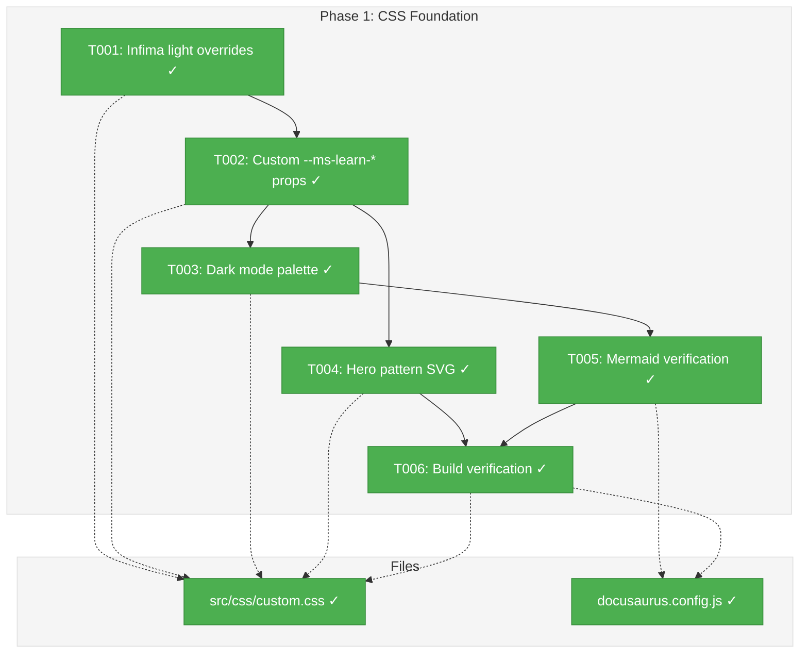
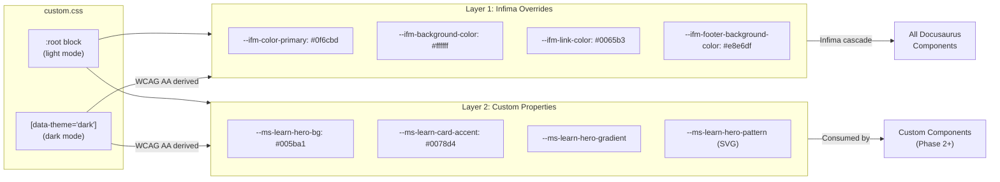
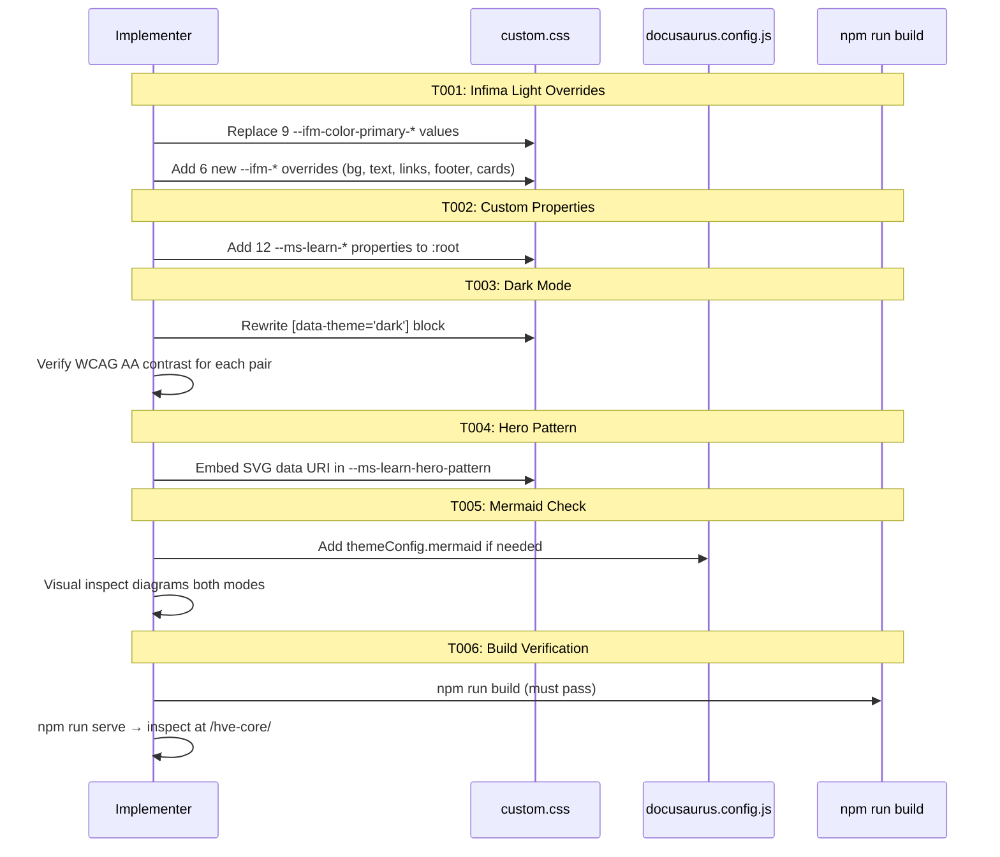

# Phase 1: CSS Foundation & Color System – Tasks & Alignment Brief

**Spec**: [ms-learn-theme-spec.md](../../ms-learn-theme-spec.md)
**Plan**: [ms-learn-theme-plan.md](../../ms-learn-theme-plan.md)
**Date**: 2026-02-19

## Executive Briefing

### Purpose

This phase replaces the current single-color Microsoft Blue (`#0078D4`) palette with the Azure Architecture Center's three-blue color system, establishing the visual foundation that every subsequent phase builds upon. Without this, card components, the hero section, and dark mode cannot render with the correct colors.

### What We're Building

A dual-layer CSS variable architecture in `src/css/custom.css`:
- **Layer 1**: Infima variable overrides (`--ifm-*`) mapping MS Learn's primary interactive colors to Docusaurus's built-in theme system (~15 overrides)
- **Layer 2**: Custom `--ms-learn-*` properties for hero gradients, card accents, section backgrounds, and semantic colors (~12 new properties)
- **Dark mode**: A complete derived palette in `[data-theme='dark']` with WCAG AA contrast verification
- **Hero pattern**: A "+" cross/plus SVG pattern embedded as a CSS data URI

### User Value

Visitors see a professional color scheme aligned with the Microsoft Learn ecosystem instead of the generic Microsoft Blue. Dark mode renders with carefully tuned contrast rather than simple color inversion.

### Example

**Before** (current `custom.css`):
```css
:root {
  --ifm-color-primary: #0078D4;        /* Single blue for everything */
}
```

**After** (new three-blue system):
```css
:root {
  --ifm-color-primary: #0f6cbd;        /* Theme primary (buttons, links) */
  --ms-learn-hero-bg: #005ba1;         /* Hero/banner azure (darker) */
  --ms-learn-card-accent: #0078d4;     /* Card accents (standard Azure) */
  --ms-learn-hero-gradient: linear-gradient(174.2deg, #005ba1 0%, #004d88 66.72%, #003e6e);
}
```

---

## Objectives & Scope

### Objective

Implement the complete CSS color foundation as specified in the plan, enabling all subsequent phases (hub page, conceptual restyling, content restructuring) to consume stable color tokens. Satisfies AC#8 (color palette), AC#9 (dark mode — partial), AC#14 (build integrity), and AC#17 (Mermaid preservation).

### Goals

- ✅ Replace all 9 existing Infima variable overrides with the MS Learn three-blue system values
- ✅ Add 6 new Infima variable overrides (background, text, links, footer, cards)
- ✅ Define 12 custom `--ms-learn-*` properties for hero, cards, sections, and semantics
- ✅ Derive a complete dark mode palette with WCAG AA contrast verification
- ✅ Create a repeating "+" cross pattern SVG embedded as a CSS data URI
- ✅ Verify Mermaid diagrams render correctly with the new palette
- ✅ Confirm `npm run build` passes clean

### Non-Goals

- ❌ React component creation (Phase 2)
- ❌ Swizzling Docusaurus components (Phase 3)
- ❌ Content restructuring or new categories (Phase 4)
- ❌ Selector-based CSS overrides (only CSS variable overrides in this phase)
- ❌ Creating new CSS files — all changes go into the existing `custom.css`
- ❌ Modifying `index.js` or any React/page files
- ❌ Visual regression testing tooling (manual inspection sufficient)

---

## Pre-Implementation Audit

### Summary

| File | Action | Origin | Modified By | Recommendation |
|------|--------|--------|-------------|----------------|
| `src/css/custom.css` | Modify | Docusaurus Classic init | Plan 003 (Fluent theming) | keep-as-is — extend existing structure |
| `docusaurus.config.js` | Modify | Docusaurus Classic init | Plan 003 (Mermaid, footer, navbar) | keep-as-is — add Mermaid theme config only |

### Per-File Detail

#### `src/css/custom.css`
- **Duplication check**: Only CSS file in `src/css/`. No conflicts.
- **Provenance**: Created during Docusaurus init, modified in Plan 003 to set Fluent colors. Current state: 31 lines, 9 Infima variable overrides in `:root`, 8 dark mode overrides.
- **Compliance**: No project rules files exist. `docusaurus-edits.instructions.md` does not prescribe CSS patterns. No violations.

#### `docusaurus.config.js`
- **Duplication check**: Only config file. No conflicts.
- **Provenance**: Created during Docusaurus init, modified in Plan 003 for Mermaid, footer, navbar.
- **Compliance**: Mermaid dual-config intact (PL-03). `future: { v4: true }` active. No violations.
- **Note**: May need `themeConfig.mermaid.theme` addition if palette change degrades diagram colors.

### Compliance Check

No compliance sources found (no `docs/project-rules/` files, no ADRs). Skipped.

---

## Requirements Traceability

### Coverage Matrix

| AC | Description | Flow Summary | Files in Flow | Tasks | Status |
|----|-------------|-------------|---------------|-------|--------|
| AC#8 | Three-blue color system in light and dark | `:root` and `[data-theme='dark']` blocks in `custom.css` → Infima cascade → all components inherit | `custom.css` | T001, T002, T003 | ✅ Complete |
| AC#9 | Dark mode renders correctly (partial) | `[data-theme='dark']` in `custom.css` → Docusaurus color mode toggle | `custom.css` | T003 | ✅ Complete |
| AC#14 | `npm run build` passes | `custom.css` loaded via `customCss` in `docusaurus.config.js` → webpack build | `custom.css`, `docusaurus.config.js` | T006 | ✅ Complete |
| AC#17 | Mermaid rendering preserved | Mermaid inherits `--ifm-color-primary` → may need `themeConfig.mermaid` override | `docusaurus.config.js` | T005 | ✅ Complete |

### Gaps Found

No gaps — all acceptance criteria have complete file coverage. Phase 1 touches only 2 files, both of which are covered by tasks.

### Orphan Files

None. All files in the task table directly serve at least one AC.

---

## Architecture Map

### Component Diagram

<!-- Status: grey=pending, orange=in-progress, green=completed, red=blocked -->
<!-- Updated by plan-6 during implementation -->



### Task-to-Component Mapping

<!-- Status: ⬜ Pending | 🟧 In Progress | ✅ Complete | 🔴 Blocked -->

| Task | Component(s) | Files | Status | Comment |
|------|-------------|-------|--------|---------|
| T001 | Infima CSS Variables | `src/css/custom.css` | ✅ Complete | Replaced 9 overrides + added 6 new ones |
| T002 | Custom CSS Properties | `src/css/custom.css` | ✅ Complete | 12 new `--ms-learn-*` properties in `:root` |
| T003 | Dark Mode Palette | `src/css/custom.css` | ✅ Complete | WCAG verified, hero gradient adjusted for contrast |
| T004 | Hero Pattern SVG | `src/css/custom.css` | ✅ Complete | Inline data URI, 20×20 cross pattern |
| T005 | Mermaid Theme | `docusaurus.config.js` | ✅ Complete | No config changes needed — diagrams render OK |
| T006 | Build Verification | Both files | ✅ Complete | `npm run build` passes clean |

---

## Tasks

| Status | ID | Task | CS | Type | Dependencies | Absolute Path(s) | Validation | Subtasks | Notes |
|--------|------|------|-----|------|--------------|-------------------|------------|----------|-------|
| [x] | T001 | Rewrite `:root` block in `custom.css`: replace all 9 existing `--ifm-color-primary-*` overrides with MS Learn three-blue values. Add new Infima overrides: `--ifm-background-color: #ffffff`, `--ifm-font-color-base: #161616`, `--ifm-link-color: #0065b3`, `--ifm-footer-background-color: #e8e6df`, `--ifm-card-background-color: #ffffff`. Preserve `--ifm-code-font-size`, `--ifm-font-family-base`, `--ifm-heading-font-family`, and `--docusaurus-highlighted-code-line-bg` unchanged | CS-1 | Core | – | `/Users/vaughanknight/GitHub/hve-core-docs-pr/docs/docusaurus/src/css/custom.css` | All `--ifm-*` values match Discovery 02 table exactly. Existing non-color variables preserved | – | Per Critical Discovery 02: Layer 1 |
| [x] | T002 | Add 12 custom `--ms-learn-*` properties to `:root` block: `--ms-learn-hero-bg: #005ba1`, `--ms-learn-hero-gradient: linear-gradient(174.2deg, #005ba1 0%, #004d88 66.72%, #003e6e)`, `--ms-learn-hero-text: #ffffff`, `--ms-learn-hero-pattern` (placeholder — T004 fills this), `--ms-learn-card-accent: #0078d4`, `--ms-learn-card-border: #e6e6e6`, `--ms-learn-text-subtle: #505050`, `--ms-learn-section-bg: #f2f2f2`, `--ms-learn-footer-bg: #e8e6df`, `--ms-learn-visited-link: #624991`, `--ms-learn-success: #107c10`, `--ms-learn-danger: #bc2f32` | CS-1 | Core | T001 | `/Users/vaughanknight/GitHub/hve-core-docs-pr/docs/docusaurus/src/css/custom.css` | All 12 properties present with correct values. CSS parses without syntax errors | – | Per Critical Discovery 02: Layer 2 |
| [x] | T003 | Derive complete dark mode palette in `[data-theme='dark']` block. Override all Infima primary variables per Discovery 02 dark column: `--ifm-color-primary: #479ef5`, `--ifm-color-primary-dark: #0f6cbd`, etc. Override custom properties: `--ms-learn-hero-bg: #2b88d8`, `--ms-learn-hero-gradient: linear-gradient(174.2deg, #2b88d8 0%, #1a6fb5 66.72%, #115ea3)`, `--ms-learn-hero-text: #ffffff`, `--ms-learn-card-accent: #479ef5`, `--ms-learn-card-border: #404040`, `--ms-learn-text-subtle: #b0b0b0`, `--ms-learn-section-bg: #252525`, `--ms-learn-footer-bg: #1f1f1f`, `--ms-learn-visited-link: #b4a0d6`, `--ms-learn-success: #2ea043`, `--ms-learn-danger: #f85149`, `--ifm-background-color: #1b1b1b`, `--ifm-font-color-base: #e0e0e0`, `--ifm-link-color: #479ef5`, `--ifm-footer-background-color: #1f1f1f`, `--ifm-card-background-color: #292929`. Verify WCAG AA contrast using WebAIM Contrast Checker for each foreground/background pair against `#1b1b1b`. Document results in execution log as a contrast table: foreground, background, ratio, PASS/FAIL | CS-2 | Core | T001, T002 | `/Users/vaughanknight/GitHub/hve-core-docs-pr/docs/docusaurus/src/css/custom.css` | All dark mode values present. WCAG AA contrast ratios documented. Visual inspection shows readable text and visible UI elements in dark mode | – | Per Critical Discovery 03: no MS Learn dark ref — derive from light palette |
| [x] | T004 | Create "+" cross/plus repeating pattern SVG and embed as CSS data URI in `--ms-learn-hero-pattern`. SVG spec: 20×20 viewBox, two crossed lines (horizontal: M0,10 L20,10; vertical: M10,0 L10,20), stroke `rgba(255,255,255,0.08)`, stroke-width `1`. Encode as `url("data:image/svg+xml,<svg xmlns='http://www.w3.org/2000/svg' width='20' height='20'><path d='M0 10h20M10 0v20' stroke='rgba(255,255,255,0.08)' stroke-width='1'/></svg>")`. Set in `:root`. Dark mode version unchanged (white on dark is fine) | CS-1 | Core | T002 | `/Users/vaughanknight/GitHub/hve-core-docs-pr/docs/docusaurus/src/css/custom.css` | `--ms-learn-hero-pattern` contains valid `data:image/svg+xml` URI. Pattern renders as repeating "+" crosses when applied as `background-image` | – | Inline data URI avoids baseUrl path issues per Discovery 09 |
| [x] | T005 | Verify Mermaid diagram rendering in both light and dark modes after palette change. Open a doc page containing Mermaid diagrams (e.g., any page with ````mermaid` blocks) via `npm run start`. Check: node colors, text contrast, edge colors in both modes. If colors are unsatisfactory, add `mermaid: { theme: { light: 'default', dark: 'dark' } }` to `themeConfig` in `docusaurus.config.js`. If no existing pages have Mermaid, create a temporary test page | CS-1 | Verification | T003 | `/Users/vaughanknight/GitHub/hve-core-docs-pr/docs/docusaurus/docusaurus.config.js` | Mermaid diagrams readable in both modes. If `themeConfig.mermaid` added, build still passes | – | Per Discovery 10 and PL-03: dual-config requirement. Do NOT remove `markdown.mermaid: true` or `themes: ['@docusaurus/theme-mermaid']` |
| [x] | T006 | Run `cd /Users/vaughanknight/GitHub/hve-core-docs-pr/docs/docusaurus && npm run build` — must pass with zero errors. Then run `npm run serve` and visually inspect at `localhost:3000/hve-core/`: verify color palette in light mode, toggle to dark mode and verify, check that all existing pages render correctly, verify no CSS console errors in DevTools | CS-1 | Verification | T003, T004, T005 | `/Users/vaughanknight/GitHub/hve-core-docs-pr/docs/docusaurus/src/css/custom.css`, `/Users/vaughanknight/GitHub/hve-core-docs-pr/docs/docusaurus/docusaurus.config.js` | `npm run build` exits 0. `npm run serve` renders correctly at `/hve-core/`. Both light and dark modes render with correct colors. No console errors | – | Safety check per Discovery 09 |

---

## Alignment Brief

### Critical Findings Affecting This Phase

| Finding | Title | Constraint | Addressed By |
|---------|-------|-----------|-------------|
| Discovery 02 | Dual-Layer CSS Variable Architecture | Separate Infima overrides from custom properties | T001 (Layer 1), T002 (Layer 2) |
| Discovery 03 | Dark Mode Derivation Without Reference | Derive from light palette using WCAG AA contrast ratios | T003 |
| Discovery 07 | Infima Specificity Conflict Prevention | Use `:root` variable overrides only, no selector-based overrides | T001, T002, T003 |
| Discovery 09 | baseUrl Asset Path Safety | Inline SVG as data URI to avoid path issues | T004 |
| Discovery 10 | Mermaid Theme Preservation | Test diagrams after palette change, add theme config if needed | T005 |
| Discovery 11 | Docusaurus v4 Compatibility | Prefer CSS custom properties over class-name selectors | All tasks |

### ADR Decision Constraints

No ADRs exist. N/A.

### Invariants & Guardrails

- **No selector-based CSS overrides** — only `:root` and `[data-theme='dark']` variable declarations in this phase
- **No `!important`** — if needed, restructure the approach
- **Preserve existing non-color variables** — `--ifm-code-font-size`, `--ifm-font-family-base`, `--ifm-heading-font-family`, `--docusaurus-highlighted-code-line-bg` must remain unchanged
- **Mermaid dual-config** — do NOT remove `markdown.mermaid: true` (line 23) or `themes: ['@docusaurus/theme-mermaid']` (line 49) from `docusaurus.config.js`
- **`future: { v4: true }`** — must remain active (line 10-12)
- **`onBrokenLinks: 'throw'`** — must remain active (line 20)
- **Font stack unchanged** — Segoe UI → system-ui → -apple-system → sans-serif

### Inputs to Read

| File | What to Extract |
|------|----------------|
| `src/css/custom.css` | Current 9 Infima overrides, dark mode block structure, preserved variables |
| `docusaurus.config.js` | Mermaid config location (lines 22-24, 49), footer style (line 81), `themeConfig` structure |
| Plan § Discovery 02 | Complete Infima variable mapping table (light + dark values) |
| Spec § Color Palette Reference | All 12 `--ms-learn-*` property names and values |

### Visual Alignment: System Flow



### Visual Alignment: Implementation Sequence



### Test Plan (Lightweight)

Phase 1 uses Lightweight testing per spec. No unit tests. Validation is:

1. **CSS syntax validation**: `npm run build` catches CSS parse errors
2. **WCAG contrast verification**: WebAIM Contrast Checker for each dark mode foreground/background pair. Log results in execution log
3. **Visual inspection**: Both light and dark modes at desktop breakpoint
4. **Mermaid check**: Diagrams render with acceptable colors in both modes
5. **Build integrity**: `npm run build` exits 0, `npm run serve` loads at `/hve-core/`

### Step-by-Step Implementation Outline

1. **T001**: Open `src/css/custom.css`. In the `:root` block, replace lines 9-15 (the 7 `--ifm-color-primary-*` values) with the new values from Discovery 02. Add `--ifm-background-color`, `--ifm-font-color-base`, `--ifm-link-color`, `--ifm-footer-background-color`, `--ifm-card-background-color`. Keep lines 16-19 unchanged.

2. **T002**: Still in `:root`, add the 12 `--ms-learn-*` properties after the Infima block. Use the exact values from the spec's Color Palette Reference section. Set `--ms-learn-hero-pattern` to an empty string placeholder (T004 fills it).

3. **T003**: Replace the `[data-theme='dark']` block (lines 22-31) with the complete dark palette. For each Infima variable, use the "New (Dark)" value from Discovery 02. For each `--ms-learn-*` property, derive the dark equivalent. Run each foreground/background pair through WebAIM. Log the contrast table.

4. **T004**: Construct the SVG data URI: `url("data:image/svg+xml,<svg xmlns='http://www.w3.org/2000/svg' width='20' height='20'><path d='M0 10h20M10 0v20' stroke='rgba(255,255,255,0.08)' stroke-width='1'/></svg>")`. Set as `--ms-learn-hero-pattern` in `:root`. Same value for dark mode (white-on-dark works).

5. **T005**: Run `npm run start` in the worktree. Navigate to a page with Mermaid diagrams. Inspect in both modes. If colors are poor, add `mermaid: { theme: { light: 'default', dark: 'dark' } }` to `themeConfig` in `docusaurus.config.js`.

6. **T006**: Run `npm run build`. Verify zero errors. Run `npm run serve`. Open `localhost:3000/hve-core/`. Check light mode colors, toggle dark mode, check all existing pages.

### Commands to Run

```bash
# Navigate to worktree
cd /Users/vaughanknight/GitHub/hve-core-docs-pr/docs/docusaurus

# Install dependencies (if not already done)
npm install

# Dev server for visual inspection (T005)
npm run start

# Production build verification (T006)
npm run build

# Serve production build at /hve-core/ (T006)
npm run serve
```

### Risks & Unknowns

| Risk | Severity | Mitigation |
|------|----------|------------|
| Dark mode contrast failures for derived palette | HIGH | WCAG verification for every pair. Iterate dark values independently without affecting light mode |
| Mermaid colors unsatisfactory after primary change | MEDIUM | `themeConfig.mermaid` override is non-destructive — add if needed, remove if not |
| CSS syntax error in data URI encoding | LOW | Test with `npm run build` immediately after T004. SVG data URIs need proper URL-encoding of special chars |
| `future: { v4: true }` interaction with CSS variables | LOW | CSS custom properties are the stable API; v4 changes target class names, not variables |

### Ready Check

- [x] Plan verified and phases identified
- [x] Critical findings mapped to tasks
- [ ] ADR constraints mapped to tasks — N/A (no ADRs exist)
- [x] File audit complete (2 files, no conflicts)
- [x] Requirements traceability verified (4 ACs, all covered)
- [x] No gaps in file coverage
- [x] **Phase 1 COMPLETE** — all 6 tasks done, build passes

---

## Phase Footnote Stubs

_Empty — populated by plan-6 during implementation._

| Footnote | Task | Description | Date |
|----------|------|-------------|------|
| | | | |

---

## Evidence Artifacts

- **Execution log**: `docs/plans/004-ms-learn-theme/tasks/phase-1-css-foundation-color-system/execution.log.md`
- **WCAG contrast table**: Documented inline in execution log under T003
- **Before/after screenshots**: Optional, in execution log

---

## Discoveries & Learnings

_Populated during implementation by plan-6. Log anything of interest to your future self._

| Date | Task | Type | Discovery | Resolution | References |
|------|------|------|-----------|------------|------------|
| 2026-02-19 | T003 | gotcha | Dark hero gradient #2b88d8 fails WCAG AA contrast with white text (3.74 < 4.5) | Darkened hero to #1a6fb5 (ratio 5.27 PASS) | log#task-t003 |
| 2026-02-19 | T003 | decision | Card border #505050 on #292929 = 1.80 ratio (below 3.0 threshold) — accepted as decorative exemption | Card borders are not information-conveying per WCAG 1.4.11. MS Learn dark mode uses similarly subtle borders | log#task-t003 |
| 2026-02-19 | T005 | insight | Mermaid diagrams work unchanged after primary color shift (#0078D4 → #0f6cbd) — no themeConfig.mermaid override needed | Both are medium blues; Mermaid contrast calculations produce acceptable results | log#task-t005 |

**Types**: `gotcha` | `research-needed` | `unexpected-behavior` | `workaround` | `decision` | `debt` | `insight`

**What to log**:
- Things that didn't work as expected
- External research that was required
- Implementation troubles and how they were resolved
- Gotchas and edge cases discovered
- Decisions made during implementation
- Technical debt introduced (and why)
- Insights that future phases should know about

_See also: `execution.log.md` for detailed narrative._

---

## Directory Layout

```
docs/plans/004-ms-learn-theme/
├── ms-learn-theme-spec.md
├── ms-learn-theme-plan.md
├── research-dossier.md
└── tasks/
    └── phase-1-css-foundation-color-system/
        ├── tasks.md                    # This file
        ├── tasks.fltplan.md            # Generated by /plan-5b (Flight Plan)
        └── execution.log.md            # Created by /plan-6
```
