# Design Thinking in HVE Core: Complete Dossier

**Generated**: 2026-03-25
**Research Query**: Design thinking skills, flows, meeting workflows, and session facilitation
**Findings**: 60+ across 8 research subagents
**Scope**: Full framework analysis including all agents, prompts, instructions, collections, and integration points

---

## Executive Summary

HVE Core's Design Thinking framework is a **9-method, 3-space coaching system** that guides teams from problem discovery through validated solutions using AI-assisted facilitation. It consists of **58 artifacts** (2 agents, 13 prompts, 43 instructions) at **preview maturity**, fully functional for adoption.

The framework integrates with HVE's RPI (Research, Plan, Implement, Review) pipeline at three exit points, providing progressively richer context for downstream implementation. Sessions are state-persisted, resumable across conversations, and support non-linear iteration.

### Key Concepts at a Glance

| Concept | What It Means |
|---------|---------------|
| **Three Spaces** | Problem (understand) -> Solution (explore) -> Implementation (prove) |
| **9 Methods** | Sequential but non-linear progression through discovery to deployment |
| **Think/Speak/Empower** | Coaching philosophy: internal assessment, conversational delivery, user agency |
| **Anti-Polish** | Rough artifacts invite honest feedback; polish invites approval |
| **Confidence Markers** | `validated` / `assumed` / `unknown` / `conflicting` tags on all handoff data |
| **Frozen vs Fluid** | Non-negotiable constraints vs redesignable aspects |
| **DT-to-RPI Handoff** | Three exit points feeding into Task Researcher with structured artifacts |

---

## The 9-Method, 3-Space Framework

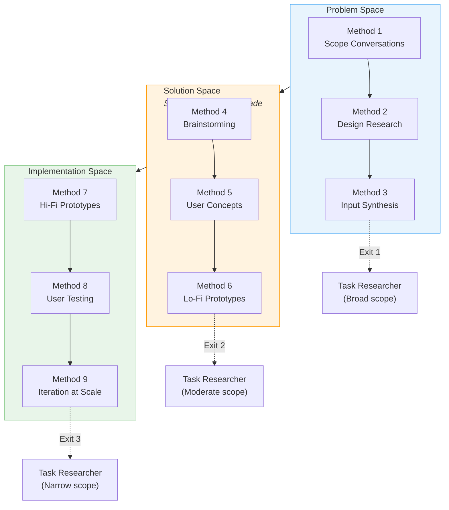

### Method Summary Table

| # | Method | Space | Key Output | Exit Signal |
|---|--------|-------|------------|-------------|
| 1 | Scope Conversations | Problem | Validated problem, stakeholder map | Problem differs from initial request; stakeholders identified |
| 2 | Design Research | Problem | Interview evidence, constraints | Multi-source evidence; environmental context documented |
| 3 | Input Synthesis | Problem | Themes, problem definition, HMW questions | Themes validated across sources; team alignment |
| 4 | Brainstorming | Solution | Divergent ideas clustered into themes | 15+ ideas, 4-6 categories, 3-5 converged themes |
| 5 | User Concepts | Solution | Visual concepts for validation | 30-second comprehensible; D/F/V evaluated |
| 6 | Lo-Fi Prototypes | Solution | Constraint discoveries from testing | Prototypes tested with real users; constraints documented |
| 7 | Hi-Fi Prototypes | Implementation | Functional systems with real data | 2-3 approaches compared systematically |
| 8 | User Testing | Implementation | Validated findings by severity | Real users in real environments; loop decisions evidenced |
| 9 | Iteration at Scale | Implementation | Telemetry-driven optimization | Baselines established; deployment plan; adoption metrics |

---

## How to Use the Design Thinking Skills

### Available Commands (Prompts)

These are the slash commands you invoke in GitHub Copilot Chat:

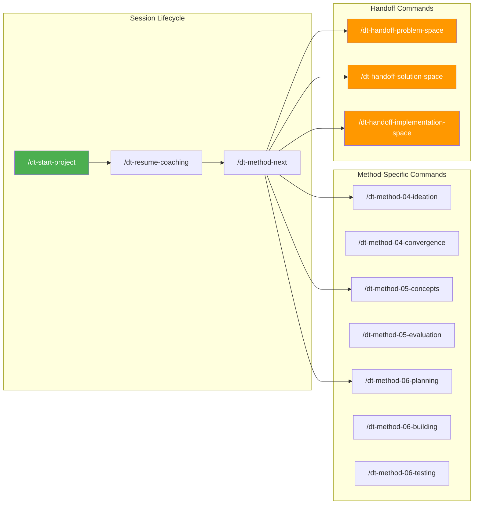

### Command Reference

| Command | Purpose | When to Use |
|---------|---------|-------------|
| `/dt-start-project` | Initialize a new DT coaching project | Starting fresh; creates state file and begins Method 1 |
| `/dt-resume-coaching` | Resume an existing session | Returning to a previous project; reads saved state |
| `/dt-method-next` | Assess readiness and recommend next method | Between methods; evaluates exit signals |
| `/dt-method-04-ideation` | Divergent idea generation | During Method 4b; constraint-informed brainstorming |
| `/dt-method-04-convergence` | Theme discovery via clustering | During Method 4c; philosophy-based grouping |
| `/dt-method-05-concepts` | Concept articulation from themes | During Method 5b; structured concept descriptions |
| `/dt-method-05-evaluation` | Three-lens evaluation (D/F/V) | During Method 5c; stakeholder alignment |
| `/dt-method-06-planning` | Prototype approach design | During Method 6a; core assumption identification |
| `/dt-method-06-building` | Scrappy prototype construction | During Method 6b; minutes-to-hours builds |
| `/dt-method-06-testing` | Hypothesis-driven testing | During Method 6c; constraint validation |
| `/dt-handoff-problem-space` | Package Methods 1-3 for RPI | After Method 3; problem statement complete |
| `/dt-handoff-solution-space` | Package Methods 4-6 for RPI | After Method 6; concept validated |
| `/dt-handoff-implementation-space` | Package Methods 7-9 for RPI | After Method 7/8/9; implementation spec ready |

### Agents

| Agent | Purpose | How to Access |
|-------|---------|---------------|
| **dt-coach** | Conversational coaching through all 9 methods | Select from Copilot Chat agent dropdown |
| **dt-learning-tutor** | Curriculum-based DT training with 9 modules | Select from Copilot Chat agent dropdown |

---

## Complete Session Flow: Start to Finish

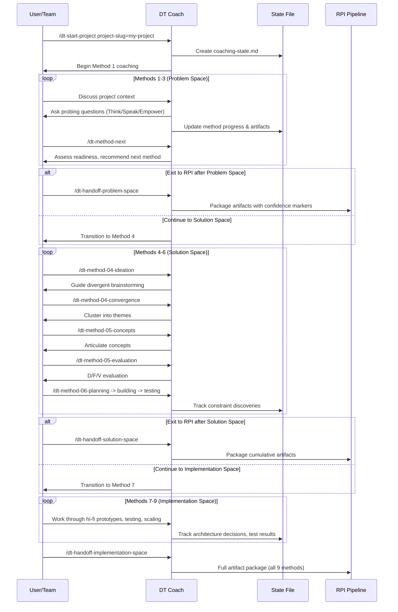

### Session Resumption Flow

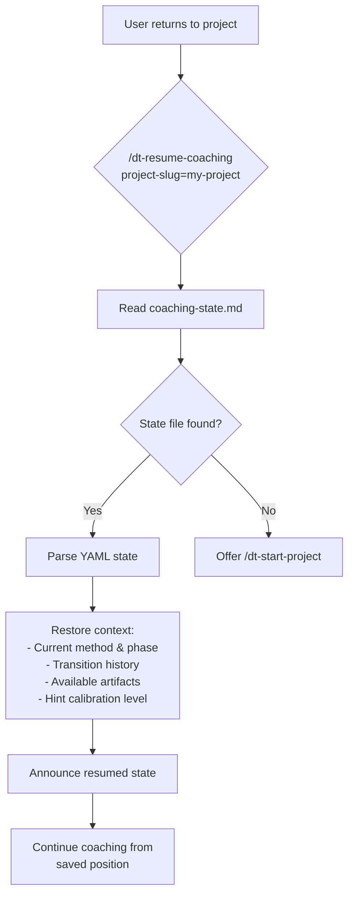

---

## Running an Effective Design Thinking Session

### Pre-Session Preparation

1. **Install HVE Core**: Via VS Code Marketplace (`ise-hve-essentials.hve-core-all`) or clone-based method
2. **Choose your agent**: `dt-coach` for live projects, `dt-learning-tutor` for training first
3. **Identify your project**: Have a clear initial request/problem statement ready
4. **Know your stakeholders**: Who are the decision makers, direct users, and affected parties?

### Starting a Session

```
/dt-start-project project-slug=factory-quality context="Night shift quality issues at Meridian plant" industry=manufacturing
```

The coach will:
- Create `.copilot-tracking/dt/factory-quality/coaching-state.md`
- Capture your initial request verbatim
- Begin Method 1 coaching with probing questions

### Navigating Between Methods

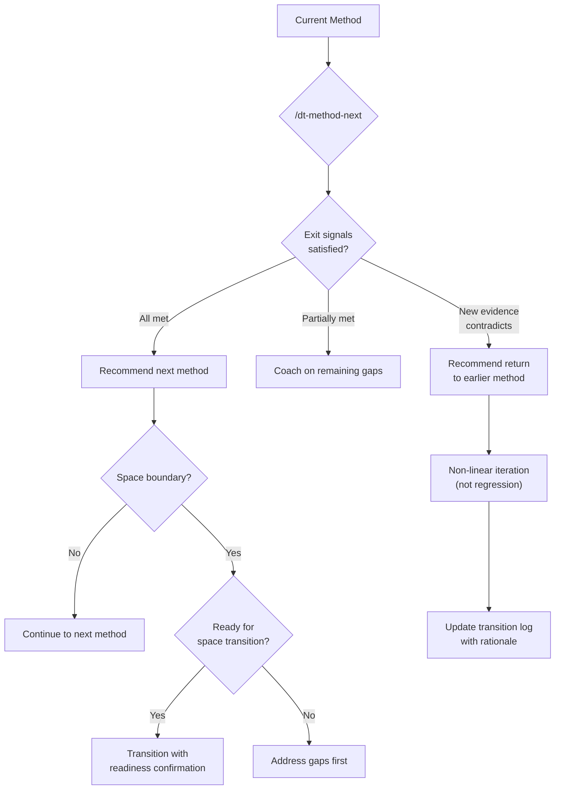

### Key Session Principles

#### Think/Speak/Empower Philosophy

The DT Coach follows a three-layer interaction pattern in every response:

| Layer | What Happens | Example |
|-------|-------------|---------|
| **Think** (internal) | Assess patterns, questions, blockers | *"User mentions workarounds - this suggests constraint discovery opportunity"* |
| **Speak** (external) | Share observation conversationally | *"I'm noticing the team has developed several workarounds. That usually means there's a constraint we haven't documented yet."* |
| **Empower** (response) | Offer choices, not directives | *"Would you like to explore those workarounds now, or should we first map out who else might be affected?"* |

#### Progressive Hint Engine

When you're stuck, the coach escalates support through 4 levels:

| Level | Style | Example |
|-------|-------|---------|
| 1 | Broad direction | *"What else did they mention about the process?"* |
| 2 | Contextual focus | *"You're on track with the handoff timing. What about the equipment they use?"* |
| 3 | Specific area | *"They mentioned the display is hard to read. What challenges might that create?"* |
| 4 | Direct detail | *"The research showed three operators couldn't read the display with safety gloves on."* |

#### Anti-Polish Principle

| Space | Expected Fidelity | Why |
|-------|-------------------|-----|
| Problem (M1-3) | Rough conversation notes, not polished docs | Understanding is the output, not documents |
| Solution (M4-6) | Stick figures, paper, cardboard | Polish invites approval feedback, not critical feedback |
| Validation (M7-9) | Functional but not visually polished | Proof over presentation |

**Core insight**: Teams investing in polish feel ownership, making redirection difficult. Scrappy artifacts surface honest reactions.

---

## Meeting Workflow Integration

### How Design Thinking Fits the HVE Project Lifecycle

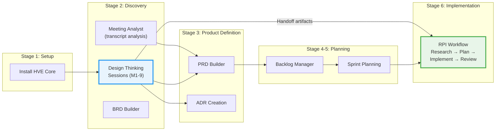

### Design Thinking in a Meeting-Driven Workflow

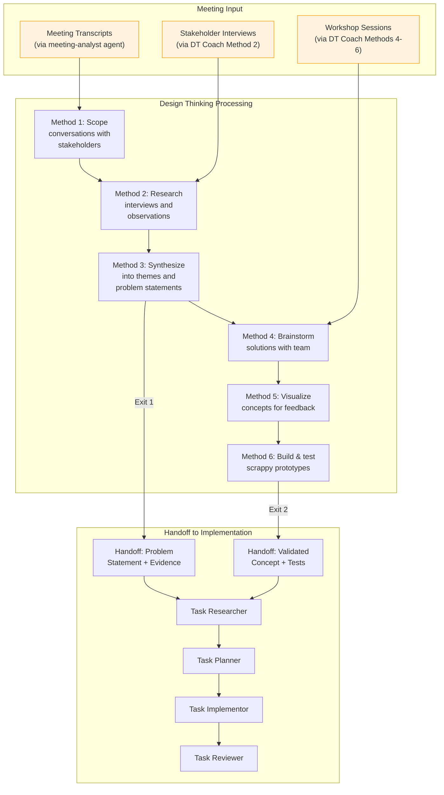

### Combining Meeting Analysis with Design Thinking

You can feed meeting transcripts into the Design Thinking process:

1. **Use Meeting Analyst** to extract requirements, decisions, and action items from recorded meetings
2. **Feed analysis into DT Coach** as stakeholder input for Method 1 (Scope) and Method 2 (Research)
3. **Run brainstorming sessions** (Method 4) informed by synthesized meeting insights
4. **Hand off validated concepts** to RPI for implementation

```
Step 1: /meeting-analyst   → Extracts structured insights from transcripts
Step 2: /dt-start-project  → Initialize DT with meeting insights as context
Step 3: Coach Methods 1-3  → Validate and synthesize meeting findings
Step 4: Coach Methods 4-6  → Generate and test solutions
Step 5: /dt-handoff-*      → Package for RPI implementation
Step 6: /task-research      → Begin RPI pipeline
```

---

## DT-to-RPI Handoff Flow

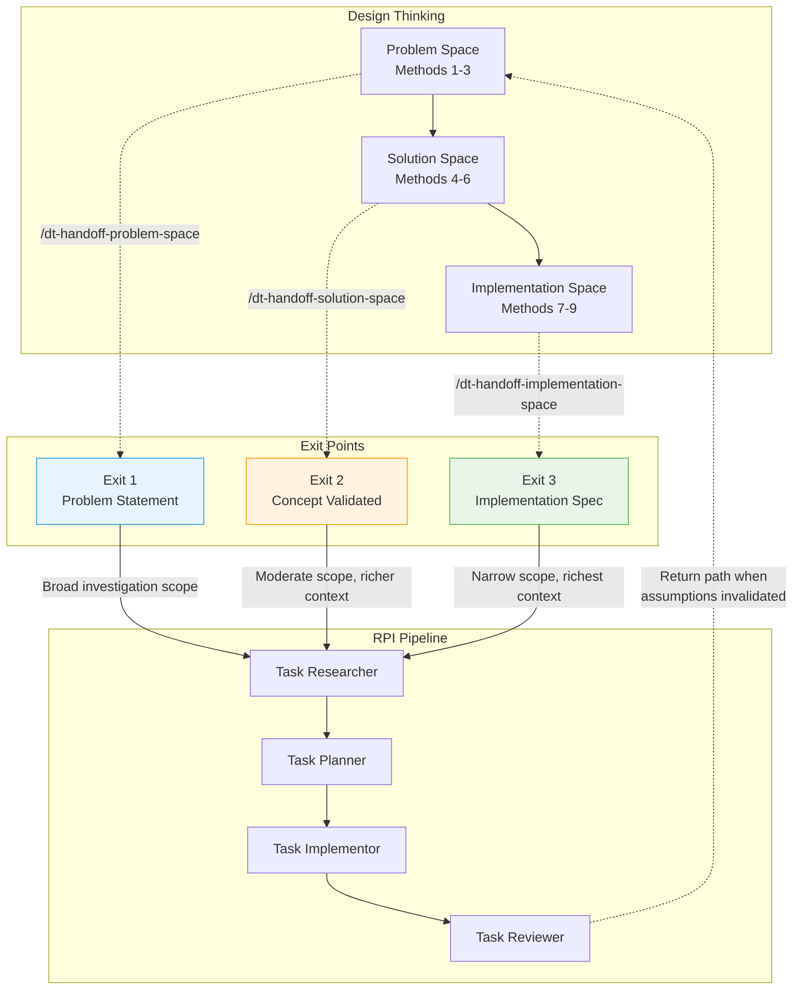

### What Each Exit Point Transfers

| Exit | After Methods | Artifacts Transferred | Confidence Tags |
|------|---------------|----------------------|-----------------|
| **Exit 1** | 1-3 | Stakeholder map, scope boundaries, assumptions log, synthesis themes, HMW questions, constraint inventory | validated/assumed/unknown/conflicting |
| **Exit 2** | 4-6 | Exit 1 + brainstorming themes, concepts.yml with D/F/V scores, lo-fi prototype feedback, constraint discoveries, user behavior patterns | Same markers, cumulative |
| **Exit 3** | 7-9 | Exits 1-2 + architecture decisions, implementation comparisons, fidelity matrix, test protocols, deployment plan, adoption metrics | Same markers, cumulative |

### Return Path: RPI Back to DT

The RPI pipeline can return work to DT when:

- Problem statement needs revision based on technical findings
- Research reveals unrepresented stakeholders
- Fundamental DT assumptions are invalidated
- Downstream agents surface DT-related issues

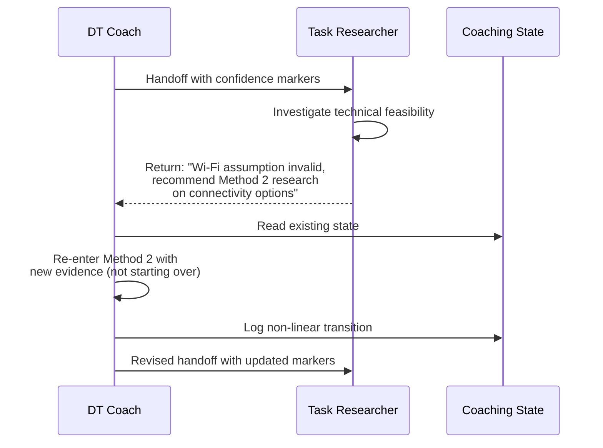

---

## Non-Linear Iteration Patterns

Design Thinking is **not a waterfall**. Backtracking is valid and progress-indicating.

```mermaid
flowchart TD
    M1["Method 1<br/>Scope"] --> M2["Method 2<br/>Research"] --> M3["Method 3<br/>Synthesis"]
    M3 --> M4["Method 4<br/>Brainstorm"] --> M5["Method 5<br/>Concepts"] --> M6["Method 6<br/>Lo-Fi Prototypes"]
    M6 --> M7["Method 7<br/>Hi-Fi Prototypes"] --> M8["Method 8<br/>Testing"] --> M9["Method 9<br/>Iteration"]

    M6 -.->|"Prototype reveals<br/>unknown constraint"| M2
    M8 -.->|"Testing contradicts<br/>a theme"| M3
    M4 -.->|"No viable ideas<br/>generated"| M3
    M5 -.->|"Concept alignment<br/>fails"| M1

    style M2 fill:#e8f4fd,stroke:#2196F3
    style M3 fill:#e8f4fd,stroke:#2196F3

    linkStyle 9 stroke:#f44336,stroke-width:2px
    linkStyle 10 stroke:#f44336,stroke-width:2px
    linkStyle 11 stroke:#f44336,stroke-width:2px
    linkStyle 12 stroke:#f44336,stroke-width:2px
```

| Trigger | Return To | Why |
|---------|-----------|-----|
| Prototype reveals unknown constraint | Method 2 (Research) | Need targeted research, then re-synthesize in Method 3 |
| User testing contradicts a theme | Method 3 or 2 | Theme needs re-investigation |
| Brainstorming produces no viable ideas | Method 3 (Synthesis) | Check if themes are too narrow |
| Concept alignment fails | Method 1 (Scope) | Need to re-engage stakeholders |

---

## Quality Standards by Space

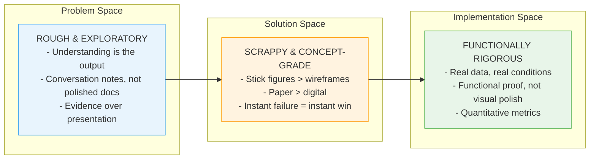

### Universal Quality Rules

1. **Multi-source validation**: No conclusion rests on a single source
2. **Real-world environment testing**: Test where users actually work, not in labs
3. **Evidence over opinion**: Require quotes, observations, metrics
4. **Constraint-driven design**: Physical/environmental/workflow constraints are creative catalysts
5. **Assumption testing**: Every method tests or validates assumptions from prior methods
6. **Anti-polish stance**: Fidelity stays appropriate to current method

---

## Session State & Artifact Management

### Coaching State File

All session state is persisted at `.copilot-tracking/dt/{project-slug}/coaching-state.md`:

```yaml
project:
  name: "Human-readable project name"
  slug: "kebab-case-identifier"
  created: "2026-03-20"
  initial_request: "Original customer request verbatim"
  initial_classification: "frozen | fluid"

current:
  method: 3
  space: "problem"
  phase: "Synthesis validation"

methods_completed: [1, 2]

transition_log:
  - from_method: null
    to_method: 1
    rationale: "Project initialized"
    date: "2026-03-20"
  - from_method: 1
    to_method: 2
    rationale: "Stakeholders mapped, constraints classified"
    date: "2026-03-20"

hint_calibration:
  level: 2
  pattern_notes: "User responds well to contextual focus"

session_log:
  - date: "2026-03-20"
    method: 1
    summary: "Mapped 3-tier stakeholders, classified frozen/fluid"
  - date: "2026-03-20"
    method: 2
    summary: "Conducted 4 interviews, documented environment"

artifacts:
  - path: "method-01-stakeholder-map.md"
    method: 1
    type: "stakeholder-map"
  - path: "method-02-interview-01-operator.md"
    method: 2
    type: "interview-notes"
```

### Artifact Directory Structure

```
.copilot-tracking/
  dt/
    {project-slug}/
      coaching-state.md                    # Session state (YAML)
      method-01-stakeholder-map.md         # Method 1 outputs
      method-01-scope-boundaries.md
      method-01-assumptions-log.md
      method-02-research-plan.md           # Method 2 outputs
      method-02-interview-01-operator.md
      method-02-observation-01-floor.md
      method-02-constraint-catalog.md
      method-03-affinity-clusters.md       # Method 3 outputs
      method-03-insight-statements.md
      method-03-problem-definition.md
      method-03-how-might-we-questions.md
      method-04-ideation-output.md         # Method 4 outputs
      method-04-convergence-themes.md
      method-05-concepts.yml               # Method 5 outputs (YAML)
      method-05-evaluation-matrix.md
      method-06-prototype-plan.md          # Method 6 outputs
      method-06-test-observations.md
      method-06-constraint-discoveries.md
      handoff-summary.md                   # Handoff artifacts
      handoff-rpi-entry.md
```

---

## Industry-Specific Contexts

Design Thinking supports industry-specific vocabulary, constraints, and empathy tools without changing the underlying method structure:

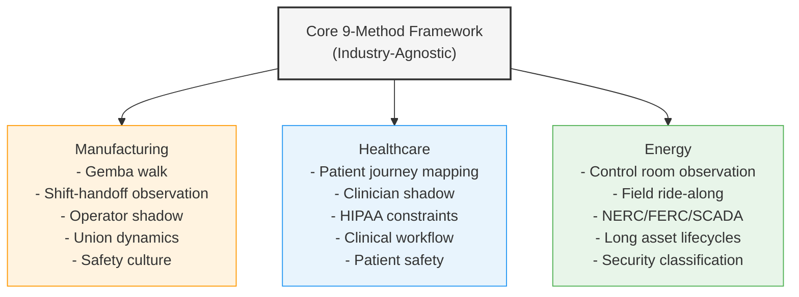

Each industry context provides:
- **Vocabulary mapping**: Technical terms translated to design thinking language
- **Operational constraints**: Domain-specific limitations (regulatory, safety, workflow)
- **Empathy tools**: Observation techniques appropriate to the environment
- **Reference scenarios**: Example problems for learning and practice

### Instruction Files

| Industry | Instruction File |
|----------|-----------------|
| Manufacturing | `.github/instructions/design-thinking/dt-industry-manufacturing.instructions.md` |
| Healthcare | `.github/instructions/design-thinking/dt-industry-healthcare.instructions.md` |
| Energy | `.github/instructions/design-thinking/dt-industry-energy.instructions.md` |

---

## Learning Path: DT Learning Tutor

Before running live sessions, teams can train using the DT Learning Tutor agent:

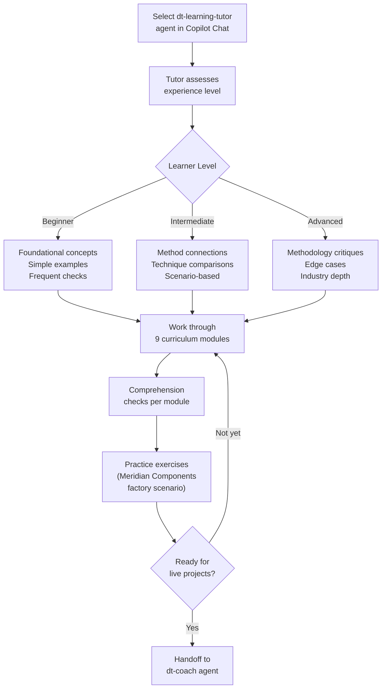

### Curriculum Modules (9 Total)

Each module covers one method with:
1. Module overview (what and why)
2. Core principles and vocabulary
3. Specific techniques
4. Comprehension questions
5. Practice exercise using the Meridian Components manufacturing scenario

| Module | Method | Key Concepts |
|--------|--------|--------------|
| 1 | Scope Conversations | Frozen vs fluid requests, stakeholder mapping, constraint discovery |
| 2 | Design Research | Genuine need discovery, environmental context, universal discovery sequence |
| 3 | Synthesis | Multi-source pattern recognition, theme development, context preservation |
| 4 | Brainstorming | Divergent vs convergent phases, constraint-driven creativity, philosophy-based clustering |
| 5 | User Concepts | Minimum viable visuals, understanding speed, interaction vs value concepts |
| 6 | Lo-Fi Prototypes | Scrappy principle, instant failure as instant win, single-assumption testing |
| 7 | Hi-Fi Prototypes | Technical feasibility validation, stripped-down functional focus, multiple implementation comparison |
| 8 | User Testing | Leap-enabling vs leap-killing questions, non-linear iteration loops, behavior over opinions |
| 9 | Iteration at Scale | Telemetry-driven enhancement, high-frequency pattern focus, incremental enhancement |

---

## Confidence Markers System

All handoff artifacts tag their contents for downstream calibration:

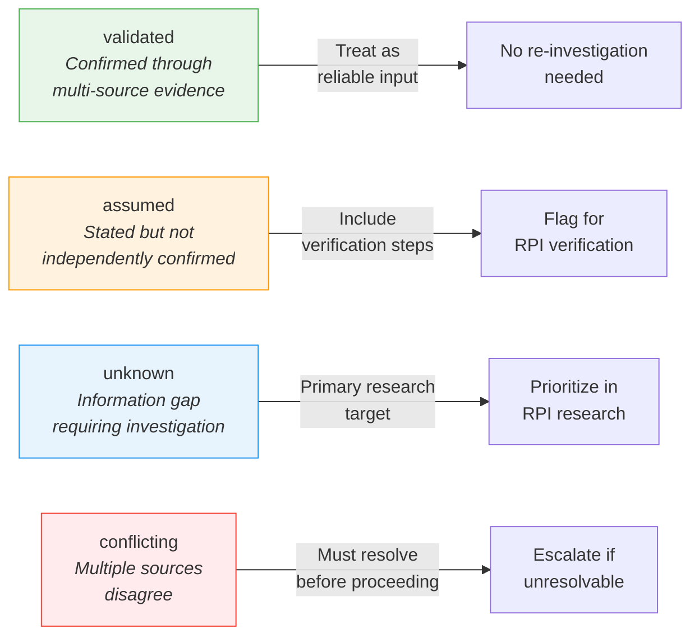

---

## Collection & Plugin Architecture

### How Design Thinking is Packaged

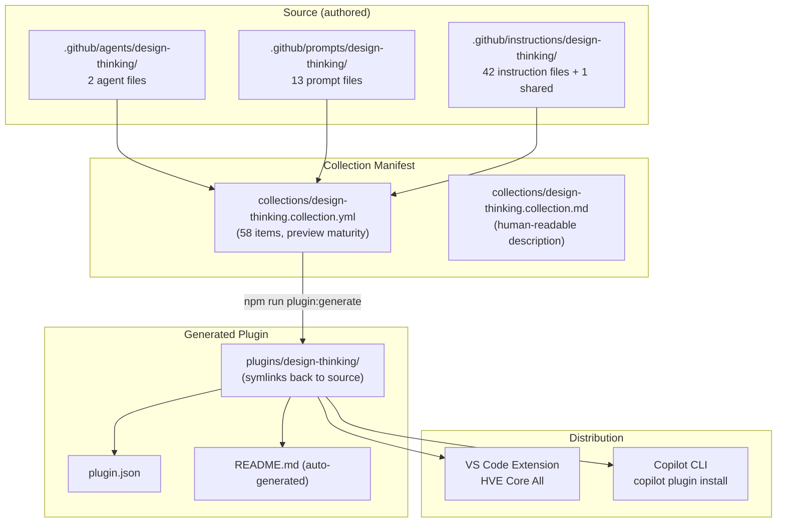

### All Collections in HVE Core

| Collection | Artifacts | Maturity | Purpose |
|------------|-----------|----------|---------|
| hve-core | 40 | Stable | RPI workflow, Git prompts, core utilities |
| ado | 21 | Stable | Azure DevOps integration |
| coding-standards | 14 | Stable | Language-specific coding conventions |
| data-science | 7 | Stable | Data specs, Jupyter, Streamlit |
| **design-thinking** | **58** | **Preview** | **AI-enhanced design thinking coaching** |
| experimental | 6 | Experimental | Early-stage artifacts |
| github | 12 | Stable | GitHub backlog management |
| project-planning | 16 | Stable | ADRs, BRDs, diagrams |
| security | 4 | Experimental | Security and threat modeling |
| hve-core-all | 163 | Stable | Superset of all artifacts |
| installer | 2 | Stable | Deployment tool |

### Tiered Instruction Loading

Design Thinking uses a three-tier instruction loading system:

| Tier | When Loaded | Example |
|------|-------------|---------|
| **Ambient** | Automatically when any DT project file is open | `dt-coaching-identity`, `dt-quality-constraints`, `dt-method-sequencing` |
| **Method** | When working within a specific method | `dt-method-04-brainstorming` loads during Method 4 |
| **On-demand** | Loaded via `read_file` when advanced expertise needed | `dt-method-04-deep` for advanced brainstorming techniques |

---

## Quick Reference: Running Your First Session

### Step-by-Step Guide

```
1. INSTALL
   - VS Code Extensions: Search "HVE Core" → Install "HVE Core All"

2. START SESSION
   - Open Copilot Chat
   - Select dt-coach agent from dropdown
   - Type: /dt-start-project project-slug=my-project

3. WORK THROUGH METHODS
   - Coach guides you through Method 1 (Scope) first
   - Answer questions, provide context, share stakeholder info
   - Use /dt-method-next to check readiness and advance

4. USE METHOD-SPECIFIC COMMANDS (Methods 4-6)
   - /dt-method-04-ideation     → Generate 15+ ideas
   - /dt-method-04-convergence  → Cluster into 3-5 themes
   - /dt-method-05-concepts     → Articulate concepts
   - /dt-method-05-evaluation   → D/F/V evaluation
   - /dt-method-06-planning     → Plan prototype approach
   - /dt-method-06-building     → Build scrappy prototype
   - /dt-method-06-testing      → Test with real users

5. HAND OFF TO RPI (when ready)
   - /dt-handoff-problem-space       → After Methods 1-3
   - /dt-handoff-solution-space      → After Methods 4-6
   - /dt-handoff-implementation-space → After Methods 7-9

6. CONTINUE IN RPI
   - /clear (reset context)
   - /task-research (begin RPI Research phase)
   - /task-plan → /task-implement → /task-review

7. RESUME LATER
   - /dt-resume-coaching project-slug=my-project
```

### Tips for Effective Sessions

- **Use `/clear` between agents** to prevent context confusion
- **Don't rush through methods** - the coach will signal when exit conditions are met
- **Embrace scrappy output** - rough artifacts invite better feedback
- **Iterate non-linearly** - returning to an earlier method is progress, not regression
- **Include all stakeholder tiers** - decision makers, direct users, AND affected parties
- **Test in real environments** - not meeting rooms or labs
- **Observe behavior, not opinions** - what people do matters more than what they say

---

## Comparison: Design Thinking vs Traditional Requirements

| Aspect | Traditional Requirements | Design Thinking |
|--------|--------------------------|-----------------|
| Starting point | Stakeholder wish list | Observed user behavior |
| Evidence basis | Stated preferences | Multi-source research |
| Validation timing | After implementation | Continuously throughout |
| Prototype fidelity | High from start | Lowest that tests hypothesis |
| Stakeholder involvement | Beginning and end | Throughout process |
| Handling disagreement | Escalation/compromise | Synthesis through shared observation |
| Relationship with RPI | N/A | Complementary: DT answers what/why, RPI answers how |

---

## Additional Capabilities

### Subagent Handoff Validation

The framework includes a multi-step subagent dispatch workflow for validating handoff readiness before transitioning artifacts to RPI. This is defined in `dt-subagent-handoff.instructions.md` and provides:

- **Readiness assessment**: Automated checks that exit signals for the current space are satisfied
- **Artifact compilation**: Gathering and structuring all method outputs for the target RPI agent
- **Quality validation**: Verifying confidence markers are applied and artifacts meet quality constraints
- **Handoff execution**: Structured transfer with lineage tracking from originating DT methods

This instruction loads automatically during handoff commands and ensures that incomplete or poorly-tagged artifacts don't leak into the RPI pipeline.

### Image Prompt Generation (Method 5)

For Method 5 (User Concepts), the framework includes AI image generation guidance via `dt-image-prompt-generation.instructions.md`. This provides:

- Techniques for generating lo-fi visualization prompts using M365 Copilot / DALL-E
- Maintains the scrappy principle -- images should be concept-grade, not polished
- Supports the "30-second comprehension test" by creating quick visual artifacts
- Integrates with the anti-polish stance: rough visuals invite honest feedback

### Per-Agent RPI Context Instructions

Beyond the handoff contract, four dedicated instruction files define how DT context flows into each specific RPI agent:

| Instruction File | RPI Agent | What It Does |
|-----------------|-----------|--------------|
| `dt-rpi-research-context.instructions.md` | Task Researcher | Frames research around stakeholder needs, quality-marked findings, assumption validation, and return path triggers |
| `dt-rpi-planning-context.instructions.md` | Task Planner | Shapes planning around fidelity constraints, iteration support, confidence-informed risk, stakeholder-segmented success criteria |
| `dt-rpi-implement-context.instructions.md` | Task Implementor | Enforces space-appropriate fidelity, constraint-validated scope, anti-polish, DT artifact path references |
| `dt-rpi-review-context.instructions.md` | Task Reviewer | Defines quality criteria per artifact type, coaching tone checks, fidelity enforcement, severity mapping |

These instructions load automatically when RPI agents are working on DT-originated artifacts, ensuring DT context and constraints persist throughout the entire implementation pipeline.

### Complete Instruction File Inventory (43 Files)

For reference, here is every instruction file in the collection organized by category:

**Core Framework (4)**:
- `dt-coaching-identity.instructions.md` -- Think/Speak/Empower philosophy
- `dt-coaching-state.instructions.md` -- Session persistence schema
- `dt-method-sequencing.instructions.md` -- Method navigation rules
- `dt-quality-constraints.instructions.md` -- Quality and fidelity rules

**RPI Integration (6)**:
- `dt-rpi-handoff-contract.instructions.md` -- Exit point schemas and contracts
- `dt-rpi-research-context.instructions.md` -- Task Researcher augmentation
- `dt-rpi-planning-context.instructions.md` -- Task Planner augmentation
- `dt-rpi-implement-context.instructions.md` -- Task Implementor augmentation
- `dt-rpi-review-context.instructions.md` -- Task Reviewer quality criteria
- `dt-subagent-handoff.instructions.md` -- Handoff readiness and validation

**Method Instructions (9 base + 9 deep = 18)**:
- `dt-method-01-scope.instructions.md` + `dt-method-01-deep.instructions.md`
- `dt-method-02-research.instructions.md` + `dt-method-02-deep.instructions.md`
- `dt-method-03-synthesis.instructions.md` + `dt-method-03-deep.instructions.md`
- `dt-method-04-brainstorming.instructions.md` + `dt-method-04-deep.instructions.md`
- `dt-method-05-concepts.instructions.md` + `dt-method-05-deep.instructions.md`
- `dt-method-06-lofi-prototypes.instructions.md` + `dt-method-06-deep.instructions.md`
- `dt-method-07-hifi-prototypes.instructions.md` + `dt-method-07-deep.instructions.md`
- `dt-method-08-testing.instructions.md` + `dt-method-08-deep.instructions.md`
- `dt-method-09-iteration.instructions.md` + `dt-method-09-deep.instructions.md`

**Industry Context (3)**:
- `dt-industry-manufacturing.instructions.md`
- `dt-industry-healthcare.instructions.md`
- `dt-industry-energy.instructions.md`

**Curriculum (10)**:
- `dt-curriculum-01-scoping.instructions.md` through `dt-curriculum-09-handoff.instructions.md` (9 modules)
- `dt-curriculum-scenario-manufacturing.instructions.md` (reference scenario)

**Other (2)**:
- `dt-image-prompt-generation.instructions.md` -- M365/DALL-E visualization
- `hve-core-location.instructions.md` (shared) -- Directory fallback guidance

---

## File Reference

### Core Documentation

| File | Purpose |
|------|---------|
| `docs/design-thinking/README.md` | Framework overview |
| `docs/design-thinking/why-design-thinking.md` | Rationale and comparison |
| `docs/design-thinking/dt-coach.md` | Coach agent guide |
| `docs/design-thinking/dt-learning-tutor.md` | Tutor agent guide |
| `docs/design-thinking/using-together.md` | End-to-end walkthrough (manufacturing scenario) |
| `docs/design-thinking/dt-rpi-integration.md` | DT-to-RPI integration |
| `docs/design-thinking/tutorial-handoff-to-rpi.md` | Step-by-step handoff tutorial |
| `docs/design-thinking/method-01-scope-conversations.md` | Method 1 guide |
| `docs/design-thinking/method-02-design-research.md` | Method 2 guide |
| `docs/design-thinking/method-03-input-synthesis.md` | Method 3 guide |
| `docs/design-thinking/method-04-brainstorming.md` | Method 4 guide |
| `docs/design-thinking/method-05-user-concepts.md` | Method 5 guide |
| `docs/design-thinking/method-06-lofi-prototypes.md` | Method 6 guide |
| `docs/design-thinking/method-07-hifi-prototypes.md` | Method 7 guide |
| `docs/design-thinking/method-08-test-validate.md` | Method 8 guide |
| `docs/design-thinking/method-09-iteration-at-scale.md` | Method 9 guide |

### Agents

| File | Purpose |
|------|---------|
| `.github/agents/design-thinking/dt-coach.agent.md` | Coach agent definition |
| `.github/agents/design-thinking/dt-learning-tutor.agent.md` | Tutor agent definition |

### Key Instructions

| File | Purpose |
|------|---------|
| `.github/instructions/design-thinking/dt-coaching-identity.instructions.md` | Think/Speak/Empower philosophy |
| `.github/instructions/design-thinking/dt-coaching-state.instructions.md` | Session persistence schema |
| `.github/instructions/design-thinking/dt-method-sequencing.instructions.md` | Method navigation rules |
| `.github/instructions/design-thinking/dt-quality-constraints.instructions.md` | Quality and fidelity rules |
| `.github/instructions/design-thinking/dt-rpi-handoff-contract.instructions.md` | Handoff exit point contracts |
| `.github/instructions/design-thinking/dt-subagent-handoff.instructions.md` | Handoff readiness and validation |
| `.github/instructions/design-thinking/dt-image-prompt-generation.instructions.md` | M365/DALL-E concept visualization |
| `.github/instructions/design-thinking/dt-rpi-research-context.instructions.md` | DT context for Task Researcher |
| `.github/instructions/design-thinking/dt-rpi-planning-context.instructions.md` | DT context for Task Planner |
| `.github/instructions/design-thinking/dt-rpi-implement-context.instructions.md` | DT context for Task Implementor |
| `.github/instructions/design-thinking/dt-rpi-review-context.instructions.md` | DT context for Task Reviewer |

### Collection

| File | Purpose |
|------|---------|
| `collections/design-thinking.collection.yml` | YAML manifest (58 items) |
| `collections/design-thinking.collection.md` | Human-readable description |

---

*This dossier was generated from comprehensive analysis of 58 Design Thinking artifacts, 16 documentation files, and cross-referenced integration points across the HVE Core repository. Validated against 12 checks covering file paths, artifact counts, command completeness, method accuracy, coaching philosophy, handoff contracts, industry contexts, collection YAML, diagrams, missing content, state schema, and cross-reference consistency.*
