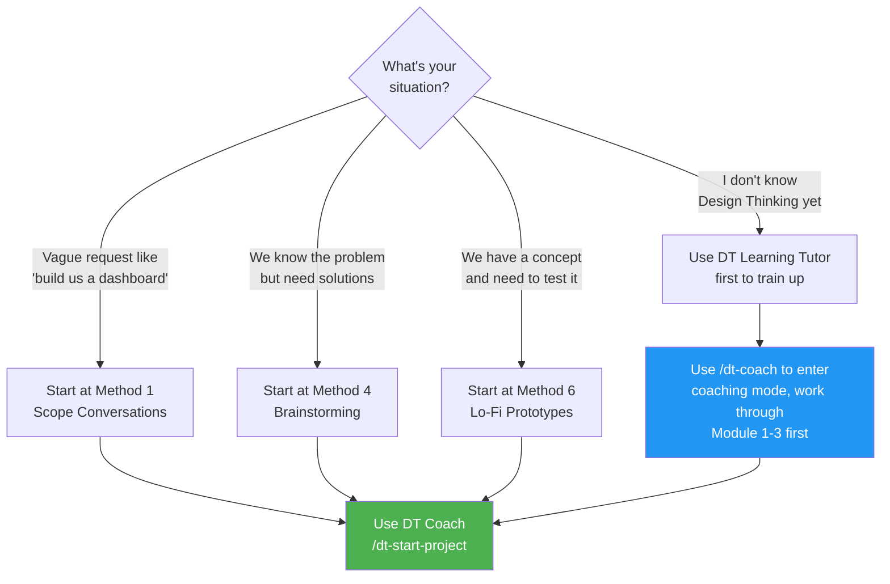
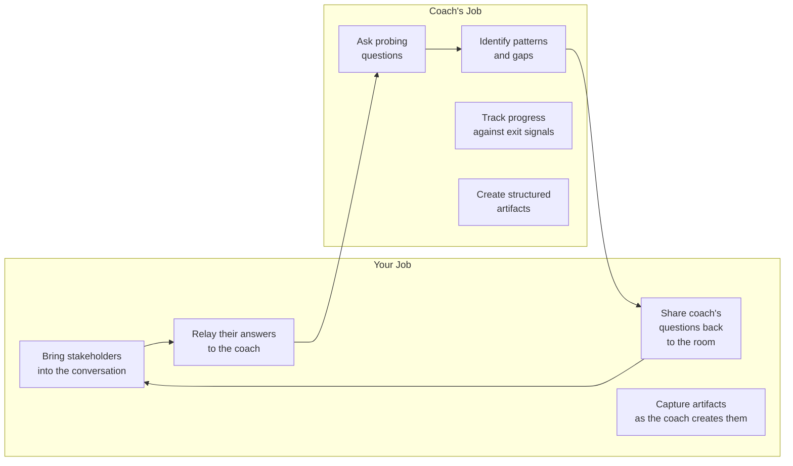
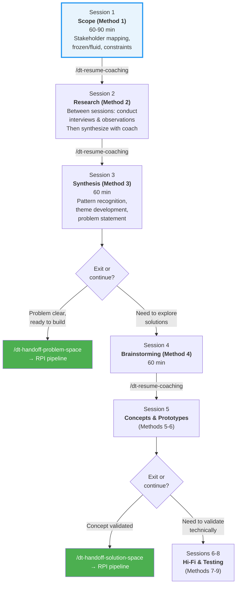

# Design Thinking Meeting Prep Guide

**Purpose**: Get you ready to run a Design Thinking session next week
**Time to read**: ~10 minutes
**Time to prepare**: ~1-2 hours before your session

---

## TL;DR: The 5-Minute Version

1. **Skills are already installed** in `.claude/skills/` -- all 14 DT commands are ready to use
2. **Read** `docs/design-thinking/dt-coach.md` (~8 min) and `docs/design-thinking/why-design-thinking.md` (~4 min)
3. **Start a practice session** now: type `/dt-start-project project-slug=practice-run` in Claude Code
4. **Before the meeting**: Know your stakeholders, your initial request/problem, and your industry context
5. **During the meeting**: Let the coach guide you through Method 1 (Scope) -- you probably won't get past Methods 1-3 in a single session, and that's fine

---

## Before You Do Anything: Decide What Kind of Session



**Most likely**: You're starting with a vague request from a stakeholder. That means Method 1.

---

## Your Preparation Checklist

### 1. Verify Skills are Installed (~2 min)

The DT skills are already installed in this repo at `.claude/skills/`. Verify they're available:

- [ ] Open Claude Code in this repo
- [ ] Type `/dt` and check that autocomplete shows the DT commands (dt-start-project, dt-coach, etc.)
- [ ] If skills don't appear, check that `.claude/skills/` directory exists with 14 subdirectories

> **Note**: The skills load the coaching instructions from `.github/instructions/design-thinking/` at runtime, so the full HVE Core repo must be your working directory.

### 2. Essential Reading (~20 min)

Read these in order. They're short and practical.

| Priority | Document | Time | What You Learn |
|----------|----------|------|----------------|
| **Must** | `docs/design-thinking/why-design-thinking.md` | 4 min | When to use DT, how it differs from traditional requirements |
| **Must** | `docs/design-thinking/dt-coach.md` | 8 min | How to start/pause/resume sessions, example interactions, tips and pitfalls |
| **Must** | `docs/design-thinking/method-01-scope-conversations.md` | 5 min | What you'll actually do in your first session |
| Should | `docs/design-thinking/README.md` | 5 min | Overview of all 9 methods and 3 spaces |
| Optional | `docs/design-thinking/using-together.md` | 8 min | Full end-to-end walkthrough (manufacturing example) |
| Optional | `docs/design-thinking/method-02-design-research.md` | 5 min | What comes after scoping (in case you move fast) |
| Reference | `DESIGN-THINKING-DOSSIER.md` | Skim | Complete framework reference with Mermaid diagrams |

### 3. Gather Your Inputs (~30 min)

Before the session, write down answers to these questions:

**The Request**
- [ ] What was the original ask? (Write it down verbatim -- "Build us a dashboard", "We need a mobile app", etc.)
- [ ] Who made the request? What's their role?
- [ ] What's driving this? (deadline, incident, executive mandate, user complaint?)

**The Stakeholders**
- [ ] **Tier 1 -- Decision Makers**: Who approves budget, scope, and direction?
- [ ] **Tier 2 -- Direct Users**: Who will actually use whatever gets built?
- [ ] **Tier 3 -- Affected Parties**: Who else is impacted? (downstream teams, IT ops, union reps, customers?)
- [ ] Who's NOT in the room but should be?

**The Constraints**
- [ ] **Frozen** (non-negotiable): Budget limits, regulatory requirements, deadlines, existing contracts
- [ ] **Fluid** (open for exploration): Workflows, interfaces, processes, tool choices

**Industry Context** (if applicable)
- [ ] Manufacturing? Healthcare? Energy? -- Mention this to the coach early for adjusted vocabulary

### 4. Run a Practice Session (~20 min)

Do a dry run before your real meeting:

```
1. Open Claude Code in this repo

2. Type:
   /dt-start-project project-slug=practice-run context="[paste your actual request here]" industry=[your industry]

3. Have a 10-minute conversation with the coach
4. Notice how it asks questions, not gives answers
5. Try: /dt-method-next   (to see readiness assessment)

Or enter free-form coaching mode:
   /dt-coach my-topic-or-question
```

This gets you comfortable with the interaction pattern before you're in front of stakeholders.

---

## During the Meeting: What to Expect

### Your Role as Facilitator

You're not running a traditional meeting. You're facilitating a **coached discovery session**.



### Realistic Session Timeline

For a 60-90 minute meeting, expect to cover **Method 1 only** (maybe start Method 2). That's normal and good.

```mermaid
gantt
    title Typical First Design Thinking Session (90 min)
    dateFormat HH:mm
    axisFormat %H:%M

    section Setup
    Introduce DT approach to room     :a1, 00:00, 10m
    Start DT Coach session            :a2, after a1, 5m

    section Method 1: Scope
    Stakeholder mapping               :b1, after a2, 20m
    Frozen vs Fluid classification    :b2, after b1, 15m
    Constraint discovery              :b3, after b2, 15m
    Scope alignment discussion        :b4, after b3, 15m

    section Wrap-up
    Review artifacts, plan next steps :c1, after b4, 10m
```



### What to Say to the Room

**Opening (2 min)**:
> "We're going to use a structured approach called Design Thinking to make sure we're solving the right problem before we start building. I'm going to use an AI coaching tool to guide our conversation. It works by asking us questions -- not by giving us answers. Let's start by making sure we understand who's affected by this and what constraints we're working within."

**When the coach asks a question, relay it**:
> "The coach is asking: [question]. Who in the room has context on this?"

**When someone wants to jump to solutions**:
> "Great idea -- let's capture that for Method 4 (Brainstorming). Right now we're making sure we understand the problem first. What else do we know about [current topic]?"

**Closing (2 min)**:
> "Here's what we've mapped so far: [show stakeholder map and constraint list]. Next session, we'll move into Design Research where we'll talk directly to the people affected. The coach saved our progress so we can pick up right where we left off."

---

## The Commands You'll Actually Use

### Session Commands (use these)

| Command | When | What It Does |
|---------|------|--------------|
| `/dt-coach [topic]` | Anytime | Enter DT coaching mode for free-form coaching |
| `/dt-start-project project-slug=my-project` | First session | Creates state file, begins Method 1 |
| `/dt-resume-coaching project-slug=my-project` | Returning to a session | Reads saved state, picks up where you left off |
| `/dt-method-next` | Between methods | Assesses readiness, recommends next method |

### Method Commands (use when you get there)

| Command | When | What It Does |
|---------|------|--------------|
| `/dt-method-04-ideation` | Method 4 | Guided divergent brainstorming |
| `/dt-method-04-convergence` | Method 4 | Cluster ideas into themes |
| `/dt-method-05-concepts` | Method 5 | Articulate concepts from themes |
| `/dt-method-05-evaluation` | Method 5 | D/F/V evaluation with stakeholders |
| `/dt-method-06-planning` | Method 6 | Plan prototype approach |
| `/dt-method-06-building` | Method 6 | Build scrappy prototypes |
| `/dt-method-06-testing` | Method 6 | Test prototypes with users |

### Handoff Commands (use when exiting to implementation)

| Command | When | What It Does |
|---------|------|--------------|
| `/dt-handoff-problem-space` | After Method 3 | Package problem statement for RPI |
| `/dt-handoff-solution-space` | After Method 6 | Package validated concept for RPI |
| `/dt-handoff-implementation-space` | After Method 7-9 | Package implementation spec for RPI |

**You probably won't need handoff commands in your first meeting.** They're for when you've completed a full space and are ready to move to implementation.

---

## How Multiple Sessions Work Together

A real Design Thinking engagement spans multiple meetings:



**Between sessions**: The coach saves state automatically. Use `/dt-resume-coaching project-slug=my-project` to pick up where you left off. No context is lost.

---

## Common Mistakes to Avoid

| Mistake | Why It Hurts | What to Do Instead |
|---------|-------------|-------------------|
| Jumping to solutions in Method 1 | You'll solve the wrong problem | Capture solution ideas for Method 4, stay in Problem Space |
| Polishing artifacts early | Polish invites approval feedback, not honest criticism | Keep things rough -- sticky notes, sketches, bullet points |
| Only talking to decision makers | Direct users and affected parties have different (critical) perspectives | Map all 3 stakeholder tiers before proceeding |
| Skipping methods | Each method builds on the previous one's output | Trust the sequence; the coach tracks exit signals |
| Running one long marathon session | Fatigue kills quality; research needs time between sessions | Plan 60-90 min sessions with days between for research |
| Treating iteration as failure | Going back to Method 2 from Method 5 means you found something important | Non-linear movement is a feature, not a bug |

---

## Quick Reference Card (Print This)

```
DESIGN THINKING SESSION QUICK REFERENCE (Claude Code)
======================================================

COACH:    /dt-coach [topic]               (free-form coaching)
START:    /dt-start-project project-slug=NAME
RESUME:   /dt-resume-coaching project-slug=NAME
NEXT:     /dt-method-next

SPACES:
  Problem  (M1-3): Understand the problem     → ROUGH output
  Solution (M4-6): Explore ideas               → SCRAPPY output
  Implement(M7-9): Validate and scale          → FUNCTIONAL output

METHOD 1 CHECKLIST:
  [ ] Stakeholders: Decision makers, direct users, affected parties
  [ ] Constraints: Classify each as FROZEN or FLUID
  [ ] Scope: What's IN, what's OUT, where do people disagree?
  [ ] Success: How would we know this worked?

COACH PHILOSOPHY:
  Think  → Coach assesses internally
  Speak  → Shares observations ("I'm noticing...")
  Empower → Gives YOU choices, not answers

EXIT POINTS:
  After M3: /dt-handoff-problem-space    → Task Researcher
  After M6: /dt-handoff-solution-space   → Task Researcher
  After M9: /dt-handoff-implementation-space → Task Researcher

GOLDEN RULES:
  - Evidence over opinions
  - Rough over polished
  - Questions over answers
  - Test in real environments, not meeting rooms
  - All stakeholder tiers represented
```

---

## After Your First Session

1. **Review artifacts**: Check `.copilot-tracking/dt/{your-project-slug}/` for what the coach captured
2. **Plan research**: If you completed Method 1, you need to do actual stakeholder interviews before Method 2
3. **Schedule next session**: Use `/dt-resume-coaching` to continue
4. **Read ahead**: Skim the next method doc (`method-02-design-research.md`) before your next session
5. **Consider training**: If the team is new to DT, have everyone spend 20 min with `/dt-coach` asking it to teach them the basics

---

## File Quick Links

| What You Need | Where to Find It |
|---------------|-----------------|
| Framework overview | `docs/design-thinking/README.md` |
| When/why to use DT | `docs/design-thinking/why-design-thinking.md` |
| How to use the coach | `docs/design-thinking/dt-coach.md` |
| Full walkthrough example | `docs/design-thinking/using-together.md` |
| Method 1 details | `docs/design-thinking/method-01-scope-conversations.md` |
| Method 2 details | `docs/design-thinking/method-02-design-research.md` |
| Method 3 details | `docs/design-thinking/method-03-input-synthesis.md` |
| DT-to-RPI handoff | `docs/design-thinking/dt-rpi-integration.md` |
| Handoff tutorial | `docs/design-thinking/tutorial-handoff-to-rpi.md` |
| Complete reference | `DESIGN-THINKING-DOSSIER.md` |
